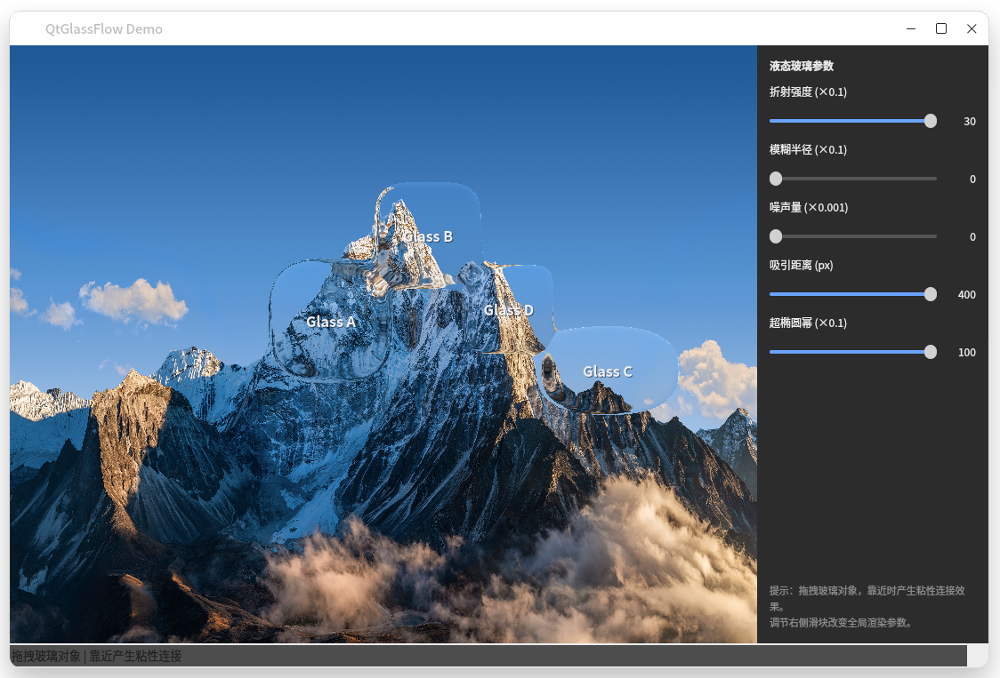
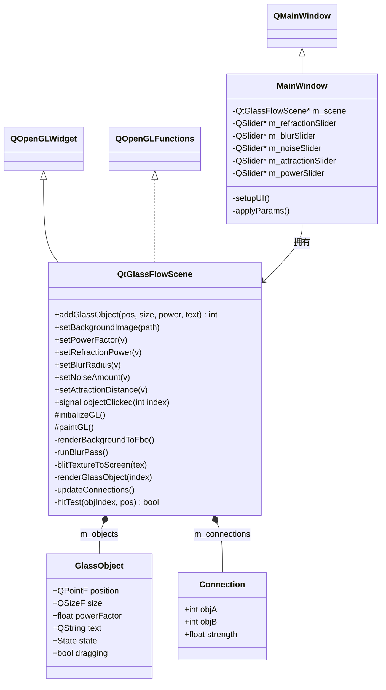
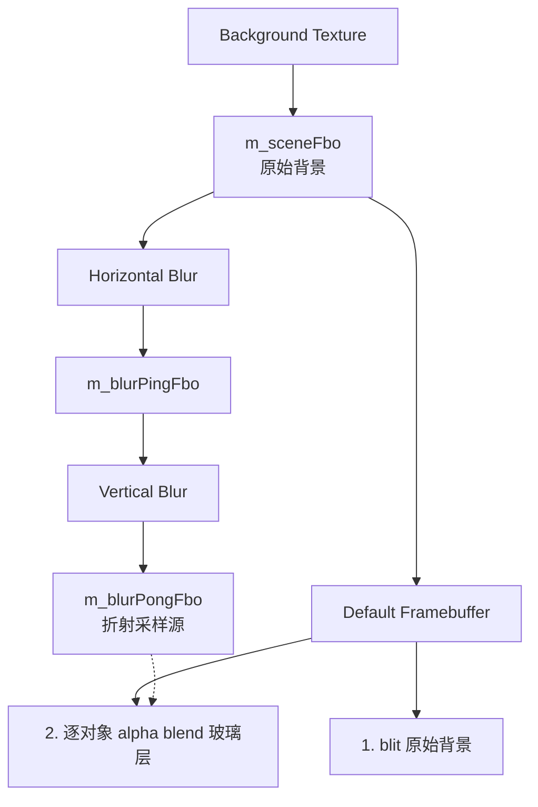
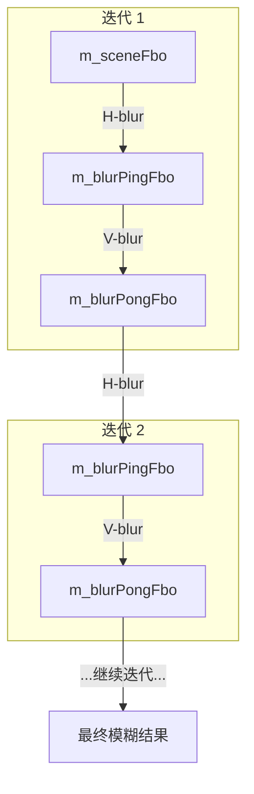
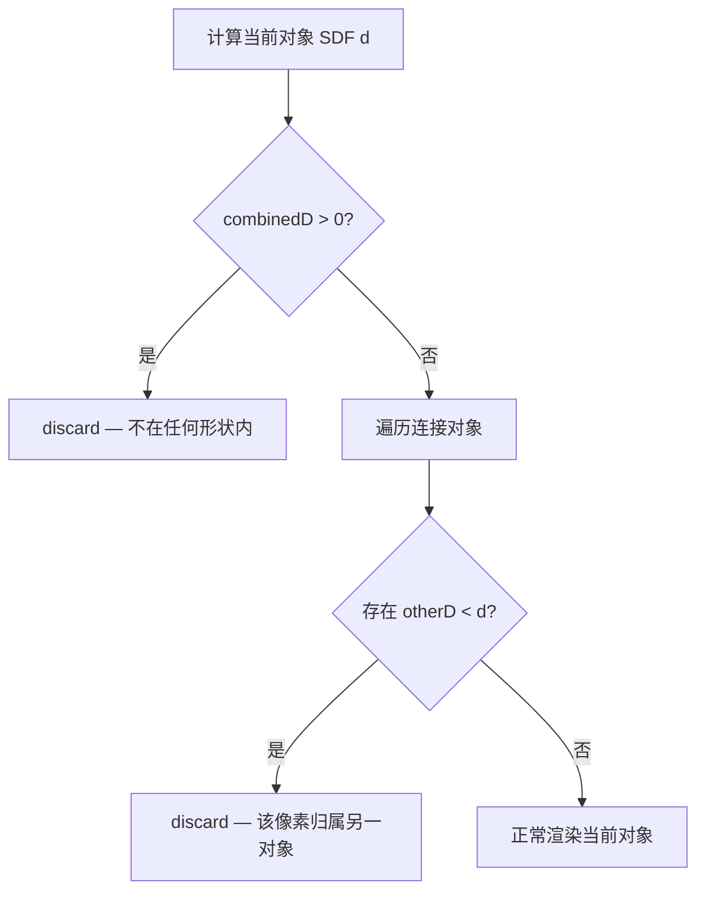
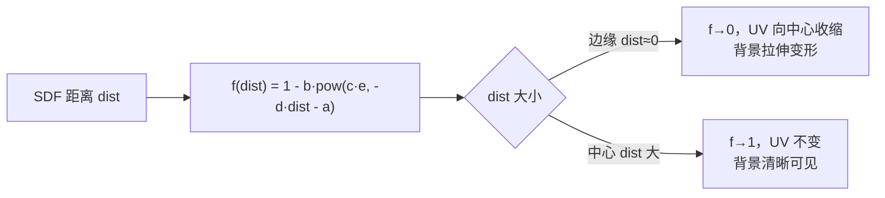
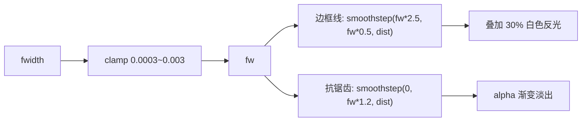

# libqtglassflow

基于 Qt + OpenGL 的液态玻璃效果渲染库，可在普通 QWidget 程序中实时渲染具备折射、模糊、噪声与粘性桥接的 SDF 超椭圆玻璃对象。



## 效果特性

- **SDF 超椭圆形状**：通过 `powerFactor` 控制圆角到方形的连续过渡
- **Smooth-union 粘性桥接**：自动检测对象间距离，平滑连接成液态形态
- **凸面穹顶光照**：上亮下暗，呈现真实玻璃球体的体积感
- **背景折射采样**：基于法线偏移对模糊后的背景进行折射采样
- **极细白色边框**：约 0.5–1 px 边缘反光，强化玻璃轮廓
- **像素级抗锯齿**：基于 `fwidth` 的屏幕空间梯度自适应过渡

## 环境要求

- Qt 5.12 及以上（`core` / `gui` / `widgets` / `opengl`）
- OpenGL 2.1（GLSL 120）
- C++11
- Linux / Windows / macOS

## 快速编译

```bash
qmake qtglassflow.pro
make -j$(nproc)
./demo/qtglassflow-demo
```

Demo 默认包含 4 个可拖拽玻璃对象与右侧参数面板（折射强度、模糊半径、噪声、吸引距离、超椭圆幂）。

## Debian 打包

```bash
dpkg-buildpackage -tc
```

将生成以下三个 deb 包：

- `libqtglassflow0`：运行时共享库
- `libqtglassflow-dev`：开发头文件与 pkg-config
- `qtglassflow-demo`：可执行示例程序

## 在项目中使用

### 方式一：pkg-config

```bash
pkg-config --cflags --libs qtglassflow
```

### 方式二：qmake 直接引用

```qmake
QT += core gui widgets opengl
INCLUDEPATH += /usr/include/qtglassflow
LIBS += -lqtglassflow
```

代码中：

```cpp
#include <qtglassflowscene.h>

QtGlassFlowScene *scene = new QtGlassFlowScene(this);
scene->setBackgroundImage(":/wallpaper.jpg");
scene->addGlassObject(QPointF(120, 120), QSizeF(220, 140), 3.0f, "Hello");
```

## API 简介

核心类 `QtGlassFlowScene`（继承自 `QOpenGLWidget`）：

| 接口 | 说明 |
| --- | --- |
| `int addGlassObject(pos, size, power, text)` | 添加一个玻璃对象，返回索引 |
| `void setBackgroundImage(path)` | 设置背景图片（用于折射采样） |
| `void setPowerFactor(v)` | 全局超椭圆幂（圆角/方形过渡） |
| `void setRefractionPower(v)` | 折射强度 |
| `void setBlurRadius(v)` | 高斯模糊半径 |
| `void setNoiseAmount(v)` | 噪声扰动强度 |
| `void setAttractionDistance(v)` | smooth-union 粘性吸引距离 |
| `signal objectClicked(int index)` | 玻璃对象被点击时触发 |

## 目录结构

```
qt-liquid-glass/
├── qtglassflow.pro          # 顶层 TEMPLATE = subdirs
├── src/
│   ├── src.pro              # TEMPLATE = lib, TARGET = qtglassflow
│   ├── qtglassflowscene.h   # 核心公开头文件
│   ├── qtglassflowscene.cpp
│   ├── shaders/
│   │   ├── scene_vertex.glsl
│   │   ├── scene_fragment.glsl
│   │   ├── blur_vertex.glsl
│   │   └── blur_fragment.glsl
│   └── shaders.qrc
├── demo/
│   ├── demo.pro
│   ├── main.cpp
│   └── mainwindow.{h,cpp}
├── qtglassflow.pc.in        # pkg-config 模板
├── debian/                  # Debian 打包配置
└── README.md
```

## 技术实现

### 技术架构



| 类 | 职责 |
|------|------|
| `QtGlassFlowScene` | 核心渲染引擎，继承 `QOpenGLWidget`。管理 FBO 管线、着色器编译、对象拖拽交互、连接检测与每帧渲染调度 |
| `GlassObject` | 单个玻璃对象的数据：坐标、尺寸、超椭圆幂、文本标签、交互状态（Normal/Hovered/Pressed） |
| `Connection` | 两个对象之间的粘性连接信息：两端索引和 0~1 的连接强度（由间距动态计算） |
| `MainWindow` | Demo 应用窗口，包含参数滑块面板，实时调节全局渲染参数并反馈到 `QtGlassFlowScene` |
### 渲染管线

每帧的 FBO 管线流程：



C++ 侧每帧调用顺序：

1. `renderBackgroundToFbo()` — 背景纹理 blit 到 `m_sceneFbo`
2. `runBlurPass()` — 分离式高斯模糊，ping-pong 迭代 `m_blurIterations` 次
3. `blitTextureToScreen(m_sceneFbo)` — 原始背景 blit 到默认帧缓冲
4. `renderGlassObject(i)` × N — 每个玻璃对象绘制一个全屏 quad，片元着色器决定形状与材质

### 分离式高斯模糊



- 水平 + 垂直两阶段 pass，每阶段一个 1D 9-tap 高斯核
- 支持多次迭代（`m_blurIterations`），等效于更大半径但避免单次大核的性能开销
- 每次迭代从上一轮结果纹理读取，实现 ping-pong 交替缓冲
- 半径由 `m_blurRadius` uniform 控制，实时可调

## SDF 超椭圆

形状基于超椭圆的有符号距离场（Signed Distance Field）。SDF 的核心思想是：对屏幕上任意一点，计算它到形状边缘的最短距离——形状外部为正、内部为负、边缘恰好为 0。这样只用一个数值就能同时确定"是否在形状内"和"离边缘多远"，后续的抗锯齿、桥接、边框等效果都依赖这个距离值。

```
d(p) = (|p.x|^n + |p.y|^n - r^n) / (n · √(|p.x|^(2n-2) + |p.y|^(2n-2)))
```

`n`（`powerFactor`）控制形状圆度：

| n 值 | 形状 |
|------|------|
| 2 | 标准椭圆 |
| 3~4 | iOS squircle（连续曲率圆角矩形） |
| 6+ | 接近方形，圆角极小 |
| →∞ | 完全方形 |

分母是梯度模长的近似值，起到归一化作用——让计算出的距离直接对应实际像素距离，而不是无量纲的数学比值。没有这个归一化，后续的抗锯齿过渡带（需要精确到 1 像素）和 smooth-union 桥接宽度控制都会失准。

## Smooth-union 粘性桥接

普通的 `min(a, b)` 取两个 SDF 的最小值可以合并形状，但交界处会产生硬边。smooth-min 则在两个形状距离差很小的区域进行圆滑过渡，产生类似两滴水融合时的液桥效果。参数 `k` 控制融合区宽度，`k` 越大桥越粗。

基于多项式平滑最小值函数（polynomial smooth-min）：

```glsl
float smin(float a, float b, float k) {
    // h 表示“当前点更接近哪个形状”的归一化比例：
    // a 远小于 b 时 h→1（完全采用 a），b 远小于 a 时 h→0（完全采用 b），
    // 两者相近时 h≈0.5（融合区——产生圆滑过渡）。
    float h = clamp(0.5 + 0.5 * (b - a) / k, 0.0, 1.0);
    // mix 做加权插值，后面的减法项让融合区的值比 a、b 都小，产生“凹陷”效果即液桥。
    return mix(b, a, h) - k * h * (1.0 - h);
}
```

参数含义：

- `k = 0.35 * strength + 0.001` — 平滑带宽度，决定桥接区域的粗细。其中 `0.35` 是经验系数，控制最大融合带宽度约为对象尺寸的 35%，视觉上接近真实液体表面张力下的桥接比例；`0.001` 是保护值，防止 strength=0 时导致除以零
- `strength` 由 C++ 侧基于间距动态计算：
  ```
  gap = centerDistance - radiusA - radiusB
  strength = clamp(1 - gap / attractionDist, 0, 1)
  ```
- 当 `gap < attractionDist` 时产生桥接，越近桥越粗
- 最多支持 8 个并发连接（shader uniform 数组上限）

### Voronoi 归属机制

每个玻璃对象渲染为全屏 quad，smooth-union 使得多个 pass 的可见区域大量重叠。由于使用 alpha 混合，重叠区域被多次绘制会导致亮度累积失真。解决方案是在片元着色器中引入 Voronoi 归属检测，确保每个像素仅由距离它最近的对象负责渲染：



```glsl
for (int i = 0; i < numConnections; i++) {
    float otherD = sdSuperellipse(...);
    if (otherD < d)
        discard;  // 该像素更靠近另一个对象
}
```

效果：每个像素恰好被 1 个 pass 绘制，桥接区域按 SDF 等距线自然分割为两半，各半段的折射方向分别朝向各自的归属对象。

## 折射模型

玻璃折射的视觉本质是"透过玻璃看到的背景发生了形变"。这里不做物理光线追踪，而是直接对背景纹理的采样坐标做形变——在形状边缘将 UV 坐标向中心收缩（背景被拉伸变形），在中心几乎不动（背景清晰可见），从而产生边缘扭曲、中心透明的玻璃质感。



基于参数化指数衰减曲线的 UV 变形：

```glsl
float f(x) = 1.0 - b * pow(c * e, -d * x - a);
vec2 UV' = localP * pow(f(dist), fPower);
```

物理含义：

- **边缘**（`dist ≈ 0`）: `f → 0`，UV 坐标向中心收缩 → 产生边缘放大/弯曲的折射效果
- **中心**（`dist` 较大）: `f → 1`，UV 不变 → 背景清晰可见

默认值 `(a=0.7, b=2.3, c=5.2, d=6.9)` 各参数含义：

| 参数 | 默认值 | 作用 |
|------|--------|------|
| `a` | 0.7 | 曲线水平偏移，控制折射从边缘多深处开始生效 |
| `b` | 2.3 | 折射强度系数，越大边缘扭曲越剧烈 |
| `c` | 5.2 | 指数底数，影响曲线的陡峭程度 |
| `d` | 6.9 | 衰减速率，越大折射效果越集中在边缘薄层 |
| `fPower` | 1.0 | 整体折射幂次放大器，数值越大非线性越强 |

## 凸面穹顶光照

现实中玻璃球体顶部反射更多天光显得亮，底部处于阴影中显得暗。这里用一个线性渐变来模拟这种体积感：

```glsl
float convex = 0.5 + 0.5 * localP.y;      // 将 y 坐标映射到 0(底部) → 1(顶部)
float domeLight = mix(0.93, 1.07, convex); // 底部压暗7%, 顶部增亮7%
color.rgb *= domeLight;
```

数值 `0.93~1.07` 的选择基于视觉感知：人眼对 10% 以内的亮度差异会感觉微妙自然，超过这个阈值则会显得生硬。这个 7% 的渐变足以赋予玻璃表面立体感，同时不会喊得太明显。

## 边框与抗锯齿

抗锯齿的核心是确定"一个像素对应多少单位的 SDF 距离"。GPU 渲染时会同时处理相邻像素，`fwidth(combinedD)` 计算 SDF 值在相邻像素间的变化量，这个变化量就代表了1 像素宽度对应的 SDF 距离。用它来控制边缘过渡带宽度，就能保证过渡始终恰好覆盖约 1 像素——在任何分辨率和缩放下都能产生锐利不虚的边缘。



三层协同实现亚像素级边缘质量：

1. **fwidth clamping**：
   ```glsl
   float fw = clamp(fwidth(combinedD), 0.0003, 0.003);
   ```
   `fwidth()` 在 smooth-union 的零值过渡区容易发散，因此用 clamp 限制范围。下限 `0.0003` 防止 fw 为零导致 smoothstep 退化为硬边；上限 `0.003` 防止在梯度剧烈跳变区域产生数像素宽的模糊光圈。

2. **极细边框线**：
   ```glsl
   float borderLine = smoothstep(fw * 2.5, fw * 0.5, dist);
   color.rgb += vec3(1.0) * borderLine * 0.3;
   ```
   `smoothstep` 的两个边界 `fw*2.5` 和 `fw*0.5` 分别对应距边缘约 2.5 像素和 0.5 像素处，形成一条约 2 像素宽的亮线。叠加强度 0.3 表示最亮处仅增加 30% 白色，模拟玻璃边缘反光而不会过于刺眼。

3. **Alpha 抗锯齿**：
   ```glsl
   float alpha = smoothstep(0.0, fw * 1.2, dist);
   ```
   在边缘 0 到 1.2 像素的范围内做 alpha 渐变，使形状边缘不是硬切而是平滑淡出，实现分辨率无关的抗锯齿。

### GLSL 120 兼容性

- 着色器仅使用 GLSL 120 核心内置函数（`fwidth` / `dFdx` / `dFdy` / `texture2D`）
- 不声明任何 `#extension`（桌面 GLSL 120 已内置导数函数，无需 `GL_OES_standard_derivatives`）
- 使用 `attribute` / `varying` 语法（非 GLSL 130+ 的 `in` / `out`）
- 兼容 OpenGL 2.1 Compatibility Profile
