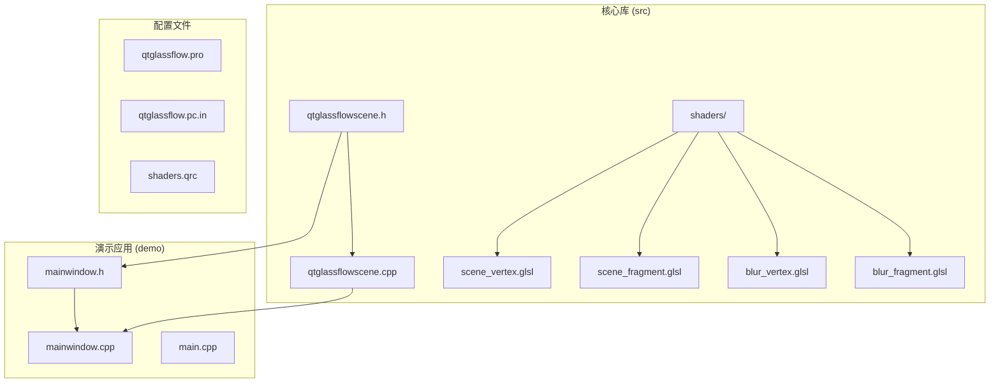
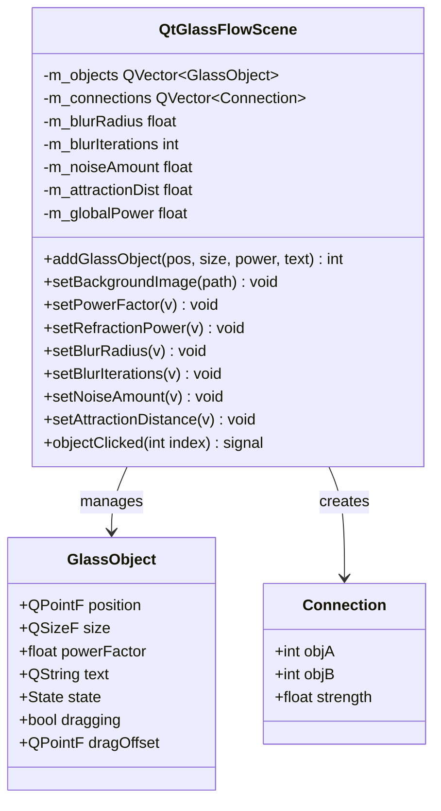
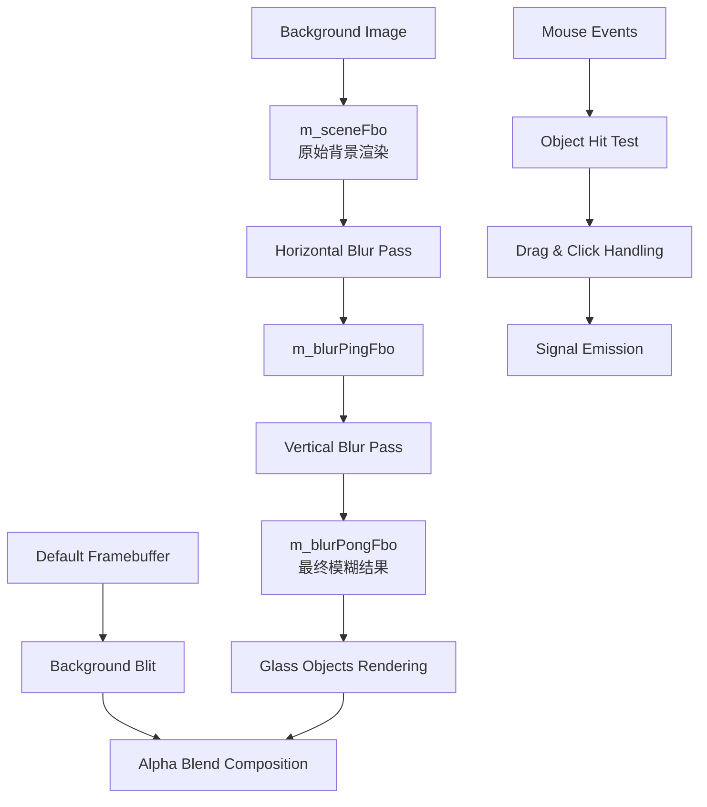
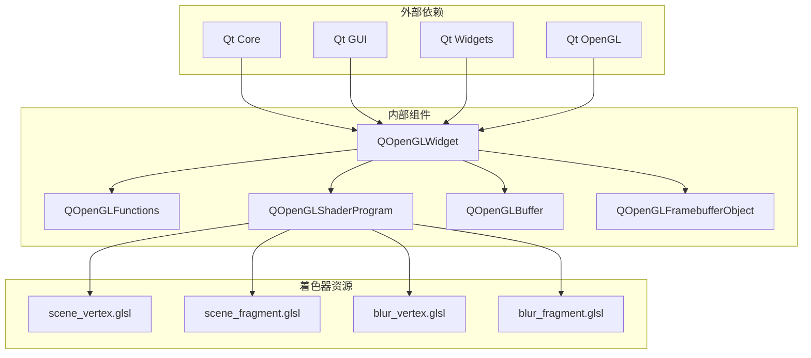

# API参考手册

<cite>
**本文档引用的文件**
- [qtglassflowscene.h](file://src/qtglassflowscene.h)
- [qtglassflowscene.cpp](file://src/qtglassflowscene.cpp)
- [mainwindow.h](file://demo/mainwindow.h)
- [mainwindow.cpp](file://demo/mainwindow.cpp)
- [README.md](file://README.md)
</cite>

## 目录
1. [简介](#简介)
2. [项目结构](#项目结构)
3. [核心组件](#核心组件)
4. [架构概览](#架构概览)
5. [详细组件分析](#详细组件分析)
6. [依赖关系分析](#依赖关系分析)
7. [性能考虑](#性能考虑)
8. [故障排除指南](#故障排除指南)
9. [结论](#结论)

## 简介

QtGlassFlowScene是一个基于Qt + OpenGL的液态玻璃效果渲染库的核心类，能够在普通QWidget程序中实时渲染具备折射、模糊、噪声与粘性桥接的SDF超椭圆玻璃对象。该库提供了丰富的API接口，允许开发者创建和管理玻璃对象，调整视觉参数，并实现交互功能。

## 项目结构

该项目采用模块化设计，主要包含以下核心组件：



**图表来源**
- [qtglassflowscene.h:1-142](file://src/qtglassflowscene.h#L1-L142)
- [qtglassflowscene.cpp:1-668](file://src/qtglassflowscene.cpp#L1-L668)

**章节来源**
- [qtglassflowscene.h:1-142](file://src/qtglassflowscene.h#L1-L142)
- [qtglassflowscene.cpp:1-668](file://src/qtglassflowscene.cpp#L1-L668)

## 核心组件

QtGlassFlowScene类是整个库的核心，继承自QOpenGLWidget并实现了完整的玻璃效果渲染系统。该类提供了以下主要功能：

### 主要职责
- **玻璃对象管理**：添加、删除和管理多个玻璃对象
- **渲染管线控制**：管理OpenGL渲染流程和FBO缓冲区
- **参数调节**：提供多种视觉参数的实时调节接口
- **用户交互**：处理鼠标事件和对象拖拽
- **着色器管理**：编译和管理GLSL着色器程序

### 关键数据结构



**图表来源**
- [qtglassflowscene.h:23-40](file://src/qtglassflowscene.h#L23-L40)
- [qtglassflowscene.h:17-139](file://src/qtglassflowscene.h#L17-L139)

**章节来源**
- [qtglassflowscene.h:17-139](file://src/qtglassflowscene.h#L17-L139)

## 架构概览

QtGlassFlowScene采用了现代OpenGL渲染架构，实现了高效的分离式高斯模糊和基于SDF的超椭圆形状渲染：



**图表来源**
- [qtglassflowscene.cpp:510-566](file://src/qtglassflowscene.cpp#L510-L566)
- [qtglassflowscene.cpp:316-359](file://src/qtglassflowscene.cpp#L316-L359)

## 详细组件分析

### 核心API接口详解

#### addGlassObject() - 添加玻璃对象

**功能描述**
添加一个新的玻璃对象到场景中，支持自定义位置、大小、形状参数和文本标签。

**方法签名**
```cpp
int addGlassObject(const QPointF &pos, const QSizeF &size, float power = 3.0f, const QString &text = QString())
```

**参数说明**
- `pos`: 对象的左上角位置（像素坐标系）
- `size`: 对象的尺寸（宽度和高度，像素）
- `power`: 超椭圆幂因子，控制形状从圆形到方形的过渡
- `text`: 可选的文本标签

**返回值**
- 返回新添加对象的索引号

**使用示例**
```cpp
// 创建一个基本的玻璃对象
int index = scene->addGlassObject(QPointF(100, 100), QSizeF(200, 150));

// 创建带标签的玻璃对象
int index = scene->addGlassObject(QPointF(300, 200), QSizeF(180, 120), 4.0f, "Hello");
```

**参数范围**
- `pos.x()`, `pos.y()`: 任意有效像素坐标
- `size.width()`, `size.height()`: 必须大于0
- `power`: 建议范围2.0-10.0，推荐3.0-6.0

**最佳实践**
- 确保对象尺寸大于0，避免渲染异常
- 合理设置power参数以获得期望的视觉效果
- 文本标签建议使用简短描述性内容

**错误处理**
- 如果传入无效的尺寸参数，对象将不会正确显示
- 返回值为负数表示添加失败

**章节来源**
- [qtglassflowscene.h:45-48](file://src/qtglassflowscene.h#L45-L48)
- [qtglassflowscene.cpp:106-117](file://src/qtglassflowscene.cpp#L106-L117)

#### setBackgroundImage() - 设置背景图像

**功能描述**
设置用于折射效果的背景图像，该图像将作为玻璃对象折射采样的基础纹理。

**方法签名**
```cpp
void setBackgroundImage(const QString &path)
```

**参数说明**
- `path`: 背景图像的文件路径

**返回值**
- 无

**使用示例**
```cpp
// 设置背景图像
scene->setBackgroundImage(":/background.jpg");

// 在初始化时设置
QtGlassFlowScene *scene = new QtGlassFlowScene(this);
scene->setBackgroundImage(":/wallpaper.jpg");
```

**参数范围**
- `path`: 必须是有效的图像文件路径
- 支持格式：PNG, JPG, BMP等Qt支持的格式

**最佳实践**
- 使用高质量的背景图像以获得更好的折射效果
- 图像尺寸建议与窗口大小相匹配或更大
- 背景图像会在首次渲染时加载，可能影响初始化时间

**错误处理**
- 如果图像加载失败，会输出警告信息但不会中断程序
- 空路径将跳过背景设置

**章节来源**
- [qtglassflowscene.h:49](file://src/qtglassflowscene.h#L49)
- [qtglassflowscene.cpp:119-129](file://src/qtglassflowscene.cpp#L119-L129)

#### setPowerFactor() - 设置全局超椭圆幂

**功能描述**
设置全局的超椭圆幂因子，控制所有玻璃对象的形状从圆形到方形的过渡。

**方法签名**
```cpp
void setPowerFactor(float v)
```

**参数说明**
- `v`: 超椭圆幂因子值

**返回值**
- 无

**使用示例**
```cpp
// 设置为标准椭圆
scene->setPowerFactor(2.0f);

// 设置为squircle形状
scene->setPowerFactor(3.0f);

// 设置为接近方形
scene->setPowerFactor(6.0f);
```

**参数范围**
- 建议范围：2.0-10.0
- 推荐范围：3.0-6.0
- 值越大，形状越接近方形

**最佳实践**
- 3.0-6.0范围通常能获得最佳视觉效果
- 2.0对应标准椭圆，6.0接近方形
- 可以与对象级别的power参数配合使用

**错误处理**
- 无特殊错误处理，超出范围的值会被直接使用

**章节来源**
- [qtglassflowscene.h:52](file://src/qtglassflowscene.h#L52)
- [qtglassflowscene.cpp:131](file://src/qtglassflowscene.cpp#L131)

#### setRefractionPower() - 设置折射强度

**功能描述**
设置玻璃折射效果的整体强度，控制背景图像在玻璃表面的扭曲程度。

**方法签名**
```cpp
void setRefractionPower(float v)
```

**参数说明**
- `v`: 折射强度值

**返回值**
- 无

**使用示例**
```cpp
// 设置轻微折射效果
scene->setRefractionPower(0.5f);

// 设置中等折射效果
scene->setRefractionPower(1.5f);

// 设置强烈折射效果
scene->setRefractionPower(3.0f);
```

**参数范围**
- 建议范围：0.1-3.0
- 推荐范围：0.5-2.0

**最佳实践**
- 0.5-1.5范围通常提供自然的折射效果
- 值过大可能导致视觉不适
- 与背景图像质量密切相关

**错误处理**
- 无特殊错误处理

**章节来源**
- [qtglassflowscene.h:53](file://src/qtglassflowscene.h#L53)
- [qtglassflowscene.cpp:132](file://src/qtglassflowscene.cpp#L132)

#### setBlurRadius() - 设置模糊半径

**功能描述**
设置高斯模糊的半径大小，影响背景图像的模糊程度和折射效果的柔和度。

**方法签名**
```cpp
void setBlurRadius(float v)
```

**参数说明**
- `v`: 模糊半径值

**返回值**
- 无

**使用示例**
```cpp
// 设置轻微模糊
scene->setBlurRadius(0.5f);

// 设置中等模糊
scene->setBlurRadius(2.0f);

// 设置强烈模糊
scene->setBlurRadius(5.0f);
```

**参数范围**
- 建议范围：0.1-10.0
- 推荐范围：1.0-5.0

**最佳实践**
- 1.0-3.0范围通常提供平衡的视觉效果
- 模糊半径越大，折射效果越柔和但可能失去细节
- 与模糊迭代次数配合使用

**错误处理**
- 无特殊错误处理

**章节来源**
- [qtglassflowscene.h:54](file://src/qtglassflowscene.h#L54)
- [qtglassflowscene.cpp:133](file://src/qtglassflowscene.cpp#L133)

#### setBlurIterations() - 设置模糊迭代次数

**功能描述**
设置高斯模糊的迭代次数，通过多次迭代实现更强大的模糊效果。

**方法签名**
```cpp
void setBlurIterations(int v)
```

**参数说明**
- `v`: 模糊迭代次数

**返回值**
- 无

**使用示例**
```cpp
// 设置单次模糊
scene->setBlurIterations(1);

// 设置两次模糊
scene->setBlurIterations(2);

// 设置四次模糊
scene->setBlurIterations(4);
```

**参数范围**
- 最小值：1
- 建议范围：1-5

**最佳实践**
- 1-3次迭代通常足够
- 迭代次数越多，性能开销越大
- 与模糊半径配合使用以达到理想效果

**错误处理**
- 自动确保最小值为1

**章节来源**
- [qtglassflowscene.h:55](file://src/qtglassflowscene.h#L55)
- [qtglassflowscene.cpp:134](file://src/qtglassflowscene.cpp#L134)

#### setNoiseAmount() - 设置噪声量

**功能描述**
设置背景噪声的强度，为玻璃表面添加细微的扰动效果。

**方法签名**
```cpp
void setNoiseAmount(float v)
```

**参数说明**
- `v`: 噪声强度值

**返回值**
- 无

**使用示例**
```cpp
// 关闭噪声效果
scene->setNoiseAmount(0.0f);

// 设置轻微噪声
scene->setNoiseAmount(0.01f);

// 设置中等噪声
scene->setNoiseAmount(0.06f);
```

**参数范围**
- 建议范围：0.0-0.1
- 推荐范围：0.0-0.06

**最佳实践**
- 0.06是默认值，提供自然的微扰效果
- 过大的噪声值可能影响视觉质量
- 通常不需要频繁调整

**错误处理**
- 无特殊错误处理

**章节来源**
- [qtglassflowscene.h:56](file://src/qtglassflowscene.h#L56)
- [qtglassflowscene.cpp:135](file://src/qtglassflowscene.cpp#L135)

#### setAttractionDistance() - 设置吸引距离

**功能描述**
设置玻璃对象之间产生粘性连接的吸引距离，控制对象靠近时的桥接效果。

**方法签名**
```cpp
void setAttractionDistance(float v)
```

**参数说明**
- `v`: 吸引距离（像素）

**返回值**
- 无

**使用示例**
```cpp
// 关闭连接效果
scene->setAttractionDistance(0.0f);

// 设置近距离连接
scene->setAttractionDistance(100.0f);

// 设置远距离连接
scene->setAttractionDistance(300.0f);
```

**参数范围**
- 建议范围：0.0-400.0
- 推荐范围：100.0-300.0

**最佳实践**
- 160.0是默认值，提供平衡的连接效果
- 距离过小可能导致过多连接
- 距离过大可能无法产生连接效果

**错误处理**
- 负值会被视为关闭连接功能
- 无特殊错误处理

**章节来源**
- [qtglassflowscene.h:57](file://src/qtglassflowscene.h#L57)
- [qtglassflowscene.cpp:136](file://src/qtglassflowscene.cpp#L136)

### 信号接口详解

#### objectClicked信号

**功能描述**
当用户点击玻璃对象时发出的信号，通知外部组件对象已被点击。

**信号签名**
```cpp
void objectClicked(int index)
```

**参数说明**
- `index`: 被点击的玻璃对象的索引号

**触发条件**
- 用户使用鼠标左键点击玻璃对象
- 点击位置位于对象的超椭圆区域内

**使用示例**
```cpp
// 连接信号到槽函数
connect(scene, &QtGlassFlowScene::objectClicked, 
        this, &MainWindow::handleObjectClick);

// 处理点击事件
void MainWindow::handleObjectClick(int index) {
    qDebug() << "Object" << index << "clicked!";
    // 处理对象点击逻辑
}
```

**最佳实践**
- 在连接信号时检查对象有效性
- 注意信号可能在对象移动或删除时触发
- 结合其他鼠标事件处理复杂的交互逻辑

**错误处理**
- 无特殊错误处理
- 如果索引无效，外部处理逻辑应进行验证

**章节来源**
- [qtglassflowscene.h:59-60](file://src/qtglassflowscene.h#L59-L60)
- [qtglassflowscene.cpp:587-605](file://src/qtglassflowscene.cpp#L587-L605)

## 依赖关系分析

QtGlassFlowScene类具有清晰的依赖关系和模块化设计：



**图表来源**
- [qtglassflowscene.h:4-13](file://src/qtglassflowscene.h#L4-L13)
- [qtglassflowscene.cpp:1-15](file://src/qtglassflowscene.cpp#L1-L15)

**章节来源**
- [qtglassflowscene.h:4-13](file://src/qtglassflowscene.h#L4-L13)

## 性能考虑

### 渲染性能优化

QtGlassFlowScene在设计时充分考虑了性能优化：

1. **分离式高斯模糊**：通过水平和垂直两次1D模糊实现高效的大半径模糊
2. **Ping-Pong缓冲**：使用双缓冲区减少内存访问冲突
3. **批量渲染**：支持最多8个并发连接的高效处理
4. **智能更新**：仅在参数变化时触发重新渲染

### 内存管理

- 自动管理OpenGL资源的生命周期
- 智能纹理缓存和释放
- FBO缓冲区的动态创建和销毁

### 最佳实践建议

- 合理设置模糊半径和迭代次数以平衡视觉效果和性能
- 避免频繁调用昂贵的参数设置方法
- 在高DPI显示器上注意内存使用量的增加

## 故障排除指南

### 常见问题及解决方案

#### OpenGL初始化失败

**症状**：应用程序启动时出现OpenGL相关错误

**原因**：
- 系统不支持所需的OpenGL版本
- 显卡驱动问题

**解决方案**：
- 确保系统满足最低OpenGL 2.1要求
- 更新显卡驱动程序
- 检查Qt OpenGL模块的安装完整性

#### 背景图像加载失败

**症状**：背景图像未显示或显示异常

**原因**：
- 文件路径错误
- 图像格式不受支持
- 权限问题

**解决方案**：
- 验证文件路径的有效性
- 确认图像格式支持（PNG, JPG, BMP）
- 检查文件权限和可访问性

#### 性能问题

**症状**：渲染帧率低或CPU占用过高

**原因**：
- 模糊半径设置过大
- 连接数量过多
- 窗口尺寸过大

**解决方案**：
- 降低模糊半径和迭代次数
- 减少同时存在的玻璃对象数量
- 适当缩小窗口尺寸

**章节来源**
- [qtglassflowscene.cpp:266-291](file://src/qtglassflowscene.cpp#L266-L291)
- [qtglassflowscene.cpp:138-157](file://src/qtglassflowscene.cpp#L138-L157)

## 结论

QtGlassFlowScene提供了一个功能完整、性能优异的玻璃效果渲染解决方案。通过精心设计的API接口和高效的渲染架构，开发者可以轻松创建具有专业级视觉效果的应用程序。

### 主要优势

1. **易用性强**：简洁的API设计，易于集成和使用
2. **性能优秀**：优化的渲染管线，支持实时交互
3. **可定制性高**：丰富的参数调节选项
4. **跨平台支持**：支持Linux、Windows、macOS等多个平台

### 适用场景

- 现代化桌面应用程序界面
- 数据可视化和仪表板
- 艺术创作和多媒体应用
- 游戏UI和特效系统

### 发展建议

随着技术的发展，可以考虑以下改进方向：
- 支持更高版本的OpenGL和GLSL
- 添加更多的视觉效果选项
- 提供更丰富的动画和过渡效果
- 优化移动端性能表现