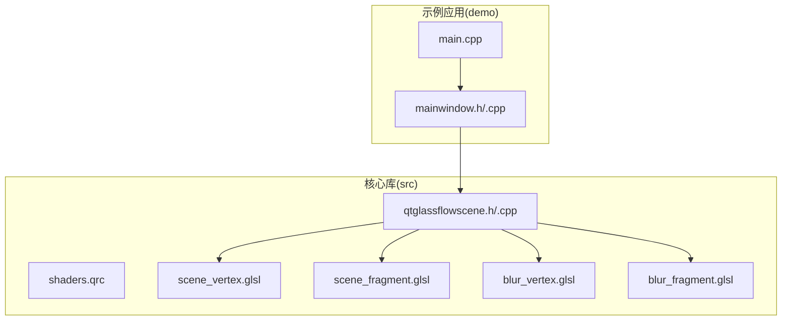
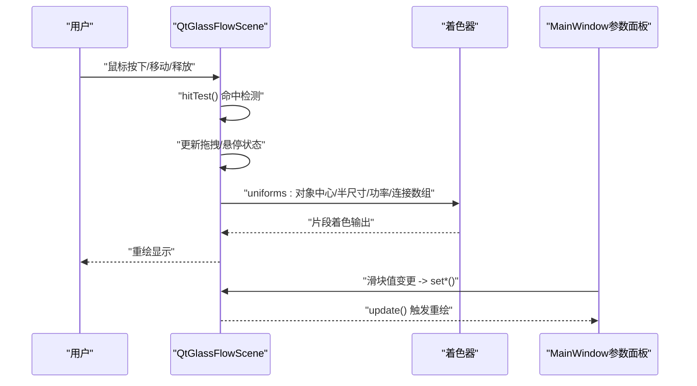
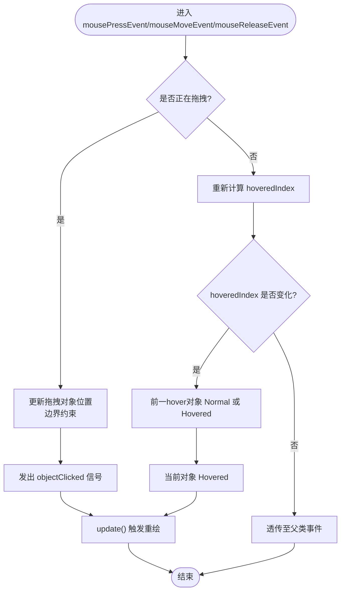
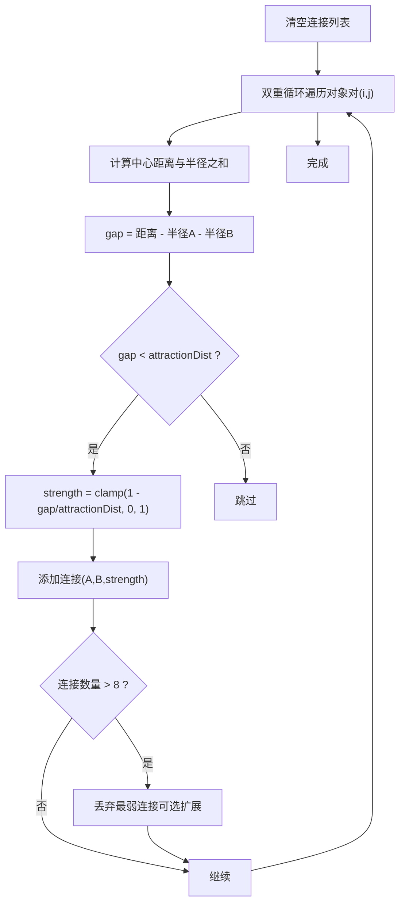
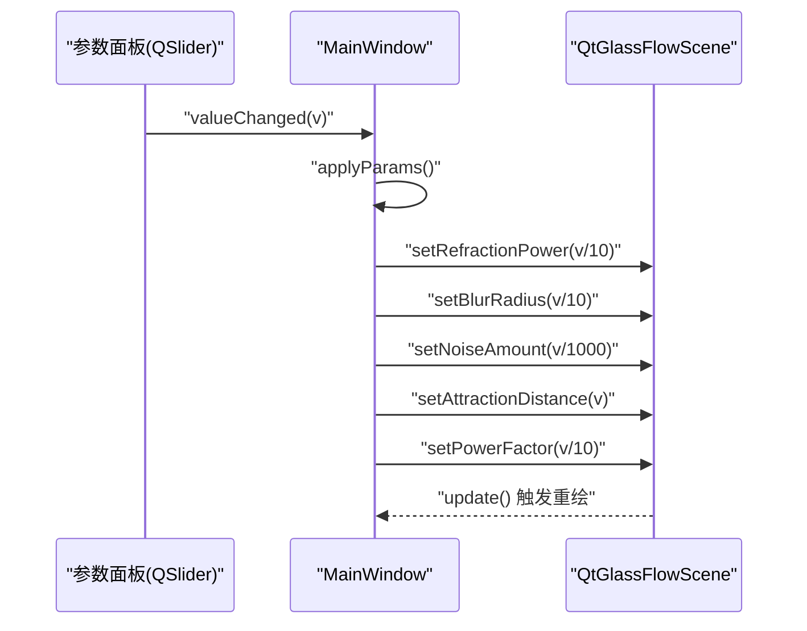
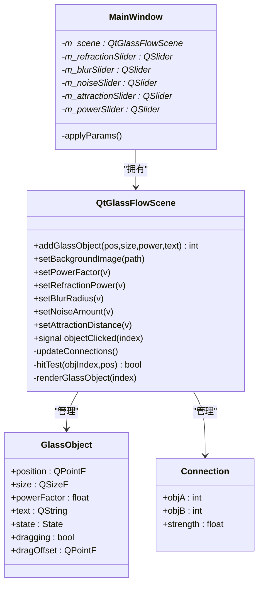

# 交互系统设计

<cite>
**本文档引用的文件**
- [qtglassflowscene.h](file://src/qtglassflowscene.h)
- [qtglassflowscene.cpp](file://src/qtglassflowscene.cpp)
- [mainwindow.h](file://demo/mainwindow.h)
- [mainwindow.cpp](file://demo/mainwindow.cpp)
- [main.cpp](file://demo/main.cpp)
- [scene_fragment.glsl](file://src/shaders/scene_fragment.glsl)
- [blur_fragment.glsl](file://src/shaders/blur_fragment.glsl)
- [README.md](file://README.md)
</cite>

## 目录
1. [简介](#简介)
2. [项目结构](#项目结构)
3. [核心组件](#核心组件)
4. [架构总览](#架构总览)
5. [详细组件分析](#详细组件分析)
6. [依赖关系分析](#依赖关系分析)
7. [性能考虑](#性能考虑)
8. [故障排查指南](#故障排查指南)
9. [结论](#结论)
10. [附录](#附录)

## 简介
本设计文档围绕液体玻璃对象交互系统展开，重点解释鼠标事件处理机制（点击检测、拖拽跟踪、悬停效果）、GlassObject对象的状态管理（Normal、Hovered、Pressed）、Smooth-union粘性连接算法（连接强度计算、连接列表管理与动态更新）、对象拖拽的物理模拟（惯性、边界约束、碰撞检测）、MainWindow参数面板与渲染引擎的双向绑定机制，以及交互事件的回调处理与状态同步策略。同时提供交互性能优化技巧与用户体验改进建议。

## 项目结构
该项目采用模块化组织方式：
- 核心渲染与交互：src/qtglassflowscene.h/.cpp
- 着色器资源：src/shaders/*.glsl
- 示例应用：demo/mainwindow.h/.cpp、demo/main.cpp
- 顶层构建脚本与打包配置：qtglassflow.pro、debian/*、qtglassflow.pc.in

图表来源
- [qtglassflowscene.h:17-142](file://src/qtglassflowscene.h#L17-L142)
- [qtglassflowscene.cpp:187-225](file://src/qtglassflowscene.cpp#L187-L225)
- [mainwindow.cpp:33-129](file://demo/mainwindow.cpp#L33-L129)
- [main.cpp:1-16](file://demo/main.cpp#L1-L16)

章节来源
- [README.md:86-108](file://README.md#L86-L108)
- [qtglassflowscene.h:17-142](file://src/qtglassflowscene.h#L17-L142)
- [qtglassflowscene.cpp:187-225](file://src/qtglassflowscene.cpp#L187-L225)
- [mainwindow.cpp:33-129](file://demo/mainwindow.cpp#L33-L129)
- [main.cpp:1-16](file://demo/main.cpp#L1-L16)

## 核心组件
- QtGlassFlowScene：继承自QOpenGLWidget，负责OpenGL初始化、FBO管线、着色器编译、对象渲染、鼠标交互、连接更新与参数驱动。
- GlassObject：玻璃对象数据结构，包含位置、尺寸、超椭圆幂、文本、状态、拖拽标志与拖拽偏移。
- Connection：连接信息，记录两个对象索引与连接强度（0~1）。
- MainWindow：示例应用窗口，包含参数面板滑块，实时调用QtGlassFlowScene的setter接口。

章节来源
- [qtglassflowscene.h:21-40](file://src/qtglassflowscene.h#L21-L40)
- [qtglassflowscene.h:112-115](file://src/qtglassflowscene.h#L112-L115)
- [mainwindow.h:10-29](file://demo/mainwindow.h#L10-L29)

## 架构总览
系统采用“OpenGL渲染管线 + 交互事件处理”的双层架构：
- 渲染层：背景纹理加载与blit、分离式高斯模糊（ping-pong）、玻璃对象逐对象alpha混合绘制。
- 交互层：鼠标事件捕获、命中测试、拖拽位移、悬停状态切换、点击信号发射。

图表来源
- [qtglassflowscene.cpp:587-667](file://src/qtglassflowscene.cpp#L587-L667)
- [qtglassflowscene.cpp:510-566](file://src/qtglassflowscene.cpp#L510-L566)
- [mainwindow.cpp:131-141](file://demo/mainwindow.cpp#L131-L141)

## 详细组件分析

### 鼠标事件处理与状态机
- 点击检测：自顶向下遍历GlassObject，使用超椭圆SDF命中测试，命中后设置拖拽索引、状态为Pressed、记录dragOffset并发出objectClicked信号。
- 拖拽跟踪：拖拽时根据dragOffset计算新位置，强制约束在窗口边界内，更新后触发重绘。
- 悬停效果：鼠标移动时重新计算hoveredIndex，若发生变化则更新前一hover对象为Normal或保持，当前对象设为Hovered。
- 释放处理：左键释放时停止拖拽，根据当前位置是否命中决定恢复为Hovered或Normal。

图表来源
- [qtglassflowscene.cpp:587-667](file://src/qtglassflowscene.cpp#L587-L667)

章节来源
- [qtglassflowscene.cpp:587-667](file://src/qtglassflowscene.cpp#L587-L667)
- [qtglassflowscene.h:21-34](file://src/qtglassflowscene.h#L21-L34)

### GlassObject状态管理
- Normal：默认状态，不参与拖拽。
- Hovered：鼠标悬停时设置，用于触发悬停流动与涟漪效果。
- Pressed：点击命中后设置，拖拽过程中保持，释放后根据命中情况回到Hovered或Normal。

状态转换逻辑由mousePressEvent/mouseMoveEvent/mouseReleaseEvent共同维护，确保同一时刻最多只有一个对象处于Pressed状态。

章节来源
- [qtglassflowscene.h:21-34](file://src/qtglassflowscene.h#L21-L34)
- [qtglassflowscene.cpp:587-667](file://src/qtglassflowscene.cpp#L587-L667)

### Smooth-union粘性连接算法
- 连接强度计算：遍历所有对象对，计算中心距离与半径之和的间隙gap，当gap小于attractionDist时建立连接，strength = clamp(1 - gap/attractionDist, 0, 1)，gap越小strength越大。
- 连接列表管理：每帧调用updateConnections()清空并重建，最多保留8个连接（着色器端限制）。
- 动态更新机制：paintGL中先updateConnections()，再渲染，确保连接随对象位置实时变化。

图表来源
- [qtglassflowscene.cpp:478-508](file://src/qtglassflowscene.cpp#L478-L508)

章节来源
- [qtglassflowscene.cpp:478-508](file://src/qtglassflowscene.cpp#L478-L508)
- [scene_fragment.glsl:60-95](file://src/shaders/scene_fragment.glsl#L60-L95)

### 对象拖拽的物理模拟
- 边界约束：拖拽时使用边界函数将新位置限定在[0, width-size.width]与[0, height-size.height]之间，避免对象移出窗口。
- 碰撞检测：当前实现未在拖拽阶段进行对象间碰撞检测，连接强度仅基于距离的平滑过渡。若需更真实的碰撞，可在拖拽阶段增加对象间SDF距离计算与位置修正。

章节来源
- [qtglassflowscene.cpp:609-620](file://src/qtglassflowscene.cpp#L609-L620)

### MainWindow参数面板与渲染引擎的双向绑定
- 参数面板：MainWindow包含折射强度、模糊半径、噪声量、吸引距离、超椭圆幂五个滑块。
- 单向绑定：滑块valueChanged信号触发applyParams()，调用QtGlassFlowScene的setter方法，随后update()触发重绘。
- 渲染参数：setRefractionPower、setBlurRadius、setNoiseAmount、setAttractionDistance、setPowerFactor分别映射到着色器uniform。

图表来源
- [mainwindow.cpp:80-103](file://demo/mainwindow.cpp#L80-L103)
- [mainwindow.cpp:131-141](file://demo/mainwindow.cpp#L131-L141)
- [qtglassflowscene.cpp:131-136](file://src/qtglassflowscene.cpp#L131-L136)

章节来源
- [mainwindow.cpp:80-103](file://demo/mainwindow.cpp#L80-L103)
- [mainwindow.cpp:131-141](file://demo/mainwindow.cpp#L131-L141)
- [qtglassflowscene.cpp:131-136](file://src/qtglassflowscene.cpp#L131-L136)

### 片元着色器中的交互效果
- 涟漪效果：当u_rippleTime≥0时，基于按压时间与局部坐标计算阻尼正弦波，叠加到dist上，产生极轻微的波动。
- 流动效果：当u_flowSpeed>0时，基于局部坐标与时间计算微扰，叠加到dist上，营造几乎不可见的流动感。
- 这些效果通过QtGlassFlowScene在渲染玻璃对象时传递uniform实现。

章节来源
- [scene_fragment.glsl:99-116](file://src/shaders/scene_fragment.glsl#L99-L116)
- [qtglassflowscene.cpp:409-432](file://src/qtglassflowscene.cpp#L409-L432)

## 依赖关系分析
- QtGlassFlowScene依赖OpenGL与QOpenGLWidget，管理FBO、着色器、对象集合与连接集合。
- MainWindow持有QtGlassFlowScene指针，负责UI与参数面板，通过信号槽与setter接口驱动场景。
- 着色器通过uniforms接收场景参数，实现平滑连接、折射与材质效果。

图表来源
- [qtglassflowscene.h:21-40](file://src/qtglassflowscene.h#L21-L40)
- [qtglassflowscene.h:112-115](file://src/qtglassflowscene.h#L112-L115)
- [mainwindow.h:10-29](file://demo/mainwindow.h#L10-L29)

章节来源
- [qtglassflowscene.h:21-40](file://src/qtglassflowscene.h#L21-L40)
- [qtglassflowscene.h:112-115](file://src/qtglassflowscene.h#L112-L115)
- [mainwindow.h:10-29](file://demo/mainwindow.h#L10-L29)

## 性能考虑
- 渲染管线优化
  - 分离式高斯模糊采用ping-pong缓冲，水平+垂直两次1D卷积，迭代次数m_blurIterations可调，平衡质量与性能。
  - 每帧仅一次背景blit与多次玻璃对象全屏quad绘制，alpha混合顺序合理，避免过度重绘。
- 交互性能优化
  - 命中测试使用超椭圆SDF，复杂度O(1)每像素，且仅在对象集合规模较小时有效；对象较多时建议减少连接数量或使用四叉树/空间分割加速。
  - updateConnections()每帧重建连接列表，复杂度O(n^2)；可通过增量更新或对象移动阈值降低频率。
  - 拖拽时仅更新被拖拽对象位置，其他对象状态不变，减少不必要的重绘。
- 用户体验优化
  - 悬停与按压状态切换即时反馈，提升交互感知。
  - 文本标签使用QPainter叠加，避免与GL混合带来的性能问题。
  - 参数面板滑块实时应用，提供即时预览。

章节来源
- [qtglassflowscene.cpp:316-359](file://src/qtglassflowscene.cpp#L316-L359)
- [qtglassflowscene.cpp:478-508](file://src/qtglassflowscene.cpp#L478-L508)
- [qtglassflowscene.cpp:510-566](file://src/qtglassflowscene.cpp#L510-L566)

## 故障排查指南
- 着色器编译失败
  - 检查着色器路径与资源文件是否正确加载，确认GLSL版本兼容性。
- 背景纹理不显示
  - 确认setBackgroundImage路径有效，检查loadBackgroundTexture与renderBackgroundToFbo流程。
- 拖拽无效或越界
  - 检查hitTest与mouseMoveEvent中的dragOffset计算，确认边界约束逻辑。
- 连接不生效
  - 检查attractionDist参数与updateConnections()是否被调用，确认着色器端u_numConnections与uniform数组长度匹配。
- 参数面板无响应
  - 确认滑块信号连接与applyParams()调用链路，检查QtGlassFlowScene的setter方法是否被调用。

章节来源
- [qtglassflowscene.cpp:138-157](file://src/qtglassflowscene.cpp#L138-L157)
- [qtglassflowscene.cpp:266-291](file://src/qtglassflowscene.cpp#L266-L291)
- [qtglassflowscene.cpp:510-566](file://src/qtglassflowscene.cpp#L510-L566)
- [mainwindow.cpp:131-141](file://demo/mainwindow.cpp#L131-L141)

## 结论
本系统通过SDF超椭圆与Smooth-union粘性连接实现了液态玻璃的视觉效果，结合OpenGL FBO管线与参数面板的实时调节，提供了高质量的交互体验。鼠标事件处理简洁高效，状态机清晰，连接算法稳定可控。建议在大规模对象场景下进一步优化连接更新与命中测试性能，并可考虑增强拖拽阶段的碰撞检测以提升真实感。

## 附录
- API参考
  - addGlassObject：添加玻璃对象，返回索引
  - setBackgroundImage：设置背景图片
  - setPowerFactor/setRefractionPower/setBlurRadius/setNoiseAmount/setAttractionDistance：参数调节
  - signal objectClicked：对象点击回调

章节来源
- [README.md:71-84](file://README.md#L71-L84)