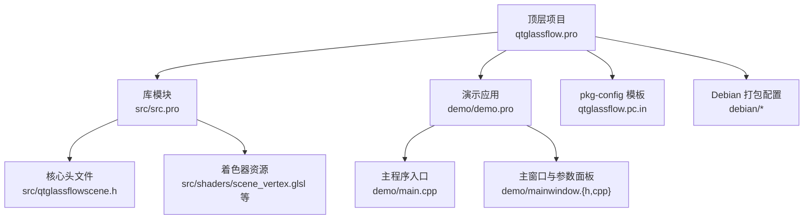
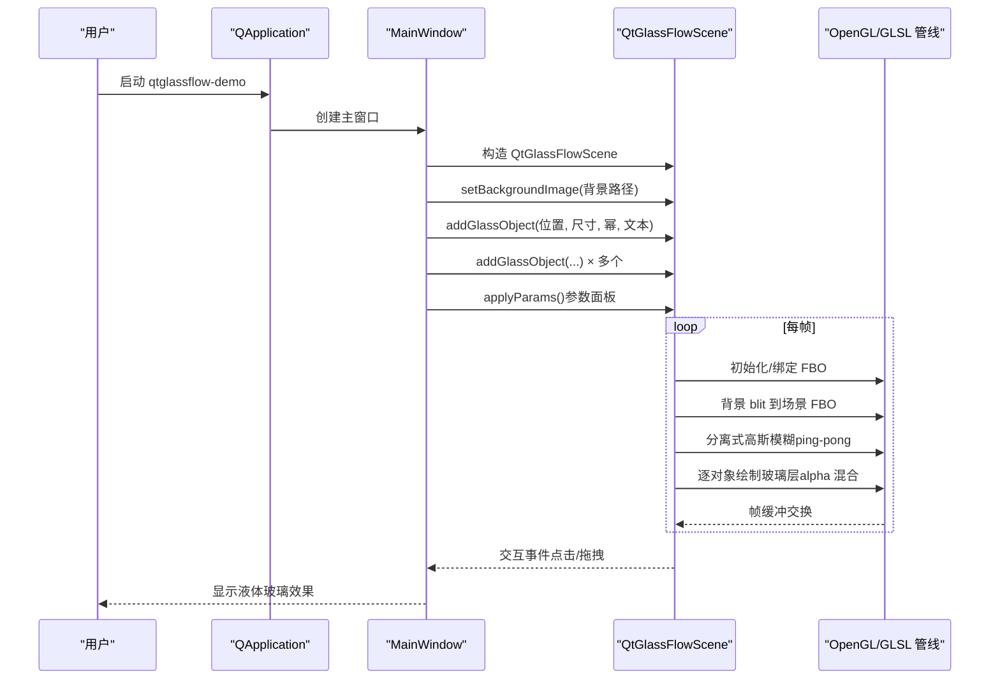
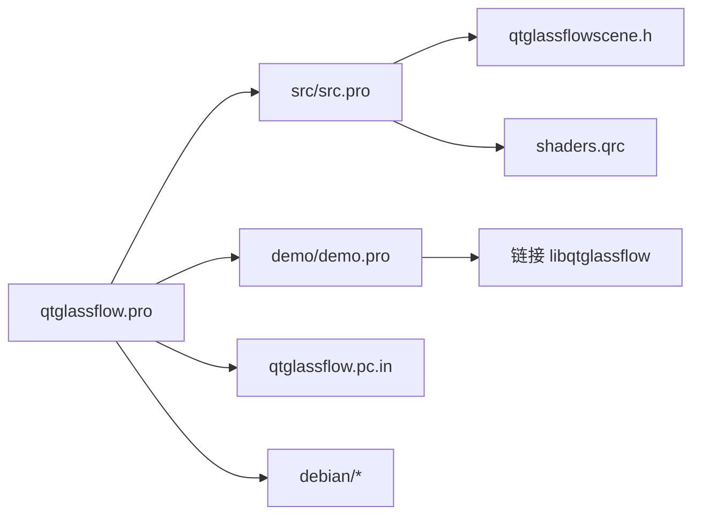

# 快速开始

<cite>
**本文引用的文件**
- [README.md](file://README.md)
- [qtglassflow.pro](file://qtglassflow.pro)
- [src/src.pro](file://src/src.pro)
- [demo/demo.pro](file://demo/demo.pro)
- [src/qtglassflowscene.h](file://src/qtglassflowscene.h)
- [demo/mainwindow.h](file://demo/mainwindow.h)
- [demo/mainwindow.cpp](file://demo/mainwindow.cpp)
- [demo/main.cpp](file://demo/main.cpp)
- [qtglassflow.pc.in](file://qtglassflow.pc.in)
- [debian/changelog](file://debian/changelog)
- [debian/libqtglassflow0.install](file://debian/libqtglassflow0.install)
- [debian/libqtglassflow-dev.install](file://debian/libqtglassflow-dev.install)
- [debian/qtglassflow-demo.install](file://debian/qtglassflow-demo.install)
- [src/shaders/scene_vertex.glsl](file://src/shaders/scene_vertex.glsl)
</cite>

## 目录
1. [简介](#简介)
2. [项目结构](#项目结构)
3. [核心组件](#核心组件)
4. [架构总览](#架构总览)
5. [详细组件分析](#详细组件分析)
6. [依赖关系分析](#依赖关系分析)
7. [性能注意事项](#性能注意事项)
8. [故障排查指南](#故障排查指南)
9. [结论](#结论)
10. [附录](#附录)

## 简介
本指南面向希望在5分钟内运行并体验 Qt 液体玻璃效果库的开发者。你将获得：
- 完整的编译安装步骤（qmake 配置与 make 编译）
- Debian 打包流程（dpkg-buildpackage）与生成的三个 deb 包内容
- 两种使用方式：pkg-config 集成与 qmake 直接引用
- 第一个液体玻璃对象的完整代码示例（创建场景、设置背景、添加玻璃对象）
- 参数面板使用说明（折射强度、模糊半径、噪声、吸引距离、超椭圆幂）

## 项目结构
该项目采用子目录组织，顶层通过 subdirs 模板聚合源码库与演示应用，并提供 pkg-config 模板与 Debian 打包配置。

图表来源
- [qtglassflow.pro:1-4](file://qtglassflow.pro#L1-L4)
- [src/src.pro:1-15](file://src/src.pro#L1-L15)
- [demo/demo.pro:1-14](file://demo/demo.pro#L1-L14)
- [src/qtglassflowscene.h:1-142](file://src/qtglassflowscene.h#L1-L142)
- [src/shaders/scene_vertex.glsl:1-9](file://src/shaders/scene_vertex.glsl#L1-L9)
- [demo/main.cpp:1-16](file://demo/main.cpp#L1-L16)
- [demo/mainwindow.h:1-32](file://demo/mainwindow.h#L1-L32)
- [demo/mainwindow.cpp:1-142](file://demo/mainwindow.cpp#L1-L142)
- [qtglassflow.pc.in:1-12](file://qtglassflow.pc.in#L1-L12)
- [debian/changelog:1-9](file://debian/changelog#L1-L9)

章节来源
- [qtglassflow.pro:1-4](file://qtglassflow.pro#L1-L4)
- [src/src.pro:1-15](file://src/src.pro#L1-L15)
- [demo/demo.pro:1-14](file://demo/demo.pro#L1-L14)

## 核心组件
- QtGlassFlowScene：继承自 QOpenGLWidget 的核心渲染类，负责管理 FBO 管线、着色器编译、对象拖拽交互、连接检测与每帧渲染调度。对外提供添加玻璃对象、设置背景图片、设置全局参数（折射强度、模糊半径、噪声、吸引距离、超椭圆幂）等接口。
- MainWindow：演示应用窗口，包含参数滑块面板，实时调节全局渲染参数并反馈到 QtGlassFlowScene。
- 着色器：基于 GLSL 120 的顶点/片段着色器，实现 SDF 超椭圆、分离式高斯模糊、折射采样、凸面穹顶光照与抗锯齿。

章节来源
- [src/qtglassflowscene.h:17-139](file://src/qtglassflowscene.h#L17-L139)
- [demo/mainwindow.h:10-29](file://demo/mainwindow.h#L10-L29)
- [demo/mainwindow.cpp:33-141](file://demo/mainwindow.cpp#L33-L141)
- [src/shaders/scene_vertex.glsl:1-9](file://src/shaders/scene_vertex.glsl#L1-L9)

## 架构总览
下图展示了从用户启动演示程序到渲染完成的端到端流程，以及库与应用之间的依赖关系。

图表来源
- [demo/main.cpp:4-15](file://demo/main.cpp#L4-L15)
- [demo/mainwindow.cpp:33-141](file://demo/mainwindow.cpp#L33-L141)
- [src/qtglassflowscene.h:62-85](file://src/qtglassflowscene.h#L62-L85)

## 详细组件分析

### 编译与安装（qmake + make）
- 在项目根目录执行 qmake 生成 Makefile，随后使用 make 并行编译。
- 编译完成后，可直接运行演示程序验证效果。

章节来源
- [README.md:23-29](file://README.md#L23-L29)

### Debian 打包（dpkg-buildpackage）
- 在项目根目录执行打包命令，生成三个 deb 包：
  - libqtglassflow0：运行时共享库
  - libqtglassflow-dev：开发头文件与 pkg-config
  - qtglassflow-demo：示例程序可执行文件
- 安装后，pkg-config 与 qmake 引用均可直接使用。

章节来源
- [README.md:33-44](file://README.md#L33-L44)
- [debian/changelog:1-9](file://debian/changelog#L1-L9)
- [debian/libqtglassflow0.install:1-2](file://debian/libqtglassflow0.install#L1-L2)
- [debian/libqtglassflow-dev.install:1-4](file://debian/libqtglassflow-dev.install#L1-L4)
- [debian/qtglassflow-demo.install:1-2](file://debian/qtglassflow-demo.install#L1-L2)

### 使用方式一：pkg-config 集成
- 通过 pkg-config 获取编译与链接参数，适用于 CMake 或手写 Makefile。
- 模板文件提供了标准字段：名称、描述、版本、依赖 Qt 模块、库路径与头文件路径。

章节来源
- [README.md:47-51](file://README.md#L47-L51)
- [qtglassflow.pc.in:1-12](file://qtglassflow.pc.in#L1-L12)

### 使用方式二：qmake 直接引用
- 在你的 qmake pro 文件中添加 Qt 模块与库路径，即可直接链接 libqtglassflow。
- 示例配置已在 demo 与 src 模块中体现。

章节来源
- [README.md:53-59](file://README.md#L53-L59)
- [demo/demo.pro:3-7](file://demo/demo.pro#L3-L7)
- [src/src.pro:4-14](file://src/src.pro#L4-L14)

### 第一个液体玻璃对象的完整代码示例
- 创建 QtGlassFlowScene 实例
- 设置背景图片（用于折射采样）
- 添加玻璃对象（位置、尺寸、超椭圆幂、文本标签）

章节来源
- [README.md:61-69](file://README.md#L61-L69)
- [demo/mainwindow.cpp:43-54](file://demo/mainwindow.cpp#L43-L54)

### 参数面板使用说明
- 折射强度（×0.1）：控制边缘扭曲程度
- 模糊半径（×0.1）：控制背景模糊范围
- 噪声量（×0.001）：控制表面扰动强度
- 吸引距离（px）：控制粘性桥接的触发距离
- 超椭圆幂（×0.1）：控制形状从圆角到方形的过渡

章节来源
- [demo/mainwindow.cpp:105-110](file://demo/mainwindow.cpp#L105-L110)
- [demo/mainwindow.cpp:131-141](file://demo/mainwindow.cpp#L131-L141)

### 渲染管线与技术要点
- 每帧流程：背景 blit → 分离式高斯模糊（ping-pong）→ 逐对象 alpha 混合 → 屏幕输出
- SDF 超椭圆：通过幂因子控制圆角到方形的连续过渡
- Smooth-union：基于多项式平滑最小值的粘性桥接，产生液桥效果
- 折射模型：基于指数衰减曲线对背景 UV 坐标进行边缘向中心的形变
- 凸面穹顶光照：线性渐变模拟顶部亮、底部暗的体积感
- 抗锯齿：基于 fwidth 的亚像素级边缘过渡与极细边框叠加

章节来源
- [README.md:171-194](file://README.md#L171-L194)
- [README.md:215-284](file://README.md#L215-L284)
- [README.md:286-331](file://README.md#L286-L331)
- [README.md:332-366](file://README.md#L332-L366)

## 依赖关系分析
- 顶层模板：subdirs 聚合 src 与 demo，demo 依赖 src
- 库模块：依赖 Qt5 core/gui/widgets/opengl，导出头文件与 pkg-config
- 演示应用：依赖 src 模块，链接 libqtglassflow
- Debian 安装：libqtglassflow0 安装共享库；libqtglassflow-dev 安装头文件与 pkgconfig；qtglassflow-demo 安装可执行文件

图表来源
- [qtglassflow.pro:1-4](file://qtglassflow.pro#L1-L4)
- [src/src.pro:1-15](file://src/src.pro#L1-L15)
- [demo/demo.pro:1-14](file://demo/demo.pro#L1-L14)
- [src/qtglassflowscene.h:1-142](file://src/qtglassflowscene.h#L1-L142)
- [qtglassflow.pc.in:1-12](file://qtglassflow.pc.in#L1-L12)
- [debian/libqtglassflow0.install:1-2](file://debian/libqtglassflow0.install#L1-L2)
- [debian/libqtglassflow-dev.install:1-4](file://debian/libqtglassflow-dev.install#L1-L4)
- [debian/qtglassflow-demo.install:1-2](file://debian/qtglassflow-demo.install#L1-L2)

章节来源
- [qtglassflow.pro:1-4](file://qtglassflow.pro#L1-L4)
- [src/src.pro:1-15](file://src/src.pro#L1-L15)
- [demo/demo.pro:1-14](file://demo/demo.pro#L1-L14)

## 性能注意事项
- 分离式高斯模糊采用 ping-pong 缓冲与多次迭代，可在不牺牲视觉质量的前提下提升性能稳定性
- 通过参数面板实时调整模糊半径与迭代次数，平衡画质与帧率
- 使用 alpha 混合时注意对象数量与重叠区域，避免亮度累积失真

## 故障排查指南
- OpenGL 上下文共享：确保在 QApplication 中启用上下文共享属性，避免多窗口或共享场景的渲染异常
- 背景图片路径：演示中使用系统默认壁纸路径，若不存在请替换为可用路径
- 权限问题：安装 deb 包后确认 pkg-config 与头文件路径正确，必要时重新生成 pc 文件

章节来源
- [demo/main.cpp:6](file://demo/main.cpp#L6)
- [demo/mainwindow.cpp:12-13](file://demo/mainwindow.cpp#L12-L13)

## 结论
通过本快速开始指南，你可以在本地完成编译与安装，并在5分钟内运行演示程序，直观体验液体玻璃效果。随后可根据需求选择 pkg-config 或 qmake 方式集成到自己的项目中，并利用参数面板进行实时调试与优化。

## 附录

### 快速操作清单
- 编译与运行
  - 在项目根目录执行 qmake 与 make
  - 运行演示程序查看效果
- Debian 打包
  - 在项目根目录执行打包命令
  - 安装生成的三个 deb 包
- 使用方式
  - pkg-config：获取编译与链接参数
  - qmake：添加 Qt 模块与库路径并链接库
- 第一个对象
  - 创建场景实例
  - 设置背景图片
  - 添加玻璃对象（位置、尺寸、幂、文本）

章节来源
- [README.md:23-29](file://README.md#L23-L29)
- [README.md:33-44](file://README.md#L33-L44)
- [README.md:47-59](file://README.md#L47-L59)
- [README.md:61-69](file://README.md#L61-L69)