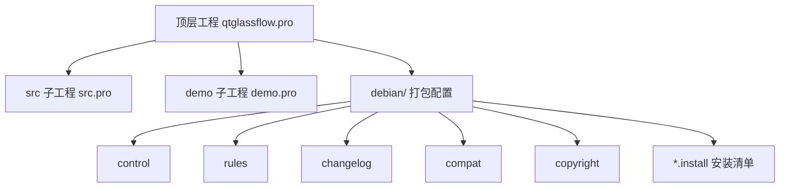
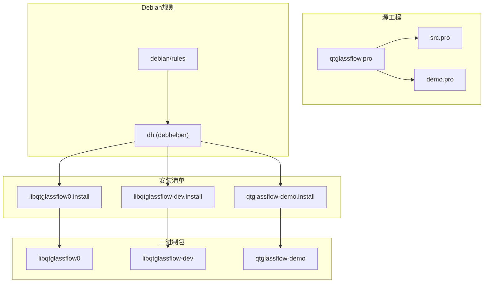
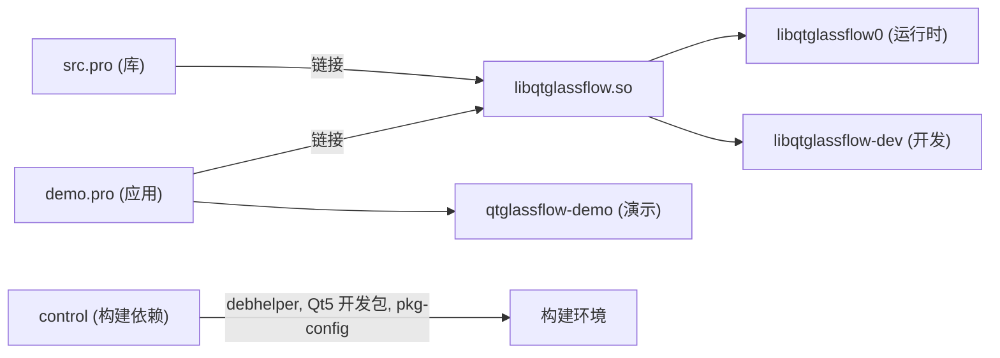

# Debian打包

<cite>
**本文档引用的文件**
- [debian/changelog](file://debian/changelog)
- [debian/control](file://debian/control)
- [debian/rules](file://debian/rules)
- [debian/compat](file://debian/compat)
- [debian/copyright](file://debian/copyright)
- [debian/libqtglassflow0.install](file://debian/libqtglassflow0.install)
- [debian/libqtglassflow-dev.install](file://debian/libqtglassflow-dev.install)
- [debian/qtglassflow-demo.install](file://debian/qtglassflow-demo.install)
- [qtglassflow.pro](file://qtglassflow.pro)
- [src/src.pro](file://src/src.pro)
- [demo/demo.pro](file://demo/demo.pro)
- [qtglassflow.pc](file://qtglassflow.pc)
- [qtglassflow.pc.in](file://qtglassflow.pc.in)
- [README.md](file://README.md)
</cite>

## 目录
1. [简介](#简介)
2. [项目结构](#项目结构)
3. [核心组件](#核心组件)
4. [架构总览](#架构总览)
5. [详细组件分析](#详细组件分析)
6. [依赖分析](#依赖分析)
7. [性能考虑](#性能考虑)
8. [故障排查指南](#故障排查指南)
9. [结论](#结论)
10. [附录](#附录)

## 简介
本文件面向Debian打包实践，围绕该项目的打包配置与流程展开，重点解释以下内容：
- Debian打包标准流程与工具链：dh_make、dpkg-buildpackage等命令的使用方式与注意事项
- changelog文件的格式与版本管理策略：如何维护软件版本历史记录
- debian/control文件的配置选项：包依赖关系、架构限制、描述信息
- 各个安装配置文件的作用：libqtglassflow0（运行时库）、libqtglassflow-dev（开发库）、qtglassflow-demo（演示程序）
- 完整工作流程：从源码准备到包文件生成的全过程
- 常见问题与调试方法：依赖冲突、权限问题等

## 项目结构
该项目采用qmake子目录工程组织，顶层模板为subdirs，包含src（库）与demo（应用）两个子模块。Debian打包配置位于debian目录，包含控制文件、规则、版权与安装清单等。

图表来源
- [qtglassflow.pro:1-4](file://qtglassflow.pro#L1-L4)
- [src/src.pro:1-15](file://src/src.pro#L1-L15)
- [demo/demo.pro:1-14](file://demo/demo.pro#L1-L14)
- [debian/control:1-27](file://debian/control#L1-L27)
- [debian/rules:1-17](file://debian/rules#L1-L17)

章节来源
- [qtglassflow.pro:1-4](file://qtglassflow.pro#L1-L4)
- [src/src.pro:1-15](file://src/src.pro#L1-L15)
- [demo/demo.pro:1-14](file://demo/demo.pro#L1-L14)
- [README.md:33-44](file://README.md#L33-L44)

## 核心组件
- 源工程与目标定义
  - 顶层工程模板为subdirs，包含src与demo两个子工程，明确构建顺序与依赖关系
  - src工程为库工程，定义库名、版本、Qt模块依赖、资源文件与安装路径
  - demo工程为应用工程，依赖src库，设置包含路径与链接库，定义可执行文件安装路径
- Debian控制与规则
  - control定义源包与三个二进制包（libqtglassflow0、libqtglassflow-dev、qtglassflow-demo）的依赖、架构与描述
  - rules使用debhelper约定式规则，通过override钩子完成qmake配置与安装，并在安装阶段生成pkg-config文件
  - changelog遵循DebConf标准格式，记录版本、发布状态、紧急程度、变更日志与提交者信息
  - compat指定DebHelper兼容级别
  - copyright遵循Debian版权格式，声明上游名称、源码地址、版权与许可证
  - *.install安装清单定义每个二进制包应安装的文件路径模式

章节来源
- [qtglassflow.pro:1-4](file://qtglassflow.pro#L1-L4)
- [src/src.pro:1-15](file://src/src.pro#L1-L15)
- [demo/demo.pro:1-14](file://demo/demo.pro#L1-L14)
- [debian/control:1-27](file://debian/control#L1-L27)
- [debian/rules:1-17](file://debian/rules#L1-L17)
- [debian/changelog:1-9](file://debian/changelog#L1-L9)
- [debian/compat:1-2](file://debian/compat#L1-L2)
- [debian/copyright:1-25](file://debian/copyright#L1-L25)
- [debian/libqtglassflow0.install:1-2](file://debian/libqtglassflow0.install#L1-L2)
- [debian/libqtglassflow-dev.install:1-4](file://debian/libqtglassflow-dev.install#L1-L4)
- [debian/qtglassflow-demo.install:1-2](file://debian/qtglassflow-demo.install#L1-L2)

## 架构总览
Debian打包架构围绕“源工程—DebHelper规则—安装清单—二进制包”的主线展开。qmake负责生成Makefile并完成构建，debhelper在rules中统一协调configure/install/build等阶段，安装清单决定每个包的文件集合，control定义包间依赖与描述信息。

图表来源
- [qtglassflow.pro:1-4](file://qtglassflow.pro#L1-L4)
- [src/src.pro:1-15](file://src/src.pro#L1-L15)
- [demo/demo.pro:1-14](file://demo/demo.pro#L1-L14)
- [debian/rules:1-17](file://debian/rules#L1-L17)
- [debian/libqtglassflow0.install:1-2](file://debian/libqtglassflow0.install#L1-L2)
- [debian/libqtglassflow-dev.install:1-4](file://debian/libqtglassflow-dev.install#L1-L4)
- [debian/qtglassflow-demo.install:1-2](file://debian/qtglassflow-demo.install#L1-L2)

## 详细组件分析

### changelog：版本与变更记录
- 格式要点
  - 第一行包含包名、版本号与发行版状态，以及紧急程度字段
  - 空行后为多条变更条目，每条以缩进开头
  - 最后一行包含提交者信息与时间戳
- 版本管理策略
  - 采用语义化版本号，配合发行版状态（如unstable）与紧急程度（如medium）
  - 变更条目应简洁描述功能或修复内容，便于用户与维护者快速了解改动
- 维护建议
  - 每次打包前更新版本号与变更条目
  - 保持提交者信息与时间戳准确，符合Debian规范

章节来源
- [debian/changelog:1-9](file://debian/changelog#L1-L9)

### debian/control：包定义与依赖
- 源包字段
  - Source：源包名
  - Section：源分类（如libs）
  - Priority：优先级（optional）
  - Maintainer：维护者姓名与邮箱
  - Build-Depends：构建期依赖（debhelper、Qt5开发包、pkg-config等）
  - Standards-Version：遵循的Debian标准版本
- 二进制包定义
  - libqtglassflow0：运行时库，依赖共享库与misc辅助
  - libqtglassflow-dev：开发包，依赖libqtglassflow0同版本、Qt5开发包与misc辅助
  - qtglassflow-demo：演示应用，依赖libqtglassflow0同版本及共享库与misc辅助
- 描述信息
  - 每个包提供简要与详细描述，帮助用户理解用途

章节来源
- [debian/control:1-27](file://debian/control#L1-L27)

### debian/rules：构建与安装流程
- 规则要点
  - 使用debhelper约定式规则，通过%通配符匹配目标
  - override_dh_auto_configure：设置QT_SELECT为qt5，使用qmake配置工程，指定PREFIX与INSTALL_ROOT
  - override_dh_auto_install：先执行默认安装，再生成并安装pkg-config文件
- pkg-config生成
  - 通过替换模板中的多架构占位符生成实际的qtglassflow.pc
  - 安装到多架构路径下的pkgconfig目录

章节来源
- [debian/rules:1-17](file://debian/rules#L1-L17)
- [qtglassflow.pc.in:1-12](file://qtglassflow.pc.in#L1-L12)

### 安装清单：libqtglassflow0、libqtglassflow-dev、qtglassflow-demo
- libqtglassflow0.install
  - 安装运行时共享库文件到多架构路径
- libqtglassflow-dev.install
  - 安装头文件、静态/共享库文件与pkg-config文件
- qtglassflow-demo.install
  - 安装演示程序可执行文件到/usr/bin

章节来源
- [debian/libqtglassflow0.install:1-2](file://debian/libqtglassflow0.install#L1-L2)
- [debian/libqtglassflow-dev.install:1-4](file://debian/libqtglassflow-dev.install#L1-L4)
- [debian/qtglassflow-demo.install:1-2](file://debian/qtglassflow-demo.install#L1-L2)

### 源工程与目标：库与应用
- src工程（库）
  - 定义库TARGET与VERSION，设置Qt模块与C++11
  - 通过target.headers.path与INSTALLS定义头文件与库的安装路径
  - 使用dpkg-architecture输出的多架构字符串作为安装路径后缀
- demo工程（应用）
  - 通过INCLUDEPATH与LIBS链接到src库
  - 定义可执行文件安装路径为/usr/bin

章节来源
- [src/src.pro:1-15](file://src/src.pro#L1-L15)
- [demo/demo.pro:1-14](file://demo/demo.pro#L1-L14)

### pkg-config文件：qtglassflow.pc与qtglassflow.pc.in
- 模板与生成
  - qtglassflow.pc.in包含多架构占位符，用于在构建时替换为实际多架构字符串
  - debian/rules在安装阶段将模板替换为实际值并安装到目标路径
- 内容要点
  - prefix/exec_prefix/libdir/includedir定义安装前缀与目录
  - Name/Description/Version提供包标识与描述
  - Requires/Libs/Cflags定义依赖与编译/链接参数

章节来源
- [qtglassflow.pc:1-12](file://qtglassflow.pc#L1-L12)
- [qtglassflow.pc.in:1-12](file://qtglassflow.pc.in#L1-L12)
- [debian/rules:10-17](file://debian/rules#L10-L17)

### 版本号一致性与多架构支持
- 版本号
  - src工程的VERSION与control中的Version、changelog中的版本号需保持一致
- 多架构支持
  - 通过dpkg-architecture查询DEB_HOST_MULTIARCH，确保库与pkg-config文件安装到正确的多架构目录

章节来源
- [src/src.pro:3](file://src/src.pro#L3)
- [debian/rules:13-16](file://debian/rules#L13-L16)

## 依赖分析
- 源工程依赖
  - src依赖Qt5核心、GUI、Widgets与OpenGL模块
  - demo同样依赖上述模块，并链接libqtglassflow
- 构建依赖
  - control中声明debhelper、Qt5开发包与pkg-config为构建期依赖
- 运行时依赖
  - libqtglassflow0提供共享库依赖
  - libqtglassflow-dev提供开发期依赖（头文件、pkg-config）
  - qtglassflow-demo依赖libqtglassflow0与其共享库

图表来源
- [src/src.pro:4](file://src/src.pro#L4)
- [demo/demo.pro:6-7](file://demo/demo.pro#L6-L7)
- [debian/control:5](file://debian/control#L5)
- [debian/control:8-26](file://debian/control#L8-L26)

章节来源
- [src/src.pro:4](file://src/src.pro#L4)
- [demo/demo.pro:6-7](file://demo/demo.pro#L6-L7)
- [debian/control:5](file://debian/control#L5)
- [debian/control:8-26](file://debian/control#L8-L26)

## 性能考虑
- 构建性能
  - 使用qmake与并行编译提升构建效率
  - 在debian/rules中避免重复生成与不必要的安装步骤
- 包大小与安装路径
  - 通过多架构路径安装库文件，减少冲突并优化系统布局
  - 合理拆分运行时与开发包，避免用户安装不必要的开发文件

## 故障排查指南
- 依赖冲突
  - 确认control中的Build-Depends与实际可用的Debian仓库版本匹配
  - 若出现运行时依赖缺失，检查libqtglassflow0的shlibs与misc依赖是否正确生成
- 权限问题
  - 确保在构建环境中具有写入debian/tmp与安装路径的权限
  - 使用sudo仅在必要时，避免污染构建环境
- 多架构路径错误
  - 检查debian/rules中多架构字符串的替换逻辑与安装路径
  - 确认qtglassflow.pc.in中的多架构占位符已被正确替换
- 版本不一致
  - 确保src.pro、control与changelog中的版本号保持一致
- 构建失败
  - 查看debian/rules的override钩子是否正确执行
  - 确认qmake配置与INSTALL_ROOT路径设置无误

章节来源
- [debian/control:5](file://debian/control#L5)
- [debian/rules:7-17](file://debian/rules#L7-L17)
- [qtglassflow.pc.in:3](file://qtglassflow.pc.in#L3)
- [src/src.pro:3](file://src/src.pro#L3)
- [debian/changelog:1](file://debian/changelog#L1)

## 结论
本项目采用qmake与debhelper的组合实现了清晰的Debian打包流程：通过顶层subdirs工程组织库与应用，借助debian/rules完成qmake配置与安装，并在安装阶段生成pkg-config文件；debian/control定义了三类包的依赖与描述，changelog维护版本历史。遵循本文档的流程与排错建议，可稳定产出libqtglassflow0、libqtglassflow-dev与qtglassflow-demo三个包。

## 附录

### Debian打包完整工作流程（从源码到包文件）
- 准备源码
  - 确保src.pro、demo.pro、qtglassflow.pro与debian目录齐备
  - 更新debian/changelog与debian/control中的版本信息
- 配置构建环境
  - 安装构建依赖：debhelper、Qt5开发包、pkg-config等
- 执行打包
  - 使用dpkg-buildpackage命令生成源码包与二进制包
  - 生成的包包括：libqtglassflow0、libqtglassflow-dev、qtglassflow-demo
- 验证与分发
  - 安装生成的.deb包进行验证
  - 发布至仓库或分发渠道

章节来源
- [README.md:33-44](file://README.md#L33-L44)
- [debian/rules:1-17](file://debian/rules#L1-L17)
- [debian/control:1-27](file://debian/control#L1-L27)