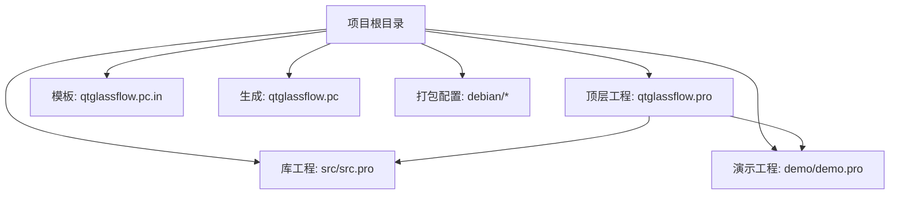
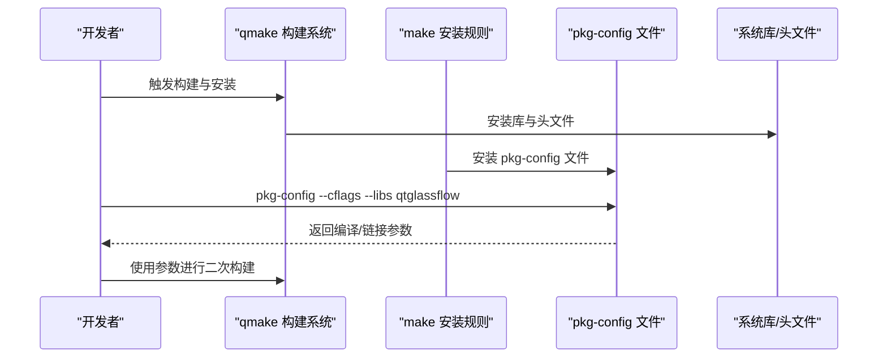
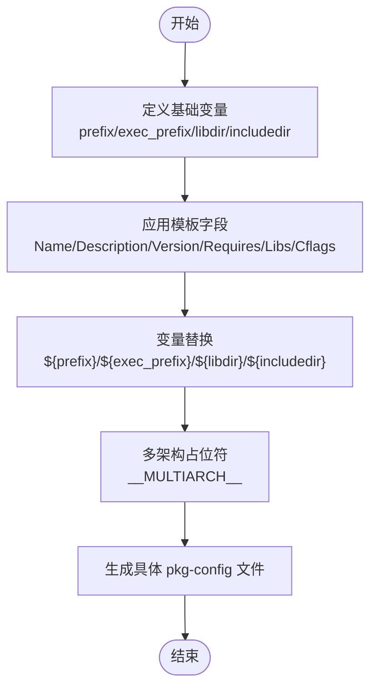
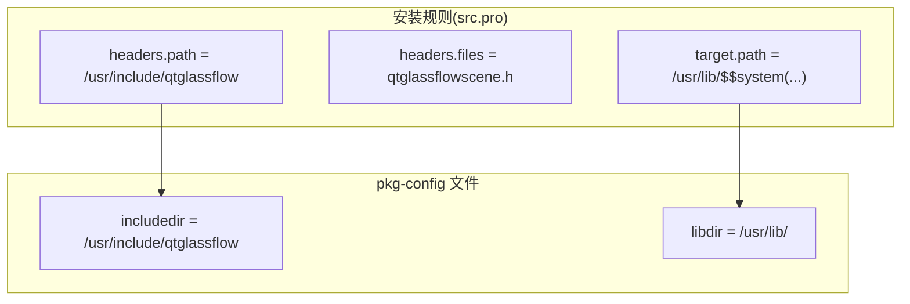
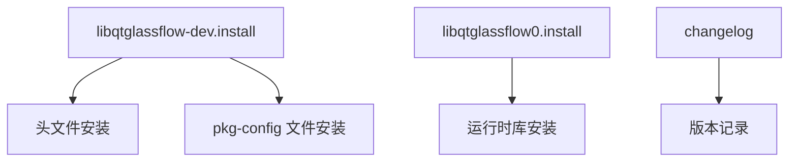
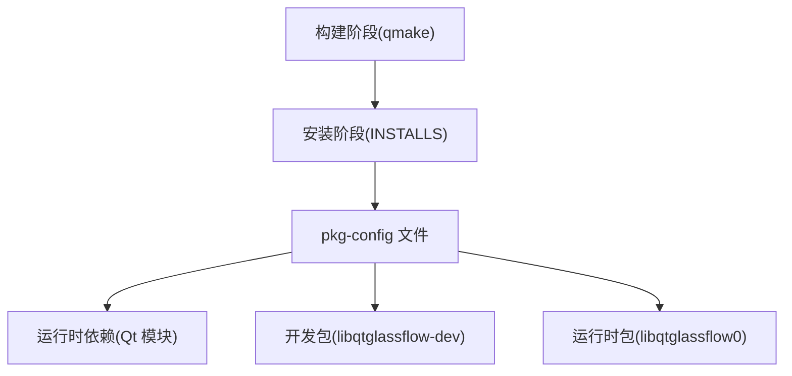

# Pkg-config集成

<cite>
**本文档引用的文件**
- [qtglassflow.pc.in](file://qtglassflow.pc.in)
- [qtglassflow.pc](file://qtglassflow.pc)
- [src.pro](file://src/src.pro)
- [demo.pro](file://demo/demo.pro)
- [README.md](file://README.md)
- [libqtglassflow-dev.install](file://debian/libqtglassflow-dev.install)
- [libqtglassflow0.install](file://debian/libqtglassflow0.install)
- [changelog](file://debian/changelog)
</cite>

## 目录
1. [简介](#简介)
2. [项目结构](#项目结构)
3. [核心组件](#核心组件)
4. [架构总览](#架构总览)
5. [详细组件分析](#详细组件分析)
6. [依赖关系分析](#依赖关系分析)
7. [性能考虑](#性能考虑)
8. [故障排除指南](#故障排除指南)
9. [结论](#结论)
10. [附录](#附录)

## 简介
本文件系统性阐述该项目的 pkg-config 集成方案，重点解析模板文件 qtglassflow.pc.in 的配置语法与变量替换机制，说明如何生成标准的 qtglassflow.pc 包配置文件，涵盖库路径、头文件路径与编译标志的设置方式；提供 pkg-config 命令的使用方法，包括查询库信息与获取编译/链接参数的指令；解释在其他项目中如何正确引用 qt-liquid-glass 库，包括 PKG_CONFIG_PATH 环境变量的设置；说明 pkg-config 在不同操作系统上的安装与配置方法；最后给出 pkg-config 集成的故障排除指南，覆盖找不到包文件、版本不匹配等问题的解决思路。

## 项目结构
该项目采用 qmake 子模块组织，顶层通过 qtglassflow.pro 管理 src 与 demo 两个子工程。pkg-config 相关的关键文件位于根目录，包含模板文件 qtglassflow.pc.in 与已生成的 qtglassflow.pc；debian 目录提供 Debian 打包配置，确保开发包安装时包含 pkg-config 文件与头文件。

**图表来源**
- [qtglassflow.pro:1-4](file://qtglassflow.pro#L1-L4)
- [src.pro:1-15](file://src/src.pro#L1-L15)
- [demo.pro:1-14](file://demo/demo.pro#L1-L14)
- [qtglassflow.pc.in:1-12](file://qtglassflow.pc.in#L1-L12)
- [qtglassflow.pc:1-12](file://qtglassflow.pc#L1-L12)
- [libqtglassflow-dev.install:1-4](file://debian/libqtglassflow-dev.install#L1-L4)

**章节来源**
- [qtglassflow.pro:1-4](file://qtglassflow.pro#L1-L4)
- [src.pro:1-15](file://src/src.pro#L1-L15)
- [demo.pro:1-14](file://demo/demo.pro#L1-L14)
- [qtglassflow.pc.in:1-12](file://qtglassflow.pc.in#L1-L12)
- [qtglassflow.pc:1-12](file://qtglassflow.pc#L1-L12)
- [libqtglassflow-dev.install:1-4](file://debian/libqtglassflow-dev.install#L1-L4)

## 核心组件
- pkg-config 模板与生成文件
  - 模板文件 qtglassflow.pc.in 定义了库的名称、描述、版本、依赖、库路径与头文件路径等元数据，并使用变量占位符进行替换。
  - 已生成的 qtglassflow.pc 为模板在特定平台（如 x86_64-linux-gnu）上的具体化产物，其中 libdir 已替换为实际的多架构库目录。
- qmake 工程与安装规则
  - src/src.pro 中定义了库目标、依赖 Qt 模块、C++11 标准，并通过 INSTALLS 指令将库与头文件安装到系统路径，确保 pkg-config 文件能正确指向这些位置。
  - demo/demo.pro 展示了手动指定 INCLUDEPATH 与 LIBS 的方式，作为不使用 pkg-config 时的替代方案。
- Debian 打包配置
  - debian/libqtglassflow-dev.install 明确安装 pkg-config 文件与头文件，保证开发包的完整性。
  - debian/libqtglassflow0.install 明确安装运行时共享库，确保运行时依赖齐全。
  - changelog 记录版本与发布信息，便于跟踪变更。

**章节来源**
- [qtglassflow.pc.in:1-12](file://qtglassflow.pc.in#L1-L12)
- [qtglassflow.pc:1-12](file://qtglassflow.pc#L1-L12)
- [src.pro:1-15](file://src/src.pro#L1-L15)
- [demo.pro:1-14](file://demo/demo.pro#L1-L14)
- [libqtglassflow-dev.install:1-4](file://debian/libqtglassflow-dev.install#L1-L4)
- [libqtglassflow0.install:1-2](file://debian/libqtglassflow0.install#L1-L2)
- [changelog:1-9](file://debian/changelog#L1-L9)

## 架构总览
pkg-config 集成在本项目中的工作流如下：qmake 构建阶段生成库与头文件；安装阶段将 pkg-config 文件与头文件放置到系统路径；最终用户通过 pkg-config 查询库信息，或在构建系统中直接使用其输出的编译/链接参数。

**图表来源**
- [src.pro:11-14](file://src/src.pro#L11-L14)
- [libqtglassflow-dev.install:1-4](file://debian/libqtglassflow-dev.install#L1-L4)
- [qtglassflow.pc.in:1-12](file://qtglassflow.pc.in#L1-L12)
- [qtglassflow.pc:1-12](file://qtglassflow.pc#L1-L12)

## 详细组件分析

### pkg-config 模板与变量替换机制
- 变量定义与替换
  - 模板文件通过 prefix、exec_prefix、libdir、includedir 等变量统一管理安装路径，便于跨平台与多架构适配。
  - 变量使用 ${var} 语法进行替换，例如 libdir=${exec_prefix}/lib/__MULTIARCH__ 会在生成时替换为实际的多架构库目录。
- 关键字段说明
  - Name/Description/Version：标识库的基本信息，便于工具链识别与展示。
  - Requires：声明运行时依赖的 Qt 模块，确保链接阶段满足依赖。
  - Libs/Cflags：分别提供链接参数与编译参数，供构建系统直接使用。
- 生成文件对比
  - 已生成的 qtglassflow.pc 将 libdir 固定为 x86_64-linux-gnu 多架构目录，体现了平台特定的安装路径。
  - 模板 qtglassflow.pc.in 保留 __MULTIARCH__ 占位符，便于在不同架构上生成对应的具体路径。

**图表来源**
- [qtglassflow.pc.in:1-12](file://qtglassflow.pc.in#L1-L12)
- [qtglassflow.pc:1-12](file://qtglassflow.pc#L1-L12)

**章节来源**
- [qtglassflow.pc.in:1-12](file://qtglassflow.pc.in#L1-L12)
- [qtglassflow.pc:1-12](file://qtglassflow.pc#L1-L12)

### 库与头文件的安装路径与构建规则
- 安装规则
  - src/src.pro 通过 INSTALLS 指令将库与头文件安装到系统路径，确保 pkg-config 文件能够正确指向这些位置。
  - INSTALLS 中的 target 指向库文件，headers 指向头文件目录，二者均遵循多架构安装约定。
- 头文件与库的布局
  - 头文件安装到 /usr/include/qtglassflow，与 pkg-config 中的 includedir 对应。
  - 库文件安装到 /usr/lib/<multiarch>/，与 pkg-config 中的 libdir 对应。
- 与 pkg-config 的一致性
  - pkg-config 文件中的 includedir 与 libdir 与 qmake 的 INSTALLS 目标保持一致，确保查询结果与实际安装路径相符。

**图表来源**
- [src.pro:11-14](file://src/src.pro#L11-L14)
- [qtglassflow.pc.in:3-4](file://qtglassflow.pc.in#L3-L4)

**章节来源**
- [src.pro:1-15](file://src/src.pro#L1-L15)
- [qtglassflow.pc.in:3-4](file://qtglassflow.pc.in#L3-L4)

### Debian 打包与 pkg-config 文件的安装
- 开发包安装内容
  - debian/libqtglassflow-dev.install 明确安装头文件、库文件与 pkg-config 文件，确保开发环境完整。
- 运行时包安装内容
  - debian/libqtglassflow0.install 明确安装运行时共享库，确保运行时依赖齐全。
- 版本与变更记录
  - changelog 记录版本号与发布说明，便于跟踪变更与问题定位。

**图表来源**
- [libqtglassflow-dev.install:1-4](file://debian/libqtglassflow-dev.install#L1-L4)
- [libqtglassflow0.install:1-2](file://debian/libqtglassflow0.install#L1-L2)
- [changelog:1-9](file://debian/changelog#L1-L9)

**章节来源**
- [libqtglassflow-dev.install:1-4](file://debian/libqtglassflow-dev.install#L1-L4)
- [libqtglassflow0.install:1-2](file://debian/libqtglassflow0.install#L1-L2)
- [changelog:1-9](file://debian/changelog#L1-L9)

### 在其他项目中正确引用 qt-liquid-glass 库
- 使用 pkg-config 的方式
  - 通过 pkg-config --cflags --libs qtglassflow 获取编译与链接参数，直接集成到构建系统中。
- 不使用 pkg-config 的方式
  - demo/demo.pro 展示了手动指定 INCLUDEPATH 与 LIBS 的做法，作为替代方案。
- 环境变量 PKG_CONFIG_PATH 的设置
  - 若 pkg-config 文件不在默认搜索路径中，可通过设置 PKG_CONFIG_PATH 指向包含 qtglassflow.pc 的目录，以便 pkg-config 正确发现包文件。

**章节来源**
- [README.md:47-60](file://README.md#L47-L60)
- [demo.pro:6-7](file://demo/demo.pro#L6-L7)

## 依赖关系分析
- 构建与安装阶段
  - qmake 构建 src 与 demo 工程，安装库与头文件至系统路径。
  - 安装阶段将 pkg-config 文件与头文件一并安装，确保查询结果与实际安装路径一致。
- 运行时依赖
  - pkg-config 文件声明 Requires: Qt5Core Qt5Gui Qt5Widgets Qt5OpenGL，确保链接阶段满足 Qt 模块依赖。
- Debian 打包依赖
  - 开发包安装 pkg-config 文件与头文件，运行时包安装共享库，二者共同构成完整的库生态。

**图表来源**
- [src.pro:11-14](file://src/src.pro#L11-L14)
- [qtglassflow.pc.in](file://qtglassflow.pc.in#L9)
- [libqtglassflow-dev.install:1-4](file://debian/libqtglassflow-dev.install#L1-L4)
- [libqtglassflow0.install:1-2](file://debian/libqtglassflow0.install#L1-L2)

**章节来源**
- [src.pro:1-15](file://src/src.pro#L1-L15)
- [qtglassflow.pc.in](file://qtglassflow.pc.in#L9)
- [libqtglassflow-dev.install:1-4](file://debian/libqtglassflow-dev.install#L1-L4)
- [libqtglassflow0.install:1-2](file://debian/libqtglassflow0.install#L1-L2)

## 性能考虑
- pkg-config 查询开销
  - pkg-config 查询为轻量级操作，通常不会成为构建瓶颈；建议在 CI 或自动化脚本中缓存查询结果以减少重复开销。
- 多架构支持
  - 模板中使用 __MULTIARCH__ 占位符，生成文件针对具体架构（如 x86_64-linux-gnu）进行替换，确保库路径精确，避免不必要的路径查找与错误。
- 头文件与库路径一致性
  - 通过 qmake 的 INSTALLS 与 pkg-config 的 includedir/libdir 保持一致，可减少构建系统在路径解析上的额外工作。

[本节为通用指导，无需列出章节来源]

## 故障排除指南
- 找不到包文件
  - 现象：pkg-config --exists qtglassflow 返回非零，或 --cflags --libs 报错。
  - 排查：确认 pkg-config 文件是否已安装到系统路径，检查 PKG_CONFIG_PATH 是否包含该文件所在目录。
  - 解决：将包含 qtglassflow.pc 的目录加入 PKG_CONFIG_PATH，或确保开发包已正确安装。
- 版本不匹配
  - 现象：查询到的版本与预期不符，或链接时报错。
  - 排查：检查 qtglassflow.pc 中的 Version 字段与实际安装版本是否一致。
  - 解决：重新生成或更新 pkg-config 文件，确保 Version 与库版本同步。
- 依赖缺失
  - 现象：链接阶段报错，提示缺少 Qt 模块。
  - 排查：确认 pkg-config 文件中的 Requires 字段与系统已安装的 Qt 模块一致。
  - 解决：安装缺失的 Qt 模块或调整构建系统的 Qt 配置。
- 头文件或库路径错误
  - 现象：编译时报找不到头文件，或链接时报找不到库。
  - 排查：核对 pkg-config 输出的 Cflags 与 Libs 是否与 qmake 的 INSTALLS 目标一致。
  - 解决：修正 qmake 的 INSTALLS 目标或 pkg-config 文件中的路径变量。

**章节来源**
- [qtglassflow.pc.in:6-11](file://qtglassflow.pc.in#L6-L11)
- [qtglassflow.pc:6-11](file://qtglassflow.pc#L6-L11)
- [src.pro:11-14](file://src/src.pro#L11-L14)

## 结论
本项目通过 pkg-config 模板与生成文件实现了标准化的库配置，结合 qmake 的安装规则与 Debian 打包配置，确保了开发与运行时环境的一致性。开发者只需通过 pkg-config 即可获取编译与链接参数，简化了跨平台与多架构的集成过程。遇到常见问题时，按照故障排除指南逐一排查变量、路径与依赖即可快速定位并解决问题。

[本节为总结性内容，无需列出章节来源]

## 附录

### pkg-config 命令使用方法
- 查询库信息
  - 使用 pkg-config --cflags --libs <包名> 获取编译与链接参数。
- 获取版本信息
  - 使用 pkg-config --modversion <包名> 获取版本号。
- 检查依赖
  - 使用 pkg-config --print-requires <包名> 查看依赖列表。
- 检查是否存在
  - 使用 pkg-config --exists <包名> 判断包是否可用。

**章节来源**
- [README.md:47-51](file://README.md#L47-L51)

### 不同操作系统上的安装与配置
- Linux（Debian/Ubuntu）
  - 通过 apt 安装开发包以获得 pkg-config 文件与头文件。
  - 如需自定义安装路径，设置 PKG_CONFIG_PATH 指向包含 qtglassflow.pc 的目录。
- Windows（MSYS2/MinGW）
  - 使用 pacman 安装相应的开发包，确保 pkg-config 文件与头文件一并安装。
  - 在构建脚本中设置 PKG_CONFIG_PATH 指向安装目录。
- macOS（Homebrew）
  - 使用 brew 安装相关依赖，确保 pkg-config 文件与头文件可用。
  - 如需自定义安装路径，设置 PKG_CONFIG_PATH 指向包含 qtglassflow.pc 的目录。

[本节为通用指导，无需列出章节来源]