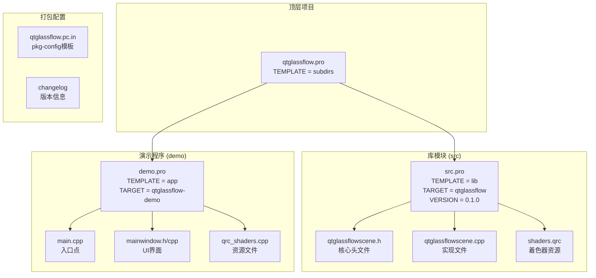
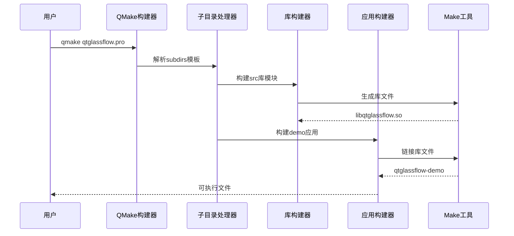
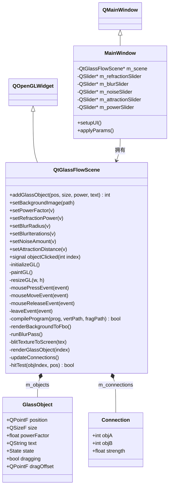
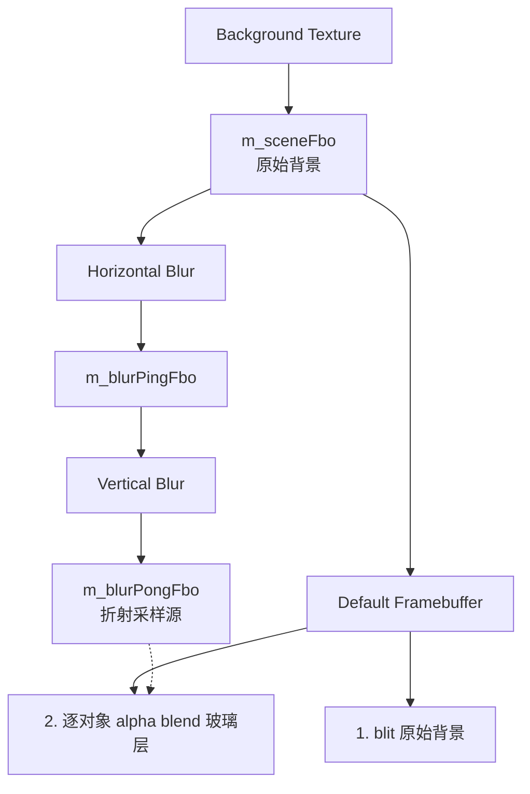
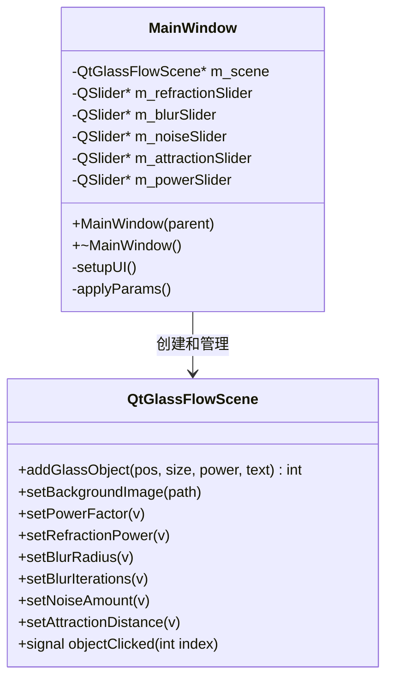
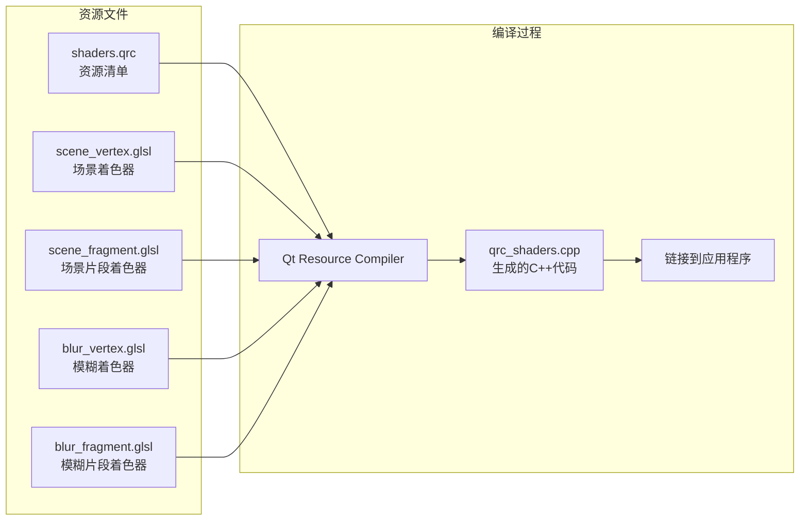
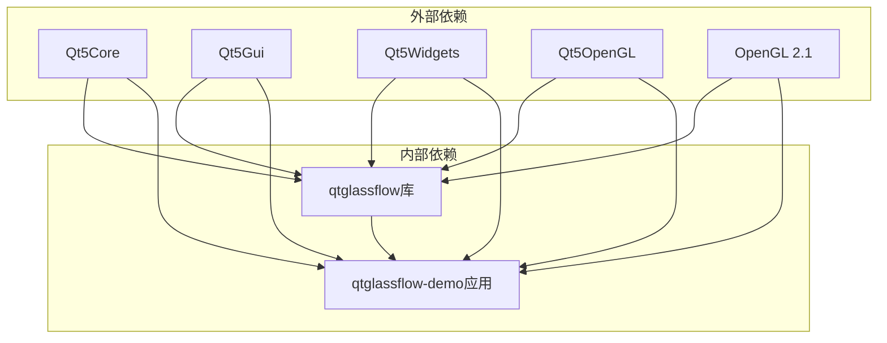

# QMake构建系统

<cite>
**本文档引用的文件**
- [qtglassflow.pro](file://qtglassflow.pro)
- [src.pro](file://src/src.pro)
- [demo.pro](file://demo/demo.pro)
- [qtglassflowscene.h](file://src/qtglassflowscene.h)
- [qtglassflowscene.cpp](file://src/qtglassflowscene.cpp)
- [mainwindow.h](file://demo/mainwindow.h)
- [mainwindow.cpp](file://demo/mainwindow.cpp)
- [shaders.qrc](file://src/shaders.qrc)
- [blur_vertex.glsl](file://src/shaders/blur_vertex.glsl)
- [scene_vertex.glsl](file://src/shaders/scene_vertex.glsl)
- [qtglassflow.pc.in](file://qtglassflow.pc.in)
- [README.md](file://README.md)
- [changelog](file://debian/changelog)
</cite>

## 目录
1. [简介](#简介)
2. [项目结构](#项目结构)
3. [核心组件](#核心组件)
4. [架构概览](#架构概览)
5. [详细组件分析](#详细组件分析)
6. [依赖关系分析](#依赖关系分析)
7. [性能考虑](#性能考虑)
8. [故障排除指南](#故障排除指南)
9. [结论](#结论)
10. [附录](#附录)

## 简介

这是一个基于Qt和OpenGL的液态玻璃效果渲染库的QMake构建系统。该项目提供了可重用的QtGlassFlowScene类库，以及一个功能完整的演示应用程序。构建系统采用分层结构，通过顶层的qtglassflow.pro文件协调src库模块和demo演示程序的构建。

## 项目结构

项目采用标准的QMake分层构建架构，主要包含以下组件：



**图表来源**
- [qtglassflow.pro:1-4](file://qtglassflow.pro#L1-L4)
- [src/src.pro:1-15](file://src/src.pro#L1-L15)
- [demo/demo.pro:1-14](file://demo/demo.pro#L1-L14)

**章节来源**
- [qtglassflow.pro:1-4](file://qtglassflow.pro#L1-L4)
- [README.md:86-108](file://README.md#L86-L108)

## 核心组件

### 顶层构建配置

顶层项目配置文件qtglassflow.pro采用subdirs模板，定义了项目的整体结构：

- **模板类型**: subdirs - 管理多个子目录的构建
- **子目录**: src (库模块) 和 demo (演示程序)
- **依赖关系**: demo依赖src库，确保库先于应用程序构建

### 库模块配置 (src/src.pro)

src模块是核心库，提供QtGlassFlowScene类的完整实现：

- **模板类型**: lib - 创建共享库
- **目标名称**: qtglassflow - 库文件名为libqtglassflow.so
- **版本管理**: 0.1.0 - 版本号遵循语义化版本控制
- **Qt模块依赖**: core, gui, widgets, opengl
- **C++标准**: c++11 - 启用现代C++特性支持

**章节来源**
- [src/src.pro:1-15](file://src/src.pro#L1-L15)

### 演示程序配置 (demo/demo.pro)

演示程序展示库的功能和使用方法：

- **模板类型**: app - 创建可执行应用程序
- **目标名称**: qtglassflow-demo - 可执行文件名
- **Qt模块依赖**: core, gui, widgets, opengl
- **C++标准**: c++11 - 与库保持一致
- **依赖配置**: 通过INCLUDEPATH和LIBS链接到src库

**章节来源**
- [demo/demo.pro:1-14](file://demo/demo.pro#L1-L14)

## 架构概览

构建系统采用典型的Qt库-应用分离架构：



**图表来源**
- [qtglassflow.pro:1-4](file://qtglassflow.pro#L1-L4)
- [src/src.pro:1-15](file://src/src.pro#L1-L15)
- [demo/demo.pro:1-14](file://demo/demo.pro#L1-L14)

## 详细组件分析

### QtGlassFlowScene类库分析

QtGlassFlowScene是库的核心类，继承自QOpenGLWidget并实现完整的渲染功能：



**图表来源**
- [qtglassflowscene.h:17-141](file://src/qtglassflowscene.h#L17-L141)
- [mainwindow.h:10-31](file://demo/mainwindow.h#L10-L31)

#### 核心数据结构

库定义了三种重要的数据结构：

1. **GlassObject**: 表示单个玻璃对象的状态和属性
2. **Connection**: 表示两个对象之间的粘性连接
3. **State枚举**: 对象的交互状态（Normal, Hovered, Pressed）

#### 渲染管线架构

库实现了复杂的多阶段渲染管线：



**图表来源**
- [qtglassflowscene.cpp:187-200](file://src/qtglassflowscene.cpp#L187-L200)

**章节来源**
- [qtglassflowscene.h:17-141](file://src/qtglassflowscene.h#L17-L141)
- [qtglassflowscene.cpp:187-200](file://src/qtglassflowscene.cpp#L187-L200)

### 演示程序组件分析

演示程序展示了库的实际使用方法和交互功能：

#### 主窗口架构



**图表来源**
- [mainwindow.h:10-31](file://demo/mainwindow.h#L10-L31)
- [qtglassflowscene.h:42-68](file://src/qtglassflowscene.h#L42-L68)

#### 参数控制系统

演示程序提供了完整的参数调节界面：

- **折射强度**: 控制玻璃的折射效果强度
- **模糊半径**: 调节背景模糊的程度
- **噪声量**: 添加随机噪声增强视觉效果
- **吸引距离**: 控制粘性连接的产生距离
- **超椭圆幂**: 调节形状的圆角到方形过渡

**章节来源**
- [mainwindow.cpp:131-141](file://demo/mainwindow.cpp#L131-L141)

### 资源管理系统

项目使用Qt的资源系统来管理着色器文件：



**图表来源**
- [shaders.qrc:1-9](file://src/shaders.qrc#L1-L9)

**章节来源**
- [shaders.qrc:1-9](file://src/shaders.qrc#L1-L9)

## 依赖关系分析

### 模块间依赖



**图表来源**
- [src/src.pro:4](file://src/src.pro#L4)
- [demo/demo.pro:3](file://demo/demo.pro#L3)

### 编译时依赖链

```mermaid
sequenceDiagram
participant Build as 构建系统
participant Lib as 库模块
participant App as 应用程序
participant Link as 链接器
Build->>Lib : 编译库源码
Lib->>Lib : 链接Qt模块
Lib->>Lib : 生成库文件
Lib-->>Build : libqtglassflow.so
Build->>App : 编译应用源码
App->>Link : 链接库文件
Link->>Link : 解析符号依赖
Link-->>App : 可执行文件
```

**图表来源**
- [src/src.pro:11-14](file://src/src.pro#L11-L14)
- [demo/demo.pro:6-7](file://demo/demo.pro#L6-L7)

**章节来源**
- [src/src.pro:4-14](file://src/src.pro#L4-L14)
- [demo/demo.pro:3-13](file://demo/demo.pro#L3-L13)

## 性能考虑

### 渲染性能优化

库实现了多种性能优化技术：

1. **分离式高斯模糊**: 通过水平和垂直两阶段模糊减少计算复杂度
2. **Ping-Pong缓冲**: 在两个FBO之间交替存储，避免内存拷贝
3. **条件渲染**: 仅在必要时更新和重新渲染
4. **批量操作**: 同时处理多个玻璃对象的渲染

### 内存管理

- **智能指针**: 使用Qt的智能指针管理OpenGL对象生命周期
- **延迟初始化**: 仅在需要时创建和初始化渲染资源
- **资源池**: 复用着色器程序和几何缓冲区

## 故障排除指南

### 常见构建问题

#### 依赖缺失问题

**问题**: `error: cannot find -lqtglassflow`
**原因**: 库未正确安装或链接路径配置错误
**解决方案**:
1. 确保库已成功构建并安装
2. 检查LIBS变量是否正确指向库文件
3. 验证pkg-config配置文件是否存在

#### 路径配置错误

**问题**: `QML import path cannot be resolved`
**原因**: INCLUDEPATH或LIBS路径配置不正确
**解决方案**:
1. 检查相对路径是否正确
2. 确保包含正确的头文件路径
3. 验证库文件的安装位置

#### OpenGL兼容性问题

**问题**: `Failed to create OpenGL context`
**原因**: OpenGL版本或配置不兼容
**解决方案**:
1. 确保系统支持OpenGL 2.1
2. 检查Qt的OpenGL支持
3. 验证硬件兼容性

#### C++11标准支持问题

**问题**: 编译器报错关于C++11特性
**原因**: 编译器版本过低或未启用C++11
**解决方案**:
1. 确保使用支持C++11的编译器
2. 验证CONFIG += c++11配置正确
3. 检查Qt版本兼容性

### 调试技巧

1. **启用详细日志**: 使用qDebug()输出调试信息
2. **检查着色器编译**: 验证着色器源码和编译错误
3. **验证OpenGL状态**: 检查OpenGL错误状态
4. **性能分析**: 使用性能分析工具识别瓶颈

**章节来源**
- [README.md:16-21](file://README.md#L16-L21)
- [src/src.pro:5](file://src/src.pro#L5)
- [demo/demo.pro:4](file://demo/demo.pro#L4)

## 结论

这个QMake构建系统展现了现代Qt项目的最佳实践：

1. **清晰的模块分离**: 库和应用职责明确分离
2. **标准的构建约定**: 遵循Qt项目的标准目录结构
3. **完善的依赖管理**: 明确的模块间依赖关系
4. **跨平台兼容性**: 支持Linux、Windows和macOS
5. **易于集成**: 提供pkg-config支持便于第三方集成

通过合理的QMake配置和模块化设计，该项目为开发者提供了一个功能完整、易于使用的液态玻璃效果渲染库。

## 附录

### 构建命令参考

#### 基本构建流程

```bash
# 生成Makefile
qmake qtglassflow.pro

# 编译所有组件
make -j$(nproc)

# 安装到系统
sudo make install
```

#### 调试模式构建

```bash
# 生成调试版本
qmake CONFIG+=debug qtglassflow.pro
make

# 运行调试器
gdb ./demo/qtglassflow-demo
```

#### 发布模式构建

```bash
# 生成发布版本
qmake CONFIG+=release qtglassflow.pro
make
```

### 安装和部署

#### 系统安装

库安装到以下位置：
- **库文件**: `/usr/lib/<multiarch>/libqtglassflow.so`
- **头文件**: `/usr/include/qtglassflow/qtglassflowscene.h`
- **pkg-config**: `/usr/lib/<multiarch>/pkgconfig/qtglassflow.pc`

#### 开发者集成

使用pkg-config集成：
```bash
# 获取编译标志
pkg-config --cflags qtglassflow

# 获取链接标志
pkg-config --libs qtglassflow
```

**章节来源**
- [src/src.pro:11-14](file://src/src.pro#L11-L14)
- [qtglassflow.pc.in:1-12](file://qtglassflow.pc.in#L1-L12)
- [README.md:45-60](file://README.md#L45-L60)