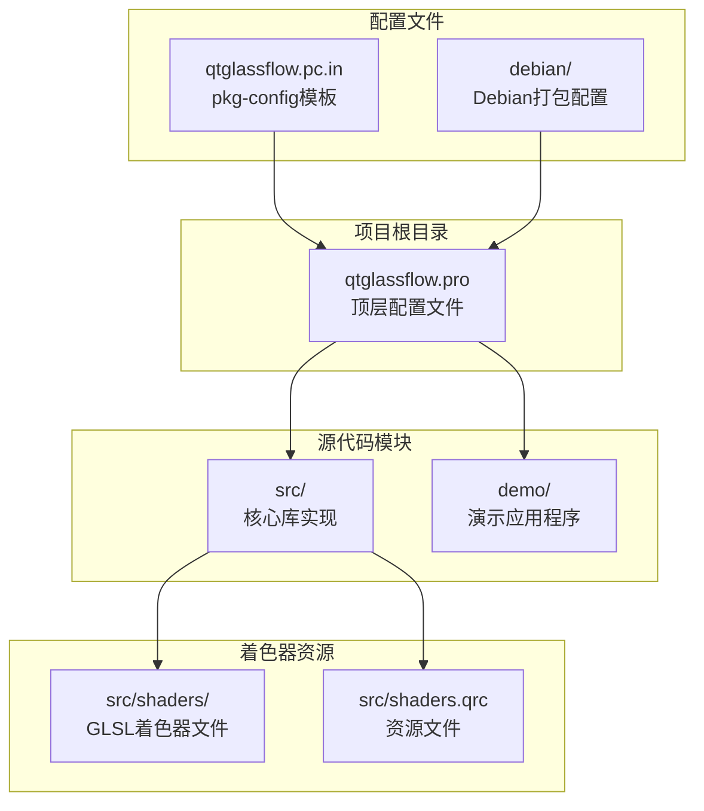
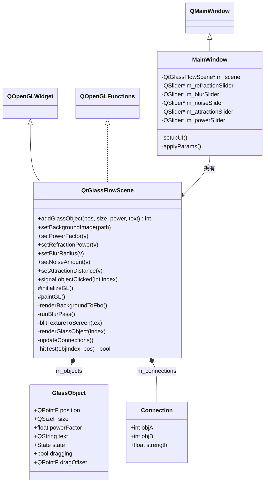
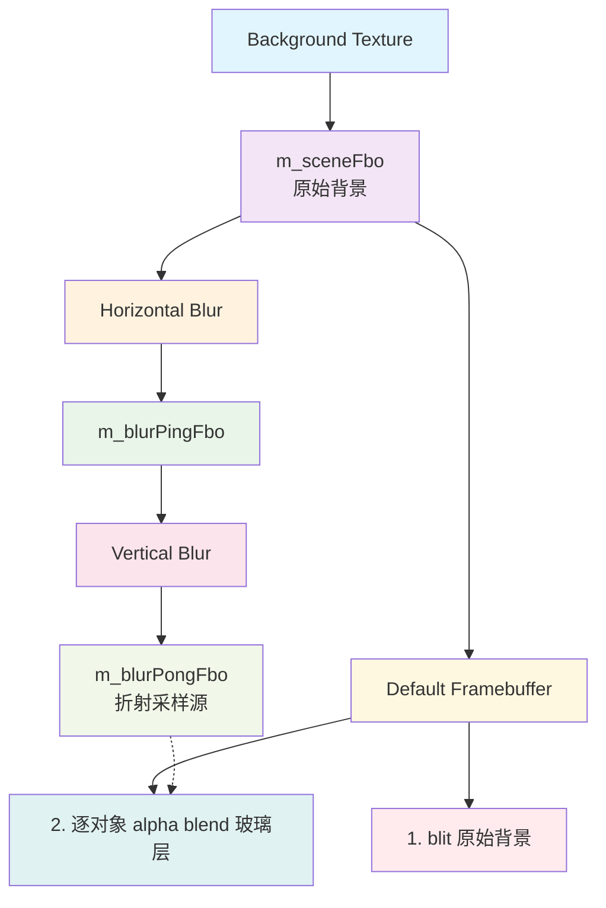
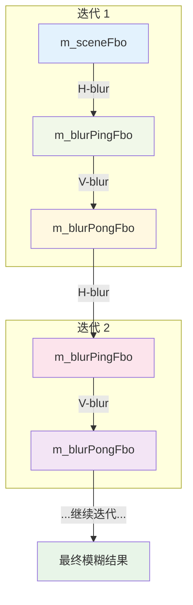

# 安装与部署

<cite>
**本文档引用的文件**
- [README.md](file://README.md)
- [qtglassflow.pro](file://qtglassflow.pro)
- [src/src.pro](file://src/src.pro)
- [demo/demo.pro](file://demo/demo.pro)
- [qtglassflow.pc.in](file://qtglassflow.pc.in)
- [debian/changelog](file://debian/changelog)
- [debian/libqtglassflow-dev.install](file://debian/libqtglassflow-dev.install)
- [debian/libqtglassflow0.install](file://debian/libqtglassflow0.install)
- [src/qtglassflowscene.h](file://src/qtglassflowscene.h)
- [src/qtglassflowscene.cpp](file://src/qtglassflowscene.cpp)
- [demo/mainwindow.h](file://demo/mainwindow.h)
- [demo/mainwindow.cpp](file://demo/mainwindow.cpp)
</cite>

## 目录
1. [简介](#简介)
2. [项目结构](#项目结构)
3. [核心组件](#核心组件)
4. [架构概览](#架构概览)
5. [详细组件分析](#详细组件分析)
6. [依赖关系分析](#依赖关系分析)
7. [性能考虑](#性能考虑)
8. [故障排除指南](#故障排除指南)
9. [结论](#结论)

## 简介

libqtglassflow是一个基于Qt + OpenGL的液态玻璃效果渲染库，能够在普通QWidget程序中实时渲染具备折射、模糊、噪声与粘性桥接的SDF超椭圆玻璃对象。该项目提供了完整的跨平台支持，包括Linux、Windows和macOS操作系统。

该库的核心特性包括：
- SDF超椭圆形状控制
- Smooth-union粘性桥接效果
- 凸面穹顶光照模拟
- 背景折射采样
- 极细白色边框渲染
- 像素级抗锯齿技术

## 项目结构

项目采用标准的Qt子目录结构，主要包含以下核心模块：



**图表来源**
- [qtglassflow.pro:1-4](file://qtglassflow.pro#L1-L4)
- [src/src.pro:1-15](file://src/src.pro#L1-L15)
- [demo/demo.pro:1-14](file://demo/demo.pro#L1-L14)

**章节来源**
- [README.md:86-108](file://README.md#L86-L108)
- [qtglassflow.pro:1-4](file://qtglassflow.pro#L1-L4)

## 核心组件

### QtGlassFlowScene核心类

核心渲染引擎类`QtGlassFlowScene`继承自`QOpenGLWidget`，负责管理整个渲染管线和对象交互。该类实现了完整的OpenGL渲染循环，包括背景处理、模糊效果、玻璃对象渲染等功能。

**章节来源**
- [src/qtglassflowscene.h:17-139](file://src/qtglassflowscene.h#L17-L139)
- [src/qtglassflowscene.cpp:51-104](file://src/qtglassflowscene.cpp#L51-L104)

### 环境要求

项目对运行环境有明确的要求：

- **Qt版本**: Qt 5.12及以上（需要core、gui、widgets、opengl模块）
- **OpenGL版本**: OpenGL 2.1（支持GLSL 120）
- **C++标准**: C++11
- **操作系统**: Linux、Windows、macOS

**章节来源**
- [README.md:16-22](file://README.md#L16-L22)

## 架构概览

项目采用模块化的架构设计，核心渲染逻辑与用户界面分离，通过清晰的接口进行交互。



**图表来源**
- [src/qtglassflowscene.h:17-139](file://src/qtglassflowscene.h#L17-L139)
- [demo/mainwindow.h:10-29](file://demo/mainwindow.h#L10-L29)

## 详细组件分析

### 渲染管线架构

项目实现了高效的FBO（Frame Buffer Object）渲染管线，包含背景处理、分离式高斯模糊和玻璃对象渲染三个主要阶段。



**图表来源**
- [src/qtglassflowscene.cpp:187-200](file://src/qtglassflowscene.cpp#L187-L200)

### 分离式高斯模糊算法

项目实现了高效的分离式高斯模糊算法，通过水平和垂直两个阶段的1D高斯核实现高质量的模糊效果。



**图表来源**
- [src/qtglassflowscene.cpp:187-200](file://src/qtglassflowscene.cpp#L187-L200)

### SDF超椭圆数学模型

项目使用SDF（有符号距离场）技术实现超椭圆形状，通过数学公式精确控制形状的圆角到方形过渡。

**章节来源**
- [README.md:215-233](file://README.md#L215-L233)

## 依赖关系分析

### 编译时依赖

项目对外部依赖有明确的要求，所有依赖都通过Qt框架和OpenGL实现。

```mermaid
graph TB
subgraph "运行时依赖"
A[Qt5Core]
B[Qt5Gui]
C[Qt5Widgets]
D[Qt5OpenGL]
E[OpenGL 2.1]
end
subgraph "项目模块"
F[libqtglassflow]
G[qtglassflow-demo]
end
subgraph "系统库"
H[GLIBC]
I[GL]
J[X11 (Linux)]
end
A --> F
B --> F
C --> F
D --> F
E --> F
F --> G
H --> F
I --> F
J --> F
```

**图表来源**
- [qtglassflow.pc.in:9](file://qtglassflow.pc.in#L9)
- [src/src.pro:4](file://src/src.pro#L4)

### 安装路径配置

项目遵循标准的Unix文件系统层次结构，定义了清晰的安装路径：

- **库文件**: `/usr/lib/` + `dpkg-architecture -qDEB_HOST_MULTIARCH`
- **头文件**: `/usr/include/qtglassflow`
- **pkg-config文件**: `/usr/lib/` + `dpkg-architecture -qDEB_HOST_MULTIARCH` + `/pkgconfig/qtglassflow.pc`

**章节来源**
- [src/src.pro:11-14](file://src/src.pro#L11-L14)
- [qtglassflow.pc.in:1-12](file://qtglassflow.pc.in#L1-L12)

## 性能考虑

### 渲染优化策略

项目采用了多种优化策略来确保流畅的渲染性能：

1. **分离式模糊算法**: 通过水平和垂直两阶段实现高效模糊
2. **FBO复用**: 使用ping-pong缓冲减少内存分配
3. **批量渲染**: 通过alpha混合实现高效的多对象渲染
4. **参数化着色器**: 支持运行时参数调整而不重新编译

### 内存管理

项目实现了完善的内存管理机制：
- 自动释放OpenGL资源
- 智能指针管理C++对象
- 及时销毁未使用的纹理和缓冲区

## 故障排除指南

### 常见编译问题

**问题**: 找不到Qt模块或OpenGL库
**解决方案**: 确保已安装完整的Qt开发包和OpenGL驱动

**问题**: OpenGL版本不兼容
**解决方案**: 更新到OpenGL 2.1或更高版本

**问题**: pkg-config无法找到库
**解决方案**: 检查`PKG_CONFIG_PATH`环境变量设置

### 运行时错误诊断

**问题**: 程序启动后显示空白画面
**排查步骤**:
1. 检查OpenGL驱动是否正确安装
2. 验证着色器编译日志
3. 确认背景纹理文件存在

**问题**: 渲染性能过低
**优化建议**:
1. 降低模糊半径设置
2. 减少玻璃对象数量
3. 关闭不必要的特效

**章节来源**
- [src/qtglassflowscene.cpp:138-157](file://src/qtglassflowscene.cpp#L138-L157)

## 结论

libqtglassflow提供了一个完整、高效的液态玻璃效果渲染解决方案。通过模块化的架构设计和优化的渲染管线，该库能够在各种平台上提供高质量的视觉效果。

项目的主要优势包括：
- 跨平台兼容性（Linux、Windows、macOS）
- 高性能的OpenGL渲染
- 易于集成的API设计
- 完善的开发工具链支持

对于开发者而言，该项目不仅提供了丰富的功能特性，还展示了现代OpenGL编程的最佳实践，是学习高级图形编程的优秀参考。