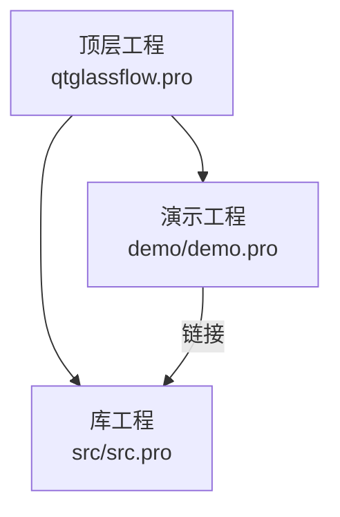
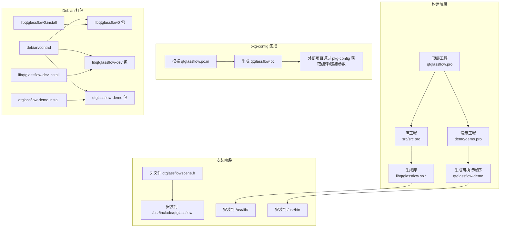
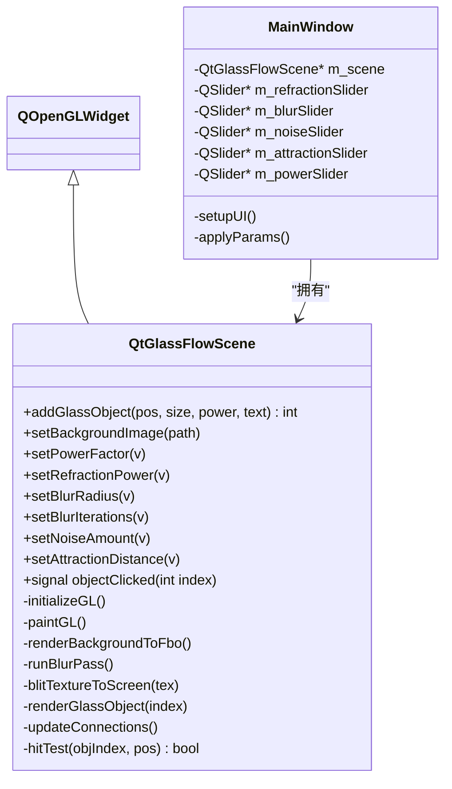
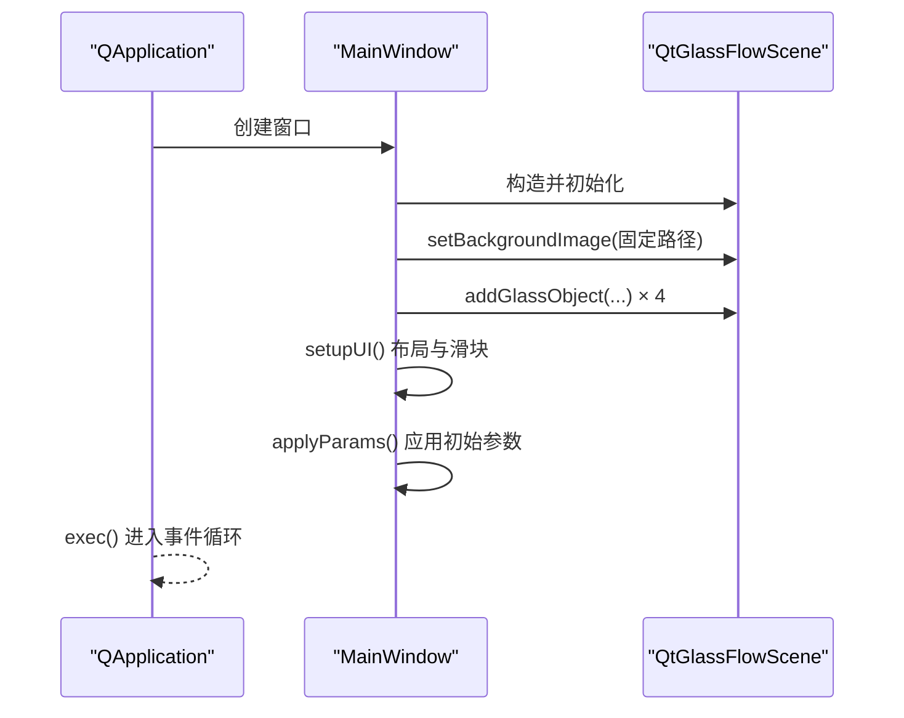
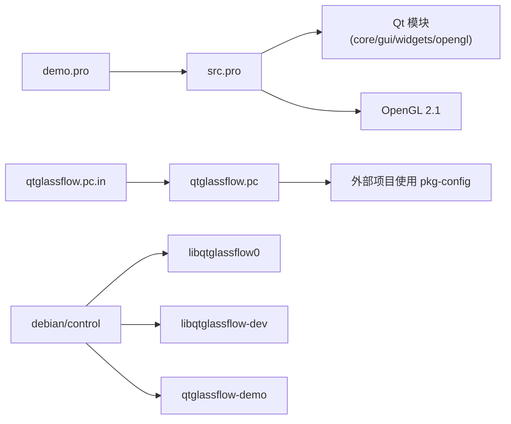

# 构建与部署

<cite>
**本文引用的文件**
- [qtglassflow.pro](file://qtglassflow.pro)
- [src.pro](file://src/src.pro)
- [demo.pro](file://demo/demo.pro)
- [qtglassflow.pc.in](file://qtglassflow.pc.in)
- [qtglassflow.pc](file://qtglassflow.pc)
- [README.md](file://README.md)
- [debian/changelog](file://debian/changelog)
- [debian/control](file://debian/control)
- [debian/libqtglassflow-dev.install](file://debian/libqtglassflow-dev.install)
- [debian/libqtglassflow0.install](file://debian/libqtglassflow0.install)
- [debian/qtglassflow-demo.install](file://debian/qtglassflow-demo.install)
- [src/qtglassflowscene.h](file://src/qtglassflowscene.h)
- [src/qtglassflowscene.cpp](file://src/qtglassflowscene.cpp)
- [demo/main.cpp](file://demo/main.cpp)
- [demo/mainwindow.h](file://demo/mainwindow.h)
- [demo/mainwindow.cpp](file://demo/mainwindow.cpp)
</cite>

## 目录
1. [简介](#简介)
2. [项目结构](#项目结构)
3. [核心组件](#核心组件)
4. [架构总览](#架构总览)
5. [详细组件分析](#详细组件分析)
6. [依赖关系分析](#依赖关系分析)
7. [性能考量](#性能考量)
8. [故障排查指南](#故障排查指南)
9. [结论](#结论)
10. [附录](#附录)

## 简介
本指南面向希望构建、打包与部署 Qt/OpenGL 液态玻璃效果渲染库的开发者与运维人员。内容涵盖：
- QMake 项目结构与子目录组织、库与演示程序的编译设置
- pkg-config 集成的原理与使用方式，以及模板文件配置说明
- Debian 打包流程，含版本管理、控制文件与安装规则
- 跨平台兼容性要点（Windows/macOS 编译注意事项）
- 安装部署最佳实践（库路径、运行时依赖检查、环境变量）
- 常见构建问题排查与解决方案

## 项目结构
该项目采用 QMake 子目录模板，顶层主工程组织 src 与 demo 两个子工程，并定义 demo 对 src 的依赖关系。src 工程产出共享库，demo 工程链接该库并运行演示程序。

图表来源
- [qtglassflow.pro:1-4](file://qtglassflow.pro#L1-L4)
- [src.pro:1-15](file://src/src.pro#L1-L15)
- [demo.pro:1-14](file://demo/demo.pro#L1-L14)

章节来源
- [qtglassflow.pro:1-4](file://qtglassflow.pro#L1-L4)
- [src.pro:1-15](file://src/src.pro#L1-L15)
- [demo.pro:1-14](file://demo/demo.pro#L1-L14)

## 核心组件
- 顶层工程：使用 subdirs 模板，组织 src 与 demo，并声明 demo 依赖 src。
- 库工程（src）：目标名为 qtglassflow，启用 Qt 模块 core/gui/widgets/opengl，C++11，资源包含着色器，安装目标与头文件至系统路径。
- 演示工程（demo）：目标名为 qtglassflow-demo，依赖 src 输出的库，安装至 /usr/bin。
- pkg-config：提供模板文件与已生成的 .pc 文件，描述库名、版本、依赖与编译/链接标志。
- Debian 打包：包含控制文件、变更日志与安装规则，生成运行时库、开发包与演示应用三个包。

章节来源
- [qtglassflow.pro:1-4](file://qtglassflow.pro#L1-L4)
- [src.pro:1-15](file://src/src.pro#L1-L15)
- [demo.pro:1-14](file://demo/demo.pro#L1-L14)
- [qtglassflow.pc.in:1-12](file://qtglassflow.pc.in#L1-L12)
- [qtglassflow.pc:1-12](file://qtglassflow.pc#L1-L12)
- [debian/control:1-27](file://debian/control#L1-L27)
- [debian/changelog:1-9](file://debian/changelog#L1-L9)
- [debian/libqtglassflow-dev.install:1-4](file://debian/libqtglassflow-dev.install#L1-L4)
- [debian/libqtglassflow0.install:1-2](file://debian/libqtglassflow0.install#L1-L2)
- [debian/qtglassflow-demo.install:1-2](file://debian/qtglassflow-demo.install#L1-L2)

## 架构总览
下图展示从源码到可执行程序与库的构建与安装路径，以及 pkg-config 在外部项目中的使用位置。

图表来源
- [qtglassflow.pro:1-4](file://qtglassflow.pro#L1-L4)
- [src.pro:11-14](file://src/src.pro#L11-L14)
- [demo.pro:12-13](file://demo/demo.pro#L12-L13)
- [qtglassflow.pc.in:1-12](file://qtglassflow.pc.in#L1-L12)
- [qtglassflow.pc:1-12](file://qtglassflow.pc#L1-L12)
- [debian/control:8-26](file://debian/control#L8-L26)
- [debian/libqtglassflow0.install:1-2](file://debian/libqtglassflow0.install#L1-L2)
- [debian/libqtglassflow-dev.install:1-4](file://debian/libqtglassflow-dev.install#L1-L4)
- [debian/qtglassflow-demo.install:1-2](file://debian/qtglassflow-demo.install#L1-L2)

## 详细组件分析

### QMake 顶层工程与子目录依赖
- 顶层工程使用 subdirs 模板，定义 SUBDIRS = src demo，并通过 demo.depends = src 明确依赖关系，确保先构建库再构建演示程序。
- 版本号与目标名在库工程中统一维护，便于 pkg-config 与 Debian 打包同步。

章节来源
- [qtglassflow.pro:1-4](file://qtglassflow.pro#L1-L4)

### 库工程（src）编译与安装设置
- 模板与目标：TEMPLATE = lib，TARGET = qtglassflow，VERSION = 0.1.0。
- 依赖模块：Qt 模块 core/gui/widgets/opengl，启用 C++11。
- 资源：包含 shaders.qrc，将着色器作为资源嵌入库。
- 安装规则：target.path 指定多架构库目录，headers.files/headers.path 指定头文件安装路径，INSTALLS += target headers。

章节来源
- [src.pro:1-15](file://src/src.pro#L1-L15)

### 演示工程（demo）编译与安装设置
- 模板与目标：TEMPLATE = app，TARGET = qtglassflow-demo。
- 依赖声明：QT += core gui widgets opengl，CONFIG += c++11。
- 头文件与库链接：通过 INCLUDEPATH += ../src 与 LIBS += -L../src -lqtglassflow 引用库。
- 安装规则：target.path = /usr/bin，INSTALLS += target。

章节来源
- [demo.pro:1-14](file://demo/demo.pro#L1-L14)

### pkg-config 集成与模板文件
- 模板文件 qtglassflow.pc.in 提供占位符，构建时由 pkg-config 自动替换多架构路径与版本号。
- 已生成文件 qtglassflow.pc 固化为特定多架构目录（如 x86_64-linux-gnu），供系统工具查询。
- 关键字段：Name、Description、Version、Requires（Qt5Core/Gui/Widgets/OpenGL）、Libs、Cflags。
- 使用方式：外部项目可通过 pkg-config --cflags --libs qtglassflow 获取编译与链接参数。

章节来源
- [qtglassflow.pc.in:1-12](file://qtglassflow.pc.in#L1-L12)
- [qtglassflow.pc:1-12](file://qtglassflow.pc#L1-L12)
- [README.md:47-60](file://README.md#L47-L60)

### Debian 打包流程
- 控制文件（debian/control）定义三包：
  - libqtglassflow0：运行时共享库
  - libqtglassflow-dev：开发头文件与 pkg-config
  - qtglassflow-demo：演示应用
- 变更日志（debian/changelog）记录版本与发行说明。
- 安装规则：
  - libqtglassflow0.install：安装库版本文件
  - libqtglassflow-dev.install：安装头文件、库与 pkg-config 文件
  - qtglassflow-demo.install：安装可执行程序

章节来源
- [debian/control:1-27](file://debian/control#L1-L27)
- [debian/changelog:1-9](file://debian/changelog#L1-L9)
- [debian/libqtglassflow0.install:1-2](file://debian/libqtglassflow0.install#L1-L2)
- [debian/libqtglassflow-dev.install:1-4](file://debian/libqtglassflow-dev.install#L1-L4)
- [debian/qtglassflow-demo.install:1-2](file://debian/qtglassflow-demo.install#L1-L2)

### 演示程序与核心类关系
- 演示程序入口创建 QApplication 与 MainWindow，MainWindow 内部持有 QtGlassFlowScene 实例。
- QtGlassFlowScene 继承自 QOpenGLWidget 并实现 OpenGL 渲染管线，包含对象添加、背景贴图、参数调节与交互事件处理。

图表来源
- [src/qtglassflowscene.h:17-139](file://src/qtglassflowscene.h#L17-L139)
- [demo/mainwindow.h:10-29](file://demo/mainwindow.h#L10-L29)
- [demo/mainwindow.cpp:15-142](file://demo/mainwindow.cpp#L15-L142)

章节来源
- [src/qtglassflowscene.h:17-139](file://src/qtglassflowscene.h#L17-L139)
- [demo/mainwindow.h:10-29](file://demo/mainwindow.h#L10-L29)
- [demo/mainwindow.cpp:15-142](file://demo/mainwindow.cpp#L15-L142)

### 演示程序启动序列

图表来源
- [demo/main.cpp:4-15](file://demo/main.cpp#L4-L15)
- [demo/mainwindow.cpp:33-129](file://demo/mainwindow.cpp#L33-L129)
- [src/qtglassflowscene.cpp:119-136](file://src/qtglassflowscene.cpp#L119-L136)

章节来源
- [demo/main.cpp:4-15](file://demo/main.cpp#L4-L15)
- [demo/mainwindow.cpp:33-129](file://demo/mainwindow.cpp#L33-L129)
- [src/qtglassflowscene.cpp:119-136](file://src/qtglassflowscene.cpp#L119-L136)

## 依赖关系分析
- 构建期依赖：demo 依赖 src；src 依赖 Qt 模块与 OpenGL；pkg-config 依赖 Qt5 开发包。
- 安装期依赖：Debian 控制文件定义各包的 Depends 与版本约束。
- 运行期依赖：演示程序依赖运行时库与 Qt 运行时；pkg-config 查询结果决定编译/链接参数。

图表来源
- [demo.pro:6-7](file://demo/demo.pro#L6-L7)
- [src.pro:4](file://src/src.pro#L4)
- [qtglassflow.pc.in:9](file://qtglassflow.pc.in#L9)
- [debian/control:8-26](file://debian/control#L8-L26)

章节来源
- [demo.pro:6-7](file://demo/demo.pro#L6-L7)
- [src.pro:4](file://src/src.pro#L4)
- [qtglassflow.pc.in:9](file://qtglassflow.pc.in#L9)
- [debian/control:8-26](file://debian/control#L8-L26)

## 性能考量
- 渲染管线采用分离式高斯模糊与 ping-pong FBO，支持多次迭代以换取更大模糊半径而不牺牲单次核性能。
- 使用 fwidth 计算亚像素级抗锯齿带宽，结合平滑步进与 alpha 淡出，确保边缘锐利且与分辨率无关。
- 通过 Voronoi 归属检测避免多对象重叠区域重复绘制，减少亮度累积与过度混合。
- OpenGL 2.1 兼容与 GLSL 120 内置导数函数，兼顾广泛硬件支持与性能。

章节来源
- [README.md:171-214](file://README.md#L171-L214)
- [README.md:336-366](file://README.md#L336-L366)
- [README.md:367-373](file://README.md#L367-L373)

## 故障排查指南
- 构建失败（找不到 Qt 模块或 OpenGL）：
  - 确认已安装 Qt5 基础与 OpenGL 开发包，且 pkg-config 能解析 Qt5Core/Gui/Widgets/OpenGL。
  - 参考 pkg-config 使用方式与模板字段，确保外部项目正确获取编译/链接参数。
- 链接错误（找不到 -lqtglassflow 或头文件）：
  - 确认 src 已成功构建并安装至多架构库目录与头文件目录。
  - 检查 demo.pro 中 INCLUDEPATH 与 LIBS 的相对路径是否正确。
- Debian 打包失败：
  - 检查 debian/control 的 Build-Depends 与各包 Depends 是否满足。
  - 确认安装规则文件（*.install）与版本号一致。
- 运行时崩溃或黑屏：
  - 确认系统 OpenGL 2.1 兼容驱动可用，且 QtOpenGL 模块可用。
  - 检查 QtGlassFlowScene 初始化时的 QSurfaceFormat 设置与双缓冲模式。
- 跨平台差异：
  - Windows/macOS 上需确保 Qt/OpenGL 开发环境完整，多架构库路径与 pkg-config 的 __MULTIARCH__ 占位符替换策略一致。

章节来源
- [README.md:16-22](file://README.md#L16-L22)
- [src.pro:11-14](file://src/src.pro#L11-L14)
- [demo.pro:6-7](file://demo/demo.pro#L6-L7)
- [qtglassflow.pc.in:3](file://qtglassflow.pc.in#L3)
- [debian/control:5](file://debian/control#L5)
- [src/qtglassflowscene.cpp:82-88](file://src/qtglassflowscene.cpp#L82-L88)

## 结论
本项目通过 QMake 子目录工程清晰划分库与演示职责，配合 pkg-config 与 Debian 打包规则，实现了从构建到分发的一体化流程。遵循本文档的构建、打包与部署步骤，可在 Linux、Windows 与 macOS 平台获得一致的开发与运行体验。

## 附录

### 构建与安装步骤（Linux）
- 使用 qmake 生成 Makefile，随后并行编译，最后安装至系统路径。
- 安装后，可通过 pkg-config 获取编译/链接参数，或直接在 qmake 项目中引用头文件与库。

章节来源
- [README.md:23-29](file://README.md#L23-L29)
- [src.pro:11-14](file://src/src.pro#L11-L14)
- [demo.pro:12-13](file://demo/demo.pro#L12-L13)
- [README.md:47-60](file://README.md#L47-L60)

### Debian 打包命令
- 使用 dpkg-buildpackage -tc 生成三个包：运行时库、开发包与演示应用。

章节来源
- [README.md:33-44](file://README.md#L33-L44)

### pkg-config 模板字段说明
- prefix/exec_prefix/libdir/includedir：库与头文件安装路径占位符。
- Name/Description/Version：库标识与版本。
- Requires：运行时依赖的 Qt 模块。
- Libs/Cflags：链接与包含路径标志。

章节来源
- [qtglassflow.pc.in:1-12](file://qtglassflow.pc.in#L1-L12)