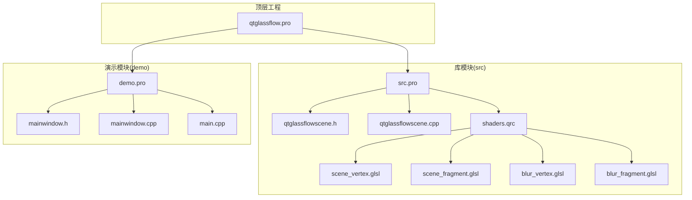
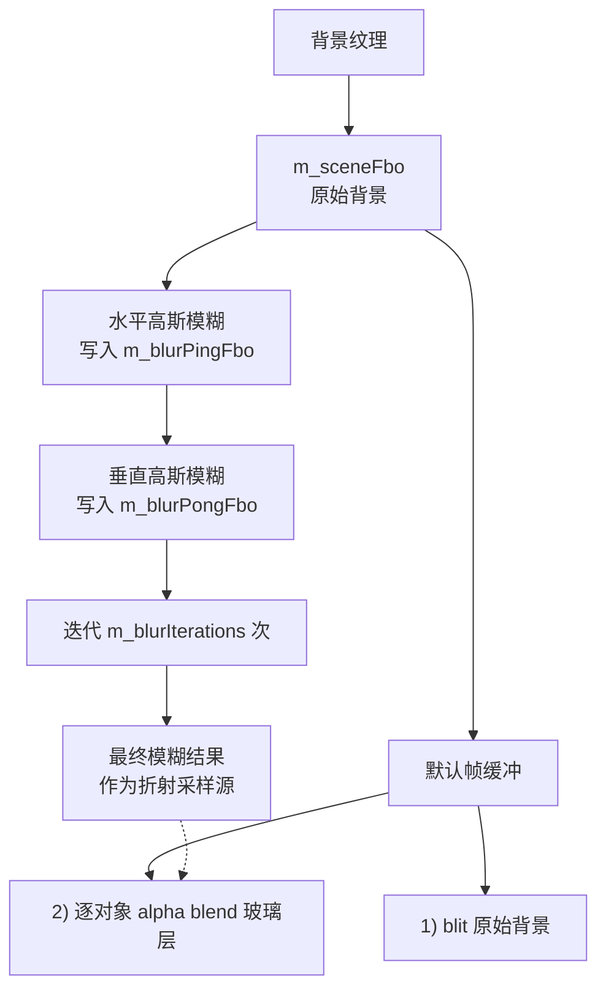
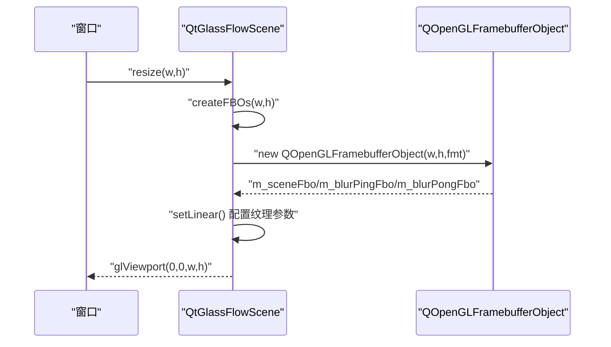
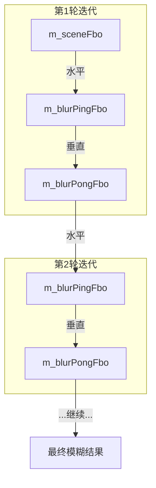
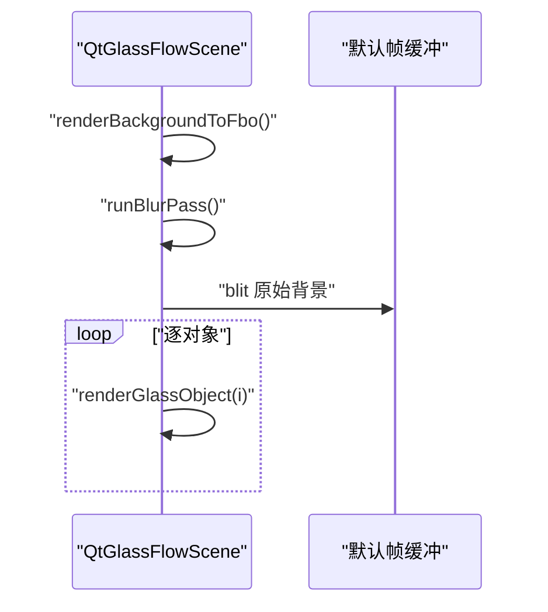
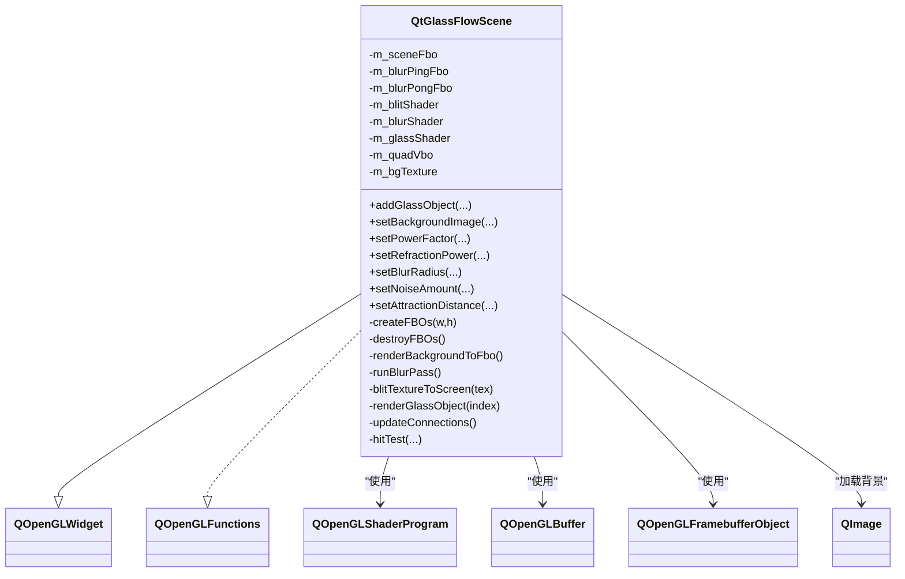

# FBO多重缓冲管理

<cite>
**本文档引用的文件**
- [qtglassflowscene.h](file://src/qtglassflowscene.h)
- [qtglassflowscene.cpp](file://src/qtglassflowscene.cpp)
- [blur_fragment.glsl](file://src/shaders/blur_fragment.glsl)
- [blur_vertex.glsl](file://src/shaders/blur_vertex.glsl)
- [scene_fragment.glsl](file://src/shaders/scene_fragment.glsl)
- [scene_vertex.glsl](file://src/shaders/scene_vertex.glsl)
- [README.md](file://README.md)
- [mainwindow.h](file://demo/mainwindow.h)
- [mainwindow.cpp](file://demo/mainwindow.cpp)
- [main.cpp](file://demo/main.cpp)
- [qtglassflow.pro](file://qtglassflow.pro)
- [src.pro](file://src/src.pro)
- [demo.pro](file://demo/demo.pro)
</cite>

## 目录
1. [简介](#简介)
2. [项目结构](#项目结构)
3. [核心组件](#核心组件)
4. [架构总览](#架构总览)
5. [详细组件分析](#详细组件分析)
6. [依赖关系分析](#依赖关系分析)
7. [性能考量](#性能考量)
8. [故障排查指南](#故障排查指南)
9. [结论](#结论)
10. [附录](#附录)

## 简介
本文件聚焦于QtGlassFlowScene中基于帧缓冲区对象（FBO）的多重缓冲管理，系统阐述其在高斯模糊算法中的应用，特别是ping-pong缓冲技术的实现与数据流。文档涵盖FBO的创建、配置与销毁流程，纹理附件设置、过滤与包装模式的选择原因，以及在分离式高斯模糊中的水平与垂直通道实现。同时给出资源管理最佳实践、内存优化建议与错误处理策略，并提供可复现的代码示例路径与性能基准方法。

## 项目结构
该项目采用模块化组织：核心库位于src目录，演示程序位于demo目录，顶层qtglassflow.pro作为子目录工程入口。核心渲染逻辑集中在QtGlassFlowScene类中，配合GLSL着色器完成背景渲染、模糊处理与玻璃对象合成。

图表来源
- [qtglassflow.pro:1-4](file://qtglassflow.pro#L1-L4)
- [src.pro:1-15](file://src/src.pro#L1-L15)
- [demo.pro:1-14](file://demo/demo.pro#L1-L14)

章节来源
- [qtglassflow.pro:1-4](file://qtglassflow.pro#L1-L4)
- [src.pro:1-15](file://src/src.pro#L1-L15)
- [demo.pro:1-14](file://demo/demo.pro#L1-L14)

## 核心组件
- QtGlassFlowScene：继承QOpenGLWidget，封装FBO管线、着色器编译、几何初始化、背景纹理加载、高斯模糊与玻璃对象渲染。
- FBO集合：包含场景FBO（m_sceneFbo）、模糊ping FBO（m_blurPingFbo）与模糊pong FBO（m_blurPongFbo），三者尺寸一致，均以RGBA8格式附件。
- 着色器：分离式高斯模糊着色器（blur_vertex.glsl、blur_fragment.glsl）与玻璃对象合成着色器（scene_vertex.glsl、scene_fragment.glsl）。
- 几何：全屏四边形VBO，用于批处理绘制。

章节来源
- [qtglassflowscene.h:17-142](file://src/qtglassflowscene.h#L17-L142)
- [qtglassflowscene.cpp:51-104](file://src/qtglassflowscene.cpp#L51-L104)
- [blur_vertex.glsl:1-9](file://src/shaders/blur_vertex.glsl#L1-L9)
- [blur_fragment.glsl:1-24](file://src/shaders/blur_fragment.glsl#L1-L24)
- [scene_vertex.glsl:1-9](file://src/shaders/scene_vertex.glsl#L1-L9)
- [scene_fragment.glsl:1-149](file://src/shaders/scene_fragment.glsl#L1-L149)

## 架构总览
渲染管线每帧分为四个阶段：背景到场景FBO、分离式高斯模糊（ping-pong）、默认帧缓冲合成、玻璃对象逐对象合成。模糊阶段通过水平与垂直两次1D高斯卷积实现，多次迭代增强模糊半径且保持性能可控。

图表来源
- [README.md:173-194](file://README.md#L173-L194)
- [qtglassflowscene.cpp:510-566](file://src/qtglassflowscene.cpp#L510-L566)
- [qtglassflowscene.cpp:316-359](file://src/qtglassflowscene.cpp#L316-L359)

## 详细组件分析

### FBO创建、配置与销毁
- 创建流程：在resizeGL中根据窗口尺寸调用createFBOs，创建三个FBO并设置内部纹理格式为RGBA8。
- 纹理附件：QOpenGLFramebufferObject::NoAttachment，纹理由框架自动附加至颜色附件。
- 过滤与包装：线性过滤（GL_LINEAR）与边缘夹紧（GL_CLAMP_TO_EDGE），避免模糊边界出现重复或黑边。
- 销毁流程：析构时删除FBO指针并释放背景纹理，确保OpenGL上下文有效。

图表来源
- [qtglassflowscene.cpp:227-233](file://src/qtglassflowscene.cpp#L227-L233)
- [qtglassflowscene.cpp:235-257](file://src/qtglassflowscene.cpp#L235-L257)

章节来源
- [qtglassflowscene.cpp:227-233](file://src/qtglassflowscene.cpp#L227-L233)
- [qtglassflowscene.cpp:235-257](file://src/qtglassflowscene.cpp#L235-L257)
- [qtglassflowscene.cpp:259-264](file://src/qtglassflowscene.cpp#L259-L264)

### 纹理附件设置、过滤与包装模式
- 内部纹理格式：GL_RGBA8，满足高斯模糊与玻璃合成的颜色需求。
- 过滤模式：GL_LINEAR，平衡清晰度与性能，避免锯齿。
- 包装模式：GL_CLAMP_TO_EDGE，防止水平/垂直模糊时采样到相邻图像边缘，避免边界伪影。
- 选择原因：线性过滤在移动设备与低端显卡上开销较低；CLAMP_TO_EDGE避免模糊扩散到画布外区域。

章节来源
- [qtglassflowscene.cpp:238-256](file://src/qtglassflowscene.cpp#L238-L256)

### 多重渲染目标（MRT）说明
- 本项目未使用MRT。所有渲染目标均为单通道颜色附件，通过ping-pong缓冲实现分离式高斯模糊。
- 优势：简化着色器与管线，降低驱动复杂度；在移动端与嵌入式GPU上更稳定。
- 劣势：需要额外的FBO与纹理拷贝，但通过迭代次数控制与线性过滤可平衡成本。

章节来源
- [qtglassflowscene.cpp:316-359](file://src/qtglassflowscene.cpp#L316-L359)

### 高斯模糊算法与ping-pong缓冲
- 水平通道：以u_direction=(1,0)采样，1D 9-tap高斯核权重累加，输出到m_blurPingFbo。
- 垂直通道：以u_direction=(0,1)采样，同样1D 9-tap核，输出到m_blurPongFbo。
- 迭代策略：m_blurIterations次循环，每次从上一轮结果读取，实现ping-pong交替，等效增大半径且避免单次大核开销。
- 着色器输入：u_resolution、u_radius、u_direction、u_texture。

图表来源
- [README.md:195-214](file://README.md#L195-L214)
- [qtglassflowscene.cpp:316-359](file://src/qtglassflowscene.cpp#L316-L359)
- [blur_fragment.glsl:9-23](file://src/shaders/blur_fragment.glsl#L9-L23)

章节来源
- [blur_fragment.glsl:1-24](file://src/shaders/blur_fragment.glsl#L1-L24)
- [blur_vertex.glsl:1-9](file://src/shaders/blur_vertex.glsl#L1-L9)
- [qtglassflowscene.cpp:316-359](file://src/qtglassflowscene.cpp#L316-L359)

### 数据流向与渲染阶段
- 背景到场景FBO：将背景纹理blit到m_sceneFbo，作为后续模糊与合成的原始输入。
- 模糊阶段：runBlurPass按迭代次数在ping-pong之间切换，最终得到m_blurPongFbo作为折射采样源。
- 合成阶段：绑定默认帧缓冲，先blit原始背景，再逐对象绘制玻璃层，使用alpha混合实现透明叠加。
- 玻璃对象：每个对象绘制全屏quad，片元着色器根据SDF与smooth-union计算形状、折射与材质。

图表来源
- [qtglassflowscene.cpp:510-566](file://src/qtglassflowscene.cpp#L510-L566)
- [qtglassflowscene.cpp:293-314](file://src/qtglassflowscene.cpp#L293-L314)
- [qtglassflowscene.cpp:316-359](file://src/qtglassflowscene.cpp#L316-L359)
- [qtglassflowscene.cpp:394-476](file://src/qtglassflowscene.cpp#L394-L476)

章节来源
- [qtglassflowscene.cpp:510-566](file://src/qtglassflowscene.cpp#L510-L566)
- [qtglassflowscene.cpp:293-314](file://src/qtglassflowscene.cpp#L293-L314)
- [qtglassflowscene.cpp:394-476](file://src/qtglassflowscene.cpp#L394-L476)

### 玻璃对象渲染与折射采样
- 输入：m_blurPongFbo的模糊纹理作为折射采样源。
- 片元着色器：基于SDF超椭圆与smooth-union，结合折射曲线f(dist)与穹顶光照，生成最终颜色与alpha。
- 混合：启用GL_BLEND与GL_SRC_ALPHA/GL_ONE_MINUS_SRC_ALPHA，实现透明叠加。

章节来源
- [qtglassflowscene.cpp:466-476](file://src/qtglassflowscene.cpp#L466-L476)
- [scene_fragment.glsl:66-148](file://src/shaders/scene_fragment.glsl#L66-L148)

## 依赖关系分析
- QtGlassFlowScene依赖QOpenGLWidget与QOpenGLFunctions，管理OpenGL上下文与扩展。
- 依赖QOpenGLShaderProgram进行着色器编译与链接，依赖QOpenGLBuffer管理全屏四边形顶点数据。
- 依赖QOpenGLFramebufferObject创建与管理FBO，依赖QOpenGLPixelTransferOptions与QImage处理背景纹理。
- 着色器资源通过shaders.qrc打包，运行时以资源路径加载。

图表来源
- [qtglassflowscene.h:17-142](file://src/qtglassflowscene.h#L17-L142)
- [qtglassflowscene.cpp:138-157](file://src/qtglassflowscene.cpp#L138-L157)
- [src.pro:7-9](file://src/src.pro#L7-L9)

章节来源
- [qtglassflowscene.h:17-142](file://src/qtglassflowscene.h#L17-L142)
- [qtglassflowscene.cpp:138-157](file://src/qtglassflowscene.cpp#L138-L157)
- [src.pro:7-9](file://src/src.pro#L7-L9)

## 性能考量
- 迭代次数控制：m_blurIterations通过参数接口暴露，建议在UI中以步进方式调整，避免过大半径导致CPU/GPU时间过长。
- 纹理格式与过滤：RGBA8与GL_LINEAR在大多数硬件上性能与质量平衡良好；若追求更高性能可考虑降采样或减少迭代。
- Ping-pong切换：通过交替读写纹理避免写读同名纹理带来的同步开销，提升吞吐。
- 混合与清屏：每阶段前清屏（glClear）避免残留数据影响模糊结果；合成阶段启用blend，注意与默认帧缓冲状态一致性。
- 资源复用：全屏四边形VBO一次性创建并复用，减少VAO/VBO切换成本。

章节来源
- [qtglassflowscene.cpp:316-359](file://src/qtglassflowscene.cpp#L316-L359)
- [qtglassflowscene.cpp:159-185](file://src/qtglassflowscene.cpp#L159-L185)

## 故障排查指南
- FBO创建失败：检查createFBOs中QOpenGLFramebufferObjectFormat配置与尺寸有效性；确认OpenGL上下文已激活。
- 纹理异常：检查setLinear中glBindTexture后参数设置是否成功；确认纹理未被意外删除。
- 模糊结果异常：核参数与半径需与u_radius、u_direction一致；确保水平与垂直通道交替正确。
- 合成阶段黑屏：检查默认帧缓冲绑定与视口设置；确认blit与glass对象绘制顺序正确。
- 着色器链接失败：compileProgram会输出日志，检查资源路径与GLSL版本兼容性（GLSL 120）。

章节来源
- [qtglassflowscene.cpp:138-157](file://src/qtglassflowscene.cpp#L138-L157)
- [qtglassflowscene.cpp:235-257](file://src/qtglassflowscene.cpp#L235-L257)
- [qtglassflowscene.cpp:316-359](file://src/qtglassflowscene.cpp#L316-L359)

## 结论
本项目通过简洁稳定的ping-pong缓冲策略实现了高质量的分离式高斯模糊，结合SDF超椭圆与smooth-union，达成液态玻璃的视觉效果。FBO管理遵循“创建-配置-销毁”的生命周期，纹理参数选择兼顾性能与质量。通过参数化接口与迭代控制，用户可在不同硬件上获得可接受的性能与视觉平衡。

## 附录

### 代码示例路径
- FBO创建与配置：[qtglassflowscene.cpp:235-257](file://src/qtglassflowscene.cpp#L235-L257)
- 模糊通道实现：[qtglassflowscene.cpp:316-359](file://src/qtglassflowscene.cpp#L316-L359)
- 玻璃对象渲染：[qtglassflowscene.cpp:394-476](file://src/qtglassflowscene.cpp#L394-L476)
- 背景到FBO：[qtglassflowscene.cpp:293-314](file://src/qtglassflowscene.cpp#L293-L314)
- 着色器加载与编译：[qtglassflowscene.cpp:138-157](file://src/qtglassflowscene.cpp#L138-L157)
- 演示程序集成：[mainwindow.cpp:43-56](file://demo/mainwindow.cpp#L43-L56)

### 性能基准测试建议
- 测试环境：固定分辨率（如1920x1080）、固定m_blurIterations与m_blurRadius，记录每帧耗时。
- 指标：平均帧时、P95帧时、GPU占用率、内存峰值。
- 场景：不同对象数量（0/1/4/8）、不同背景分辨率、不同滤镜强度。
- 方法：使用QElapsedTimer测量paintGL总时长，或在着色器中插入计时标记（需扩展）。