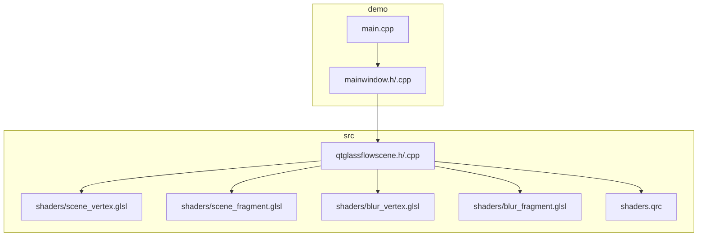
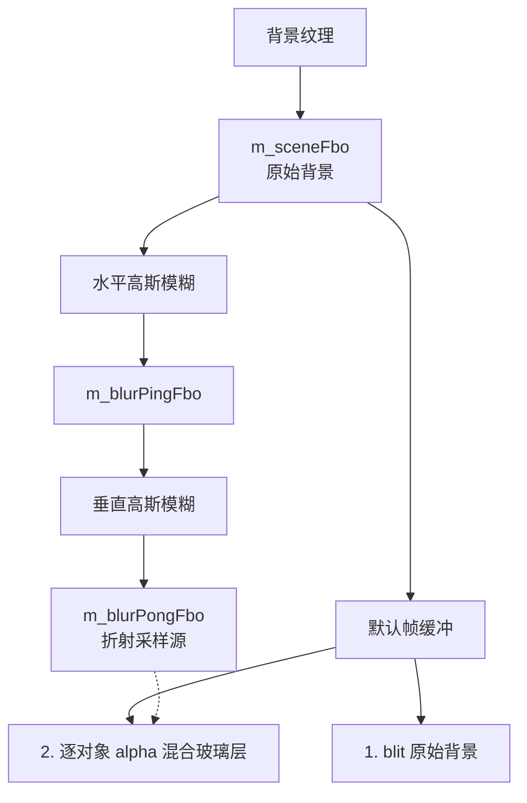
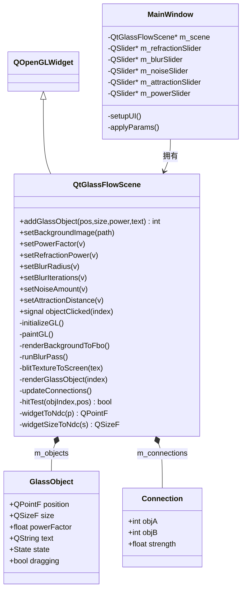

# OpenGL渲染管线

<cite>
**本文引用的文件**
- [src/qtglassflowscene.h](file://src/qtglassflowscene.h)
- [src/qtglassflowscene.cpp](file://src/qtglassflowscene.cpp)
- [src/shaders/scene_vertex.glsl](file://src/shaders/scene_vertex.glsl)
- [src/shaders/scene_fragment.glsl](file://src/shaders/scene_fragment.glsl)
- [src/shaders/blur_vertex.glsl](file://src/shaders/blur_vertex.glsl)
- [src/shaders/blur_fragment.glsl](file://src/shaders/blur_fragment.glsl)
- [src/shaders.qrc](file://src/shaders.qrc)
- [demo/main.cpp](file://demo/main.cpp)
- [demo/mainwindow.h](file://demo/mainwindow.h)
- [demo/mainwindow.cpp](file://demo/mainwindow.cpp)
- [README.md](file://README.md)
</cite>

## 目录
1. [简介](#简介)
2. [项目结构](#项目结构)
3. [核心组件](#核心组件)
4. [架构总览](#架构总览)
5. [详细组件分析](#详细组件分析)
6. [依赖关系分析](#依赖关系分析)
7. [性能考量](#性能考量)
8. [故障排查指南](#故障排查指南)
9. [结论](#结论)
10. [附录](#附录)

## 简介
本技术文档围绕 QtGlassFlowScene 的 OpenGL 渲染管线展开，系统阐述从背景纹理加载、高斯模糊处理到最终玻璃对象渲染的完整流程。重点解释顶点着色器与片段着色器的工作原理，涵盖 NDC 坐标系统转换、屏幕空间采样与 UV 坐标的计算方法，以及渲染状态管理与 OpenGL 上下文切换的最佳实践。文档还包含对 SDF 超椭圆数学公式、Smooth-union 桥接与折射效果的深入解析，并提供性能优化建议与常见问题的解决方案。

## 项目结构
该项目采用模块化组织方式，核心渲染逻辑位于 src 目录，着色器资源通过 Qt 资源系统打包，演示程序位于 demo 目录。

图表来源
- [src/qtglassflowscene.h:1-142](file://src/qtglassflowscene.h#L1-L142)
- [src/qtglassflowscene.cpp:1-668](file://src/qtglassflowscene.cpp#L1-L668)
- [src/shaders/scene_vertex.glsl:1-9](file://src/shaders/scene_vertex.glsl#L1-L9)
- [src/shaders/scene_fragment.glsl:1-149](file://src/shaders/scene_fragment.glsl#L1-L149)
- [src/shaders/blur_vertex.glsl:1-9](file://src/shaders/blur_vertex.glsl#L1-L9)
- [src/shaders/blur_fragment.glsl:1-24](file://src/shaders/blur_fragment.glsl#L1-L24)
- [src/shaders.qrc:1-9](file://src/shaders.qrc#L1-L9)
- [demo/main.cpp:1-16](file://demo/main.cpp#L1-L16)
- [demo/mainwindow.h:1-32](file://demo/mainwindow.h#L1-L32)
- [demo/mainwindow.cpp:1-142](file://demo/mainwindow.cpp#L1-L142)

章节来源
- [README.md:86-108](file://README.md#L86-L108)
- [src/qtglassflowscene.h:17-142](file://src/qtglassflowscene.h#L17-L142)
- [src/qtglassflowscene.cpp:187-225](file://src/qtglassflowscene.cpp#L187-L225)
- [src/shaders.qrc:1-9](file://src/shaders.qrc#L1-L9)

## 核心组件
- QtGlassFlowScene：继承自 QOpenGLWidget，负责初始化 OpenGL、管理 FBO 管线、编译着色器、构建全屏四边形 VBO、处理鼠标交互、驱动每帧渲染。
- 玻璃对象数据结构：包含位置、尺寸、超椭圆幂因子、文本标签、交互状态与拖拽偏移。
- 连接关系：记录两个对象间的粘性连接，强度随间距动态计算。
- 着色器程序：包含背景 blit、高斯模糊与玻璃对象渲染三套着色器。
- FBO 管线：场景 FBO、模糊 ping/pong FBO，用于离屏渲染与多次迭代模糊。

章节来源
- [src/qtglassflowscene.h:21-41](file://src/qtglassflowscene.h#L21-L41)
- [src/qtglassflowscene.h:113-114](file://src/qtglassflowscene.h#L113-L114)
- [src/qtglassflowscene.cpp:51-104](file://src/qtglassflowscene.cpp#L51-L104)
- [src/qtglassflowscene.cpp:138-214](file://src/qtglassflowscene.cpp#L138-L214)

## 架构总览
整体渲染管线分为四步：背景 blit 到场景 FBO、分离式高斯模糊（ping-pong）、合成到默认帧缓冲、逐对象玻璃层 alpha 混合。

图表来源
- [src/qtglassflowscene.cpp:510-566](file://src/qtglassflowscene.cpp#L510-L566)
- [src/qtglassflowscene.cpp:316-359](file://src/qtglassflowscene.cpp#L316-L359)
- [src/qtglassflowscene.cpp:293-314](file://src/qtglassflowscene.cpp#L293-L314)
- [src/qtglassflowscene.cpp:361-371](file://src/qtglassflowscene.cpp#L361-L371)

## 详细组件分析

### 1) 初始化与上下文管理
- 初始化 OpenGL 函数、禁用深度测试与背面剔除，设置视口。
- 编译并链接三套着色器程序：blit、blur、glass。
- 创建全屏四边形 VBO，绑定属性位置。
- 创建 FBO：场景 FBO 与模糊 ping/pong FBO，均设置线性过滤与边缘裁剪。
- 启动定时器以固定时间步刷新动画。

章节来源
- [src/qtglassflowscene.cpp:187-225](file://src/qtglassflowscene.cpp#L187-L225)
- [src/qtglassflowscene.cpp:235-264](file://src/qtglassflowscene.cpp#L235-L264)
- [src/qtglassflowscene.cpp:159-185](file://src/qtglassflowscene.cpp#L159-L185)

### 2) 背景纹理加载与 blit
- 从路径加载图像，转 RGBA8888 并镜像翻转以适配 OpenGL 坐标系。
- 创建并配置背景纹理，设置线性过滤与边缘裁剪。
- 绑定场景 FBO，清空颜色，使用 blit 着色器将背景纹理全屏 blit 到场景 FBO。

章节来源
- [src/qtglassflowscene.cpp:266-291](file://src/qtglassflowscene.cpp#L266-L291)
- [src/qtglassflowscene.cpp:293-314](file://src/qtglassflowscene.cpp#L293-L314)

### 3) 分离式高斯模糊（ping-pong）
- 通过 u_resolution、u_radius、u_direction 传递模糊参数。
- 水平 pass：以 u_direction=(1,0) 对 ping FBO 写入。
- 垂直 pass：以 u_direction=(0,1) 对 pong FBO 写入。
- 迭代 m_blurIterations 次，每次从上一轮结果纹理读取，实现等效大半径模糊且避免单次大核开销。

章节来源
- [src/qtglassflowscene.cpp:316-359](file://src/qtglassflowscene.cpp#L316-L359)
- [src/shaders/blur_fragment.glsl:1-24](file://src/shaders/blur_fragment.glsl#L1-L24)
- [src/shaders/blur_vertex.glsl:1-9](file://src/shaders/blur_vertex.glsl#L1-L9)

### 4) 合成与玻璃对象渲染
- 绑定默认帧缓冲，清屏，blit 原始背景到屏幕。
- 逐对象渲染：将每个玻璃对象的中心与半尺寸转换为 NDC，设置着色器 uniform，启用混合后绘制全屏四边形。
- 片元着色器根据 SDF 距离、Smooth-union 桥接与 Voronoi 归属决定像素是否渲染与如何采样背景。

章节来源
- [src/qtglassflowscene.cpp:510-566](file://src/qtglassflowscene.cpp#L510-L566)
- [src/qtglassflowscene.cpp:394-476](file://src/qtglassflowscene.cpp#L394-L476)

### 5) 顶点着色器与全屏四边形
- 顶点着色器将 a_position 作为 NDC 位置，a_texcoord 作为纹理坐标传给片元着色器。
- 全屏四边形由六个顶点构成，交错存储位置与 UV，使用静态 VBO 一次性上传。

章节来源
- [src/shaders/scene_vertex.glsl:1-9](file://src/shaders/scene_vertex.glsl#L1-L9)
- [src/shaders/blur_vertex.glsl:1-9](file://src/shaders/blur_vertex.glsl#L1-L9)
- [src/qtglassflowscene.cpp:39-47](file://src/qtglassflowscene.cpp#L39-L47)
- [src/qtglassflowscene.cpp:159-185](file://src/qtglassflowscene.cpp#L159-L185)

### 6) 片元着色器：SDF 超椭圆、Smooth-union、折射与材质
- SDF 超椭圆：基于数学公式计算到形状边缘的有符号距离，归一化以保证抗锯齿精度。
- Smooth-union：对多个对象的距离进行平滑并集，形成粘性桥接。
- Voronoi 归属：确保每个像素仅由最近对象负责渲染，避免多重混合导致的亮度累积。
- 折射采样：根据距离 dist 与参数化指数曲线 f(dist)，对局部坐标进行非线性变换，再映射到 NDC 与 UV，实现边缘扭曲、中心清晰的玻璃效果。
- 材质细节：穹顶光照、微弱噪声去色带、极细边框线与基于 fwidth 的抗锯齿 alpha 混合。

章节来源
- [src/shaders/scene_fragment.glsl:40-82](file://src/shaders/scene_fragment.glsl#L40-L82)
- [src/shaders/scene_fragment.glsl:118-147](file://src/shaders/scene_fragment.glsl#L118-L147)
- [src/qtglassflowscene.cpp:478-508](file://src/qtglassflowscene.cpp#L478-L508)

### 7) NDC 坐标系统与屏幕空间采样
- widgetToNdc：将像素坐标转换为 NDC[-1,1]，注意 Qt Widget Y 轴向下，OpenGL Y 轴向上，需取反。
- widgetSizeToNdc：将像素尺寸转换为 NDC 相对尺寸。
- 片元着色器中：v_texcoord 乘以 2-1 得到 NDC，再由对象中心与半尺寸换算得到局部坐标 localP，用于 SDF 计算与折射 UV 变换。

章节来源
- [src/qtglassflowscene.cpp:373-392](file://src/qtglassflowscene.cpp#L373-L392)
- [src/shaders/scene_fragment.glsl:66-72](file://src/shaders/scene_fragment.glsl#L66-L72)

### 8) 渲染状态管理与上下文切换最佳实践
- 状态最小化：仅在必要时切换混合、纹理单元与 FBO，避免频繁状态变更。
- 统一绑定：在绘制前统一设置 uniform，减少重复调用。
- FBO 生命周期：在 resize 时重建，在析构时销毁，避免泄漏。
- OpenGL 2.1 兼容：使用 GLSL 120 语法与内置导数函数，避免扩展指令。

章节来源
- [src/qtglassflowscene.cpp:187-225](file://src/qtglassflowscene.cpp#L187-L225)
- [src/qtglassflowscene.cpp:235-264](file://src/qtglassflowscene.cpp#L235-L264)
- [README.md:367-373](file://README.md#L367-L373)

### 9) 着色器代码分析要点
- 场景顶点着色器：简单传递位置与 UV。
- 场景片元着色器：集中实现 SDF、Smooth-union、折射、材质与抗锯齿。
- 模糊顶点着色器：同场景顶点着色器。
- 模糊片元着色器：九抽头高斯核权重累加，支持水平/垂直方向分离。

章节来源
- [src/shaders/scene_vertex.glsl:1-9](file://src/shaders/scene_vertex.glsl#L1-L9)
- [src/shaders/scene_fragment.glsl:1-149](file://src/shaders/scene_fragment.glsl#L1-L149)
- [src/shaders/blur_vertex.glsl:1-9](file://src/shaders/blur_vertex.glsl#L1-L9)
- [src/shaders/blur_fragment.glsl:1-24](file://src/shaders/blur_fragment.glsl#L1-L24)

### 10) SDF 超椭圆数学公式与折射计算
- SDF 公式：分子为 |x|^n + |y|^n - r^n，分母为 n·√(|x|^(2n-2) + |y|^(2n-2))，归一化梯度长度，使距离与像素一致。
- Smooth-union：使用多项式平滑最小值函数，k 控制融合带宽度，strength 由间距动态计算。
- 折射曲线：f(x) = 1 - b·pow(c·e, -d·x - a)，结合 fPower 实现非线性放大，边缘向中心收缩，中心保持清晰。

章节来源
- [src/shaders/scene_fragment.glsl:40-48](file://src/shaders/scene_fragment.glsl#L40-L48)
- [src/shaders/scene_fragment.glsl:60-64](file://src/shaders/scene_fragment.glsl#L60-L64)
- [src/shaders/scene_fragment.glsl:50-53](file://src/shaders/scene_fragment.glsl#L50-L53)
- [src/shaders/scene_fragment.glsl:118-121](file://src/shaders/scene_fragment.glsl#L118-L121)

## 依赖关系分析

图表来源
- [src/qtglassflowscene.h:17-142](file://src/qtglassflowscene.h#L17-L142)
- [demo/mainwindow.h:10-32](file://demo/mainwindow.h#L10-L32)
- [demo/mainwindow.cpp:131-142](file://demo/mainwindow.cpp#L131-L142)

章节来源
- [src/qtglassflowscene.h:17-142](file://src/qtglassflowscene.h#L17-L142)
- [demo/mainwindow.h:10-32](file://demo/mainwindow.h#L10-L32)
- [demo/mainwindow.cpp:131-142](file://demo/mainwindow.cpp#L131-L142)

## 性能考量
- 模糊迭代次数：m_blurIterations 增加会线性提升像素采样次数，建议在低分辨率或移动端适度降低。
- 模糊半径：u_radius 增大导致采样半径扩大，建议与迭代次数协同调整。
- 连接数量：最多 8 个连接，过多连接会增加片元着色器循环与 uniform 数组开销。
- 混合状态：仅在玻璃层启用混合，背景 blit 关闭混合，减少状态切换。
- 纹理过滤：FBO 纹理使用线性过滤，避免锯齿同时兼顾性能。
- 导数函数：fwidth 在 smooth-union 区域可能不稳定，已通过 clamp 限制范围，避免过度模糊。

章节来源
- [src/qtglassflowscene.cpp:316-359](file://src/qtglassflowscene.cpp#L316-L359)
- [src/shaders/scene_fragment.glsl:74-95](file://src/shaders/scene_fragment.glsl#L74-L95)
- [src/shaders/scene_fragment.glsl:348-352](file://src/shaders/scene_fragment.glsl#L348-L352)

## 故障排查指南
- 背景不显示或全黑
  - 检查背景纹理加载路径与格式转换，确认镜像翻转与 RGBA8888 转换成功。
  - 确认 blit 着色器绑定与 u_texture 设置正确。
- 模糊无效或过强
  - 检查 u_radius 与 m_blurIterations 的组合，确认水平/垂直 pass 正确 ping-pong。
- 玻璃对象渲染异常
  - 检查 NDC 转换与对象中心/半尺寸 uniform 是否正确传入。
  - 确认 Smooth-union 与 Voronoi 归属逻辑未被误用。
- 折射效果不明显
  - 调整折射参数 a/b/c/d 与 fPower，观察边缘与中心的对比度。
- 抗锯齿不锐利
  - 检查 fwidth 的 clamp 范围与 smoothstep 边界，避免 fw 过小或过大。
- OpenGL 2.1 兼容性
  - 确保未使用 GLSL 130+ 语法与扩展指令，使用内置导数函数。

章节来源
- [src/qtglassflowscene.cpp:266-291](file://src/qtglassflowscene.cpp#L266-L291)
- [src/qtglassflowscene.cpp:293-314](file://src/qtglassflowscene.cpp#L293-L314)
- [src/qtglassflowscene.cpp:316-359](file://src/qtglassflowscene.cpp#L316-L359)
- [src/qtglassflowscene.cpp:394-476](file://src/qtglassflowscene.cpp#L394-L476)
- [src/shaders/scene_fragment.glsl:118-147](file://src/shaders/scene_fragment.glsl#L118-L147)

## 结论
QtGlassFlowScene 通过清晰的 FBO 管线与精心设计的着色器，实现了基于 SDF 超椭圆与 Smooth-union 的液态玻璃效果。其优势在于：NDC 坐标转换明确、屏幕空间采样与 UV 计算直观、折射模型简洁有效、材质细节丰富且性能可控。遵循本文的渲染状态管理与优化建议，可在不同平台上获得稳定、高质量的实时渲染效果。

## 附录
- 资源打包：着色器通过 Qt 资源系统打包，路径前缀为 "/qtglassflow"。
- 示例应用：demo 中 MainWindow 创建 QtGlassFlowScene 并添加四个玻璃对象，右侧参数面板实时调节全局渲染参数。

章节来源
- [src/shaders.qrc:1-9](file://src/shaders.qrc#L1-L9)
- [demo/mainwindow.cpp:43-56](file://demo/mainwindow.cpp#L43-L56)
- [demo/mainwindow.cpp:131-142](file://demo/mainwindow.cpp#L131-L142)