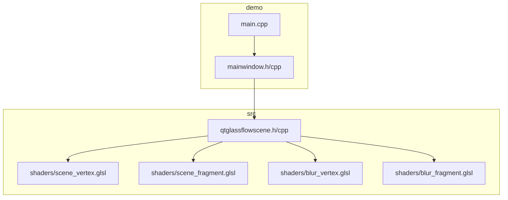
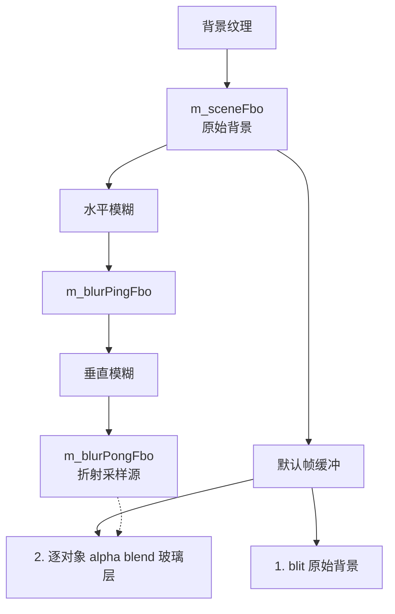
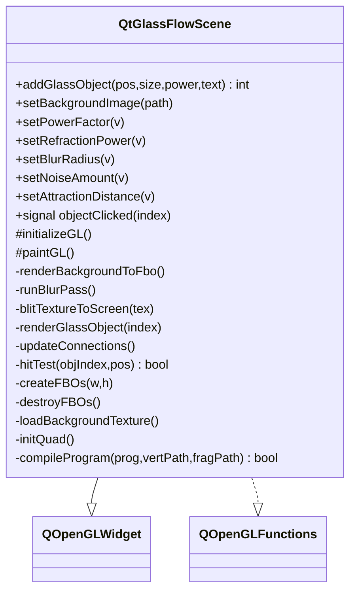
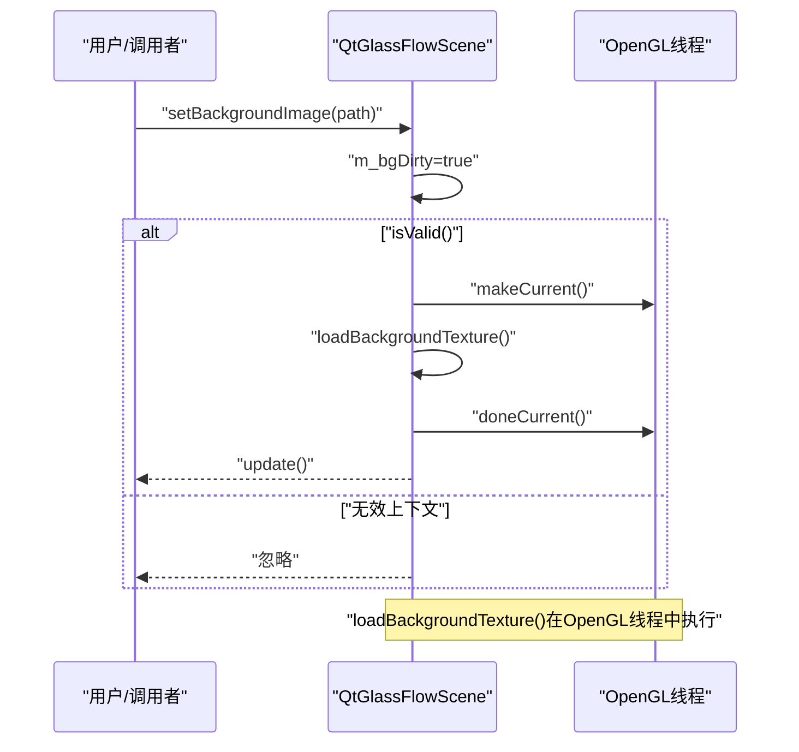
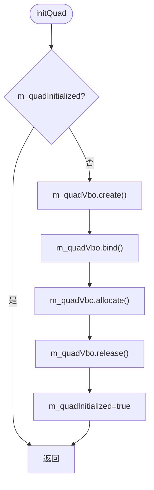
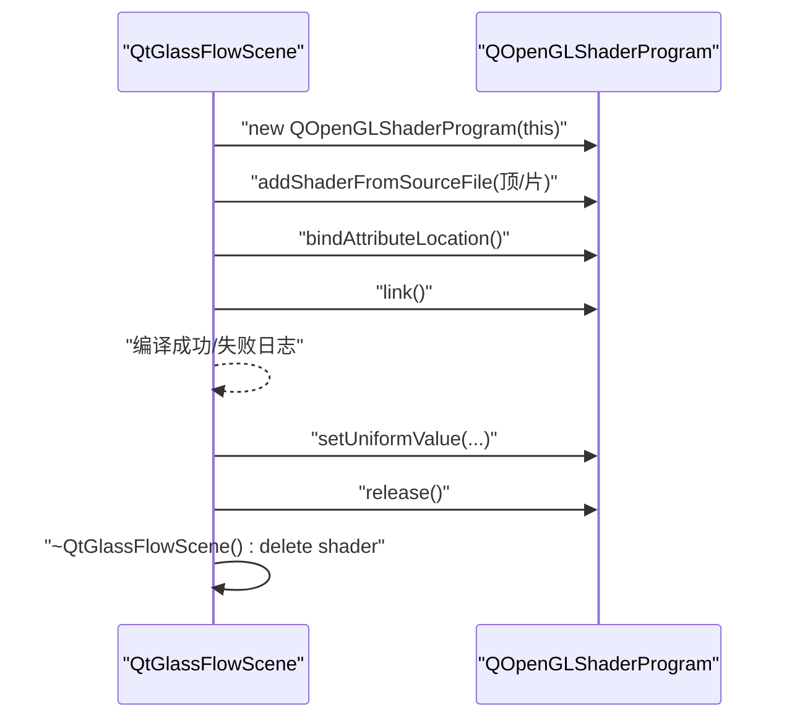
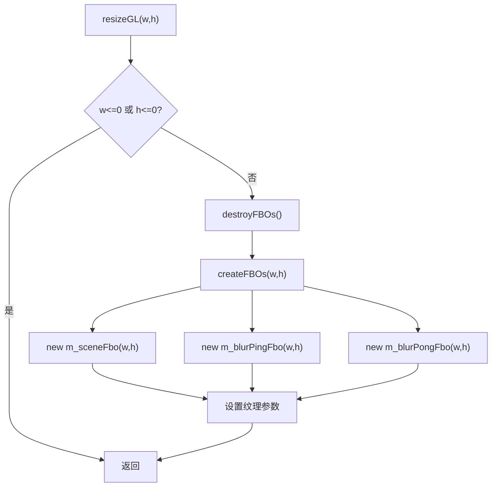
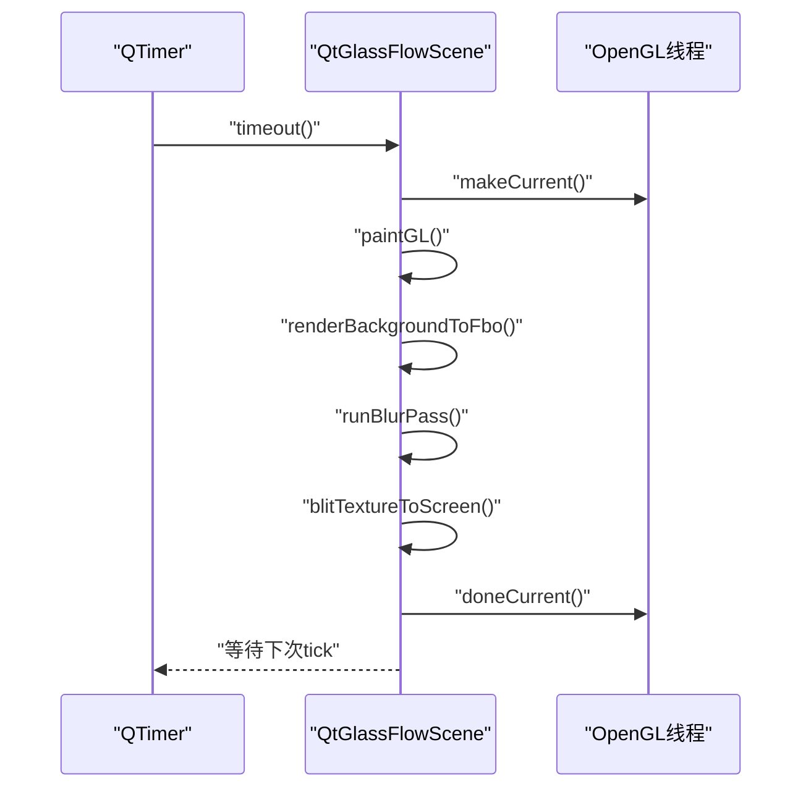
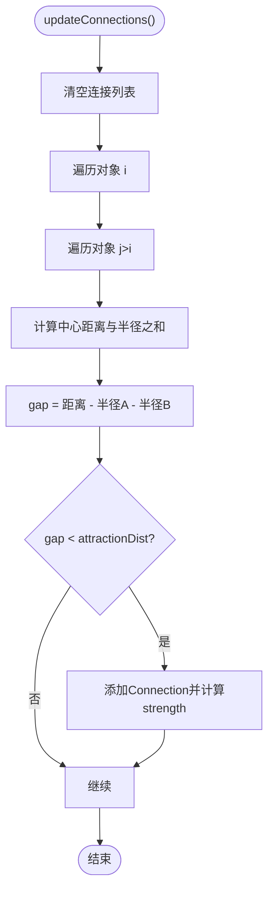
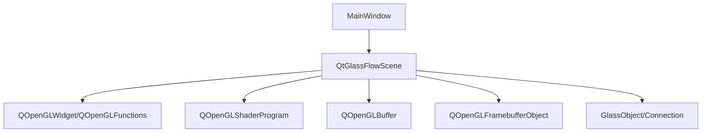

# OpenGL资源生命周期

<cite>
**本文档引用的文件**
- [qtglassflowscene.h](file://src/qtglassflowscene.h)
- [qtglassflowscene.cpp](file://src/qtglassflowscene.cpp)
- [scene_vertex.glsl](file://src/shaders/scene_vertex.glsl)
- [scene_fragment.glsl](file://src/shaders/scene_fragment.glsl)
- [blur_vertex.glsl](file://src/shaders/blur_vertex.glsl)
- [blur_fragment.glsl](file://src/shaders/blur_fragment.glsl)
- [mainwindow.h](file://demo/mainwindow.h)
- [mainwindow.cpp](file://demo/mainwindow.cpp)
- [main.cpp](file://demo/main.cpp)
- [README.md](file://README.md)
</cite>

## 目录
1. [简介](#简介)
2. [项目结构](#项目结构)
3. [核心组件](#核心组件)
4. [架构总览](#架构总览)
5. [详细组件分析](#详细组件分析)
6. [依赖关系分析](#依赖关系分析)
7. [性能考量](#性能考量)
8. [故障排查指南](#故障排查指南)
9. [结论](#结论)
10. [附录](#附录)

## 简介
本文件系统性阐述QtGlassFlowScene中的OpenGL资源生命周期管理，涵盖纹理、缓冲区对象、着色器程序与帧缓冲区（FBO）的创建、使用与销毁流程。重点说明RAII模式在异常安全与内存泄漏防护中的应用，资源的延迟创建与按需加载策略（如背景纹理异步加载与FBO动态尺寸调整），以及多线程环境下OpenGL上下文管理与竞态条件规避。同时提供资源泄漏检测与性能监控方法及最佳实践建议。

## 项目结构
该项目采用模块化组织：核心渲染逻辑位于src目录，着色器资源通过资源文件打包，演示程序位于demo目录。核心类QtGlassFlowScene继承自QOpenGLWidget并实现OpenGL功能，负责管理所有OpenGL资源并在paintGL中完成渲染管线。

图表来源
- [qtglassflowscene.h:17-142](file://src/qtglassflowscene.h#L17-L142)
- [qtglassflowscene.cpp:1-668](file://src/qtglassflowscene.cpp#L1-L668)
- [scene_vertex.glsl:1-9](file://src/shaders/scene_vertex.glsl#L1-L9)
- [scene_fragment.glsl:1-149](file://src/shaders/scene_fragment.glsl#L1-L149)
- [blur_vertex.glsl:1-9](file://src/shaders/blur_vertex.glsl#L1-L9)
- [blur_fragment.glsl:1-24](file://src/shaders/blur_fragment.glsl#L1-L24)
- [mainwindow.h:1-32](file://demo/mainwindow.h#L1-L32)
- [mainwindow.cpp:1-142](file://demo/mainwindow.cpp#L1-L142)
- [main.cpp:1-16](file://demo/main.cpp#L1-L16)

章节来源
- [README.md:86-108](file://README.md#L86-L108)

## 核心组件
- QtGlassFlowScene：核心渲染引擎，继承QOpenGLWidget并实现OpenGL功能，管理FBO管线、着色器编译、对象拖拽交互、连接检测与每帧渲染调度。
- 纹理：背景纹理（GL_TEXTURE_2D），用于折射采样。
- 缓冲区对象：全屏四边形顶点缓冲（QOpenGLBuffer），用于一次性绘制。
- 着色器程序：背景blit着色器、模糊着色器、玻璃对象着色器。
- 帧缓冲区：场景FBO、水平模糊FBO、垂直模糊FBO（ping-pong）。

章节来源
- [qtglassflowscene.h:17-142](file://src/qtglassflowscene.h#L17-L142)
- [qtglassflowscene.cpp:51-104](file://src/qtglassflowscene.cpp#L51-L104)

## 架构总览
渲染管线采用分离式高斯模糊（水平+垂直两次pass），通过ping-pong FBO在迭代中交替读写，最终得到可作为折射采样的模糊背景纹理。每帧流程如下：
1) 将背景纹理blit到场景FBO
2) 对场景FBO进行多次迭代的分离式高斯模糊（ping-pong）
3) 将模糊结果作为采样源，逐对象绘制全屏quad，片元着色器根据SDF与smooth-union实现液态玻璃效果
4) 最终将原始背景与玻璃层合成到默认帧缓冲

图表来源
- [qtglassflowscene.cpp:510-566](file://src/qtglassflowscene.cpp#L510-L566)
- [qtglassflowscene.cpp:316-359](file://src/qtglassflowscene.cpp#L316-L359)
- [qtglassflowscene.cpp:293-314](file://src/qtglassflowscene.cpp#L293-L314)

## 详细组件分析

### QtGlassFlowScene类与RAII资源管理
- 构造函数：设置OpenGL格式、启用鼠标跟踪与不透明绘制属性；初始化各类资源指针为空或零；设置默认渲染参数。
- 析构函数：确保在有效OpenGL上下文中调用，销毁FBO链、删除纹理、删除着色器、销毁顶点缓冲，最后释放上下文。
- RAII要点：
  - 纹理：使用glGenTextures/glDeleteTextures配对，析构中统一清理。
  - 着色器：new创建后由delete销毁，避免裸指针悬挂。
  - VBO：QOpenGLBuffer构造时未绑定数据，首次使用前创建并分配，析构时若已创建则destroy。
  - FBO：new创建，析构与resize时统一delete并置空，避免悬挂指针。

图表来源
- [qtglassflowscene.h:17-142](file://src/qtglassflowscene.h#L17-L142)
- [qtglassflowscene.cpp:51-104](file://src/qtglassflowscene.cpp#L51-L104)

章节来源
- [qtglassflowscene.cpp:90-104](file://src/qtglassflowscene.cpp#L90-L104)
- [qtglassflowscene.cpp:51-88](file://src/qtglassflowscene.cpp#L51-L88)

### 纹理资源管理
- 创建时机：首次设置背景路径或进入paintGL且标记脏时创建；若纹理尚未生成则调用glGenTextures。
- 数据上传：将QImage转换为RGBA8888并镜像翻转后上传至GL_TEXTURE_2D，设置线性过滤与边缘夹紧。
- 生命周期：析构时glDeleteTextures并清零句柄；背景路径变更时重新加载并更新尺寸缓存。
- 异步加载策略：当前实现为阻塞式加载（QImage构造与glTexImage2D），可通过后台线程加载图像数据后在OpenGL线程中上传优化。

图表来源
- [qtglassflowscene.cpp:119-129](file://src/qtglassflowscene.cpp#L119-L129)
- [qtglassflowscene.cpp:512-513](file://src/qtglassflowscene.cpp#L512-L513)
- [qtglassflowscene.cpp:266-291](file://src/qtglassflowscene.cpp#L266-L291)

章节来源
- [qtglassflowscene.cpp:119-129](file://src/qtglassflowscene.cpp#L119-L129)
- [qtglassflowscene.cpp:266-291](file://src/qtglassflowscene.cpp#L266-L291)
- [qtglassflowscene.cpp:94-97](file://src/qtglassflowscene.cpp#L94-L97)

### 缓冲区对象（VBO）管理
- 初始化：initQuad()在首次使用前创建QOpenGLBuffer并分配全屏四边形顶点数据，设置为静态绘制。
- 使用：drawFullscreenQuad()绑定VBO，启用顶点属性数组，设置位置与纹理坐标缓冲，调用glDrawArrays绘制，最后禁用属性数组并释放绑定。
- 生命周期：析构时若VBO已创建则调用destroy()，避免重复销毁。

图表来源
- [qtglassflowscene.cpp:159-169](file://src/qtglassflowscene.cpp#L159-L169)
- [qtglassflowscene.cpp:171-185](file://src/qtglassflowscene.cpp#L171-L185)

章节来源
- [qtglassflowscene.cpp:159-185](file://src/qtglassflowscene.cpp#L159-L185)
- [qtglassflowscene.cpp:101-102](file://src/qtglassflowscene.cpp#L101-L102)

### 着色器程序管理
- 编译链接：initializeGL()中创建并链接blit/blur/glass三套着色器；compileProgram()封装通用编译与链接流程，绑定顶点属性位置。
- 使用：每帧根据目标绘制调用bind()/setUniformValue()/release()，确保在绘制前后正确切换状态。
- 生命周期：析构时delete删除着色器对象，避免泄漏。

图表来源
- [qtglassflowscene.cpp:187-225](file://src/qtglassflowscene.cpp#L187-L225)
- [qtglassflowscene.cpp:138-157](file://src/qtglassflowscene.cpp#L138-L157)

章节来源
- [qtglassflowscene.cpp:187-225](file://src/qtglassflowscene.cpp#L187-L225)
- [qtglassflowscene.cpp:138-157](file://src/qtglassflowscene.cpp#L138-L157)

### 帧缓冲区（FBO）管理
- 动态尺寸：resizeGL()根据窗口尺寸调用createFBOs()，先destroyFBOs()再新建三个FBO，格式为GL_RGBA8。
- 纹理参数：对FBO纹理设置线性过滤与边缘夹紧，确保高质量采样。
- 生命周期：析构与resize时统一delete并置空，避免悬挂指针；runBlurPass()中通过ping-pong纹理在迭代间传递数据。

图表来源
- [qtglassflowscene.cpp:227-233](file://src/qtglassflowscene.cpp#L227-L233)
- [qtglassflowscene.cpp:235-264](file://src/qtglassflowscene.cpp#L235-L264)

章节来源
- [qtglassflowscene.cpp:227-264](file://src/qtglassflowscene.cpp#L227-L264)

### 渲染流程与资源状态同步
- 每帧流程：paintGL()中先检查背景脏标志并加载纹理，更新连接列表，渲染背景到场景FBO，执行多次迭代的分离式高斯模糊，最后将模糊结果与玻璃对象层合成到默认帧缓冲。
- 状态同步：使用makeCurrent()/doneCurrent()确保在OpenGL线程中操作资源；在多线程环境中，通过QApplication::setAttribute(Qt::AA_ShareOpenGLContexts)允许共享上下文，避免跨线程直接操作OpenGL对象。
- 竞态条件规避：所有OpenGL资源访问均在Qt事件循环的OpenGL线程中进行，避免与GUI线程并发修改状态。

图表来源
- [qtglassflowscene.cpp:221-224](file://src/qtglassflowscene.cpp#L221-L224)
- [qtglassflowscene.cpp:510-566](file://src/qtglassflowscene.cpp#L510-L566)

章节来源
- [qtglassflowscene.cpp:510-566](file://src/qtglassflowscene.cpp#L510-L566)
- [main.cpp](file://demo/main.cpp#L6)

### 玻璃对象与连接管理
- GlassObject：包含位置、尺寸、超椭圆幂、文本标签、交互状态与拖拽偏移。
- Connection：记录两个对象间的连接信息（索引与强度）。
- updateConnections()：基于对象中心距离与半径之和计算间隙，当间隙小于吸引距离时建立连接，最多支持8个连接。
- renderGlassObject()：绑定玻璃着色器，设置uniform数组（连接中心、半径、幂、强度），启用混合后绘制全屏quad。

图表来源
- [qtglassflowscene.cpp:478-508](file://src/qtglassflowscene.cpp#L478-L508)

章节来源
- [qtglassflowscene.h:23-40](file://src/qtglassflowscene.h#L23-L40)
- [qtglassflowscene.cpp:478-508](file://src/qtglassflowscene.cpp#L478-L508)
- [qtglassflowscene.cpp:394-476](file://src/qtglassflowscene.cpp#L394-L476)

## 依赖关系分析
- QtGlassFlowScene依赖QOpenGLWidget与QOpenGLFunctions，通过initializeOpenGLFunctions()获取OpenGL函数指针。
- 着色器资源通过资源文件打包，使用QOpenGLShaderProgram::addShaderFromSourceFile从资源路径加载。
- 玻璃对象与连接数据存储在容器中，渲染时动态构建uniform数组传入着色器。
- 主窗口通过滑块面板实时调节全局参数并驱动QtGlassFlowScene更新。

图表来源
- [qtglassflowscene.h:4-14](file://src/qtglassflowscene.h#L4-L14)
- [qtglassflowscene.cpp:1-15](file://src/qtglassflowscene.cpp#L1-L15)
- [mainwindow.cpp:43-56](file://demo/mainwindow.cpp#L43-L56)

章节来源
- [qtglassflowscene.h:4-14](file://src/qtglassflowscene.h#L4-L14)
- [mainwindow.cpp:43-56](file://demo/mainwindow.cpp#L43-L56)

## 性能考量
- 分离式高斯模糊：水平+垂直两次1D高斯核，支持多次迭代以换取更大半径而不牺牲单次核效率。
- Ping-pong FBO：减少中间临时纹理的创建与销毁次数，降低GPU内存碎片与状态切换开销。
- 顶点缓冲复用：全屏四边形VBO仅创建一次并复用，避免每帧重建。
- 纹理参数：线性过滤与边缘夹紧提升采样质量，减少重复创建/销毁。
- 建议优化：
  - 背景纹理异步加载：在工作线程解码图像，完成后在OpenGL线程中上传，避免主线程阻塞。
  - FBO尺寸缓存：在resize前检查尺寸变化，避免不必要的重建。
  - 着色器缓存：编译失败时记录错误日志，避免重复编译。
  - 统计与监控：使用QElapsedTimer统计每帧耗时，结合帧率与GPU占用评估性能瓶颈。

[本节为通用性能指导，不直接分析具体文件]

## 故障排查指南
- 着色器编译失败：compileProgram()会输出编译日志，检查顶点/片段着色器路径与GLSL版本兼容性。
- FBO尺寸异常：resizeGL()中检查w/h有效性，确认createFBOs()在每次尺寸变化时重建。
- 纹理未显示：确认背景路径有效、loadBackgroundTexture()成功、纹理绑定与uniform设置正确。
- OpenGL上下文问题：确保在OpenGL线程中调用makeCurrent()/doneCurrent()，避免跨线程操作。
- 内存泄漏：检查析构函数是否删除所有OpenGL对象，避免悬挂指针；使用工具检测未释放的纹理/缓冲/着色器/FBO。

章节来源
- [qtglassflowscene.cpp:142-156](file://src/qtglassflowscene.cpp#L142-L156)
- [qtglassflowscene.cpp:229-232](file://src/qtglassflowscene.cpp#L229-L232)
- [qtglassflowscene.cpp:266-291](file://src/qtglassflowscene.cpp#L266-L291)
- [qtglassflowscene.cpp:90-104](file://src/qtglassflowscene.cpp#L90-L104)

## 结论
QtGlassFlowScene通过明确的RAII模式与严格的生命周期管理，确保OpenGL资源在创建、使用与销毁过程中的异常安全与内存安全。延迟创建与按需加载策略（背景纹理与FBO）有效降低了启动成本与内存占用。渲染管线采用分离式高斯模糊与ping-pongFBO，兼顾质量与性能。建议在多线程环境下遵循OpenGL线程模型，结合异步加载与性能监控进一步提升用户体验。

[本节为总结性内容，不直接分析具体文件]

## 附录

### 资源管理最佳实践清单
- 资源创建：在initializeGL()或首次使用前创建，确保OpenGL上下文有效。
- 资源销毁：在析构函数与resize回调中统一销毁，避免悬挂指针。
- 状态同步：使用makeCurrent()/doneCurrent()限定OpenGL操作线程。
- 错误处理：记录编译/链接日志，及时暴露问题。
- 性能监控：统计每帧耗时，识别瓶颈并优化。

[本节为通用指导，不直接分析具体文件]