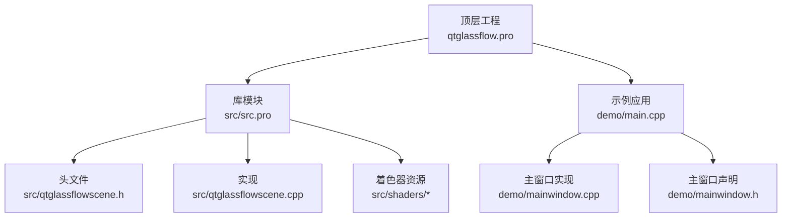
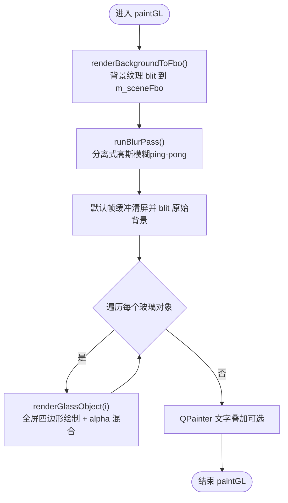
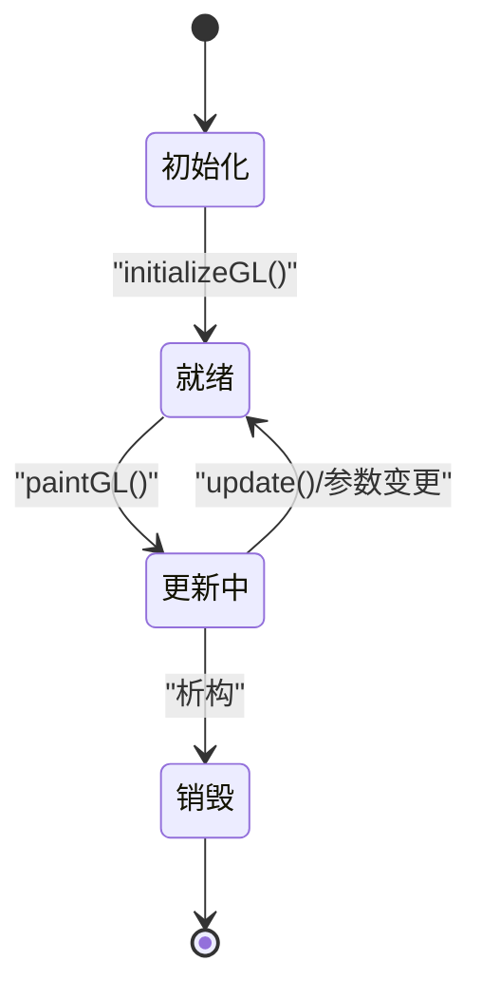
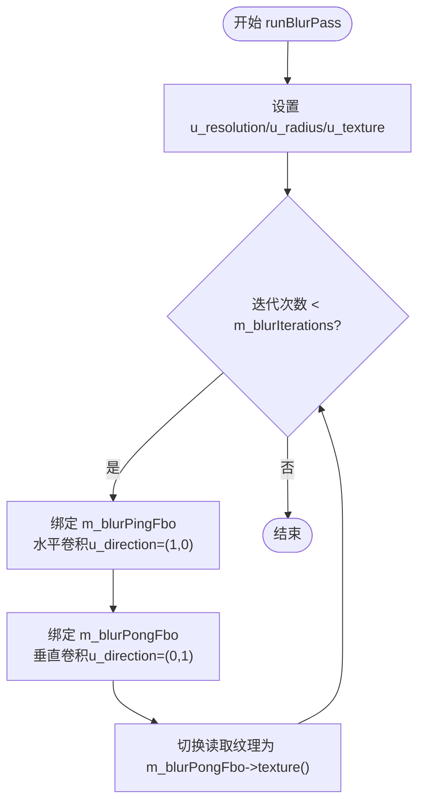
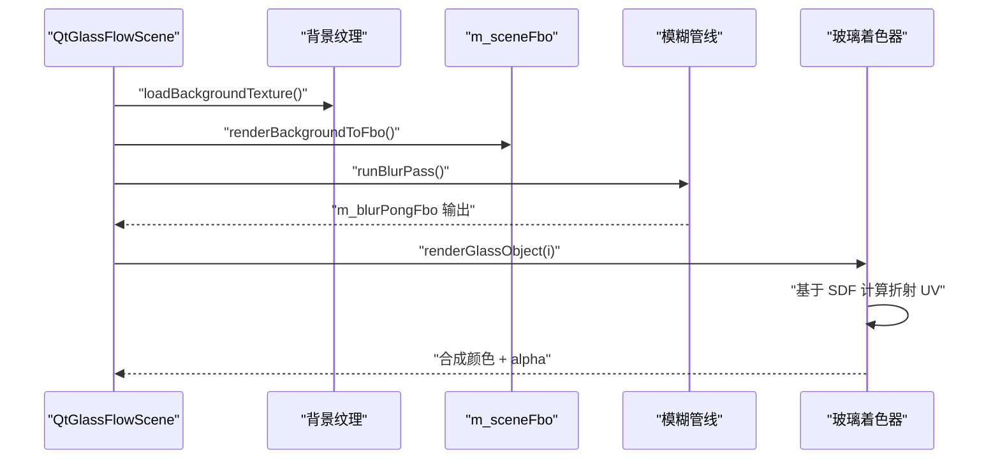
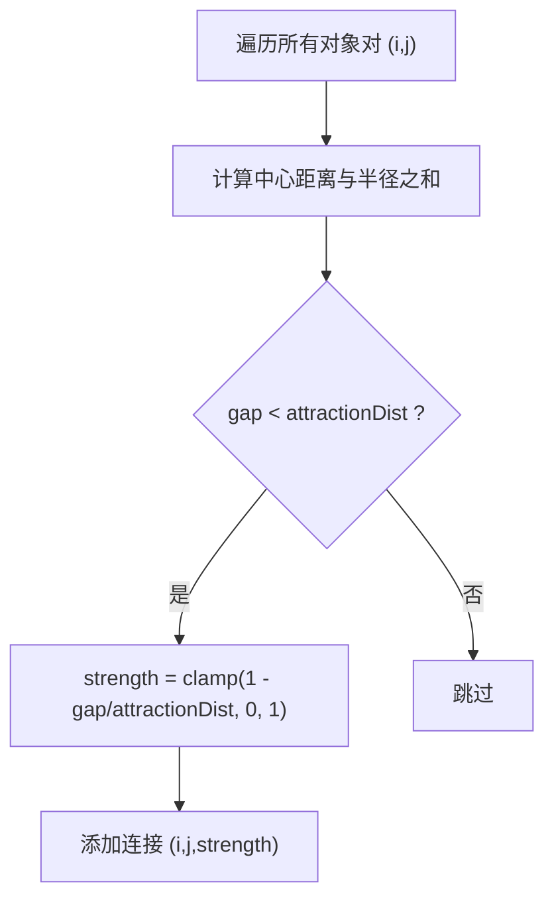
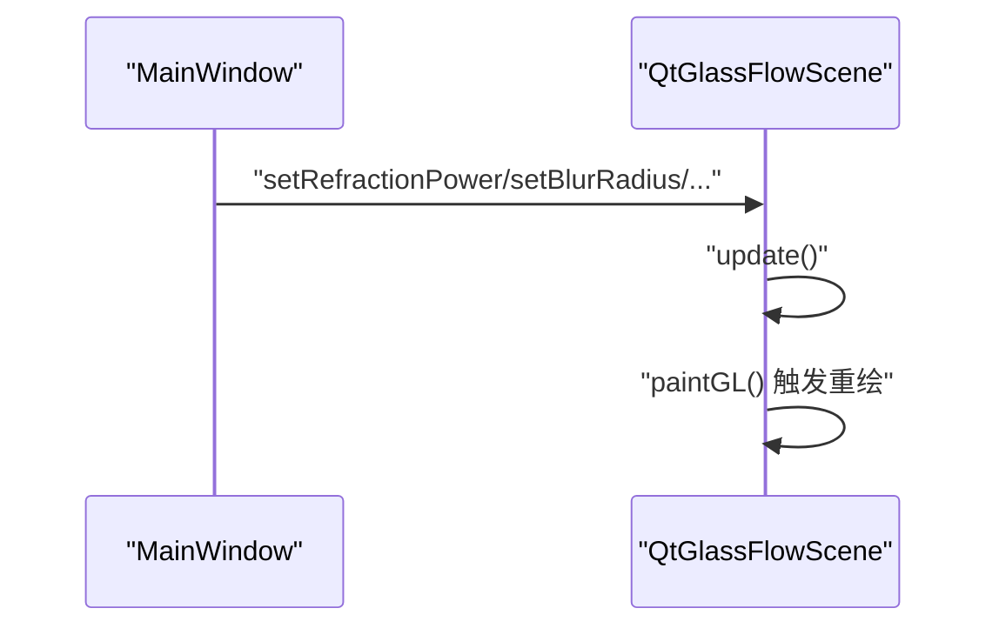
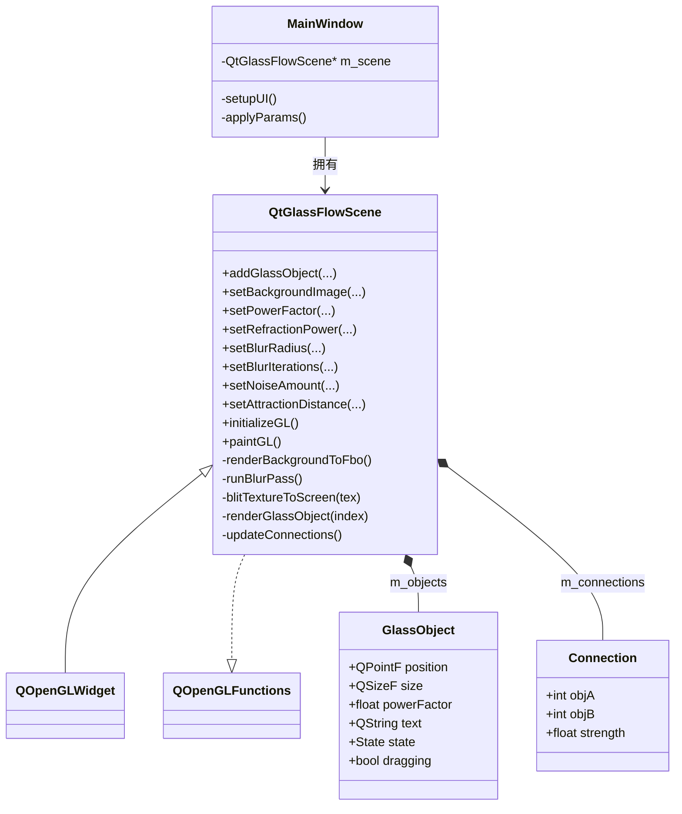

# 渲染引擎架构

<cite>
**本文档引用的文件**
- [README.md](file://README.md)
- [qtglassflow.pro](file://qtglassflow.pro)
- [src/src.pro](file://src/src.pro)
- [src/qtglassflowscene.h](file://src/qtglassflowscene.h)
- [src/qtglassflowscene.cpp](file://src/qtglassflowscene.cpp)
- [src/shaders/scene_vertex.glsl](file://src/shaders/scene_vertex.glsl)
- [src/shaders/scene_fragment.glsl](file://src/shaders/scene_fragment.glsl)
- [src/shaders/blur_vertex.glsl](file://src/shaders/blur_vertex.glsl)
- [src/shaders/blur_fragment.glsl](file://src/shaders/blur_fragment.glsl)
- [demo/mainwindow.h](file://demo/mainwindow.h)
- [demo/mainwindow.cpp](file://demo/mainwindow.cpp)
- [demo/main.cpp](file://demo/main.cpp)
</cite>

## 目录
1. [简介](#简介)
2. [项目结构](#项目结构)
3. [核心组件](#核心组件)
4. [架构总览](#架构总览)
5. [详细组件分析](#详细组件分析)
6. [依赖关系分析](#依赖关系分析)
7. [性能考量](#性能考量)
8. [故障排查指南](#故障排查指南)
9. [结论](#结论)
10. [附录](#附录)

## 简介
本项目是一个基于 Qt + OpenGL 的液态玻璃效果渲染库，能够在普通 QWidget 程序中实时渲染具备折射、模糊、噪声与粘性桥接的 SDF 超椭圆玻璃对象。其核心渲染架构围绕 QOpenGLWidget 展开，采用 FBO 多重缓冲与分离式高斯模糊实现背景纹理的预处理，并通过逐对象的全屏四边形绘制完成玻璃对象的合成渲染。系统支持参数化折射模型、凸面穹顶光照、极细边框与抗锯齿、以及基于 Voronoi 的像素归属控制，确保在多对象重叠时仍能获得正确的视觉结果。

## 项目结构
项目采用子目录组织，顶层为工程入口，src 子工程提供库实现，demo 子工程提供示例应用。着色器资源通过资源文件打包，便于运行时加载。

图表来源
- [qtglassflow.pro:1-4](file://qtglassflow.pro#L1-L4)
- [src/src.pro:1-15](file://src/src.pro#L1-L15)
- [demo/main.cpp:1-16](file://demo/main.cpp#L1-L16)

章节来源
- [qtglassflow.pro:1-4](file://qtglassflow.pro#L1-L4)
- [src/src.pro:1-15](file://src/src.pro#L1-L15)
- [demo/main.cpp:1-16](file://demo/main.cpp#L1-L16)

## 核心组件
- QtGlassFlowScene：继承自 QOpenGLWidget，负责 OpenGL 初始化、FBO 管线、着色器编译与绑定、背景纹理加载、分离式高斯模糊、逐对象玻璃渲染、鼠标交互与参数更新。
- GlassObject：玻璃对象数据结构，包含位置、尺寸、超椭圆幂、文本标签、交互状态与拖拽偏移。
- Connection：对象间的粘性连接，记录两端索引与连接强度。
- MainWindow：示例应用窗口，提供参数滑块面板，实时调节全局渲染参数并反馈到场景。

章节来源
- [src/qtglassflowscene.h:17-142](file://src/qtglassflowscene.h#L17-L142)
- [demo/mainwindow.h:10-32](file://demo/mainwindow.h#L10-L32)
- [README.md:110-171](file://README.md#L110-L171)

## 架构总览
系统采用“背景预处理 + 多对象合成”的渲染管线。每帧流程包括：背景纹理 blit 到场景 FBO、分离式高斯模糊（ping-pong 缓冲）、将原始背景 blit 到默认帧缓冲、逐对象进行全屏四边形绘制并进行 alpha 混合合成。

图表来源
- [src/qtglassflowscene.cpp:510-566](file://src/qtglassflowscene.cpp#L510-L566)
- [src/qtglassflowscene.cpp:293-314](file://src/qtglassflowscene.cpp#L293-L314)
- [src/qtglassflowscene.cpp:316-359](file://src/qtglassflowscene.cpp#L316-L359)
- [src/qtglassflowscene.cpp:361-371](file://src/qtglassflowscene.cpp#L361-L371)
- [src/qtglassflowscene.cpp:394-476](file://src/qtglassflowscene.cpp#L394-L476)

章节来源
- [README.md:171-194](file://README.md#L171-L194)
- [src/qtglassflowscene.cpp:510-566](file://src/qtglassflowscene.cpp#L510-L566)

## 详细组件分析

### QtGlassFlowScene 类与渲染状态机
- 初始化阶段（initializeGL）：启用 OpenGL 功能、编译并链接着色器程序、初始化全屏四边形 VBO、加载背景纹理、启动定时器驱动更新。
- 更新阶段（paintGL）：根据脏标志加载背景纹理；计算对象间连接；渲染背景到场景 FBO；执行多次迭代的分离式高斯模糊；将原始背景 blit 到默认帧缓冲；逐对象绘制玻璃层；最后使用 QPainter 进行文字叠加。
- 销毁阶段（析构）：释放 FBO、纹理、着色器程序与 VBO，确保 OpenGL 资源回收。

图表来源
- [src/qtglassflowscene.cpp:187-225](file://src/qtglassflowscene.cpp#L187-L225)
- [src/qtglassflowscene.cpp:510-566](file://src/qtglassflowscene.cpp#L510-L566)
- [src/qtglassflowscene.cpp:90-104](file://src/qtglassflowscene.cpp#L90-L104)

章节来源
- [src/qtglassflowscene.cpp:187-225](file://src/qtglassflowscene.cpp#L187-L225)
- [src/qtglassflowscene.cpp:510-566](file://src/qtglassflowscene.cpp#L510-L566)
- [src/qtglassflowscene.cpp:90-104](file://src/qtglassflowscene.cpp#L90-L104)

### FBO 多重缓冲与分离式高斯模糊
- FBO 管线：使用 m_sceneFbo 作为原始背景输出，m_blurPingFbo 与 m_blurPongFbo 实现 ping-pong 交替缓冲，减少内存占用并提升缓存局部性。
- 分离式高斯模糊：水平与垂直两次 1D 高斯卷积，每次使用 9-tap 核心，支持多次迭代以等效更大半径且避免单次大核的性能开销。
- ping-pong 交替：迭代 i 使用 m_blurPingFbo 作为中间结果，迭代 i+1 使用 m_blurPongFbo，最终结果写入 m_blurPongFbo，供玻璃着色器采样。

图表来源
- [src/qtglassflowscene.cpp:316-359](file://src/qtglassflowscene.cpp#L316-L359)
- [src/shaders/blur_fragment.glsl:9-23](file://src/shaders/blur_fragment.glsl#L9-L23)
- [src/shaders/blur_vertex.glsl:1-9](file://src/shaders/blur_vertex.glsl#L1-L9)

章节来源
- [src/qtglassflowscene.cpp:316-359](file://src/qtglassflowscene.cpp#L316-L359)
- [src/shaders/blur_fragment.glsl:9-23](file://src/shaders/blur_fragment.glsl#L9-L23)
- [README.md:195-214](file://README.md#L195-L214)

### 背景纹理处理与折射采样
- 背景纹理加载：支持从文件路径加载，转换为 RGBA8888 格式并镜像 Y 轴，设置线性过滤与边缘裁剪。
- 背景 blit：将背景纹理直接 blit 到 m_sceneFbo，随后进行模糊处理。
- 折射采样：在玻璃着色器中，依据 SDF 距离计算 UV 变换，边缘向中心收缩，中心保持清晰，实现折射效果。

图表来源
- [src/qtglassflowscene.cpp:266-291](file://src/qtglassflowscene.cpp#L266-L291)
- [src/qtglassflowscene.cpp:293-314](file://src/qtglassflowscene.cpp#L293-L314)
- [src/qtglassflowscene.cpp:316-359](file://src/qtglassflowscene.cpp#L316-L359)
- [src/qtglassflowscene.cpp:394-476](file://src/qtglassflowscene.cpp#L394-L476)
- [src/shaders/scene_fragment.glsl:118-121](file://src/shaders/scene_fragment.glsl#L118-L121)

章节来源
- [src/qtglassflowscene.cpp:266-291](file://src/qtglassflowscene.cpp#L266-L291)
- [src/qtglassflowscene.cpp:293-314](file://src/qtglassflowscene.cpp#L293-L314)
- [src/qtglassflowscene.cpp:394-476](file://src/qtglassflowscene.cpp#L394-L476)
- [README.md:286-319](file://README.md#L286-L319)

### 玻璃对象渲染与粘性桥接
- 对象渲染：每个玻璃对象以全屏四边形绘制，片元着色器计算 SDF 超椭圆形状、smooth-union 桥接、Voronoi 归属、折射采样、穹顶光照、边框与抗锯齿。
- 连接检测：基于对象中心距离与半径之和计算间隙 gap，当 gap 小于吸引距离时建立连接，强度随距离线性插值。
- 并发连接上限：最多支持 8 个连接，通过数组 uniform 传递至着色器。

图表来源
- [src/qtglassflowscene.cpp:478-508](file://src/qtglassflowscene.cpp#L478-L508)
- [README.md:234-261](file://README.md#L234-L261)

章节来源
- [src/qtglassflowscene.cpp:478-508](file://src/qtglassflowscene.cpp#L478-L508)
- [README.md:234-261](file://README.md#L234-L261)

### 交互与参数更新
- 鼠标交互：自顶向下进行命中测试，支持悬停、按下与拖拽，拖拽时限制在窗口范围内。
- 参数更新：通过滑块面板实时调整折射强度、模糊半径、噪声量、吸引距离与超椭圆幂，调用相应 setter 触发重绘。

图表来源
- [demo/mainwindow.cpp:131-141](file://demo/mainwindow.cpp#L131-L141)
- [src/qtglassflowscene.cpp:131-136](file://src/qtglassflowscene.cpp#L131-L136)
- [src/qtglassflowscene.cpp:510-566](file://src/qtglassflowscene.cpp#L510-L566)

章节来源
- [demo/mainwindow.cpp:131-141](file://demo/mainwindow.cpp#L131-L141)
- [src/qtglassflowscene.cpp:131-136](file://src/qtglassflowscene.cpp#L131-L136)
- [src/qtglassflowscene.cpp:510-566](file://src/qtglassflowscene.cpp#L510-L566)

## 依赖关系分析
- QtGlassFlowScene 依赖 QOpenGLWidget 与 QOpenGLFunctions 提供的 OpenGL 上下文与功能。
- 着色器通过资源文件加载，使用 GLSL 120 兼容语法。
- 示例应用 MainWindow 持有 QtGlassFlowScene 实例，提供参数面板与事件响应。

图表来源
- [src/qtglassflowscene.h:17-142](file://src/qtglassflowscene.h#L17-L142)
- [demo/mainwindow.h:10-32](file://demo/mainwindow.h#L10-L32)
- [README.md:114-163](file://README.md#L114-L163)

章节来源
- [src/qtglassflowscene.h:17-142](file://src/qtglassflowscene.h#L17-L142)
- [demo/mainwindow.h:10-32](file://demo/mainwindow.h#L10-L32)
- [README.md:114-163](file://README.md#L114-L163)

## 性能考量
- ping-pong 缓冲：通过在 m_blurPingFbo 与 m_blurPongFbo 之间交替，减少内存带宽与 GPU 内存占用，提升缓存局部性。
- alpha 混合顺序：先 blit 原始背景，再逐对象进行 alpha 混合，避免多次混合导致的亮度累积与错误叠加。
- 批量渲染策略：每个玻璃对象以全屏四边形绘制，结合 Voronoi 归属与 smooth-union，减少不必要的像素处理。
- 抗锯齿与边框：使用 fwidth 自适应边缘过渡，配合极细边框线与 alpha 抗锯齿，保证边缘锐利且性能可控。
- 纹理与 FBO：统一使用 GL_LINEAR 过滤与 CLAMP_TO_EDGE 包装，避免采样边界问题；FBO 内部格式为 RGBA8，满足玻璃材质需求。

章节来源
- [README.md:195-214](file://README.md#L195-L214)
- [src/qtglassflowscene.cpp:316-359](file://src/qtglassflowscene.cpp#L316-L359)
- [src/qtglassflowscene.cpp:469-475](file://src/qtglassflowscene.cpp#L469-L475)
- [src/shaders/scene_fragment.glsl:139-145](file://src/shaders/scene_fragment.glsl#L139-L145)

## 故障排查指南
- 着色器编译失败：检查着色器源文件路径与资源打包，确认 GLSL 版本与内置函数兼容性。
- 背景纹理不显示：确认背景路径有效、图像格式转换成功、纹理绑定与采样正确。
- 模糊效果异常：检查 u_radius 与 u_resolution 传参、迭代次数设置、ping-pong 纹理切换逻辑。
- 折射效果不明显：调整折射参数 a/b/c/d 与 fPower，确保 SDF 距离计算与 UV 变换正确。
- 多对象重叠闪烁：确认 Voronoi 归属逻辑与 smooth-union 的正确性，避免像素被重复渲染。

章节来源
- [src/qtglassflowscene.cpp:138-157](file://src/qtglassflowscene.cpp#L138-L157)
- [src/qtglassflowscene.cpp:266-291](file://src/qtglassflowscene.cpp#L266-L291)
- [src/qtglassflowscene.cpp:316-359](file://src/qtglassflowscene.cpp#L316-L359)
- [src/qtglassflowscene.cpp:394-476](file://src/qtglassflowscene.cpp#L394-L476)
- [src/shaders/scene_fragment.glsl:66-95](file://src/shaders/scene_fragment.glsl#L66-L95)

## 结论
本渲染引擎以 QtGlassFlowScene 为核心，结合 FBO 多重缓冲与分离式高斯模糊，实现了高效的背景预处理与玻璃对象的逐对象合成渲染。通过 SDF 超椭圆、smooth-union 桥接、Voronoi 归属与折射采样，系统在视觉上实现了逼真的液态玻璃效果。OpenGL 资源管理策略（纹理、FBO、着色器）与渲染状态机（初始化、更新、销毁）确保了稳定性与可维护性。性能方面，ping-pong 缓冲、alpha 混合顺序与抗锯齿策略共同保障了流畅的帧率表现。

## 附录
- 着色器资源：场景顶点/片段着色器与模糊顶点/片段着色器均采用 GLSL 120 语法，确保 OpenGL 2.1 兼容性。
- 示例应用：MainWindow 提供参数面板与交互演示，展示如何集成 QtGlassFlowScene 并实时调整渲染参数。

章节来源
- [src/shaders/scene_vertex.glsl:1-9](file://src/shaders/scene_vertex.glsl#L1-L9)
- [src/shaders/scene_fragment.glsl:1-149](file://src/shaders/scene_fragment.glsl#L1-L149)
- [src/shaders/blur_vertex.glsl:1-9](file://src/shaders/blur_vertex.glsl#L1-L9)
- [src/shaders/blur_fragment.glsl:1-24](file://src/shaders/blur_fragment.glsl#L1-L24)
- [demo/mainwindow.cpp:33-141](file://demo/mainwindow.cpp#L33-L141)