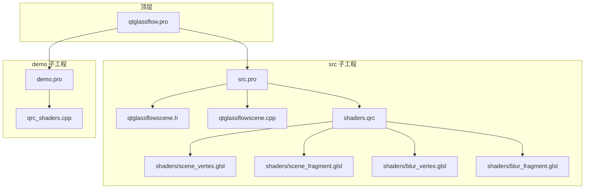
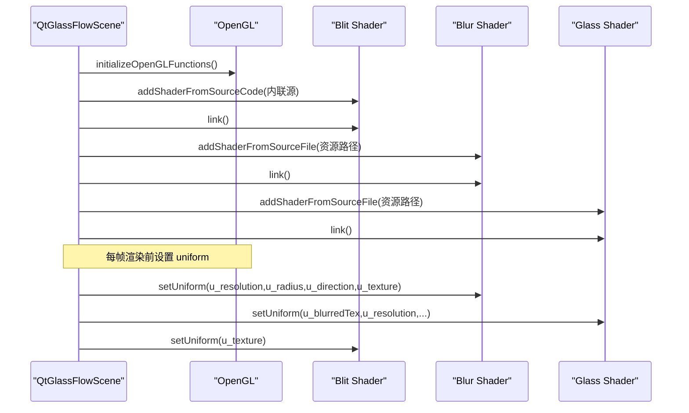
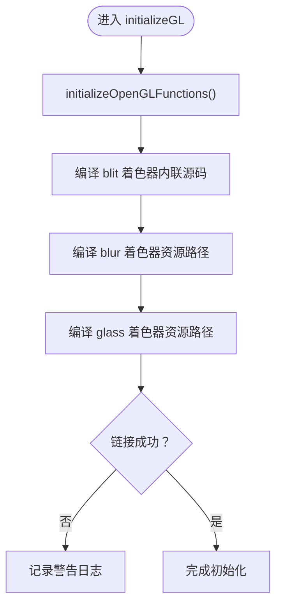
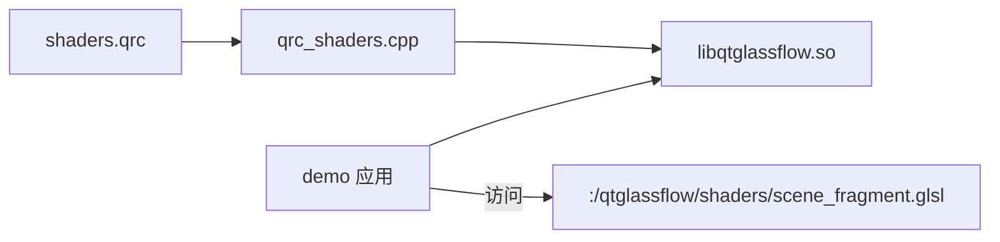
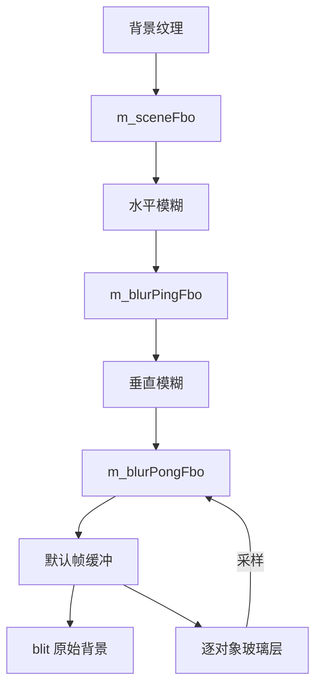
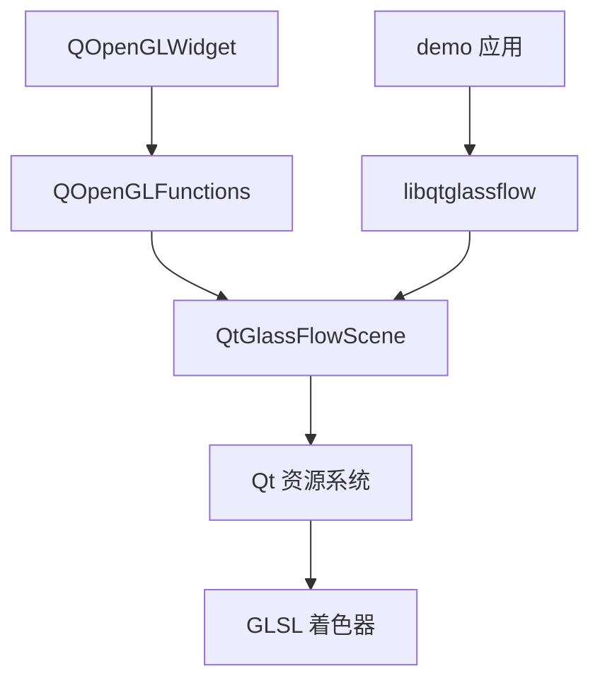

# 着色器编译与管理

<cite>
**本文引用的文件**
- [qtglassflowscene.h](file://src/qtglassflowscene.h)
- [qtglassflowscene.cpp](file://src/qtglassflowscene.cpp)
- [shaders.qrc](file://src/shaders.qrc)
- [qrc_shaders.cpp](file://demo/qrc_shaders.cpp)
- [scene_vertex.glsl](file://src/shaders/scene_vertex.glsl)
- [scene_fragment.glsl](file://src/shaders/scene_fragment.glsl)
- [blur_vertex.glsl](file://src/shaders/blur_vertex.glsl)
- [blur_fragment.glsl](file://src/shaders/blur_fragment.glsl)
- [demo.pro](file://demo/demo.pro)
- [src.pro](file://src/src.pro)
- [qtglassflow.pro](file://qtglassflow.pro)
- [README.md](file://README.md)
</cite>

## 目录
1. [简介](#简介)
2. [项目结构](#项目结构)
3. [核心组件](#核心组件)
4. [架构总览](#架构总览)
5. [详细组件分析](#详细组件分析)
6. [依赖关系分析](#依赖关系分析)
7. [性能考量](#性能考量)
8. [故障排查指南](#故障排查指南)
9. [结论](#结论)
10. [附录](#附录)

## 简介
本文件面向 QtGlassFlowScene 中的着色器编译与管理子系统，系统性阐述以下内容：
- 着色器程序生命周期管理：编译、链接、错误处理与资源释放
- 三种着色器程序的用途与职责：blit（全屏纹理复制）、blur（高斯模糊）、glass（玻璃对象渲染）
- Qt 资源系统集成：.qrc 文件组织、资源编译与访问路径
- 统一变量（uniform）设置与传递机制：矩阵变换、纹理采样、参数控制
- 调试技巧与常见编译错误的解决方法
- 性能优化建议与跨平台兼容性注意事项

## 项目结构
本项目采用 subdirs 结构，核心库位于 src，演示应用位于 demo。着色器资源通过 shaders.qrc 组织并在构建时嵌入到库中，供运行时以 Qt 资源路径访问。

图表来源
- [qtglassflow.pro:1-4](file://qtglassflow.pro#L1-L4)
- [src.pro:1-15](file://src/src.pro#L1-L15)
- [demo.pro:1-14](file://demo/demo.pro#L1-L14)
- [shaders.qrc:1-9](file://src/shaders.qrc#L1-L9)

章节来源
- [qtglassflow.pro:1-4](file://qtglassflow.pro#L1-L4)
- [src.pro:1-15](file://src/src.pro#L1-L15)
- [demo.pro:1-14](file://demo/demo.pro#L1-L14)
- [shaders.qrc:1-9](file://src/shaders.qrc#L1-L9)

## 核心组件
- QtGlassFlowScene：继承 QOpenGLWidget，封装 OpenGL 初始化、着色器编译与链接、FBO 管线、对象渲染与交互逻辑
- 三种着色器程序：
  - blit：用于全屏纹理复制，直接从内存内联源码编译
  - blur：分离式高斯模糊，使用资源路径加载
  - glass：玻璃对象渲染，使用资源路径加载
- 资源系统：shaders.qrc 将四个 GLSL 文件打包为 Qt 资源，运行时通过 ":/qtglassflow/shaders/..." 访问

章节来源
- [qtglassflowscene.h:17-142](file://src/qtglassflowscene.h#L17-L142)
- [qtglassflowscene.cpp:138-225](file://src/qtglassflowscene.cpp#L138-L225)
- [shaders.qrc:1-9](file://src/shaders.qrc#L1-L9)

## 架构总览
着色器编译与管理的总体流程如下：
- initializeGL 中初始化 OpenGL 函数指针
- 编译 blit 着色器：从内联字符串编译顶点/片元着色器并链接
- 编译 blur/glass 着色器：通过 compileProgram 从资源路径加载 GLSL 源码并链接
- 每帧渲染前，设置必要的 uniform（分辨率、半径、方向、纹理采样器等）
- 渲染结束后释放绑定状态，避免状态泄漏

图表来源
- [qtglassflowscene.cpp:187-225](file://src/qtglassflowscene.cpp#L187-L225)
- [qtglassflowscene.cpp:138-157](file://src/qtglassflowscene.cpp#L138-L157)

章节来源
- [qtglassflowscene.cpp:187-225](file://src/qtglassflowscene.cpp#L187-L225)
- [qtglassflowscene.cpp:138-157](file://src/qtglassflowscene.cpp#L138-L157)

## 详细组件分析

### 组件一：着色器编译与链接管理
- compileProgram：通用编译函数，负责添加顶点/片元着色器、绑定属性位置、链接并输出日志
- initializeGL：初始化 OpenGL 函数指针，编译 blit、blur、glass 三套着色器
- 生命周期：构造时创建，析构时删除，确保资源释放

图表来源
- [qtglassflowscene.cpp:187-225](file://src/qtglassflowscene.cpp#L187-L225)
- [qtglassflowscene.cpp:138-157](file://src/qtglassflowscene.cpp#L138-L157)

章节来源
- [qtglassflowscene.cpp:138-157](file://src/qtglassflowscene.cpp#L138-L157)
- [qtglassflowscene.cpp:187-225](file://src/qtglassflowscene.cpp#L187-L225)

### 组件二：三种着色器程序的用途与职责
- blit 着色器
  - 用途：全屏纹理复制，用于将背景纹理或中间结果 blit 到屏幕
  - 特点：内联源码，属性位置绑定，简单高效
- blur 着色器
  - 用途：分离式高斯模糊，水平+垂直两次 1D 9-tap 核
  - 关键 uniform：u_resolution、u_radius、u_direction、u_texture
- glass 着色器
  - 用途：玻璃对象渲染，基于 SDF 超椭圆、smooth-union、折射、抗锯齿与材质混合
  - 关键 uniform：u_blurredTex、u_resolution、u_objCenter、u_objHalfSize、u_powerFactor、u_a~u_d、u_fPower、u_noise、u_time、u_numConnections、u_connCenterB~u_connStrength、u_tintColor、u_tintStrength、u_opacity、u_rippleTime、u_rippleCenter、u_flowSpeed、u_deformAmount

章节来源
- [qtglassflowscene.cpp:194-214](file://src/qtglassflowscene.cpp#L194-L214)
- [qtglassflowscene.cpp:316-359](file://src/qtglassflowscene.cpp#L316-L359)
- [qtglassflowscene.cpp:410-476](file://src/qtglassflowscene.cpp#L410-L476)
- [blur_fragment.glsl:1-24](file://src/shaders/blur_fragment.glsl#L1-L24)
- [scene_fragment.glsl:1-149](file://src/shaders/scene_fragment.glsl#L1-L149)

### 组件三：Qt 资源系统集成
- shaders.qrc：定义资源前缀 "/qtglassflow"，包含四个 GLSL 文件
- 构建后生成 qrc_shaders.cpp，包含资源数据与注册/注销函数
- 运行时通过 ":/qtglassflow/shaders/xxx.glsl" 访问资源
- 演示工程 demo.pro 未直接包含 shaders.qrc，但 qrc_shaders.cpp 由构建系统生成并链接

图表来源
- [shaders.qrc:1-9](file://src/shaders.qrc#L1-L9)
- [qrc_shaders.cpp:482-496](file://demo/qrc_shaders.cpp#L482-L496)
- [demo.pro:1-14](file://demo/demo.pro#L1-L14)

章节来源
- [shaders.qrc:1-9](file://src/shaders.qrc#L1-L9)
- [qrc_shaders.cpp:482-496](file://demo/qrc_shaders.cpp#L482-L496)
- [demo.pro:1-14](file://demo/demo.pro#L1-L14)

### 组件四：统一变量设置与传递机制
- blit：设置 u_texture（采样器 0）
- blur：设置 u_resolution、u_radius、u_direction、u_texture
- glass：设置 u_blurredTex、u_resolution、u_objCenter、u_objHalfSize、u_powerFactor、u_a~u_d、u_fPower、u_noise、u_time、u_numConnections、u_connCenterB~u_connStrength、u_tintColor、u_tintStrength、u_opacity、u_rippleTime、u_rippleCenter、u_flowSpeed、u_deformAmount
- 传递方式：通过 QOpenGLShaderProgram::setUniformValue 或 setUniformValueArray

章节来源
- [qtglassflowscene.cpp:304-311](file://src/qtglassflowscene.cpp#L304-L311)
- [qtglassflowscene.cpp:325-327](file://src/qtglassflowscene.cpp#L325-L327)
- [qtglassflowscene.cpp:411-432](file://src/qtglassflowscene.cpp#L411-L432)

### 组件五：渲染管线中的着色器使用
- renderBackgroundToFbo：将背景纹理 blit 到 m_sceneFbo
- runBlurPass：水平+垂直分离式高斯模糊，ping-pong 交替缓冲，迭代 m_blurIterations 次
- blitTextureToScreen：将纹理 blit 到默认帧缓冲
- renderGlassObject：对每个玻璃对象绘制全屏 quad，使用模糊后的纹理作为折射采样源

图表来源
- [qtglassflowscene.cpp:510-566](file://src/qtglassflowscene.cpp#L510-L566)
- [qtglassflowscene.cpp:316-359](file://src/qtglassflowscene.cpp#L316-L359)
- [qtglassflowscene.cpp:530-536](file://src/qtglassflowscene.cpp#L530-L536)

章节来源
- [qtglassflowscene.cpp:510-566](file://src/qtglassflowscene.cpp#L510-L566)
- [qtglassflowscene.cpp:316-359](file://src/qtglassflowscene.cpp#L316-L359)

## 依赖关系分析
- QtGlassFlowScene 依赖 QOpenGLWidget 与 QOpenGLFunctions 提供的 OpenGL 上下文与函数指针
- 着色器依赖 Qt 资源系统提供的 ":/qtglassflow/shaders/..." 路径
- 演示应用通过链接 libqtglassflow 使用 QtGlassFlowScene

图表来源
- [qtglassflowscene.h:4-14](file://src/qtglassflowscene.h#L4-L14)
- [src.pro:1-15](file://src/src.pro#L1-L15)
- [demo.pro:1-14](file://demo/demo.pro#L1-L14)

章节来源
- [qtglassflowscene.h:4-14](file://src/qtglassflowscene.h#L4-L14)
- [src.pro:1-15](file://src/src.pro#L1-L15)
- [demo.pro:1-14](file://demo/demo.pro#L1-L14)

## 性能考量
- 分离式高斯模糊：水平+垂直两次 1D 9-tap 核，迭代次数 m_blurIterations 控制整体模糊半径与成本
- ping-pong FBO：减少单次大核带来的内存与带宽压力
- uniform 传递：尽量批量设置，避免频繁切换状态
- 抗锯齿：使用 fwidth 自适应边缘宽度，保证锐利且与分辨率无关
- 顶点缓冲：全屏四边形 VBO 预分配，避免每帧重复创建
- 纹理过滤：FBO 纹理设置为线性过滤，减少采样噪声

章节来源
- [qtglassflowscene.cpp:235-257](file://src/qtglassflowscene.cpp#L235-L257)
- [qtglassflowscene.cpp:316-359](file://src/qtglassflowscene.cpp#L316-L359)
- [qtglassflowscene.cpp:159-185](file://src/qtglassflowscene.cpp#L159-L185)

## 故障排查指南
- 编译失败
  - 症状：日志输出 vertex/fragment shader compile failed 或 shader link failed
  - 排查：检查 GLSL 版本与语法（GLSL 120），确认资源路径正确
  - 参考：compileProgram 输出的日志
- 链接失败
  - 症状：link 返回 false
  - 排查：检查 uniform 名称一致性、属性位置绑定、纹理单元设置
- 资源访问失败
  - 症状：无法找到 ":/qtglassflow/shaders/xxx.glsl"
  - 排查：确认 shaders.qrc 正确包含文件，构建后生成 qrc_shaders.cpp
- 运行时崩溃或黑屏
  - 症状：渲染异常
  - 排查：检查 OpenGL 版本与 profile（Compatibility Profile 2.1），确认 initializeOpenGLFunctions 成功

章节来源
- [qtglassflowscene.cpp:142-156](file://src/qtglassflowscene.cpp#L142-L156)
- [shaders.qrc:1-9](file://src/shaders.qrc#L1-L9)
- [qrc_shaders.cpp:482-496](file://demo/qrc_shaders.cpp#L482-L496)

## 结论
本系统通过 Qt 资源系统将 GLSL 着色器嵌入库中，结合 QtOpenGL 的 QOpenGLShaderProgram 实现了可靠的编译、链接与运行时管理。blit、blur、glass 三类着色器职责明确，配合分离式高斯模糊与 SDF 超椭圆渲染技术，实现了高质量的玻璃对象渲染效果。通过合理的 uniform 传递与状态管理，系统在多平台上保持了良好的性能与稳定性。

## 附录
- API 与参数参考
  - QtGlassFlowScene::setPowerFactor(float)
  - QtGlassFlowScene::setRefractionPower(float)
  - QtGlassFlowScene::setBlurRadius(float)
  - QtGlassFlowScene::setBlurIterations(int)
  - QtGlassFlowScene::setNoiseAmount(float)
  - QtGlassFlowScene::setAttractionDistance(float)
- 着色器统一变量清单
  - blit：u_texture
  - blur：u_resolution、u_radius、u_direction、u_texture
  - glass：u_blurredTex、u_resolution、u_objCenter、u_objHalfSize、u_powerFactor、u_a~u_d、u_fPower、u_noise、u_time、u_numConnections、u_connCenterB~u_connStrength、u_tintColor、u_tintStrength、u_opacity、u_rippleTime、u_rippleCenter、u_flowSpeed、u_deformAmount

章节来源
- [qtglassflowscene.h:51-58](file://src/qtglassflowscene.h#L51-L58)
- [qtglassflowscene.cpp:304-311](file://src/qtglassflowscene.cpp#L304-L311)
- [qtglassflowscene.cpp:325-327](file://src/qtglassflowscene.cpp#L325-L327)
- [qtglassflowscene.cpp:411-432](file://src/qtglassflowscene.cpp#L411-L432)