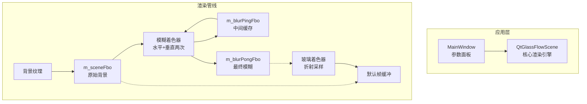
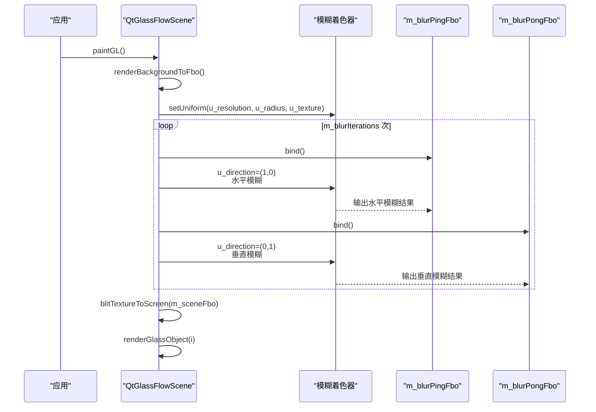
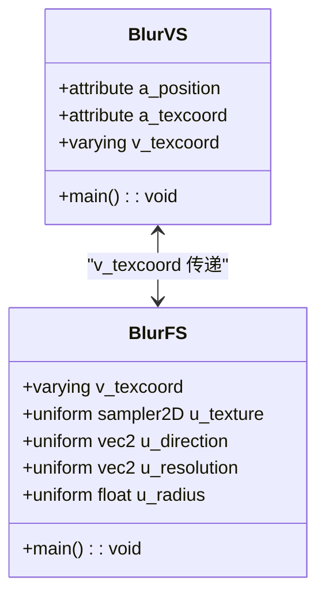
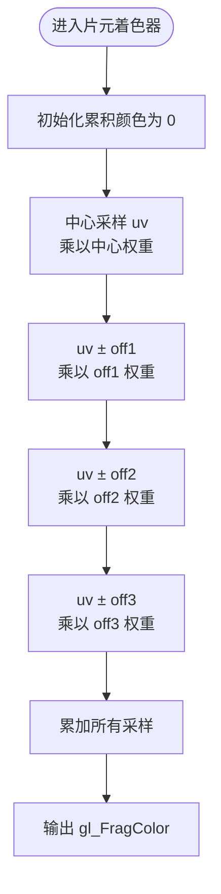
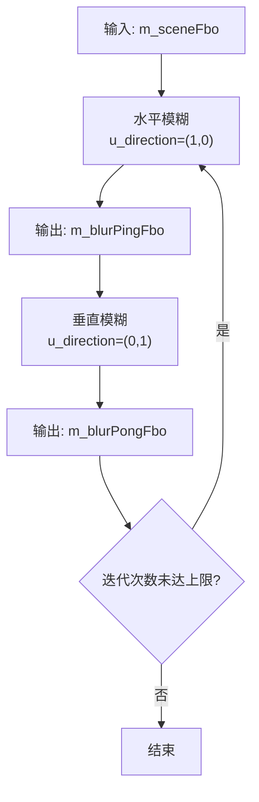
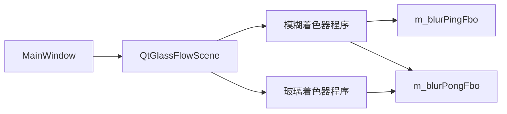

# 模糊着色器详解

<cite>
**本文档引用的文件**
- [blur_vertex.glsl](file://src/shaders/blur_vertex.glsl)
- [blur_fragment.glsl](file://src/shaders/blur_fragment.glsl)
- [scene_vertex.glsl](file://src/shaders/scene_vertex.glsl)
- [scene_fragment.glsl](file://src/shaders/scene_fragment.glsl)
- [qtglassflowscene.h](file://src/qtglassflowscene.h)
- [qtglassflowscene.cpp](file://src/qtglassflowscene.cpp)
- [mainwindow.h](file://demo/mainwindow.h)
- [mainwindow.cpp](file://demo/mainwindow.cpp)
- [README.md](file://README.md)
</cite>

## 目录
1. [简介](#简介)
2. [项目结构](#项目结构)
3. [核心组件](#核心组件)
4. [架构总览](#架构总览)
5. [详细组件分析](#详细组件分析)
6. [依赖关系分析](#依赖关系分析)
7. [性能考量](#性能考量)
8. [故障排查指南](#故障排查指南)
9. [结论](#结论)
10. [附录](#附录)

## 简介
本文件聚焦于液体玻璃效果中的屏幕空间高斯模糊实现，深入解析 blur_vertex.glsl 与 blur_fragment.glsl 的协作机制，阐述水平与垂直分离式模糊的实现原理、采样权重与卷积核设计、模糊半径对视觉与性能的影响，以及在折射背景采样中的应用策略。文档还提供数学推导与优化技巧，帮助开发者在 Qt + OpenGL 环境下高效实现高质量的屏幕空间模糊。

## 项目结构
该项目采用 Qt + OpenGL 的模块化组织方式，核心渲染逻辑位于 QtGlassFlowScene，着色器资源通过资源文件打包并在运行时加载。模糊处理作为独立的屏幕空间后处理步骤，与玻璃对象的折射采样形成前后处理链路。

图表来源
- [qtglassflowscene.cpp:510-566](file://src/qtglassflowscene.cpp#L510-L566)
- [qtglassflowscene.cpp:316-359](file://src/qtglassflowscene.cpp#L316-L359)
- [qtglassflowscene.cpp:520-536](file://src/qtglassflowscene.cpp#L520-L536)

章节来源
- [README.md:86-108](file://README.md#L86-L108)
- [qtglassflowscene.cpp:510-566](file://src/qtglassflowscene.cpp#L510-L566)

## 核心组件
- 模糊着色器对（blur_vertex.glsl + blur_fragment.glsl）：实现屏幕空间高斯模糊，采用水平+垂直分离式 1D 9 点核，支持多次迭代以提升质量并控制性能。
- 玻璃着色器对（scene_vertex.glsl + scene_fragment.glsl）：负责玻璃对象的 SDF 超椭圆形状、Smooth-union 桥接、折射 UV 变换、抗锯齿与材质细节，最终从模糊后的背景纹理采样。
- QtGlassFlowScene：管理 FBO 管线、编译着色器、驱动渲染循环、暴露参数接口（模糊半径、迭代次数等）。

章节来源
- [blur_vertex.glsl:1-9](file://src/shaders/blur_vertex.glsl#L1-L9)
- [blur_fragment.glsl:1-24](file://src/shaders/blur_fragment.glsl#L1-L24)
- [scene_fragment.glsl:1-149](file://src/shaders/scene_fragment.glsl#L1-L149)
- [qtglassflowscene.h:96-100](file://src/qtglassflowscene.h#L96-L100)
- [qtglassflowscene.cpp:203-214](file://src/qtglassflowscene.cpp#L203-L214)

## 架构总览
模糊处理在每帧渲染的早期阶段完成，先将背景纹理写入 m_sceneFbo，随后通过 runBlurPass() 对其进行多次 ping-pong 迭代的水平+垂直模糊，最终得到可被玻璃着色器用于折射采样的模糊背景纹理。

图表来源
- [qtglassflowscene.cpp:510-566](file://src/qtglassflowscene.cpp#L510-L566)
- [qtglassflowscene.cpp:316-359](file://src/qtglassflowscene.cpp#L316-L359)
- [qtglassflowscene.cpp:520-536](file://src/qtglassflowscene.cpp#L520-L536)

## 详细组件分析

### 模糊着色器对协作机制
- 顶点着色器：接收全屏四边形的顶点与纹理坐标，原样传递至片元着色器，不进行任何变换。
- 片元着色器：根据 u_direction 决定采样方向（水平或垂直），使用固定权重的 1D 高斯核对当前像素及其邻域进行线性组合，输出模糊颜色。

图表来源
- [blur_vertex.glsl:1-9](file://src/shaders/blur_vertex.glsl#L1-L9)
- [blur_fragment.glsl:1-24](file://src/shaders/blur_fragment.glsl#L1-L24)

章节来源
- [blur_vertex.glsl:1-9](file://src/shaders/blur_vertex.glsl#L1-L9)
- [blur_fragment.glsl:1-24](file://src/shaders/blur_fragment.glsl#L1-L24)

### 高斯模糊算法与卷积核设计
- 1D 高斯核：在水平或垂直方向上对 9 个采样点进行加权求和，权重来自预计算的高斯分布系数，中心权重最大，两侧递减。
- 采样偏移：off1、off2、off3 为不同距离的采样偏移，按 u_radius 缩放；偏移以像素为单位，通过除以 u_resolution 转换为纹理坐标增量。
- 固定权重：片元着色器中直接给出各采样点的权重，无需运行时计算，减少分支与浮点运算。

图表来源
- [blur_fragment.glsl:9-23](file://src/shaders/blur_fragment.glsl#L9-L23)

章节来源
- [blur_fragment.glsl:9-23](file://src/shaders/blur_fragment.glsl#L9-L23)

### 分离式水平/垂直模糊实现
- 水平模糊：u_direction=(1,0)，在 ping 缓冲中输出水平方向的 1D 模糊结果。
- 垂直模糊：u_direction=(0,1)，在 pong 缓冲中输出垂直方向的 1D 模糊结果。
- 多次迭代：通过 m_blurIterations 控制迭代次数，每次迭代读取上一次的结果纹理，实现等效更大半径的模糊，同时避免单次大核带来的性能压力。

图表来源
- [qtglassflowscene.cpp:334-355](file://src/qtglassflowscene.cpp#L334-L355)

章节来源
- [qtglassflowscene.cpp:316-359](file://src/qtglassflowscene.cpp#L316-L359)

### 模糊半径与视觉质量的关系
- 半径控制：u_radius 由 m_blurRadius 提供，直接影响采样偏移的像素距离与权重分布。
- 视觉影响：半径越大，边缘柔化越强，背景虚化效果越明显；但过大的半径会降低细节锐度。
- 性能权衡：半径增大通常意味着更大的卷积核或更多迭代次数，需结合 m_blurIterations 进行平衡。

章节来源
- [qtglassflowscene.cpp:323-327](file://src/qtglassflowscene.cpp#L323-L327)
- [qtglassflowscene.h:123-126](file://src/qtglassflowscene.h#L123-L126)

### 在液体玻璃效果中的应用场景
- 背景虚化：玻璃对象的折射采样基于模糊后的背景纹理，边缘的背景被拉伸变形，中心保持清晰，形成自然的虚化与聚焦效果。
- 边缘柔化：结合抗锯齿与边框线，模糊后的背景在玻璃边缘处提供更柔和的过渡，减少锯齿与硬边感。
- 材质一致性：模糊背景与玻璃材质的穹顶光照、色调混合等效果协同，增强整体的体积感与真实感。

章节来源
- [scene_fragment.glsl:118-147](file://src/shaders/scene_fragment.glsl#L118-L147)
- [qtglassflowscene.cpp:520-536](file://src/qtglassflowscene.cpp#L520-L536)

### 数学推导与优化技巧
- 高斯核权重：在屏幕空间中，1D 高斯核的权重通常来源于离散化后的标准高斯分布，此处采用预计算常量，避免运行时计算。
- 采样偏移：off1、off2、off3 为等距采样点的相对偏移，乘以 u_radius 实现半径缩放；偏移以像素为单位，除以 u_resolution 转换为纹理坐标增量，确保与分辨率无关。
- 优化策略：
  - 分离式 1D 核：水平+垂直两次 1D 采样等价于 2D 2D 高斯核，但显著减少采样次数。
  - 固定权重：避免运行时权重计算与归一化，减少分支与浮点运算。
  - 多次迭代：通过 ping-pong 交替缓冲，避免单次大核带来的内存与带宽压力。
  - 线性过滤：FBO 纹理设置为 GL_LINEAR，配合 1D 采样获得更平滑的结果。

章节来源
- [blur_fragment.glsl:12-21](file://src/shaders/blur_fragment.glsl#L12-L21)
- [qtglassflowscene.cpp:246-256](file://src/qtglassflowscene.cpp#L246-L256)

## 依赖关系分析
- QtGlassFlowScene 依赖模糊着色器程序与场景着色器程序，通过 setUniformValue 传递分辨率、半径、方向与纹理采样器。
- 玻璃着色器依赖模糊后的背景纹理进行折射采样，确保折射效果与背景虚化一致。
- 参数面板通过 MainWindow 将用户调整的模糊半径与迭代次数传递给 QtGlassFlowScene。

图表来源
- [qtglassflowscene.cpp:203-214](file://src/qtglassflowscene.cpp#L203-L214)
- [qtglassflowscene.cpp:316-359](file://src/qtglassflowscene.cpp#L316-L359)
- [mainwindow.cpp:131-141](file://demo/mainwindow.cpp#L131-L141)

章节来源
- [qtglassflowscene.h:96-100](file://src/qtglassflowscene.h#L96-L100)
- [qtglassflowscene.cpp:203-214](file://src/qtglassflowscene.cpp#L203-L214)
- [mainwindow.cpp:131-141](file://demo/mainwindow.cpp#L131-L141)

## 性能考量
- 采样次数：每次 1D 采样包含 9 个点，水平+垂直两次，总计 18 次采样；多次迭代进一步增加采样次数。
- 带宽与内存：使用 ping-pong FBO 交替存储中间结果，避免额外的临时纹理分配；线性过滤减少锯齿但可能带来轻微的模糊。
- 分辨率无关：通过 u_resolution 将像素偏移转换为纹理坐标增量，确保在不同分辨率下具有相同的视觉效果。
- 动态半径：u_radius 实时可调，建议在 UI 中提供步进与范围限制，避免极端值导致过度模糊或性能下降。

章节来源
- [blur_fragment.glsl:12-21](file://src/shaders/blur_fragment.glsl#L12-L21)
- [qtglassflowscene.cpp:323-327](file://src/qtglassflowscene.cpp#L323-L327)
- [qtglassflowscene.cpp:334-355](file://src/qtglassflowscene.cpp#L334-L355)

## 故障排查指南
- 模糊效果异常：
  - 检查 u_resolution 是否正确传入，确保偏移转换为正确的纹理坐标增量。
  - 确认 u_direction 在水平与垂直 pass 之间切换，避免方向错误导致的条纹。
  - 验证 u_radius 是否在合理范围内，过大可能导致过度模糊。
- 性能问题：
  - 适当降低 m_blurIterations 或 u_radius，减少采样次数。
  - 确保 FBO 纹理格式为 GL_RGBA8，避免不必要的精度损失。
- 视觉不一致：
  - 确认玻璃着色器从正确的模糊纹理采样（m_blurPongFbo）。
  - 检查渲染顺序：先模糊，再合成玻璃对象。

章节来源
- [qtglassflowscene.cpp:323-327](file://src/qtglassflowscene.cpp#L323-L327)
- [qtglassflowscene.cpp:334-355](file://src/qtglassflowscene.cpp#L334-L355)
- [qtglassflowscene.cpp:520-536](file://src/qtglassflowscene.cpp#L520-L536)

## 结论
本模糊着色器通过分离式 1D 高斯核与多次迭代，在保证视觉质量的同时兼顾性能，为液体玻璃效果提供了稳定的背景虚化与边缘柔化基础。结合 QtGlassFlowScene 的 FBO 管线与参数接口，开发者可以灵活调整模糊半径与迭代次数，实现从细腻到柔和的不同风格，满足不同场景下的视觉需求。

## 附录
- 参数接口与默认值：
  - setBlurRadius(float v)：设置模糊半径，默认值由 m_blurRadius 提供。
  - setBlurIterations(int v)：设置迭代次数，默认值由 m_blurIterations 提供。
- 示例调用路径：
  - 参数面板通过 MainWindow.applyParams() 调用 QtGlassFlowScene 的 setBlurRadius/setBlurIterations，驱动 runBlurPass() 的行为。

章节来源
- [qtglassflowscene.h:54-55](file://src/qtglassflowscene.h#L54-L55)
- [qtglassflowscene.h:123-126](file://src/qtglassflowscene.h#L123-L126)
- [mainwindow.cpp:131-141](file://demo/mainwindow.cpp#L131-L141)