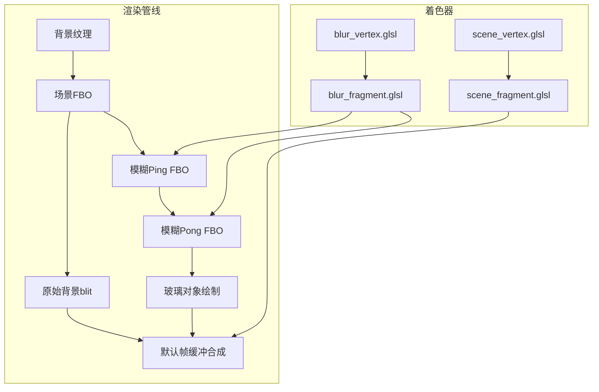
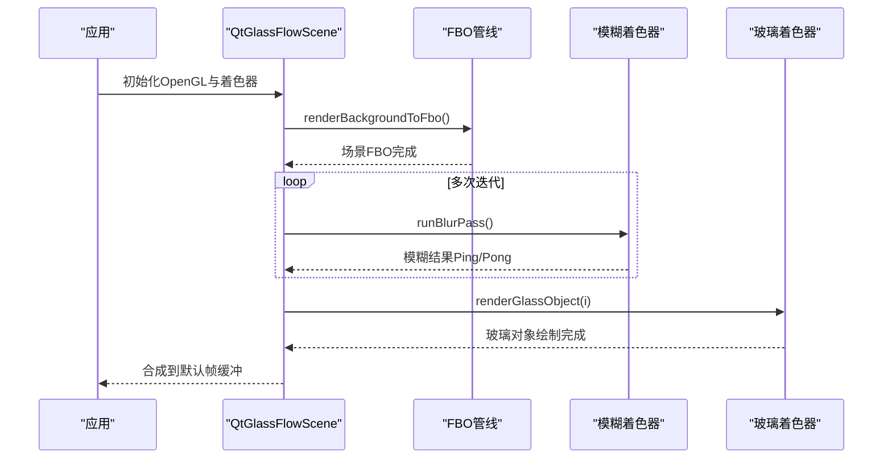
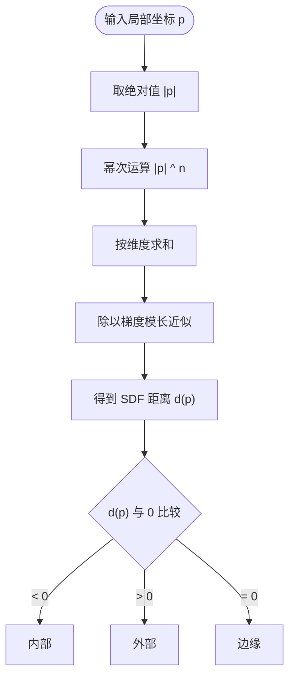
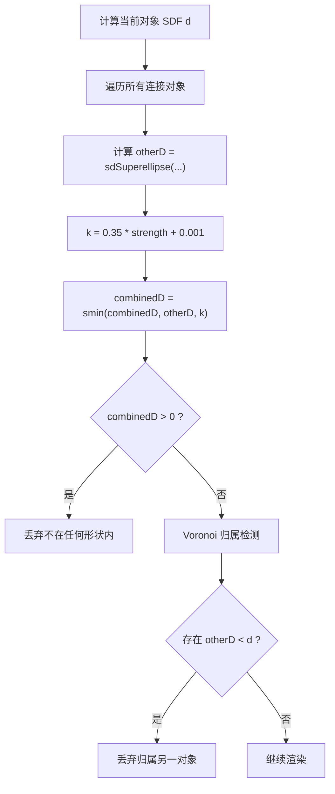
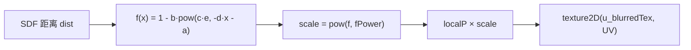
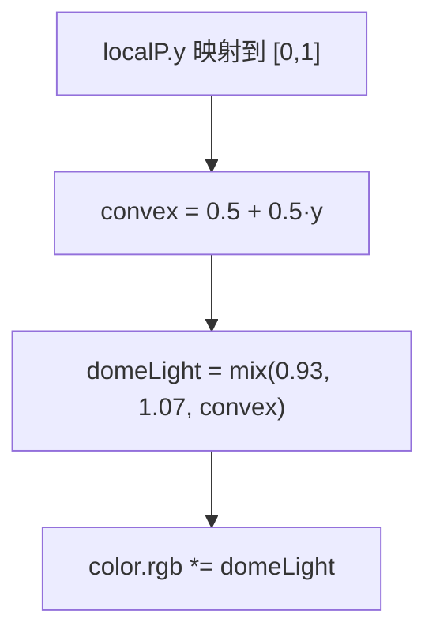
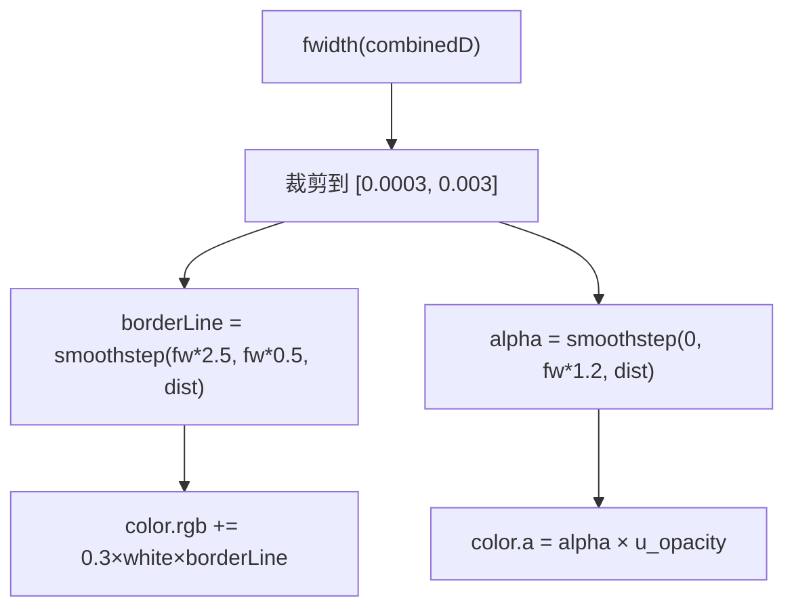
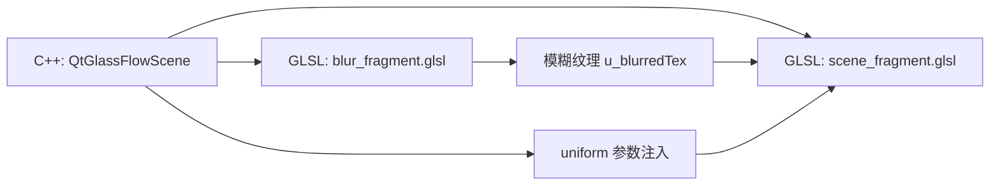

# 片段着色器详解

<cite>
**本文引用的文件**
- [scene_fragment.glsl](file://src/shaders/scene_fragment.glsl)
- [scene_vertex.glsl](file://src/shaders/scene_vertex.glsl)
- [blur_fragment.glsl](file://src/shaders/blur_fragment.glsl)
- [blur_vertex.glsl](file://src/shaders/blur_vertex.glsl)
- [qtglassflowscene.h](file://src/qtglassflowscene.h)
- [qtglassflowscene.cpp](file://src/qtglassflowscene.cpp)
- [main.cpp](file://demo/main.cpp)
- [README.md](file://README.md)
</cite>

## 目录
1. [简介](#简介)
2. [项目结构](#项目结构)
3. [核心组件](#核心组件)
4. [架构总览](#架构总览)
5. [详细组件分析](#详细组件分析)
6. [依赖关系分析](#依赖关系分析)
7. [性能考量](#性能考量)
8. [故障排查指南](#故障排查指南)
9. [结论](#结论)
10. [附录](#附录)

## 简介
本技术文档围绕液体玻璃效果的片段着色器展开，系统解析 scene_fragment.glsl 的核心算法实现，涵盖以下主题：
- SDF 超椭圆距离场的数学原理与 powerFactor 参数的作用机制
- smooth-union 粘性桥接算法的实现细节与参数控制
- 折射效果的计算过程，含基于法线偏移的背景采样与参数化指数衰减曲线
- 凸面穹顶光照模型的实现与亮度渐变原理
- 抗锯齿处理的实现细节，特别是基于 fwidth 的自适应边缘平滑
- 完整的着色器调试方法与性能优化策略

## 项目结构
该项目采用 Qt + OpenGL 的架构，渲染管线分为背景模糊与玻璃对象绘制两大阶段。核心文件组织如下：
- 着色器：scene_fragment.glsl、scene_vertex.glsl、blur_fragment.glsl、blur_vertex.glsl
- 渲染引擎：qtglassflowscene.h/.cpp（继承 QOpenGLWidget，管理 FBO、着色器、对象与连接）
- 示例应用：demo/main.cpp
- 文档与架构说明：README.md

图表来源
- [qtglassflowscene.cpp:510-536](file://src/qtglassflowscene.cpp#L510-L536)
- [blur_fragment.glsl:1-24](file://src/shaders/blur_fragment.glsl#L1-L24)
- [blur_vertex.glsl:1-9](file://src/shaders/blur_vertex.glsl#L1-L9)
- [scene_fragment.glsl:66-148](file://src/shaders/scene_fragment.glsl#L66-L148)
- [scene_vertex.glsl:1-9](file://src/shaders/scene_vertex.glsl#L1-L9)

章节来源
- [README.md:171-194](file://README.md#L171-L194)
- [qtglassflowscene.cpp:510-536](file://src/qtglassflowscene.cpp#L510-L536)

## 核心组件
- 背景与几何参数：u_blurredTex、u_resolution、u_objCenter、u_objHalfSize、u_powerFactor
- 折射参数：u_a、u_b、u_c、u_d、u_fPower
- 材质参数：u_noise、u_time
- Smooth-union 桥接：u_numConnections、u_connCenterB[]、u_connHalfSizeB[]、u_connPowerB[]、u_connStrength[]
- 液态玻璃控件：u_tintColor、u_tintStrength、u_opacity、u_rippleTime、u_rippleCenter、u_flowSpeed、u_deformAmount

章节来源
- [scene_fragment.glsl:5-36](file://src/shaders/scene_fragment.glsl#L5-L36)

## 架构总览
液体玻璃渲染的整体流程如下：
- 背景纹理 blit 到场景 FBO
- 多次分离式高斯模糊（水平+垂直）生成模糊背景作为折射采样源
- 对每个玻璃对象，使用全屏四边形绘制，片元着色器根据 SDF 距离场与桥接规则决定形状与材质
- 通过 alpha 混合将玻璃层合成到默认帧缓冲

图表来源
- [qtglassflowscene.cpp:510-536](file://src/qtglassflowscene.cpp#L510-L536)
- [qtglassflowscene.cpp:316-359](file://src/qtglassflowscene.cpp#L316-L359)
- [qtglassflowscene.cpp:394-476](file://src/qtglassflowscene.cpp#L394-L476)

## 详细组件分析

### SDF 超椭圆距离场与 powerFactor 参数
- 数学定义：SDF 将任意点到形状边缘的距离量化，内部为负、外部为正、边缘为零。超椭圆 SDF 通过 powerFactor 控制从圆角到方形的连续过渡。
- 实现要点：
  - 使用绝对值与幂次运算构造椭圆范数
  - 分母为梯度模长的近似，实现归一化，使距离与像素尺度一致
  - powerFactor 决定形状“圆度”，n 越大越接近方形
- 参数作用：
  - u_powerFactor 由对象或全局设置，影响形状边缘的锐利程度与圆润程度

图表来源
- [scene_fragment.glsl:41-48](file://src/shaders/scene_fragment.glsl#L41-L48)

章节来源
- [scene_fragment.glsl:41-48](file://src/shaders/scene_fragment.glsl#L41-L48)
- [README.md:215-232](file://README.md#L215-L232)

### smooth-union 粘性桥接算法
- 目标：在多个相邻形状之间产生平滑的液桥连接，避免硬边
- 数学公式：基于多项式平滑最小值函数，通过参数 k 控制融合带宽度
- 参数控制：
  - k = 0.35 × strength + 0.001，strength 由 C++ 侧基于对象间距动态计算
  - 最多支持 8 个连接（受 uniform 数组上限约束）

图表来源
- [scene_fragment.glsl:60-82](file://src/shaders/scene_fragment.glsl#L60-L82)
- [scene_fragment.glsl:87-95](file://src/shaders/scene_fragment.glsl#L87-L95)
- [qtglassflowscene.cpp:478-508](file://src/qtglassflowscene.cpp#L478-L508)

章节来源
- [scene_fragment.glsl:60-82](file://src/shaders/scene_fragment.glsl#L60-L82)
- [scene_fragment.glsl:87-95](file://src/shaders/scene_fragment.glsl#L87-L95)
- [README.md:234-284](file://README.md#L234-L284)
- [qtglassflowscene.cpp:478-508](file://src/qtglassflowscene.cpp#L478-L508)

### 折射效果与法线偏移背景采样
- 视觉本质：透过玻璃看到的背景发生形变，边缘拉伸、中心清晰
- 计算流程：
  - 基于 SDF 距离 dist，使用参数化指数衰减曲线 f(dist)
  - UV 坐标按 localP × pow(f(dist), fPower) 偏移，实现边缘向中心收缩
  - 采样模糊后的背景纹理 u_blurredTex，获得折射效果

图表来源
- [scene_fragment.glsl:50-53](file://src/shaders/scene_fragment.glsl#L50-L53)
- [scene_fragment.glsl:118-121](file://src/shaders/scene_fragment.glsl#L118-L121)
- [qtglassflowscene.cpp:416-420](file://src/qtglassflowscene.cpp#L416-L420)

章节来源
- [scene_fragment.glsl:50-53](file://src/shaders/scene_fragment.glsl#L50-L53)
- [scene_fragment.glsl:118-121](file://src/shaders/scene_fragment.glsl#L118-L121)
- [README.md:286-319](file://README.md#L286-L319)

### 凸面穹顶光照模型
- 实现思路：利用 y 坐标映射到亮度渐变，模拟玻璃球体顶部亮、底部暗的体积感
- 公式：convex = 0.5 + 0.5 × localP.y；domeLight = mix(0.93, 1.07, convex)
- 作用：对颜色进行乘性调制，增强立体感而不破坏整体色调

图表来源
- [scene_fragment.glsl:130-133](file://src/shaders/scene_fragment.glsl#L130-L133)
- [README.md:320-330](file://README.md#L320-L330)

章节来源
- [scene_fragment.glsl:130-133](file://src/shaders/scene_fragment.glsl#L130-L133)
- [README.md:320-330](file://README.md#L320-L330)

### 抗锯齿与极细边框线
- 自适应边缘平滑：使用 fwidth(combinedD) 计算相邻像素间的 SDF 变化量，作为 1 像素对应的 SDF 距离尺度
- 三段式处理：
  - fwidth 裁剪：限制范围避免在平滑过渡区发散
  - 极细边框线：在 2.5 像素到 0.5 像素区间内产生约 2 像素宽的亮线，强度 0.3
  - Alpha 抗锯齿：在 0 到 1.2 像素范围内做 alpha 渐变，实现分辨率无关的锐利边缘

图表来源
- [scene_fragment.glsl:139-145](file://src/shaders/scene_fragment.glsl#L139-L145)
- [README.md:332-365](file://README.md#L332-L365)

章节来源
- [scene_fragment.glsl:139-145](file://src/shaders/scene_fragment.glsl#L139-L145)
- [README.md:332-365](file://README.md#L332-L365)

### 材质与噪声
- 噪声：使用简单哈希噪声对采样颜色进行极低强度扰动，消除色带
- 色调混合：将玻璃色调柔和地混合到背景色，保留底层亮度结构
- 透明度：由 alpha 通道与全局 u_opacity 控制

章节来源
- [scene_fragment.glsl:125-137](file://src/shaders/scene_fragment.glsl#L125-L137)

### 动画与交互
- 按压涟漪：在交互时激活，基于时间与位置的正弦波与指数衰减叠加，产生柔和的波动
- 悬停流动：轻微的周期性扰动，提升交互反馈
- 参数传递：u_time、u_rippleTime、u_rippleCenter、u_flowSpeed、u_deformAmount

章节来源
- [scene_fragment.glsl:99-116](file://src/shaders/scene_fragment.glsl#L99-L116)
- [qtglassflowscene.cpp:421-431](file://src/qtglassflowscene.cpp#L421-L431)

## 依赖关系分析
- C++ 侧负责：
  - 管理 FBO 管线与着色器编译
  - 计算对象间连接强度并传入着色器
  - 将模糊后的纹理绑定为玻璃着色器的 u_blurredTex
- 着色器侧负责：
  - 依据 SDF 与 smooth-union 决定形状与桥接
  - 基于折射曲线与法线偏移进行背景采样
  - 实现抗锯齿与边框线

图表来源
- [qtglassflowscene.cpp:394-476](file://src/qtglassflowscene.cpp#L394-L476)
- [qtglassflowscene.cpp:316-359](file://src/qtglassflowscene.cpp#L316-L359)
- [scene_fragment.glsl:5-36](file://src/shaders/scene_fragment.glsl#L5-L36)

章节来源
- [qtglassflowscene.cpp:394-476](file://src/qtglassflowscene.cpp#L394-L476)
- [scene_fragment.glsl:5-36](file://src/shaders/scene_fragment.glsl#L5-L36)

## 性能考量
- 分离式高斯模糊：水平+垂直两次 1D 高斯核，支持多次迭代以等效更大半径且避免单次大核开销
- Ping-Pong 缓冲：减少内存占用并提高缓存命中
- uniform 数组上限：smooth-union 最多 8 个连接，避免过多 uniform 导致驱动限制
- fwidth 裁剪：防止在平滑过渡区出现过宽的边缘模糊
- alpha 混合：仅在玻璃对象绘制阶段启用，避免不必要的混合开销

章节来源
- [README.md:195-214](file://README.md#L195-L214)
- [README.md:332-365](file://README.md#L332-L365)
- [blur_fragment.glsl:12-21](file://src/shaders/blur_fragment.glsl#L12-L21)

## 故障排查指南
- 折射异常或过强/过弱：
  - 检查折射参数 a/b/c/d/fPower 是否合理
  - 调整 u_fPower 以改变非线性程度
- 桥接不出现或过粗：
  - 检查 u_numConnections 与 u_connStrength
  - 调整 m_attractionDist 以改变连接阈值
- 边缘锯齿明显：
  - 确认 fwidth 裁剪范围是否合适
  - 适当增大 u_noise 以缓解色带，但避免过度
- 透明度异常：
  - 检查 u_opacity 与 alpha 计算路径
- 性能下降：
  - 降低 m_blurIterations 或 m_blurRadius
  - 减少连接数量（<=8）

章节来源
- [scene_fragment.glsl:50-53](file://src/shaders/scene_fragment.glsl#L50-L53)
- [scene_fragment.glsl:60-82](file://src/shaders/scene_fragment.glsl#L60-L82)
- [scene_fragment.glsl:139-145](file://src/shaders/scene_fragment.glsl#L139-L145)
- [qtglassflowscene.cpp:416-420](file://src/qtglassflowscene.cpp#L416-L420)
- [qtglassflowscene.cpp:478-508](file://src/qtglassflowscene.cpp#L478-L508)

## 结论
本项目通过 SDF 超椭圆、smooth-union 桥接、参数化折射曲线、凸面穹顶光照与基于 fwidth 的抗锯齿，构建了高质量的液体玻璃效果。其架构清晰、参数可控，适合在 Qt + OpenGL 环境中集成与扩展。建议在实际工程中结合目标平台的性能预算，合理设置模糊迭代次数与连接数量，并通过参数面板进行可视化调试与优化。

## 附录
- 示例入口：demo/main.cpp
- 渲染管线与 API：README.md 中的架构与 API 简介
- 着色器兼容性：GLSL 120，OpenGL 2.1 兼容配置

章节来源
- [demo/main.cpp:1-16](file://demo/main.cpp#L1-L16)
- [README.md:110-170](file://README.md#L110-L170)