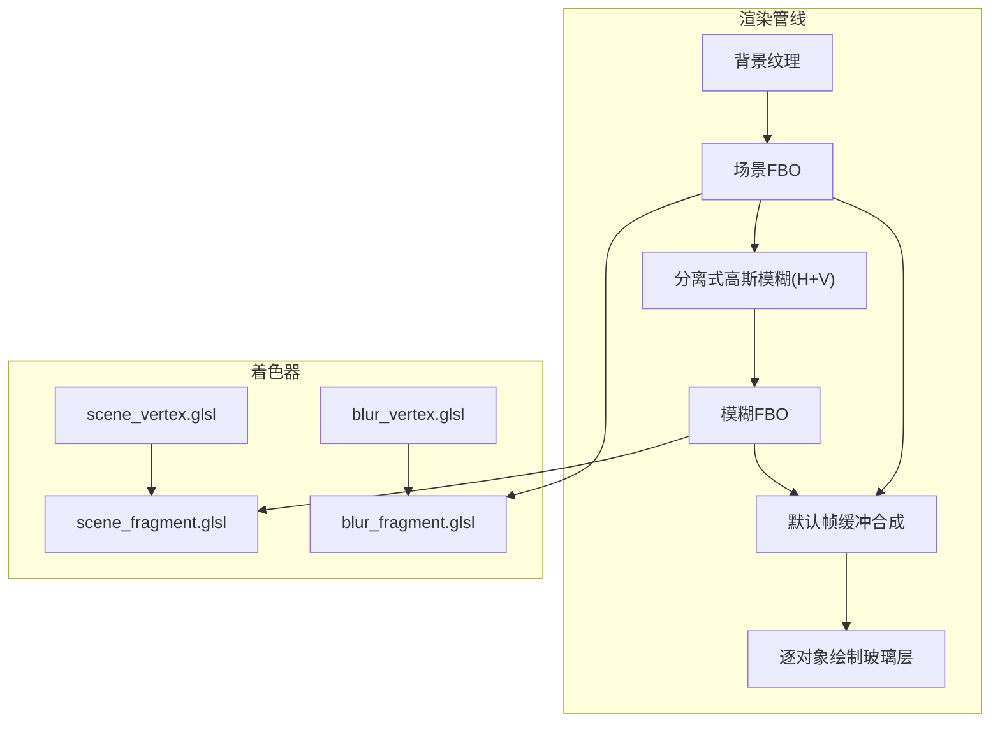
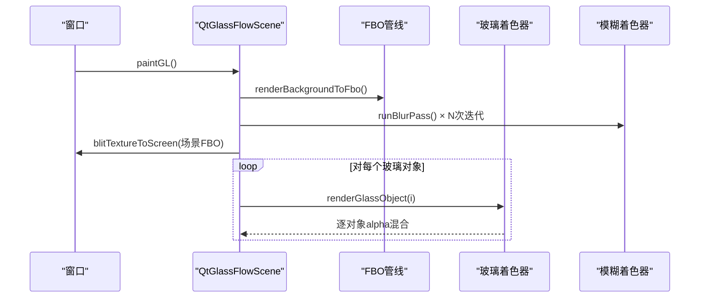
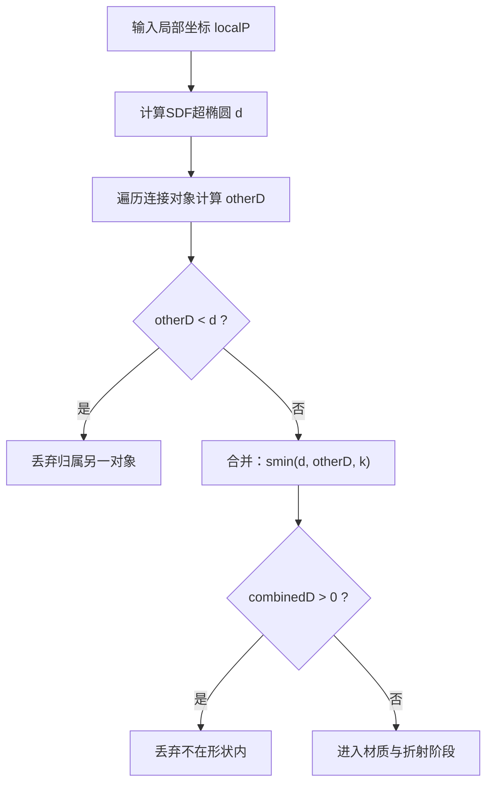
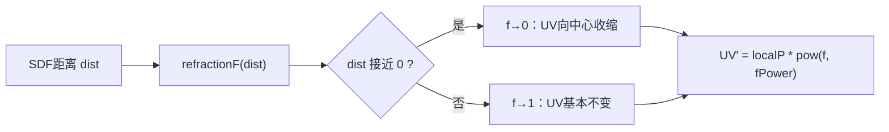
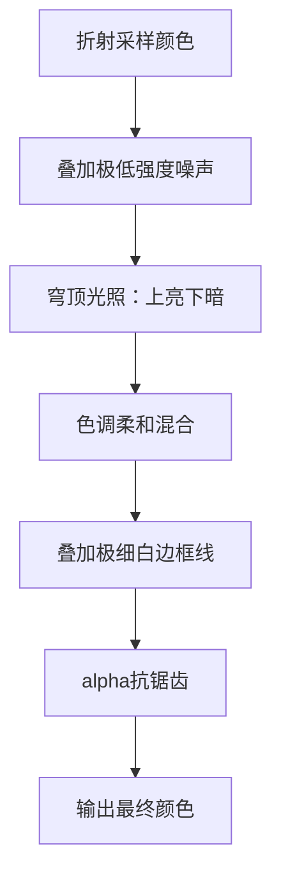
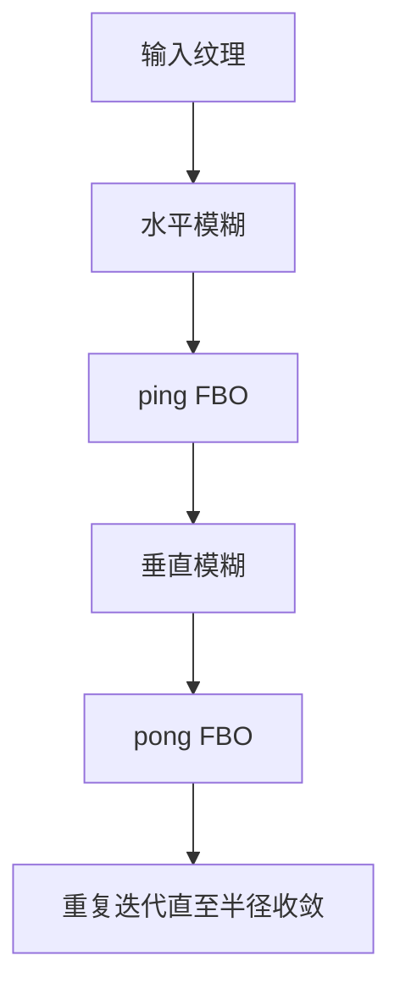
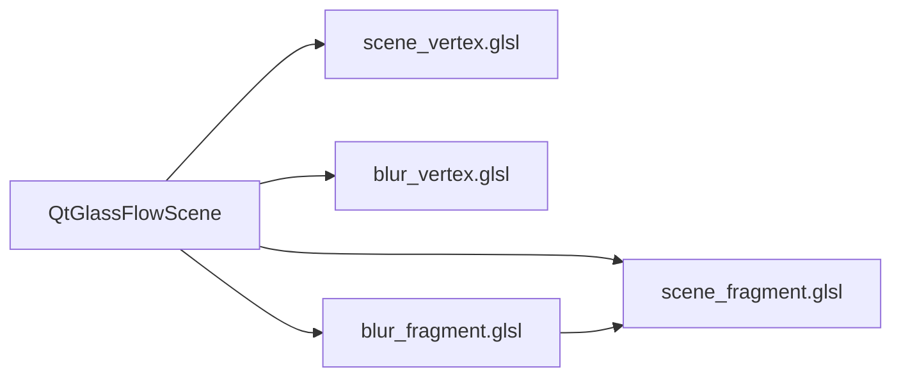

# 着色器编程详解

<cite>
**本文档引用的文件**
- [scene_vertex.glsl](file://src/shaders/scene_vertex.glsl)
- [scene_fragment.glsl](file://src/shaders/scene_fragment.glsl)
- [blur_vertex.glsl](file://src/shaders/blur_vertex.glsl)
- [blur_fragment.glsl](file://src/shaders/blur_fragment.glsl)
- [qtglassflowscene.cpp](file://src/qtglassflowscene.cpp)
- [qtglassflowscene.h](file://src/qtglassflowscene.h)
- [README.md](file://README.md)
</cite>

## 目录
1. [简介](#简介)
2. [项目结构](#项目结构)
3. [核心组件](#核心组件)
4. [架构总览](#架构总览)
5. [详细组件分析](#详细组件分析)
6. [依赖关系分析](#依赖关系分析)
7. [性能考量](#性能考量)
8. [故障排查指南](#故障排查指南)
9. [结论](#结论)
10. [附录](#附录)

## 简介
本技术文档围绕液体玻璃效果的着色器程序展开，系统解析四个GLSL着色器文件的实现原理与算法细节。重点涵盖：
- 顶点着色器中的几何变换与UV坐标传递
- 片段着色器中的SDF超椭圆距离场、smooth-union粘性桥接、折射效果、抗锯齿与材质细节
- SDF数学原理与分母归一化的物理意义
- 折射模型的指数衰减曲线推导与参数化解释
- 凸面穹顶光照与亮度渐变算法
- 调试技巧与性能优化建议

## 项目结构
该项目基于Qt + OpenGL，采用分离式高斯模糊管线与全屏四边形渲染，实现背景模糊后对玻璃对象进行折射采样与材质合成。着色器文件位于src/shaders目录，核心渲染逻辑在C++侧的QtGlassFlowScene中组织。

图表来源
- [qtglassflowscene.cpp:316-359](file://src/qtglassflowscene.cpp#L316-L359)
- [scene_fragment.glsl:118-122](file://src/shaders/scene_fragment.glsl#L118-L122)
- [blur_fragment.glsl:9-23](file://src/shaders/blur_fragment.glsl#L9-L23)

章节来源
- [README.md:171-194](file://README.md#L171-L194)
- [qtglassflowscene.cpp:510-536](file://src/qtglassflowscene.cpp#L510-L536)

## 核心组件
- 场景顶点着色器：将顶点位置映射到NDC，传递UV至片元着色器
- 场景片元着色器：构建SDF超椭圆、执行smooth-union桥接、计算折射UV、应用材质与抗锯齿
- 模糊顶点着色器：全屏四边形顶点与UV
- 模糊片元着色器：分离式高斯模糊（水平+垂直），支持多次迭代

章节来源
- [scene_vertex.glsl:1-9](file://src/shaders/scene_vertex.glsl#L1-L9)
- [scene_fragment.glsl:1-149](file://src/shaders/scene_fragment.glsl#L1-L149)
- [blur_vertex.glsl:1-9](file://src/shaders/blur_vertex.glsl#L1-L9)
- [blur_fragment.glsl:1-24](file://src/shaders/blur_fragment.glsl#L1-L24)

## 架构总览
液体玻璃渲染的关键在于“背景先模糊，再对玻璃对象进行折射采样”。C++侧负责：
- 初始化OpenGL与着色器
- 创建FBO并完成背景到场景FBO的blit
- 多次迭代的分离式高斯模糊（ping-pong）
- 逐对象绘制玻璃层，使用模糊后的背景作为折射采样源

图表来源
- [qtglassflowscene.cpp:510-536](file://src/qtglassflowscene.cpp#L510-L536)
- [qtglassflowscene.cpp:316-359](file://src/qtglassflowscene.cpp#L316-L359)
- [qtglassflowscene.cpp:394-476](file://src/qtglassflowscene.cpp#L394-L476)

## 详细组件分析

### 顶点着色器：几何变换与UV传递
- 输入属性：位置与UV
- 输出：gl_Position为NDC坐标，varying v_texcoord传递UV
- 用途：为全屏四边形提供NDC顶点与纹理坐标，供片元着色器使用

章节来源
- [scene_vertex.glsl:1-9](file://src/shaders/scene_vertex.glsl#L1-L9)
- [blur_vertex.glsl:1-9](file://src/shaders/blur_vertex.glsl#L1-L9)

### 片段着色器：SDF超椭圆与smooth-union桥接
- SDF超椭圆距离场
  - 数学形式：基于符号距离场的定义，结合分母梯度归一化，使距离值与像素尺度一致
  - 归一化作用：确保抗锯齿过渡带与桥接宽度控制精确到像素级
- smooth-union粘性桥接
  - 使用多项式平滑最小值函数，控制融合带宽度与凹陷效果
  - 连接强度由C++侧根据对象间距动态计算，支持最多8个连接

图表来源
- [scene_fragment.glsl:72-95](file://src/shaders/scene_fragment.glsl#L72-L95)
- [scene_fragment.glsl:60-64](file://src/shaders/scene_fragment.glsl#L60-L64)

章节来源
- [scene_fragment.glsl:40-48](file://src/shaders/scene_fragment.glsl#L40-L48)
- [scene_fragment.glsl:60-64](file://src/shaders/scene_fragment.glsl#L60-L64)
- [scene_fragment.glsl:74-95](file://src/shaders/scene_fragment.glsl#L74-L95)

### 折射效果：指数衰减曲线与UV变形
- 折射强度曲线：基于参数化指数衰减，控制边缘到中心的非线性收缩
- UV变形：根据SDF距离对localP进行幂次变换，边缘向中心收缩，中心保持不变
- 参数物理意义：
  - a：水平偏移，决定折射从边缘多深开始生效
  - b：强度系数，越大边缘扭曲越剧烈
  - c：指数底数，影响曲线陡峭程度
  - d：衰减速率，越大折射越集中在边缘薄层
  - fPower：整体幂次放大器，增强非线性

图表来源
- [scene_fragment.glsl:50-53](file://src/shaders/scene_fragment.glsl#L50-L53)
- [scene_fragment.glsl:118-121](file://src/shaders/scene_fragment.glsl#L118-L121)

章节来源
- [scene_fragment.glsl:50-53](file://src/shaders/scene_fragment.glsl#L50-L53)
- [scene_fragment.glsl:118-121](file://src/shaders/scene_fragment.glsl#L118-L121)
- [README.md:286-319](file://README.md#L286-L319)

### 材质与光照：噪声、穹顶光照、边框与抗锯齿
- 噪声：使用简单哈希噪声，极低强度叠加，消除色带
- 凸面穹顶光照：基于localP.y的线性渐变，模拟顶部亮、底部暗的体积感
- 边框线：基于fwidth的亚像素宽度，叠加约30%白色，模拟边缘反光
- 抗锯齿：基于fwidth的alpha渐变，实现分辨率无关的锐利边缘

图表来源
- [scene_fragment.glsl:125-145](file://src/shaders/scene_fragment.glsl#L125-L145)
- [README.md:320-366](file://README.md#L320-L366)

章节来源
- [scene_fragment.glsl:55-58](file://src/shaders/scene_fragment.glsl#L55-L58)
- [scene_fragment.glsl:130-136](file://src/shaders/scene_fragment.glsl#L130-L136)
- [scene_fragment.glsl:138-145](file://src/shaders/scene_fragment.glsl#L138-L145)

### 模糊着色器：分离式高斯模糊
- 水平+垂直两阶段，每阶段一次1D 9抽头高斯核
- 支持多次迭代，实现更大半径的模糊，避免单次大核的性能开销
- ping-pong交替缓冲，减少内存占用

图表来源
- [blur_fragment.glsl:9-23](file://src/shaders/blur_fragment.glsl#L9-L23)
- [qtglassflowscene.cpp:316-359](file://src/qtglassflowscene.cpp#L316-L359)

章节来源
- [blur_fragment.glsl:1-24](file://src/shaders/blur_fragment.glsl#L1-L24)
- [qtglassflowscene.cpp:316-359](file://src/qtglassflowscene.cpp#L316-L359)

## 依赖关系分析
- C++侧QtGlassFlowScene负责：
  - 着色器编译与绑定
  - FBO创建与纹理参数设置
  - 背景纹理加载与blit
  - 分离式高斯模糊的ping-pong迭代
  - 逐对象渲染玻璃层并设置uniform
- 着色器侧：
  - scene_fragment.glsl依赖blur_fragment.glsl提供的模糊背景纹理
  - 通过uniform数组传递连接对象的中心、半尺寸、幂与强度

图表来源
- [qtglassflowscene.cpp:203-214](file://src/qtglassflowscene.cpp#L203-L214)
- [qtglassflowscene.cpp:316-359](file://src/qtglassflowscene.cpp#L316-L359)
- [qtglassflowscene.cpp:394-476](file://src/qtglassflowscene.cpp#L394-L476)

章节来源
- [qtglassflowscene.cpp:203-214](file://src/qtglassflowscene.cpp#L203-L214)
- [qtglassflowscene.cpp:394-476](file://src/qtglassflowscene.cpp#L394-L476)

## 性能考量
- 分离式高斯模糊：水平+垂直两次1D卷积，复杂度O(N)，支持多次迭代实现大半径模糊
- smooth-union：最多8个连接，循环内计算SDF与smin，注意连接数量与fwidth稳定性
- fwidth clamping：避免在smooth-union过渡区出现不稳定梯度，提升抗锯齿稳定性
- ping-pong FBO：减少内存占用，提高缓存命中率
- uniform数组上限：连接数量受GLSL 120 uniform数组限制，需控制并发连接数

章节来源
- [README.md:195-214](file://README.md#L195-L214)
- [scene_fragment.glsl:8-27](file://src/shaders/scene_fragment.glsl#L8-L27)
- [scene_fragment.glsl:38-38](file://src/shaders/scene_fragment.glsl#L38-L38)

## 故障排查指南
- 折射异常或过强/过弱
  - 检查折射参数a、b、c、d与fPower的组合，确认边缘到中心的非线性分布符合预期
  - 参考参数化指数衰减曲线的物理意义
- 桥接不出现或桥过粗/过细
  - 检查连接强度计算与k系数（0.35×strength+0.001），以及对象间距与attractionDist
  - 确认smooth-union循环与Voronoi归属判定未误判像素归属
- 抗锯齿抖动或边缘过宽/过窄
  - 检查fwidth的clamping范围（0.0003~0.003），避免在梯度突变区域产生光晕
  - 调整alpha过渡带宽度（fw×1.2）与边框线宽度（fw×0.5）
- 边框过亮或过暗
  - 调整边框叠加强度（0.3）与穹顶光照的增亮/压暗比例（0.93~1.07）
- 噪声导致色带
  - 降低噪声强度（u_noise），确保叠加极低强度噪声

章节来源
- [scene_fragment.glsl:50-53](file://src/shaders/scene_fragment.glsl#L50-L53)
- [scene_fragment.glsl:60-64](file://src/shaders/scene_fragment.glsl#L60-L64)
- [scene_fragment.glsl:88-95](file://src/shaders/scene_fragment.glsl#L88-L95)
- [scene_fragment.glsl:138-145](file://src/shaders/scene_fragment.glsl#L138-L145)
- [README.md:332-366](file://README.md#L332-L366)

## 结论
该液体玻璃效果通过SDF超椭圆与smooth-union桥接实现连续液面，结合分离式高斯模糊与参数化指数衰减的折射模型，营造出边缘扭曲、中心清晰的真实玻璃质感。配合穹顶光照与亚像素抗锯齿，实现了高质量且性能可控的实时渲染。理解SDF数学原理、折射曲线与fwidth抗锯齿机制，有助于进一步定制与优化效果。

## 附录
- GLSL 120兼容性：使用内置导数函数与attribute/varying语法，兼容OpenGL 2.1兼容配置文件
- 交互与动画：C++侧提供拖拽、悬停、涟漪与流动扰动等交互效果，统一在片元着色器中合成

章节来源
- [README.md:367-373](file://README.md#L367-L373)
- [qtglassflowscene.cpp:587-667](file://src/qtglassflowscene.cpp#L587-L667)