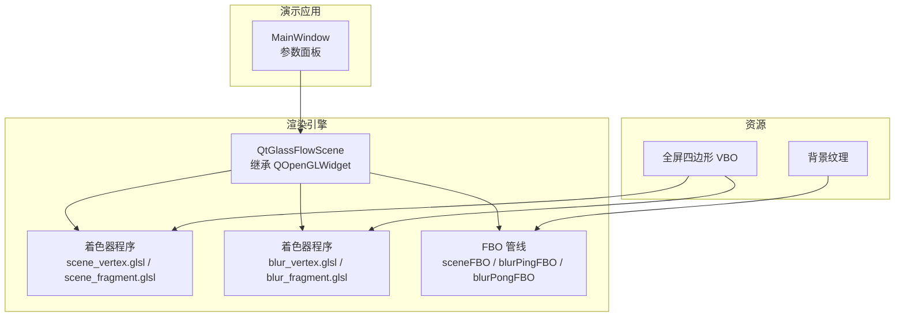
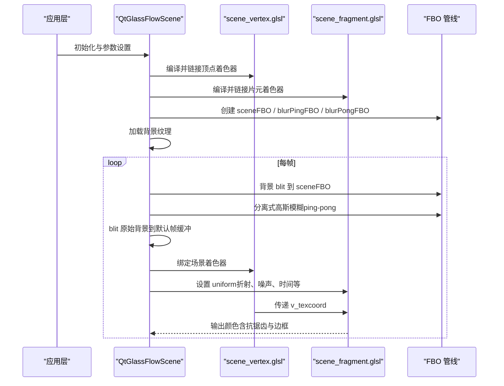
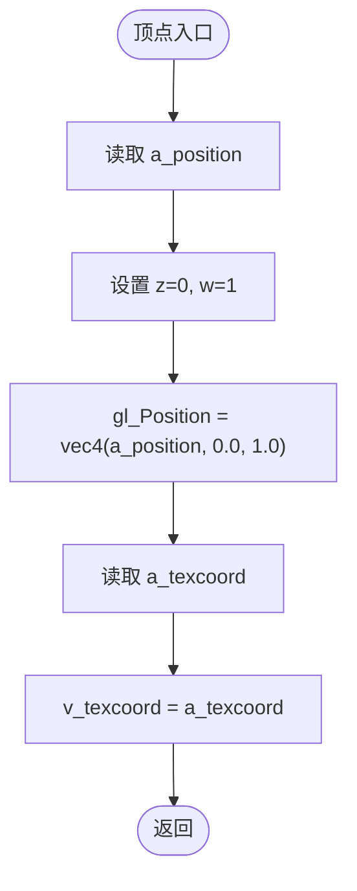
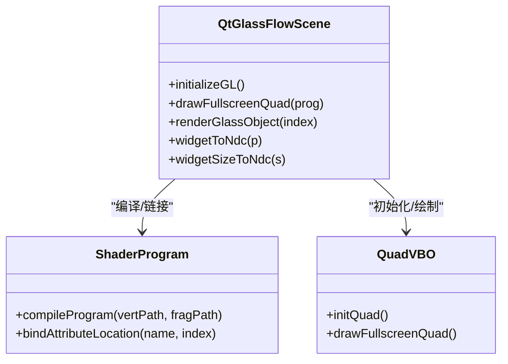
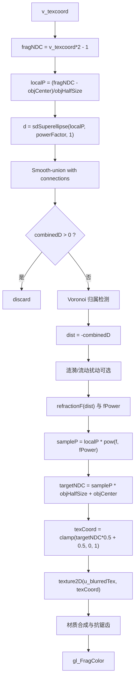
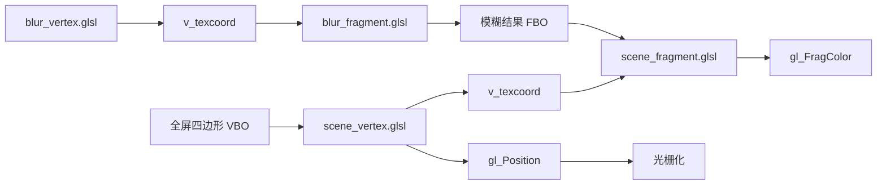

# 顶点着色器详解

<cite>
**本文档引用的文件**
- [scene_vertex.glsl](file://src/shaders/scene_vertex.glsl)
- [scene_fragment.glsl](file://src/shaders/scene_fragment.glsl)
- [blur_vertex.glsl](file://src/shaders/blur_vertex.glsl)
- [blur_fragment.glsl](file://src/shaders/blur_fragment.glsl)
- [qtglassflowscene.h](file://src/qtglassflowscene.h)
- [qtglassflowscene.cpp](file://src/qtglassflowscene.cpp)
- [mainwindow.h](file://demo/mainwindow.h)
- [mainwindow.cpp](file://demo/mainwindow.cpp)
- [README.md](file://README.md)
</cite>

## 目录
1. [简介](#简介)
2. [项目结构](#项目结构)
3. [核心组件](#核心组件)
4. [架构总览](#架构总览)
5. [详细组件分析](#详细组件分析)
6. [依赖关系分析](#依赖关系分析)
7. [性能考量](#性能考量)
8. [故障排查指南](#故障排查指南)
9. [结论](#结论)

## 简介
本文件针对液体玻璃效果中的顶点着色器实现进行深入技术解析，重点围绕 scene_vertex.glsl 的设计与工作原理展开。我们将详细说明顶点属性输入（a_position、a_texcoord）的用途与数据格式，解释标准化设备坐标（NDC）转换过程以及 gl_Position 的设置方式，并阐述 v_texcoord 的传递机制。同时，结合整体渲染管线，说明该简单顶点着色器如何通过最少的计算实现高效的屏幕空间渲染，最后提供调试技巧与性能优化建议，帮助开发者理解 OpenGL 顶点处理流水线的工作原理。

## 项目结构
该项目采用 Qt + OpenGL 的组合架构，核心渲染逻辑位于 QtGlassFlowScene 中，顶点着色器与片元着色器分别定义在独立的 GLSL 文件中。演示应用通过 MainWindow 创建场景并提供参数面板进行实时调节。

图表来源
- [qtglassflowscene.cpp:187-225](file://src/qtglassflowscene.cpp#L187-L225)
- [qtglassflowscene.cpp:138-157](file://src/qtglassflowscene.cpp#L138-L157)
- [qtglassflowscene.cpp:159-185](file://src/qtglassflowscene.cpp#L159-L185)

章节来源
- [README.md:86-108](file://README.md#L86-L108)
- [qtglassflowscene.h:17-142](file://src/qtglassflowscene.h#L17-L142)
- [qtglassflowscene.cpp:187-225](file://src/qtglassflowscene.cpp#L187-L225)

## 核心组件
- 顶点着色器 scene_vertex.glsl：负责将顶点位置与纹理坐标从对象空间映射到标准化设备坐标，并将纹理坐标传递给片元着色器。
- 片元着色器 scene_fragment.glsl：在屏幕空间内根据 SDF 超椭圆、Smooth-union 桥接、折射模型、材质与抗锯齿等算法生成最终颜色。
- 顶点着色器 blur_vertex.glsl：与场景顶点着色器相同，用于全屏模糊 pass 的顶点处理。
- QtGlassFlowScene：管理着色器编译、全屏四边形 VBO 初始化、FBO 管线、背景纹理加载与渲染调度。

章节来源
- [scene_vertex.glsl:1-9](file://src/shaders/scene_vertex.glsl#L1-L9)
- [scene_fragment.glsl:1-149](file://src/shaders/scene_fragment.glsl#L1-L149)
- [blur_vertex.glsl:1-9](file://src/shaders/blur_vertex.glsl#L1-L9)
- [qtglassflowscene.cpp:138-157](file://src/qtglassflowscene.cpp#L138-L157)

## 架构总览
液体玻璃渲染采用“背景模糊 + 屏幕空间折射 + SDF 几何 + 平滑桥接 + 抗锯齿”的完整管线。顶点着色器在其中承担“全屏四边形顶点变换”的职责，将顶点数据直接映射到 NDC，随后片元着色器完成复杂的几何与材质计算。

图表来源
- [qtglassflowscene.cpp:510-566](file://src/qtglassflowscene.cpp#L510-L566)
- [qtglassflowscene.cpp:316-359](file://src/qtglassflowscene.cpp#L316-L359)
- [qtglassflowscene.cpp:293-314](file://src/qtglassflowscene.cpp#L293-L314)

## 详细组件分析

### 顶点着色器 scene_vertex.glsl 解析
- 版本与属性
  - 使用 GLSL 120，声明两个 attribute：a_position（顶点位置）、a_texcoord（纹理坐标）。
  - 声明 varying v_texcoord，用于向片元着色器传递纹理坐标。
- 顶点变换与 NDC 映射
  - 将 a_position 扩展为 vec4 并设置 z=0、w=1，得到 gl_Position = vec4(a_position, 0.0, 1.0)。
  - 这一步将顶点从对象空间直接映射到标准化设备坐标（NDC），省去了投影矩阵与视图矩阵的计算，适用于全屏四边形。
- 纹理坐标传递
  - v_texcoord = a_texcoord，将顶点的纹理坐标原样传递给片元着色器，供片元着色器进行背景采样与折射计算。
- 设计理念
  - 该顶点着色器极其精简，仅完成必要的 NDC 转换与纹理坐标传递，最大化减少顶点阶段的计算开销，将复杂逻辑全部下沉到片元着色器，实现高效的屏幕空间渲染。

图表来源
- [scene_vertex.glsl:5-8](file://src/shaders/scene_vertex.glsl#L5-L8)

章节来源
- [scene_vertex.glsl:1-9](file://src/shaders/scene_vertex.glsl#L1-L9)

### 顶点属性输入详解
- a_position
  - 数据类型：vec2，表示顶点在 NDC 空间中的 xy 坐标。
  - 数据格式：-1.0 到 1.0 的范围，对应屏幕左下角到右上角的标准化设备坐标。
  - 用途：作为全屏四边形的顶点位置，配合顶点数组或顶点缓冲对象（VBO）传入。
- a_texcoord
  - 数据类型：vec2，表示与顶点对应的纹理坐标（UV）。
  - 数据格式：0.0 到 1.0 的范围，对应纹理的左下角到右上角。
  - 用途：用于片元着色器对背景纹理进行采样，实现折射与材质效果。

章节来源
- [qtglassflowscene.cpp:38-47](file://src/qtglassflowscene.cpp#L38-L47)
- [qtglassflowscene.cpp:171-185](file://src/qtglassflowscene.cpp#L171-L185)

### 标准化设备坐标转换过程
- NDC 范围
  - 顶点着色器将 a_position 直接映射到 [-1, 1] × [-1, 1] 的 NDC 范围，与 OpenGL 默认的 NDC 一致。
- gl_Position 设置
  - 通过 gl_Position = vec4(a_position, 0.0, 1.0) 实现，z=0、w=1 的设置确保顶点位于近平面且不参与透视除法。
- 与全屏四边形的关系
  - 该设置与全屏四边形的顶点布局（-1/-1, 1/-1, 1/1, -1/1 的三角形条带）完美匹配，保证片元着色器能覆盖整个屏幕。

章节来源
- [scene_vertex.glsl:6](file://src/shaders/scene_vertex.glsl#L6)
- [qtglassflowscene.cpp:38-47](file://src/qtglassflowscene.cpp#L38-L47)

### v_texcoord 传递机制
- 传递路径
  - 顶点阶段：v_texcoord = a_texcoord。
  - 片元阶段：v_texcoord 作为 varying 输入，用于背景纹理采样与折射 UV 计算。
- 与片元着色器的协作
  - 片元着色器将 v_texcoord 从 NDC 转换回目标对象的局部坐标系，再进行 SDF 计算与 Smooth-union 桥接，最终得到折射后的采样坐标。

章节来源
- [scene_vertex.glsl:7](file://src/shaders/scene_vertex.glsl#L7)
- [scene_fragment.glsl:66-121](file://src/shaders/scene_fragment.glsl#L66-L121)

### 与 QtGlassFlowScene 的集成
- VBO 初始化
  - 使用静态顶点数组定义全屏四边形的顶点与纹理坐标，绑定到 a_position（前 2 个浮点）与 a_texcoord（后 2 个浮点），步长为 4×float。
- 着色器绑定
  - 通过 bindAttributeLocation 将 a_position 绑定到位置 0，a_texcoord 绑定到位置 1，确保与 VBO 数据布局一致。
- 渲染调用
  - drawFullscreenQuad 统一调用 glDrawArrays(GL_TRIANGLES, 0, 6)，渲染两个三角形组成的全屏四边形。

图表来源
- [qtglassflowscene.cpp:138-157](file://src/qtglassflowscene.cpp#L138-L157)
- [qtglassflowscene.cpp:159-185](file://src/qtglassflowscene.cpp#L159-L185)
- [qtglassflowscene.cpp:373-392](file://src/qtglassflowscene.cpp#L373-L392)

章节来源
- [qtglassflowscene.cpp:138-157](file://src/qtglassflowscene.cpp#L138-L157)
- [qtglassflowscene.cpp:159-185](file://src/qtglassflowscene.cpp#L159-L185)
- [qtglassflowscene.cpp:373-392](file://src/qtglassflowscene.cpp#L373-L392)

### 片元着色器中的坐标转换与折射
- 从 v_texcoord 到 NDC
  - 片元着色器将 v_texcoord 从 [0,1] 映射到 [-1,1]，得到 fragNDC。
- 对象局部坐标系
  - 通过对象中心与半尺寸（NDC 空间）将 fragNDC 转换为对象局部坐标 localP。
- SDF 与 Smooth-union
  - 计算对象的 SDF 值，并与连接对象的 SDF 值进行 Smooth-union，实现粘性桥接。
- 折射 UV 计算
  - 基于 SDF 距离 dist 与折射曲线 f(dist)，计算折射后的采样坐标 targetNDC，再转换为纹理坐标 texCoord。
- 材质与抗锯齿
  - 结合模糊背景、穹顶光照、色调混合、极细边框与 alpha 抗锯齿，生成最终颜色。

图表来源
- [scene_fragment.glsl:66-147](file://src/shaders/scene_fragment.glsl#L66-L147)

章节来源
- [scene_fragment.glsl:66-147](file://src/shaders/scene_fragment.glsl#L66-L147)

### 与模糊管线的对比
- blur_vertex.glsl
  - 与 scene_vertex.glsl 完全一致，同样将顶点映射到 NDC 并传递纹理坐标。
- blur_fragment.glsl
  - 使用高斯核对输入纹理进行分离式模糊，水平与垂直两次 pass 实现高质量模糊，支持多次迭代以增大等效半径。
- 集成方式
  - QtGlassFlowScene 在 runBlurPass 中交替使用 ping/pong FBO，将模糊结果作为折射采样的输入纹理。

章节来源
- [blur_vertex.glsl:1-9](file://src/shaders/blur_vertex.glsl#L1-L9)
- [blur_fragment.glsl:1-24](file://src/shaders/blur_fragment.glsl#L1-L24)
- [qtglassflowscene.cpp:316-359](file://src/qtglassflowscene.cpp#L316-L359)

## 依赖关系分析
- 顶点着色器依赖
  - 顶点属性 a_position 与 a_texcoord 的布局必须与 VBO 数据一致。
  - 着色器程序需正确绑定 attribute 位置（0 与 1）。
- 片元着色器依赖
  - 依赖来自顶点着色器的 v_texcoord。
  - 依赖场景统一变量（如 u_blurredTex、u_objCenter、u_objHalfSize、u_powerFactor 等）。
- 渲染管线依赖
  - 全屏四边形 VBO 提供顶点与纹理坐标。
  - FBO 管线提供模糊后的背景纹理作为折射采样源。

图表来源
- [scene_vertex.glsl:2-8](file://src/shaders/scene_vertex.glsl#L2-L8)
- [scene_fragment.glsl:2](file://src/shaders/scene_fragment.glsl#L2)
- [blur_vertex.glsl:2-8](file://src/shaders/blur_vertex.glsl#L2-L8)
- [blur_fragment.glsl:2](file://src/shaders/blur_fragment.glsl#L2)

章节来源
- [qtglassflowscene.cpp:138-157](file://src/qtglassflowscene.cpp#L138-L157)
- [qtglassflowscene.cpp:159-185](file://src/qtglassflowscene.cpp#L159-L185)

## 性能考量
- 顶点阶段最小化
  - 仅进行 NDC 映射与纹理坐标传递，避免投影与视图矩阵计算，显著降低顶点阶段开销。
- 屏幕空间渲染优势
  - 全屏四边形覆盖整个屏幕，片元着色器一次性完成复杂几何与材质计算，避免多 pass 的几何阶段重复计算。
- 抗锯齿与边框
  - 使用 fwidth 自适应边缘宽度，确保在不同分辨率下保持锐利边缘，避免过度模糊。
- 模糊管线优化
  - 分离式高斯模糊（水平+垂直）与 ping-pong FBO 交替，支持多次迭代以获得更大半径，同时保持单次 pass 的低开销。
- 统一变量与数组
  - 片元着色器使用固定大小数组（最多 8 个连接）限制 uniform 数量，避免超出硬件限制。

章节来源
- [README.md:332-366](file://README.md#L332-L366)
- [qtglassflowscene.cpp:316-359](file://src/qtglassflowscene.cpp#L316-L359)

## 故障排查指南
- 顶点坐标异常
  - 症状：画面空白或全黑。
  - 排查：确认 a_position 是否在 [-1,1] 范围内；检查 VBO 步长与 attribute 布局是否与着色器一致。
- 纹理采样错误
  - 症状：折射区域出现拉伸或错位。
  - 排查：检查 v_texcoord 是否正确传递；确认片元着色器中从 NDC 到对象局部坐标的转换是否使用正确的中心与半尺寸。
- 折射效果不明显
  - 症状：边缘无明显扭曲。
  - 排查：调整折射参数（a、b、c、d、fPower）；确认 u_blurredTex 是否正确绑定至模糊结果 FBO。
- 抗锯齿不锐利
  - 症状：边缘模糊或锯齿明显。
  - 排查：检查 fwidth 的 clamp 范围；确认 smoothstep 的边界参数与 dist 的关系。
- 性能问题
  - 症状：帧率下降。
  - 排查：减少模糊迭代次数；降低模糊半径；减少连接数量；避免不必要的 uniform 更新。

章节来源
- [scene_vertex.glsl:5-8](file://src/shaders/scene_vertex.glsl#L5-L8)
- [scene_fragment.glsl:66-147](file://src/shaders/scene_fragment.glsl#L66-L147)
- [qtglassflowscene.cpp:410-476](file://src/qtglassflowscene.cpp#L410-L476)

## 结论
scene_vertex.glsl 通过极简的顶点处理实现了高效的屏幕空间渲染：将全屏四边形的顶点直接映射到 NDC，并将纹理坐标传递给片元着色器，使复杂的几何与材质计算集中在片元阶段完成。结合 QtGlassFlowScene 的 FBO 管线与参数化折射模型，该设计在保证视觉质量的同时实现了良好的性能表现。开发者可通过理解顶点阶段的职责与数据流，快速定位问题并进行针对性优化。