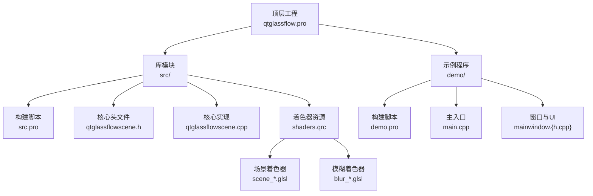
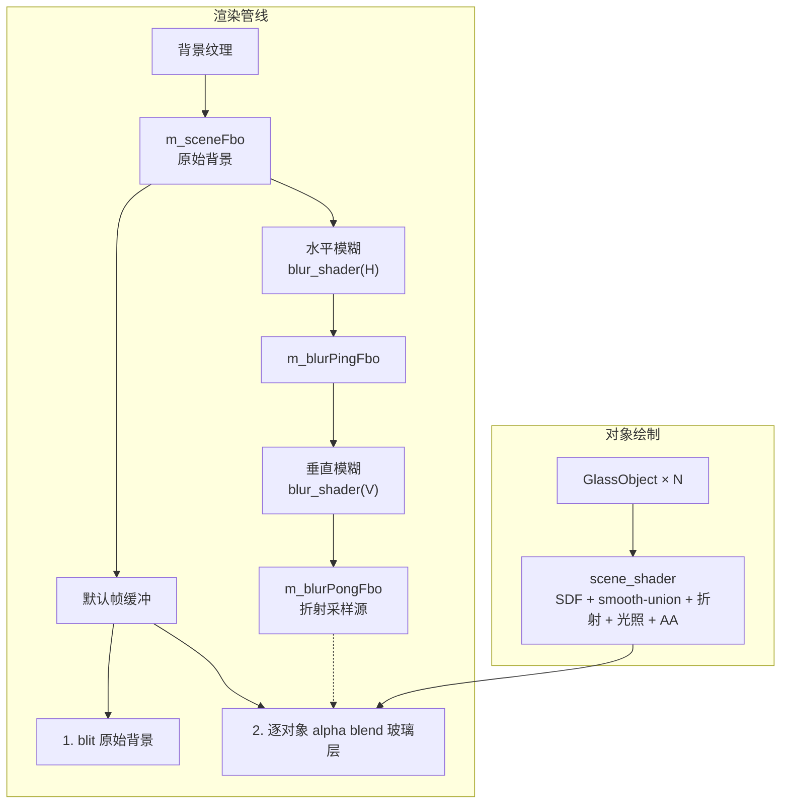
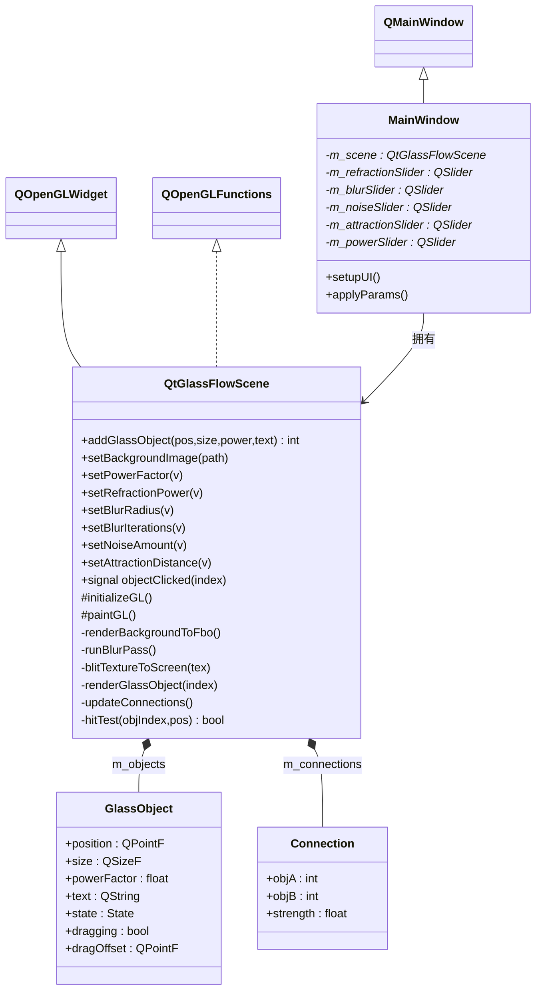
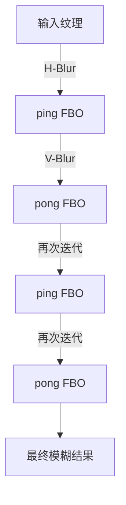
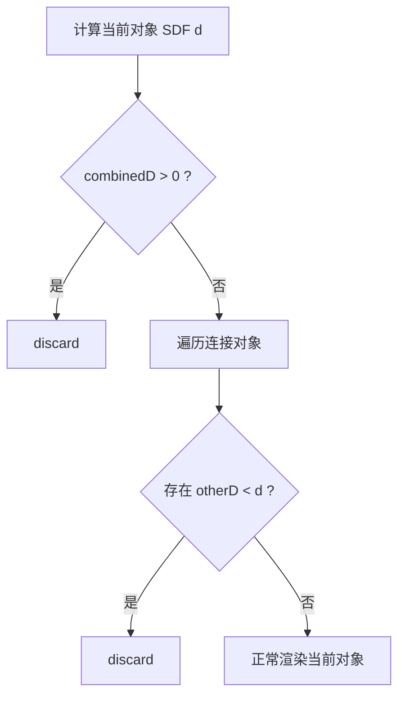
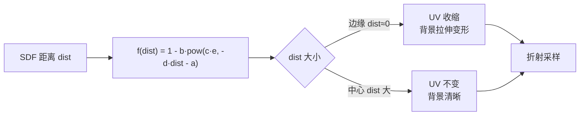
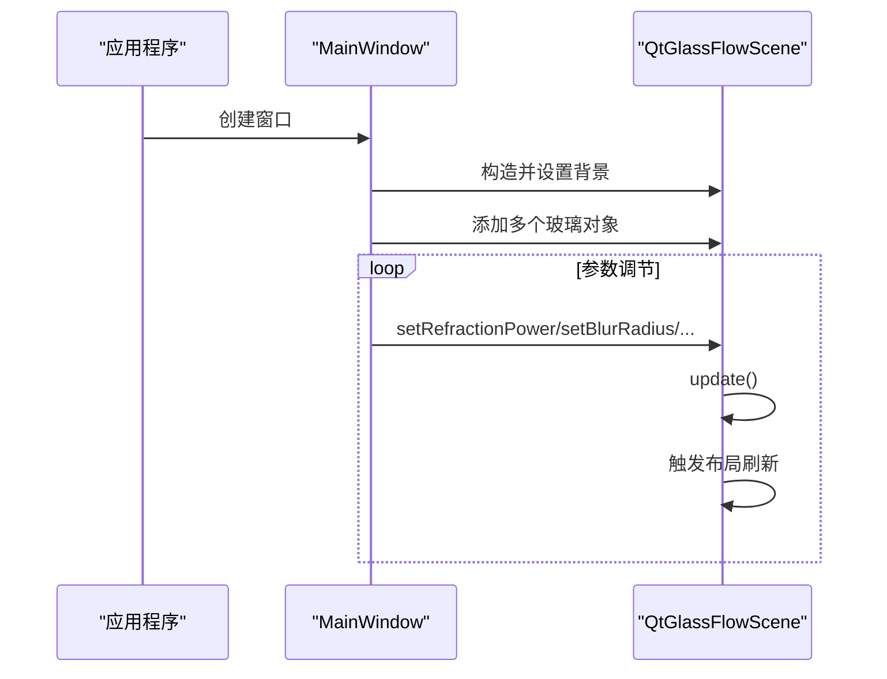
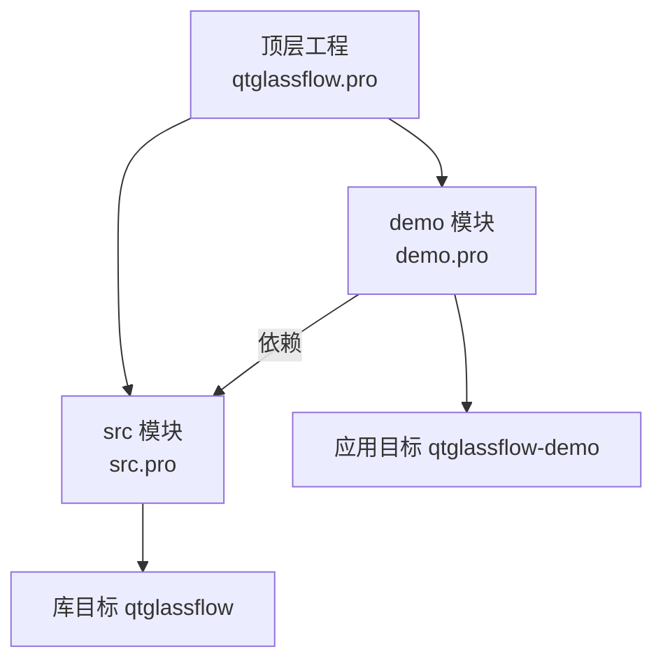

# 示例与最佳实践

<cite>
**本文引用的文件**
- [README.md](file://README.md)
- [qtglassflow.pro](file://qtglassflow.pro)
- [src.pro](file://src/src.pro)
- [demo.pro](file://demo/demo.pro)
- [qtglassflowscene.h](file://src/qtglassflowscene.h)
- [qtglassflowscene.cpp](file://src/qtglassflowscene.cpp)
- [scene_vertex.glsl](file://src/shaders/scene_vertex.glsl)
- [scene_fragment.glsl](file://src/shaders/scene_fragment.glsl)
- [blur_vertex.glsl](file://src/shaders/blur_vertex.glsl)
- [blur_fragment.glsl](file://src/shaders/blur_fragment.glsl)
- [mainwindow.h](file://demo/mainwindow.h)
- [mainwindow.cpp](file://demo/mainwindow.cpp)
- [main.cpp](file://demo/main.cpp)
- [changelog](file://debian/changelog)
</cite>

## 目录
1. [简介](#简介)
2. [项目结构](#项目结构)
3. [核心组件](#核心组件)
4. [架构总览](#架构总览)
5. [详细组件分析](#详细组件分析)
6. [依赖关系分析](#依赖关系分析)
7. [性能考量](#性能考量)
8. [故障排查指南](#故障排查指南)
9. [结论](#结论)
10. [附录](#附录)

## 简介
本项目提供基于 Qt + OpenGL 的液态玻璃效果渲染库，可在普通 QWidget 程序中实时渲染具备折射、模糊、噪声与粘性桥接的 SDF 超椭圆玻璃对象。其核心能力包括：
- SDF 超椭圆形状与 smooth-union 粘性桥接
- 背景折射采样与凸面穹顶光照
- 极细白色边框与像素级抗锯齿
- 实时参数调节与交互拖拽

项目同时提供完整示例程序与 Debian 打包配置，便于快速集成与部署。

## 项目结构
仓库采用子目录组织方式，顶层通过 subdirs 管理模块划分：
- 顶层工程：qtglassflow.pro
- 库模块：src（库目标 qtglassflow，含头文件、源文件与着色器资源）
- 示例程序：demo（应用目标 qtglassflow-demo，演示参数面板与交互）

图表来源
- [qtglassflow.pro:1-4](file://qtglassflow.pro#L1-L4)
- [src.pro:1-15](file://src/src.pro#L1-L15)
- [demo.pro:1-14](file://demo/demo.pro#L1-L14)

章节来源
- [qtglassflow.pro:1-4](file://qtglassflow.pro#L1-L4)
- [src.pro:1-15](file://src/src.pro#L1-L15)
- [demo.pro:1-14](file://demo/demo.pro#L1-L14)

## 核心组件
- QtGlassFlowScene（继承自 QOpenGLWidget）：核心渲染引擎，负责初始化 OpenGL、管理 FBO 管线、编译着色器、对象拖拽交互、连接检测与每帧渲染调度。
- GlassObject：单个玻璃对象数据结构，包含位置、尺寸、超椭圆幂、文本标签、交互状态与拖拽偏移。
- Connection：两个对象之间的粘性连接信息，包含两端索引与连接强度（由间距动态计算）。
- MainWindow：示例窗口，包含参数滑块面板，实时调节全局渲染参数并反馈到 QtGlassFlowScene。

章节来源
- [qtglassflowscene.h:17-139](file://src/qtglassflowscene.h#L17-L139)
- [mainwindow.h:10-29](file://demo/mainwindow.h#L10-L29)

## 架构总览
系统采用“背景模糊 + 多对象逐对象绘制”的渲染管线，结合 SDF 超椭圆与 smooth-union 实现液态桥接，最终通过 alpha 混合合成到屏幕。

图表来源
- [qtglassflowscene.cpp:187-200](file://src/qtglassflowscene.cpp#L187-L200)
- [qtglassflowscene.cpp:80-85](file://src/qtglassflowscene.cpp#L80-L85)
- [blur_fragment.glsl:9-23](file://src/shaders/blur_fragment.glsl#L9-L23)
- [scene_fragment.glsl:66-148](file://src/shaders/scene_fragment.glsl#L66-L148)

## 详细组件分析

### QtGlassFlowScene 类与渲染流程
- 初始化：设置 OpenGL 上下文格式（Compatibility Profile 2.1）、禁用深度测试与背面剔除、创建并链接着色器程序、准备全屏四边形 VBO。
- 生命周期：析构时释放 FBO、纹理与着色器资源，确保无泄漏。
- 渲染调度：每帧依次执行背景 blit、分离式高斯模糊（ping-pong）、屏幕 blit 与逐对象绘制。
- 交互：鼠标事件驱动悬停与拖拽，更新对象状态并触发布局刷新。

图表来源
- [qtglassflowscene.h:17-139](file://src/qtglassflowscene.h#L17-L139)
- [mainwindow.h:10-29](file://demo/mainwindow.h#L10-L29)

章节来源
- [qtglassflowscene.cpp:51-104](file://src/qtglassflowscene.cpp#L51-L104)
- [qtglassflowscene.cpp:187-200](file://src/qtglassflowscene.cpp#L187-L200)
- [qtglassflowscene.cpp:80-85](file://src/qtglassflowscene.cpp#L80-L85)

### 分离式高斯模糊算法
- 采用水平 + 垂直两阶段 pass，每阶段使用 1D 9-tap 高斯核，支持多次迭代以实现更大半径且避免单次大核的性能开销。
- 迭代在 ping-pong FBO 之间切换，半径由 m_blurRadius 控制，可实时调节。

图表来源
- [blur_fragment.glsl:9-23](file://src/shaders/blur_fragment.glsl#L9-L23)
- [qtglassflowscene.cpp:80-85](file://src/qtglassflowscene.cpp#L80-L85)

章节来源
- [blur_fragment.glsl:1-24](file://src/shaders/blur_fragment.glsl#L1-L24)
- [qtglassflowscene.cpp:134](file://src/qtglassflowscene.cpp#L134)

### SDF 超椭圆与 smooth-union 桥接
- SDF 超椭圆：基于符号距离场，支持通过 powerFactor 在圆角到方形之间连续过渡。
- smooth-union：使用多项式平滑最小值函数，在对象接近时产生液桥效果，桥宽由连接强度与经验系数共同决定。
- Voronoi 归属：确保每个像素仅由最近对象负责渲染，避免 alpha 混合导致的亮度累积失真。

图表来源
- [scene_fragment.glsl:66-95](file://src/shaders/scene_fragment.glsl#L66-L95)

章节来源
- [scene_fragment.glsl:40-64](file://src/shaders/scene_fragment.glsl#L40-L64)
- [scene_fragment.glsl:66-95](file://src/shaders/scene_fragment.glsl#L66-L95)

### 折射模型与材质细节
- 折射：基于指数衰减曲线对背景采样坐标进行 UV 变形，边缘向中心收缩，中心保持清晰。
- 光照：使用线性渐变模拟穹顶光照，底部略暗、顶部略亮，增强体积感。
- 边框与抗锯齿：通过 fwidth 计算亚像素级过渡带，结合极细边框线与 alpha 抗锯齿，实现锐利边缘。
- 噪声：加入极低强度哈希噪声，消除色带并保持自然观感。

图表来源
- [scene_fragment.glsl:50-58](file://src/shaders/scene_fragment.glsl#L50-L58)
- [scene_fragment.glsl:118-121](file://src/shaders/scene_fragment.glsl#L118-L121)
- [scene_fragment.glsl:130-145](file://src/shaders/scene_fragment.glsl#L130-L145)

章节来源
- [scene_fragment.glsl:118-148](file://src/shaders/scene_fragment.glsl#L118-L148)

### 示例程序与参数面板
- 主窗口 MainWindow：左侧嵌入 QtGlassFlowScene，右侧提供参数滑块面板，实时调整折射强度、模糊半径、噪声量、吸引距离与超椭圆幂。
- 示例初始化：加载背景图片，添加四个可拖拽玻璃对象，展示粘性桥接与交互效果。

图表来源
- [mainwindow.cpp:43-56](file://demo/mainwindow.cpp#L43-L56)
- [mainwindow.cpp:131-141](file://demo/mainwindow.cpp#L131-L141)
- [qtglassflowscene.cpp:119-136](file://src/qtglassflowscene.cpp#L119-L136)

章节来源
- [mainwindow.cpp:33-129](file://demo/mainwindow.cpp#L33-L129)
- [main.cpp:4-15](file://demo/main.cpp#L4-L15)

## 依赖关系分析
- 构建依赖：demo 依赖 src，确保先构建库再构建示例。
- 运行时依赖：Qt5.12+（core/gui/widgets/opengl），OpenGL 2.1（GLSL 120）。
- 头文件与库：示例通过 INCLUDEPATH 与 LIBS 引用库头文件与静态/动态库。

图表来源
- [qtglassflow.pro:1-4](file://qtglassflow.pro#L1-L4)
- [src.pro:1-15](file://src/src.pro#L1-L15)
- [demo.pro:1-14](file://demo/demo.pro#L1-L14)

章节来源
- [qtglassflow.pro:1-4](file://qtglassflow.pro#L1-L4)
- [src.pro:4-8](file://src/src.pro#L4-L8)
- [demo.pro:3-7](file://demo/demo.pro#L3-L7)

## 性能考量
- 渲染管线优化
  - 分离式高斯模糊：水平+垂直两次 1D 9-tap 核，支持多次迭代，平衡半径与性能。
  - Ping-pong FBO：减少单次大核带来的带宽与计算压力。
  - Alpha 混合顺序：先 blit 原始背景，再逐对象 alpha blend，避免重复绘制。
- 着色器与几何
  - 全屏四边形 VBO：一次性分配，避免每帧重建。
  - SDF 计算与 smooth-union：在片元着色器内完成，避免额外几何开销。
- 交互与动画
  - 涟漪与流动：仅在交互时启用，幅度极小，避免显著性能损耗。
- 参数调节
  - 模糊半径与迭代次数：实时可调，建议根据分辨率与帧率动态调整。
  - 折射强度与噪声量：过高的噪声会增加采样抖动，应适度控制。

章节来源
- [qtglassflowscene.cpp:159-185](file://src/qtglassflowscene.cpp#L159-L185)
- [blur_fragment.glsl:9-23](file://src/shaders/blur_fragment.glsl#L9-L23)
- [scene_fragment.glsl:118-148](file://src/shaders/scene_fragment.glsl#L118-L148)

## 故障排查指南
- OpenGL 上下文与格式
  - 若出现渲染异常，检查 QSurfaceFormat 是否设置为 Compatibility Profile 2.1。
- 资源加载与清理
  - 确保在析构中释放 FBO、纹理与着色器，避免内存泄漏。
- 背景纹理
  - 调用 setBackgroundImage 后需标记脏状态并触发更新。
- 着色器编译
  - 编译失败时查看日志输出，确认着色器路径与 GLSL 版本兼容。
- 交互行为
  - 拖拽与悬停状态需正确更新，避免状态错乱导致视觉异常。

章节来源
- [qtglassflowscene.cpp:51-104](file://src/qtglassflowscene.cpp#L51-L104)
- [qtglassflowscene.cpp:119-136](file://src/qtglassflowscene.cpp#L119-L136)
- [qtglassflowscene.cpp:138-157](file://src/qtglassflowscene.cpp#L138-L157)

## 结论
本项目提供了完整的液态玻璃效果实现与示例程序，涵盖从基础用法到高级定制的关键技术点。通过合理的渲染管线设计与参数调节，可在桌面 UI、游戏界面等多种场景中获得高质量的玻璃材质表现。建议在集成时遵循本文的项目结构与最佳实践，确保性能与稳定性。

## 附录

### 快速集成步骤
- 使用 pkg-config 或 qmake 直接引用库头文件与库文件。
- 在代码中包含头文件并创建 QtGlassFlowScene 实例，设置背景图片与添加玻璃对象。
- 通过参数接口实时调节折射强度、模糊半径、噪声量、吸引距离与超椭圆幂。

章节来源
- [README.md:45-70](file://README.md#L45-L70)

### 项目配置与打包
- 顶层工程：使用 subdirs 管理模块依赖。
- 库安装：头文件与库文件安装到标准路径，便于 pkg-config 与 qmake 引用。
- Debian 打包：生成运行时库、开发头文件与示例程序三个包。

章节来源
- [qtglassflow.pro:1-4](file://qtglassflow.pro#L1-L4)
- [src.pro:11-14](file://src/src.pro#L11-L14)
- [changelog:1-9](file://debian/changelog#L1-L9)