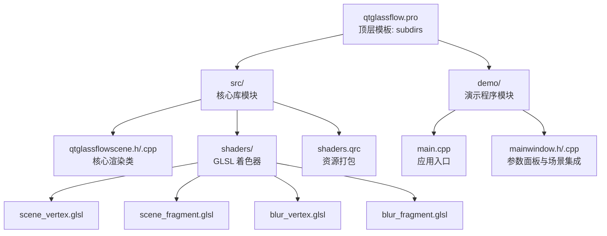
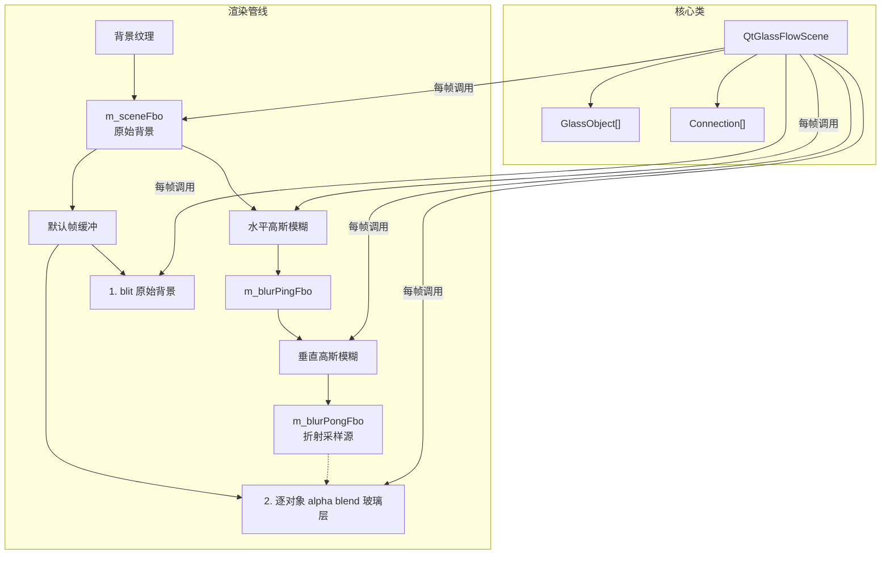
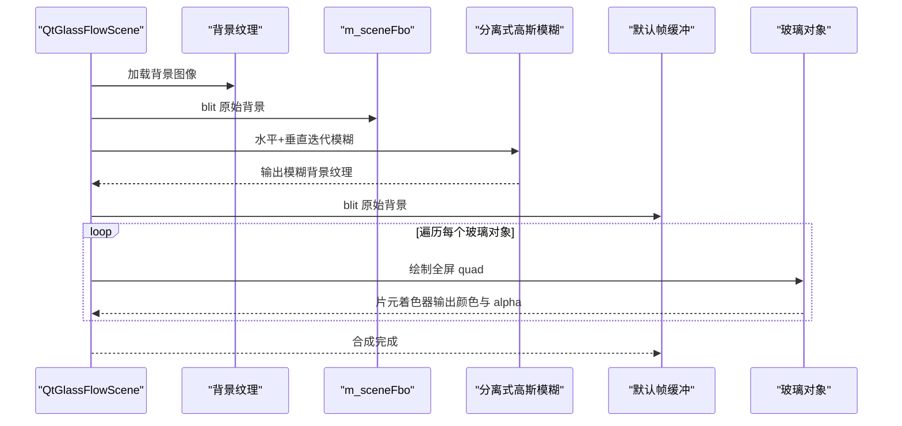
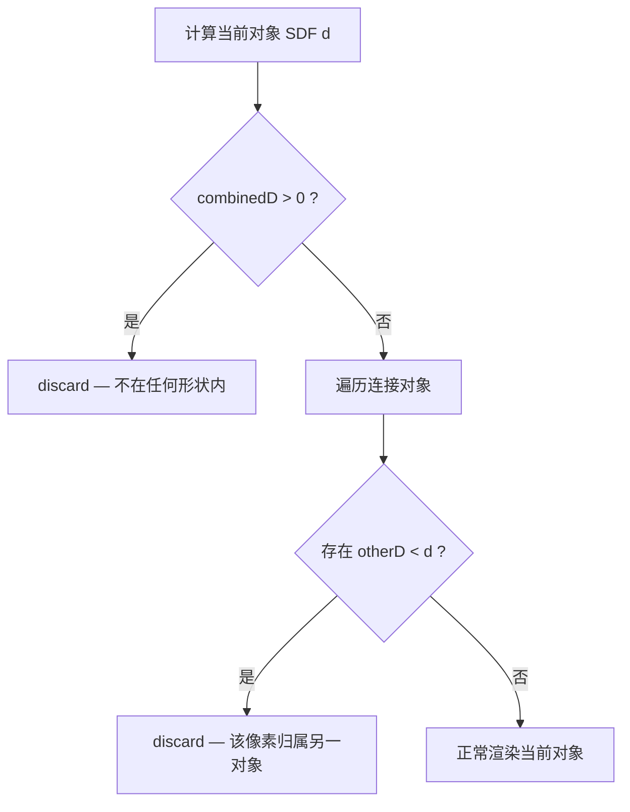
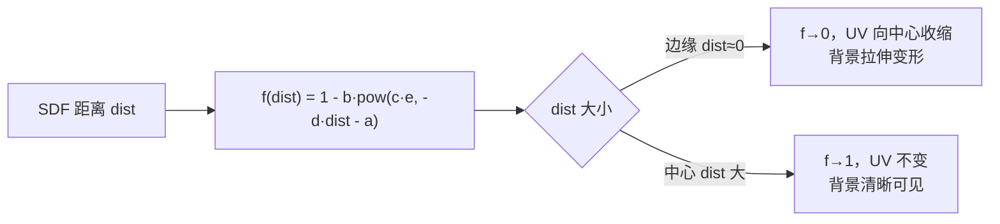
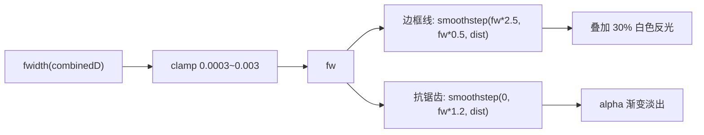
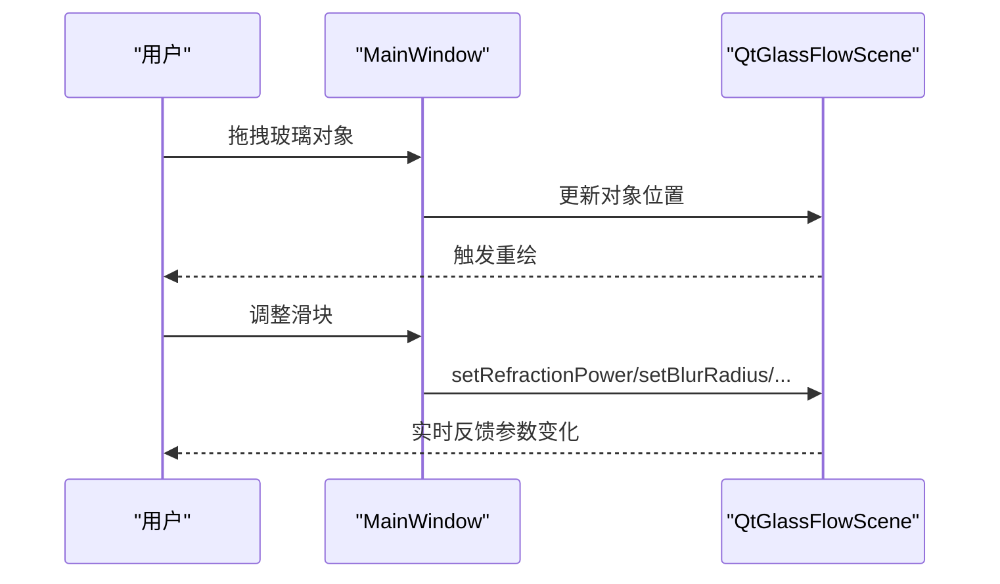
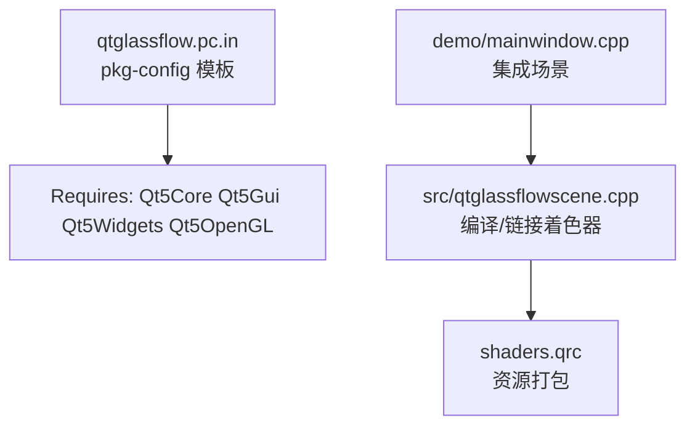

# 项目概述

<cite>
**本文档引用的文件**
- [README.md](file://README.md)
- [qtglassflow.pro](file://qtglassflow.pro)
- [src/qtglassflowscene.h](file://src/qtglassflowscene.h)
- [src/qtglassflowscene.cpp](file://src/qtglassflowscene.cpp)
- [src/shaders/scene_vertex.glsl](file://src/shaders/scene_vertex.glsl)
- [src/shaders/scene_fragment.glsl](file://src/shaders/scene_fragment.glsl)
- [src/shaders/blur_vertex.glsl](file://src/shaders/blur_vertex.glsl)
- [src/shaders/blur_fragment.glsl](file://src/shaders/blur_fragment.glsl)
- [src/shaders.qrc](file://src/shaders.qrc)
- [demo/main.cpp](file://demo/main.cpp)
- [demo/mainwindow.h](file://demo/mainwindow.h)
- [demo/mainwindow.cpp](file://demo/mainwindow.cpp)
- [qtglassflow.pc.in](file://qtglassflow.pc.in)
</cite>

## 目录
1. [简介](#简介)
2. [项目结构](#项目结构)
3. [核心组件](#核心组件)
4. [架构总览](#架构总览)
5. [详细组件分析](#详细组件分析)
6. [依赖关系分析](#依赖关系分析)
7. [性能考量](#性能考量)
8. [故障排查指南](#故障排查指南)
9. [结论](#结论)
10. [附录](#附录)

## 简介
本项目是一个基于 Qt + OpenGL 的液态玻璃效果渲染库，能够在常规 QWidget 程序中实时渲染具备折射、模糊、噪声与粘性桥接的 SDF 超椭圆玻璃对象。其独特优势在于：
- 使用 SDF 超椭圆作为形状基础，通过幂因子连续控制圆角到方形的过渡；
- 采用 Smooth-union 粘性桥接算法，自动检测对象间距并平滑连接形成液态桥；
- 凸面穹顶光照模拟真实玻璃球体的体积感；
- 基于法线偏移的背景折射采样，实现边缘扭曲与中心清晰的玻璃质感；
- 极细白色边框与像素级抗锯齿，确保锐利边缘与高质量边缘过渡；
- 仅依赖 OpenGL 2.1（GLSL 120）与 Qt 5.12+，跨平台支持良好。

应用场景包括现代桌面 UI 的装饰性玻璃面板、可拖拽的交互式玻璃容器、以及需要强调材质通透感的可视化界面元素。

## 项目结构
项目采用子目录组织方式，顶层通过 subdirs 模板管理源码库与演示程序，核心库位于 src，演示程序位于 demo，着色器资源通过资源文件打包。

图表来源
- [qtglassflow.pro:1-4](file://qtglassflow.pro#L1-L4)
- [src/shaders.qrc:1-9](file://src/shaders.qrc#L1-L9)

章节来源
- [qtglassflow.pro:1-4](file://qtglassflow.pro#L1-L4)
- [README.md:86-108](file://README.md#L86-L108)

## 核心组件
- QtGlassFlowScene：继承自 QOpenGLWidget，负责初始化 OpenGL、管理 FBO 管线、编译着色器、维护玻璃对象列表与连接关系、处理鼠标交互、驱动每帧渲染。
- GlassObject：描述单个玻璃对象的位置、尺寸、超椭圆幂、文本标签、交互状态（Normal/Hovered/Pressed）。
- Connection：描述两个对象之间的粘性连接，包含两端索引与连接强度（由间距动态计算）。
- MainWindow：演示应用窗口，包含参数滑块面板，实时调节全局渲染参数并反馈到 QtGlassFlowScene。

章节来源
- [README.md:110-171](file://README.md#L110-L171)
- [src/qtglassflowscene.h:17-139](file://src/qtglassflowscene.h#L17-L139)
- [demo/mainwindow.h:10-29](file://demo/mainwindow.h#L10-L29)

## 架构总览
系统采用“背景模糊 + 多对象全屏 quad 渲染”的管线，结合 SDF、Smooth-union、折射与抗锯齿等技术，实现实时液态玻璃效果。

图表来源
- [README.md:171-194](file://README.md#L171-L194)
- [src/qtglassflowscene.cpp:510-537](file://src/qtglassflowscene.cpp#L510-L537)

## 详细组件分析

### 渲染管线与着色器工作流
- 初始化阶段：设置 OpenGL 上下文格式（兼容配置文件 2.1）、编译并链接着色器程序、创建全屏四边形 VBO、加载背景纹理、启动定时刷新。
- 每帧流程：
  1) 将背景 blit 到 m_sceneFbo；
  2) 通过 ping-pong 迭代执行水平+垂直高斯模糊，得到模糊背景纹理；
  3) 将原始背景 blit 到默认帧缓冲；
  4) 对每个玻璃对象绘制全屏 quad，片元着色器根据 SDF、Smooth-union、折射、抗锯齿等计算最终颜色与 alpha。

图表来源
- [src/qtglassflowscene.cpp:510-537](file://src/qtglassflowscene.cpp#L510-L537)
- [src/qtglassflowscene.cpp:316-359](file://src/qtglassflowscene.cpp#L316-L359)
- [src/qtglassflowscene.cpp:361-371](file://src/qtglassflowscene.cpp#L361-L371)

章节来源
- [src/qtglassflowscene.cpp:187-225](file://src/qtglassflowscene.cpp#L187-L225)
- [src/qtglassflowscene.cpp:510-537](file://src/qtglassflowscene.cpp#L510-L537)

### SDF 超椭圆与 Smooth-union 桥接
- SDF 超椭圆：以有符号距离场表达形状，支持通过幂因子连续控制圆角到方形的过渡；分母归一化确保距离与像素一一对应，保障抗锯齿与桥接宽度控制精度。
- Smooth-union：基于多项式平滑最小值函数，在两个形状距离差很小时进行圆滑过渡，形成类似液体桥接的效果；连接强度由对象间距动态计算，最多支持 8 个并发连接。
- Voronoi 归属：在片元着色器中确保每个像素仅由距离它最近的对象负责渲染，避免多次绘制导致的亮度累积失真。

图表来源
- [src/shaders/scene_fragment.glsl:74-95](file://src/shaders/scene_fragment.glsl#L74-L95)
- [README.md:262-284](file://README.md#L262-L284)

章节来源
- [README.md:215-232](file://README.md#L215-L232)
- [README.md:234-261](file://README.md#L234-L261)
- [src/shaders/scene_fragment.glsl:40-64](file://src/shaders/scene_fragment.glsl#L40-L64)

### 折射模型与穹顶光照
- 折射模型：基于参数化指数衰减曲线对 UV 坐标进行非线性变换，边缘向中心收缩产生扭曲，中心保持清晰；可通过参数控制折射强度、衰减范围与幂次放大器。
- 凸面穹顶光照：基于局部 y 坐标线性渐变模拟玻璃顶部亮、底部暗的体积感，亮度调整幅度控制在 7% 左右，符合人眼感知阈值。

图表来源
- [src/shaders/scene_fragment.glsl:118-121](file://src/shaders/scene_fragment.glsl#L118-L121)
- [README.md:286-319](file://README.md#L286-L319)

章节来源
- [src/shaders/scene_fragment.glsl:130-136](file://src/shaders/scene_fragment.glsl#L130-L136)
- [README.md:320-331](file://README.md#L320-L331)

### 边框与抗锯齿
- 像素级抗锯齿：利用 fwidth 计算相邻像素 SDF 值变化，得到 1 像素宽度对应的 SDF 距离，clamp 限制范围，避免在过渡区发散或过度模糊；通过 smoothstep 在不同边界之间进行亚像素级插值。
- 极细白色边框：在 2 像素宽的过渡带内叠加约 0.3 强度的纯白光，模拟玻璃边缘反光，同时保持自然不过曝。
- Alpha 抗锯齿：在边缘 0 到 1.2 像素范围内做 alpha 渐变，实现分辨率无关的锐利边缘。

图表来源
- [src/shaders/scene_fragment.glsl:138-145](file://src/shaders/scene_fragment.glsl#L138-L145)
- [README.md:332-366](file://README.md#L332-L366)

章节来源
- [src/shaders/scene_fragment.glsl:125-147](file://src/shaders/scene_fragment.glsl#L125-L147)

### 交互与参数面板
- 交互：支持鼠标悬停、按下拖拽与释放；拖拽时更新对象位置并触发重绘；悬停状态用于触发热身动画与涟漪效果。
- 参数面板：演示程序提供滑块面板，实时调节折射强度、模糊半径、噪声量、吸引距离与超椭圆幂，并将参数传递给核心渲染类。

图表来源
- [demo/mainwindow.cpp:56-56](file://demo/mainwindow.cpp#L56-L56)
- [demo/mainwindow.cpp:131-141](file://demo/mainwindow.cpp#L131-L141)
- [src/qtglassflowscene.cpp:587-667](file://src/qtglassflowscene.cpp#L587-L667)

章节来源
- [demo/mainwindow.cpp:33-129](file://demo/mainwindow.cpp#L33-L129)
- [src/qtglassflowscene.cpp:587-667](file://src/qtglassflowscene.cpp#L587-L667)

## 依赖关系分析
- Qt 模块依赖：Qt5Core、Qt5Gui、Qt5Widgets、Qt5OpenGL（通过 pkg-config 文件声明）。
- OpenGL 要求：OpenGL 2.1（兼容配置文件），GLSL 120，使用传统 attribute/varying 语法与内置导数函数。
- 资源打包：着色器通过资源文件打包，便于跨平台分发与运行时加载。

图表来源
- [qtglassflow.pc.in:9-9](file://qtglassflow.pc.in#L9-L9)
- [src/shaders.qrc:1-9](file://src/shaders.qrc#L1-9)
- [src/qtglassflowscene.cpp:203-213](file://src/qtglassflowscene.cpp#L203-L213)

章节来源
- [qtglassflow.pc.in:6-11](file://qtglassflow.pc.in#L6-L11)
- [README.md:16-21](file://README.md#L16-L21)

## 性能考量
- 分离式高斯模糊：水平+垂直两阶段 1D 9-tap 核，支持多次迭代（ping-pong 缓冲）以实现更大半径而不牺牲单次核效率；半径与迭代次数均可实时调节。
- FBO 管线：使用 RGBA8 纹理与线性过滤，边缘采样采用 CLAMP_TO_EDGE，减少额外开销。
- 交互优化：仅在对象状态变化或参数调整时触发 update，避免不必要的重绘。
- GLSL 120 兼容：仅使用内置函数与传统语法，保证在旧硬件上的稳定运行。

章节来源
- [README.md:195-214](file://README.md#L195-L214)
- [src/qtglassflowscene.cpp:235-257](file://src/qtglassflowscene.cpp#L235-L257)
- [README.md:367-373](file://README.md#L367-L373)

## 故障排查指南
- 着色器编译失败：检查着色器路径与资源打包，确认资源前缀一致；查看日志输出定位具体错误。
- 背景不显示：确认背景路径有效且图像成功加载，检查纹理绑定与 blit 流程。
- 折射异常：检查折射参数（a/b/c/d/fPower）是否合理，尝试调整 fPower 与吸引距离。
- 边缘锯齿明显：适当提高抗锯齿参数（fw 范围与 smoothstep 边界），或降低模糊半径。
- 交互无响应：确认鼠标事件处理逻辑与 hitTest 判定，确保对象尺寸与状态切换正确。

章节来源
- [src/qtglassflowscene.cpp:138-157](file://src/qtglassflowscene.cpp#L138-L157)
- [src/qtglassflowscene.cpp:266-291](file://src/qtglassflowscene.cpp#L266-L291)
- [src/qtglassflowscene.cpp:568-585](file://src/qtglassflowscene.cpp#L568-L585)

## 结论
本项目以 Qt + OpenGL 为基础，结合 SDF 超椭圆、Smooth-union 桥接、背景折射、穹顶光照与像素级抗锯齿等技术，实现了高质量、实时的液态玻璃渲染效果。其 GLSL 120 兼容与跨平台支持使其易于集成到现有 Qt 应用中，适合用于现代桌面 UI 的装饰与交互增强。

## 附录

### 环境要求与安装
- 环境要求：Qt 5.12+（core/gui/widgets/opengl）、OpenGL 2.1（GLSL 120）、C++11、Linux/Windows/macOS。
- 快速编译：使用 qmake 与 make，示例程序位于 demo 子目录。
- Debian 打包：提供 libqtglassflow0、libqtglassflow-dev、qtglassflow-demo 三类包。

章节来源
- [README.md:16-44](file://README.md#L16-L44)

### API 简介（核心类）
- QtGlassFlowScene：继承 QOpenGLWidget，提供添加玻璃对象、设置背景、全局参数调节与信号回调；内部管理 FBO 管线、着色器与对象交互。
- GlassObject：包含位置、尺寸、幂因子、文本与交互状态。
- Connection：连接两个对象的强度信息。

章节来源
- [README.md:71-85](file://README.md#L71-L85)
- [src/qtglassflowscene.h:17-139](file://src/qtglassflowscene.h#L17-L139)