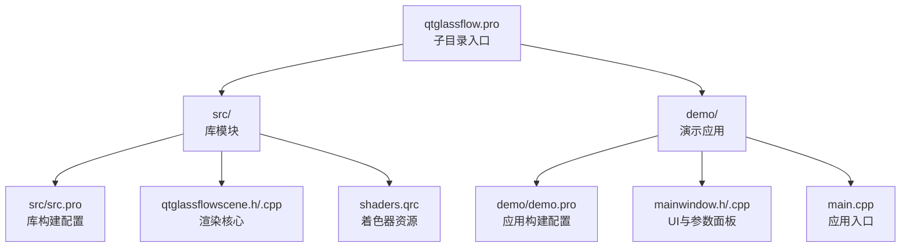
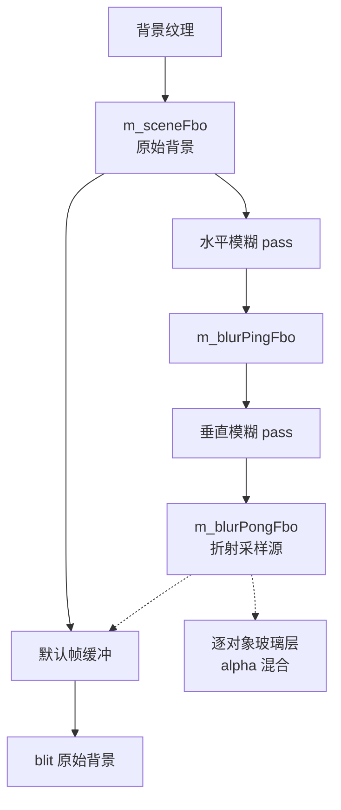
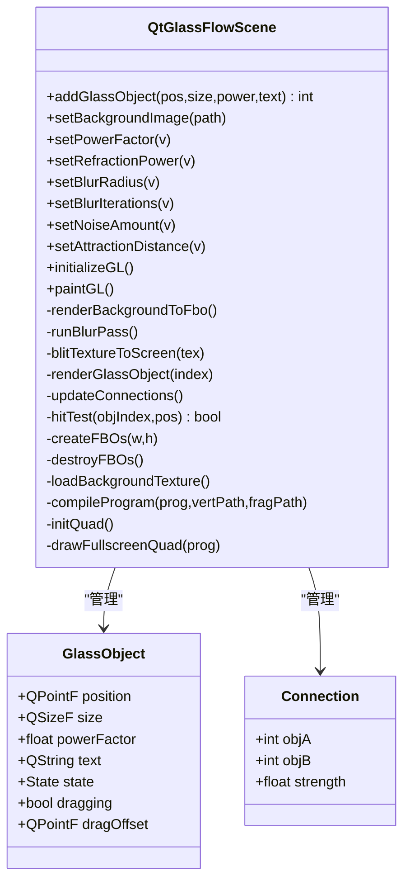
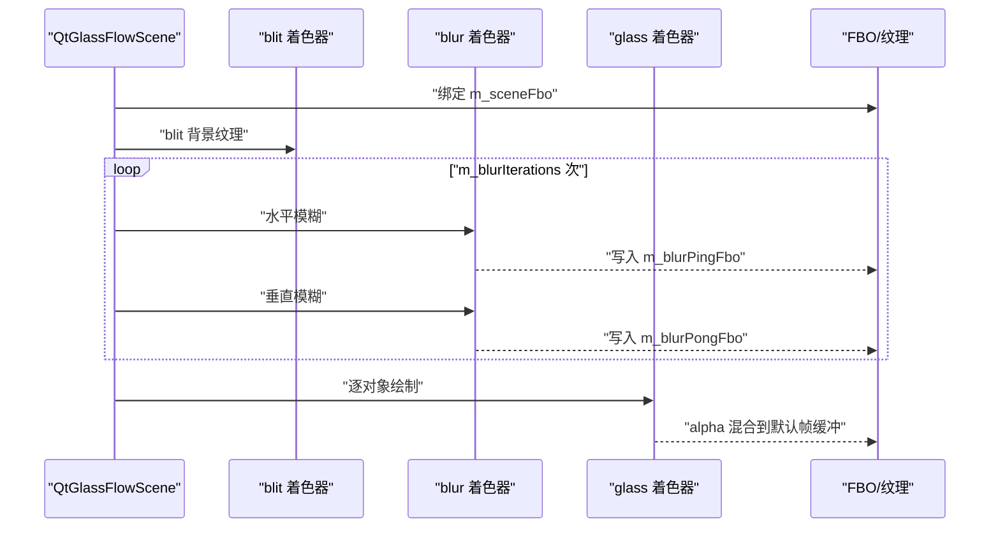
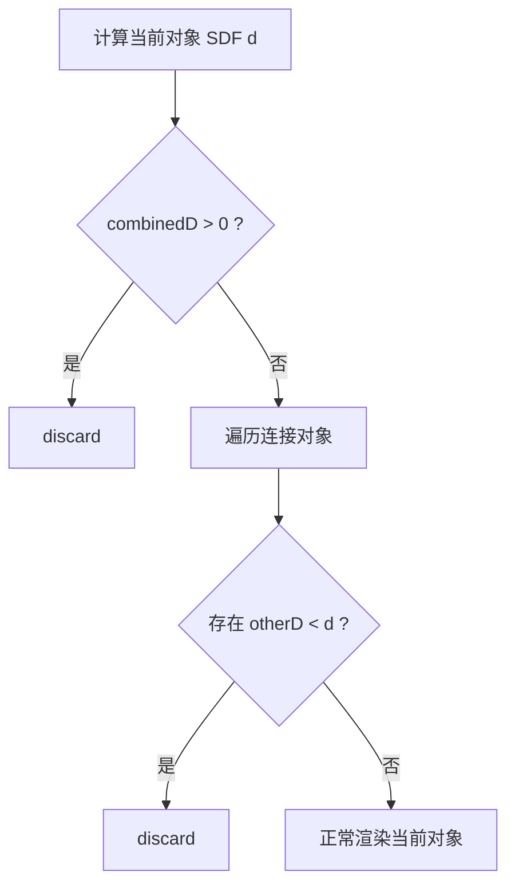
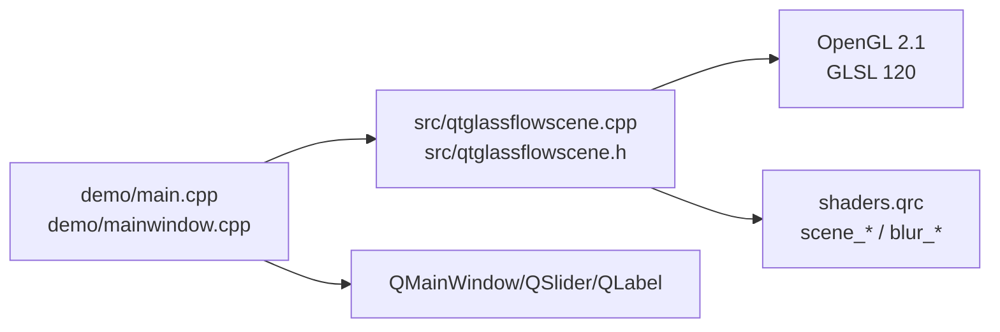

# 性能优化与调试

<cite>
**本文引用的文件**
- [README.md](file://README.md)
- [qtglassflow.pro](file://qtglassflow.pro)
- [src/src.pro](file://src/src.pro)
- [demo/demo.pro](file://demo/demo.pro)
- [src/qtglassflowscene.h](file://src/qtglassflowscene.h)
- [src/qtglassflowscene.cpp](file://src/qtglassflowscene.cpp)
- [src/shaders/scene_vertex.glsl](file://src/shaders/scene_vertex.glsl)
- [src/shaders/scene_fragment.glsl](file://src/shaders/scene_fragment.glsl)
- [src/shaders/blur_vertex.glsl](file://src/shaders/blur_vertex.glsl)
- [src/shaders/blur_fragment.glsl](file://src/shaders/blur_fragment.glsl)
- [demo/mainwindow.h](file://demo/mainwindow.h)
- [demo/mainwindow.cpp](file://demo/mainwindow.cpp)
- [demo/main.cpp](file://demo/main.cpp)
</cite>

## 目录
1. [简介](#简介)
2. [项目结构](#项目结构)
3. [核心组件](#核心组件)
4. [架构总览](#架构总览)
5. [详细组件分析](#详细组件分析)
6. [依赖关系分析](#依赖关系分析)
7. [性能考量](#性能考量)
8. [故障排查指南](#故障排查指南)
9. [结论](#结论)
10. [附录](#附录)

## 简介
本指南面向高级开发者，聚焦于液体玻璃渲染系统的性能优化与调试。系统基于 Qt + OpenGL 实现，采用分离式高斯模糊、SDF 超椭圆形状与 smooth-union 液桥连接、背景折射采样、像素级抗锯齿等技术，形成完整的 GPU 渲染管线。本文将从 GPU 渲染管线、内存使用、CPU-GPU 同步三方面给出优化策略，并结合 OpenGL 性能分析工具、着色器优化技巧与内存管理最佳实践，帮助定位与解决性能瓶颈。

## 项目结构
该项目采用子目录组织，核心库位于 src，演示应用位于 demo，构建脚本使用 qmake。渲染核心位于 QtGlassFlowScene，着色器资源通过资源文件打包。

图表来源
- [qtglassflow.pro:1-4](file://qtglassflow.pro#L1-L4)
- [src/src.pro:1-15](file://src/src.pro#L1-L15)
- [demo/demo.pro:1-14](file://demo/demo.pro#L1-L14)

章节来源
- [qtglassflow.pro:1-4](file://qtglassflow.pro#L1-L4)
- [src/src.pro:1-15](file://src/src.pro#L1-L15)
- [demo/demo.pro:1-14](file://demo/demo.pro#L1-L14)

## 核心组件
- QtGlassFlowScene：继承 QOpenGLWidget，负责初始化 OpenGL、管理 FBO 缓冲、编译着色器、构建全屏四边形 VBO、驱动每帧渲染流程、处理鼠标交互与对象拖拽、维护玻璃对象列表与连接关系。
- 玻璃对象数据结构：包含位置、尺寸、超椭圆幂、文本标签、交互状态与拖拽偏移。
- 连接结构：记录两个对象间的连接强度与索引，用于 smooth-union 液桥计算。
- 着色器管线：场景着色器（scene_*）、模糊着色器（blur_*）、通用 blit 着色器，均兼容 OpenGL 2.1/GLSL 120。

章节来源
- [src/qtglassflowscene.h:17-142](file://src/qtglassflowscene.h#L17-L142)
- [src/qtglassflowscene.cpp:51-104](file://src/qtglassflowscene.cpp#L51-L104)
- [src/qtglassflowscene.cpp:106-117](file://src/qtglassflowscene.cpp#L106-L117)
- [src/qtglassflowscene.cpp:478-508](file://src/qtglassflowscene.cpp#L478-L508)

## 架构总览
系统采用“背景 -> 模糊 -> 折射采样 -> 多对象合成”的 FBO 管线，每帧先将背景 blit 至场景 FBO，再进行多次 ping-pong 迭代的分离式高斯模糊，最后将模糊结果作为折射采样源，逐对象绘制全屏四边形，使用 alpha 混合合成到默认帧缓冲。

图表来源
- [src/qtglassflowscene.cpp:293-314](file://src/qtglassflowscene.cpp#L293-L314)
- [src/qtglassflowscene.cpp:316-359](file://src/qtglassflowscene.cpp#L316-L359)
- [src/qtglassflowscene.cpp:510-566](file://src/qtglassflowscene.cpp#L510-L566)

章节来源
- [README.md:171-194](file://README.md#L171-L194)
- [src/qtglassflowscene.cpp:510-566](file://src/qtglassflowscene.cpp#L510-L566)

## 详细组件分析

### 渲染核心：QtGlassFlowScene
- 初始化与格式：启用兼容配置文件与 OpenGL 2.1，双缓冲交换行为，禁用深度测试与背面剔除，减少不必要的状态开销。
- FBO 管线：创建 RGBA8 纹理的场景与模糊 ping-pong FBO，线性过滤与边缘夹紧，避免采样边界泄漏。
- 着色器管理：内联 blit 着色器源码，blur 与 glass 着色器从资源加载，统一绑定属性位置，链接失败时输出日志。
- 几何：静态全屏四边形 VBO，使用一次 drawArrays 绘制。
- 背景：支持从路径加载背景图像，镜像翻转后上传至纹理，线性过滤与边缘夹紧。
- 渲染流程：背景 blit -> 多次迭代模糊 -> 默认帧缓冲清屏 -> blit 原始背景 -> 逐对象玻璃层 alpha 混合 -> 文字叠加（QPainter）。
- 连接更新：遍历所有对象对，计算中心距离与半径之和，得到间隙 gap，当 gap 小于吸引距离时建立连接，强度按线性插值计算。
- 交互：命中测试基于超椭圆 SDF，拖拽时保持在窗口内，悬停状态切换，释放时恢复状态。

图表来源
- [src/qtglassflowscene.h:17-142](file://src/qtglassflowscene.h#L17-L142)
- [src/qtglassflowscene.cpp:51-104](file://src/qtglassflowscene.cpp#L51-L104)
- [src/qtglassflowscene.cpp:106-117](file://src/qtglassflowscene.cpp#L106-L117)
- [src/qtglassflowscene.cpp:478-508](file://src/qtglassflowscene.cpp#L478-L508)

章节来源
- [src/qtglassflowscene.cpp:187-225](file://src/qtglassflowscene.cpp#L187-L225)
- [src/qtglassflowscene.cpp:235-264](file://src/qtglassflowscene.cpp#L235-L264)
- [src/qtglassflowscene.cpp:266-291](file://src/qtglassflowscene.cpp#L266-L291)
- [src/qtglassflowscene.cpp:293-314](file://src/qtglassflowscene.cpp#L293-L314)
- [src/qtglassflowscene.cpp:316-359](file://src/qtglassflowscene.cpp#L316-L359)
- [src/qtglassflowscene.cpp:361-371](file://src/qtglassflowscene.cpp#L361-L371)
- [src/qtglassflowscene.cpp:394-476](file://src/qtglassflowscene.cpp#L394-L476)
- [src/qtglassflowscene.cpp:478-508](file://src/qtglassflowscene.cpp#L478-L508)
- [src/qtglassflowscene.cpp:510-566](file://src/qtglassflowscene.cpp#L510-L566)

### 着色器管线
- 场景着色器（scene_*）：接收模糊后的背景纹理、对象中心与半尺寸、折射参数、连接数组、时间与噪声等；实现超椭圆 SDF、smooth-union 液桥、Voronoi 归属裁剪、折射 UV 变换、穹顶光照、极细边框与 alpha 抗锯齿。
- 模糊着色器（blur_*）：1D 高斯核分离式模糊，支持水平/垂直方向与迭代次数；使用固定权重与 9-tap 近似核。
- blit 着色器：简单全屏四边形拷贝，用于背景与中间结果的快速传输。

图表来源
- [src/qtglassflowscene.cpp:293-314](file://src/qtglassflowscene.cpp#L293-L314)
- [src/qtglassflowscene.cpp:316-359](file://src/qtglassflowscene.cpp#L316-L359)
- [src/qtglassflowscene.cpp:394-476](file://src/qtglassflowscene.cpp#L394-L476)
- [src/shaders/blur_vertex.glsl:1-9](file://src/shaders/blur_vertex.glsl#L1-L9)
- [src/shaders/blur_fragment.glsl:1-24](file://src/shaders/blur_fragment.glsl#L1-L24)
- [src/shaders/scene_vertex.glsl:1-9](file://src/shaders/scene_vertex.glsl#L1-L9)
- [src/shaders/scene_fragment.glsl:1-149](file://src/shaders/scene_fragment.glsl#L1-L149)

章节来源
- [src/shaders/blur_vertex.glsl:1-9](file://src/shaders/blur_vertex.glsl#L1-L9)
- [src/shaders/blur_fragment.glsl:1-24](file://src/shaders/blur_fragment.glsl#L1-L24)
- [src/shaders/scene_vertex.glsl:1-9](file://src/shaders/scene_vertex.glsl#L1-L9)
- [src/shaders/scene_fragment.glsl:1-149](file://src/shaders/scene_fragment.glsl#L1-L149)

### 连接与液桥计算
- 连接强度：基于中心距离与半径之和的间隙 gap，按线性插值计算强度，小于吸引距离时建立连接，最多 8 个连接。
- smooth-union：对每个像素的 SDF 值进行平滑并集，融合区宽度由连接强度与经验系数共同决定，产生自然液桥。
- Voronoi 归属：确保每个像素仅由最近对象负责渲染，避免 alpha 混合导致的亮度累积失真。

图表来源
- [src/qtglassflowscene.cpp:478-508](file://src/qtglassflowscene.cpp#L478-L508)
- [src/shaders/scene_fragment.glsl:66-96](file://src/shaders/scene_fragment.glsl#L66-L96)

章节来源
- [src/qtglassflowscene.cpp:478-508](file://src/qtglassflowscene.cpp#L478-L508)
- [src/shaders/scene_fragment.glsl:66-96](file://src/shaders/scene_fragment.glsl#L66-L96)

### 演示应用与参数面板
- MainWindow：创建 QtGlassFlowScene，添加四个可拖拽玻璃对象，右侧参数面板实时调整折射强度、模糊半径、噪声量、吸引距离与超椭圆幂。
- 应用入口：设置共享 OpenGL 上下文属性，启动事件循环。

章节来源
- [demo/mainwindow.h:10-32](file://demo/mainwindow.h#L10-L32)
- [demo/mainwindow.cpp:33-142](file://demo/mainwindow.cpp#L33-L142)
- [demo/main.cpp:1-16](file://demo/main.cpp#L1-16)

## 依赖关系分析
- 构建依赖：demo 依赖 src 库；src 依赖 Qt GUI/Widgets/OpenGL，资源文件包含着色器。
- 运行时依赖：QtGlassFlowScene 依赖 OpenGL 功能接口、QOpenGLShaderProgram、QOpenGLBuffer、QOpenGLFramebufferObject、QElapsedTimer、QTimer 等。
- 着色器依赖：场景着色器依赖模糊结果纹理与连接数组 uniform；模糊着色器依赖方向、分辨率与半径 uniform。

图表来源
- [demo/demo.pro:1-14](file://demo/demo.pro#L1-L14)
- [src/src.pro:1-15](file://src/src.pro#L1-L15)
- [src/qtglassflowscene.cpp:187-225](file://src/qtglassflowscene.cpp#L187-L225)

章节来源
- [demo/demo.pro:1-14](file://demo/demo.pro#L1-L14)
- [src/src.pro:1-15](file://src/src.pro#L1-L15)
- [src/qtglassflowscene.cpp:187-225](file://src/qtglassflowscene.cpp#L187-L225)

## 性能考量

### GPU 渲染管线优化
- 分离式高斯模糊
  - 优势：水平+垂直两阶段 pass，每次使用 1D 9-tap 高斯核，避免单次大核的昂贵采样；迭代次数可调，平衡质量与性能。
  - 优化建议：根据目标分辨率与模糊半径动态调整迭代次数；在低端设备降低迭代次数或半径上限。
  - 关键实现参考：[src/qtglassflowscene.cpp:316-359](file://src/qtglassflowscene.cpp#L316-L359)，[src/shaders/blur_fragment.glsl:1-24](file://src/shaders/blur_fragment.glsl#L1-L24)。
- FBO 与纹理
  - 使用 RGBA8 纹理格式，线性过滤与边缘夹紧，减少采样误差与边界泄漏。
  - 优化建议：在不需要高精度的场景可考虑降级到 RGB5_A1 或 RGBA4；对静态背景可复用纹理避免频繁重建。
  - 关键实现参考：[src/qtglassflowscene.cpp:235-264](file://src/qtglassflowscene.cpp#L235-L264)。
- 逐对象绘制与 alpha 混合
  - 每个玻璃对象绘制一次全屏四边形，使用 alpha 混合合成；Voronoi 归属确保像素仅被一个对象渲染，避免亮度累积。
  - 优化建议：减少对象数量或合并相似对象；在 UI 场景中优先保证前景对象的清晰度。
  - 关键实现参考：[src/qtglassflowscene.cpp:394-476](file://src/qtglassflowscene.cpp#L394-L476)，[src/shaders/scene_fragment.glsl:66-96](file://src/shaders/scene_fragment.glsl#L66-L96)。
- 折射采样
  - 基于 SDF 距离的 UV 变换，使用指数衰减曲线控制折射强度与分布，避免昂贵的物理光线追踪。
  - 优化建议：降低噪声量与半径，或在静态场景中预计算背景模糊。
  - 关键实现参考：[src/shaders/scene_fragment.glsl:118-121](file://src/shaders/scene_fragment.glsl#L118-L121)。

### 内存使用优化
- 纹理资源管理
  - 背景纹理与 FBO 纹理在线性过滤与边缘夹紧下工作，避免重复创建与销毁。
  - 优化建议：延迟加载背景纹理，按需重建 FBO；在窗口大小变化时复用已分配的纹理。
  - 关键实现参考：[src/qtglassflowscene.cpp:266-291](file://src/qtglassflowscene.cpp#L266-L291)，[src/qtglassflowscene.cpp:235-264](file://src/qtglassflowscene.cpp#L235-L264)。
- FBO 缓存策略
  - ping-pong 交替缓冲，减少中间结果的内存峰值；迭代次数与分辨率成正比。
  - 优化建议：在低分辨率或移动设备上减少迭代次数；避免频繁 resize 导致的重建。
  - 关键实现参考：[src/qtglassflowscene.cpp:316-359](file://src/qtglassflowscene.cpp#L316-L359)。
- 对象池技术
  - 当前未实现对象池；可考虑复用 GlassObject 与 Connection 结构，减少频繁分配与释放。
  - 关键实现参考：[src/qtglassflowscene.h:23-40](file://src/qtglassflowscene.h#L23-L40)。

### CPU-GPU 同步优化
- 定时刷新与帧率
  - 使用定时器以约 16ms 触发 update，维持约 60fps；可根据设备能力调整频率。
  - 优化建议：在高负载时降低刷新频率或使用 vsync；对交互敏感场景可提高刷新频率。
  - 关键实现参考：[src/qtglassflowscene.cpp:220-224](file://src/qtglassflowscene.cpp#L220-L224)。
- 状态切换与批处理
  - 每帧仅进行必要的状态切换（禁用深度测试、背面剔除、blend），减少状态变更带来的 GPU 同步成本。
  - 优化建议：合并相似状态的绘制调用，减少 bind/unbind 次数。
  - 关键实现参考：[src/qtglassflowscene.cpp:187-225](file://src/qtglassflowscene.cpp#L187-L225)。

### OpenGL 性能分析工具使用
- 渲染统计信息获取
  - 使用 OpenGL 扩展或驱动提供的查询接口（如 GPU 时间戳、绘制调用计数）获取帧时间与批次信息。
- 帧率分析
  - 通过定时器与计时器测量帧间隔，结合 FPS 显示或日志输出，定位掉帧原因。
- GPU 负载监控
  - 使用 GPU 驱动自带的性能分析器（如 NVIDIA Nsight Graphics、AMD GPU Profiler、Intel GPA）观察顶点/片段吞吐、带宽与占用率。
- 着色器性能分析
  - 关注热点内核（如 smooth-union 循环、纹理采样、导数计算），检查分支与分支条件消除情况，避免分支分歧导致的吞吐下降。

### 着色器性能优化技巧
- 指令流水线优化
  - 将昂贵操作（如 pow、exp、sin/cos）尽量移到常量或预计算；减少分支条件，避免分支分歧。
- 纹理缓存利用
  - 使用线性过滤与合适的 wrap 模式，减少边界采样；合理安排纹理尺寸与布局，提升缓存命中。
- 分支条件消除
  - 在场景着色器中，smooth-union 与 Voronoi 归属使用固定上限（如 8 个连接），避免动态分支；必要时将循环展开为固定次数的序列调用。

章节来源
- [src/qtglassflowscene.cpp:316-359](file://src/qtglassflowscene.cpp#L316-L359)
- [src/shaders/blur_fragment.glsl:1-24](file://src/shaders/blur_fragment.glsl#L1-L24)
- [src/qtglassflowscene.cpp:235-264](file://src/qtglassflowscene.cpp#L235-L264)
- [src/qtglassflowscene.cpp:394-476](file://src/qtglassflowscene.cpp#L394-L476)
- [src/shaders/scene_fragment.glsl:66-96](file://src/shaders/scene_fragment.glsl#L66-L96)
- [src/shaders/scene_fragment.glsl:118-121](file://src/shaders/scene_fragment.glsl#L118-L121)
- [src/qtglassflowscene.cpp:220-224](file://src/qtglassflowscene.cpp#L220-L224)
- [src/qtglassflowscene.cpp:187-225](file://src/qtglassflowscene.cpp#L187-L225)

## 故障排查指南
- 着色器编译失败
  - 现象：日志输出编译错误或链接失败。
  - 排查：检查 GLSL 版本与内置函数兼容性；确认资源文件正确打包；验证 uniform 名称与类型一致。
  - 参考实现：[src/qtglassflowscene.cpp:138-157](file://src/qtglassflowscene.cpp#L138-L157)。
- 背景纹理不显示或模糊异常
  - 现象：背景未渲染或模糊过度。
  - 排查：确认背景路径有效、图像格式转换成功；检查纹理过滤与 wrap 设置；验证模糊半径与迭代次数。
  - 参考实现：[src/qtglassflowscene.cpp:266-291](file://src/qtglassflowscene.cpp#L266-L291)，[src/qtglassflowscene.cpp:316-359](file://src/qtglassflowscene.cpp#L316-L359)。
- 连接与液桥不生效
  - 现象：对象靠近不产生桥接。
  - 排查：检查吸引距离与对象半径计算；确认连接强度插值逻辑；验证 smooth-union 与 Voronoi 归属。
  - 参考实现：[src/qtglassflowscene.cpp:478-508](file://src/qtglassflowscene.cpp#L478-L508)，[src/shaders/scene_fragment.glsl:66-96](file://src/shaders/scene_fragment.glsl#L66-L96)。
- 性能抖动或掉帧
  - 现象：帧率不稳定或卡顿。
  - 排查：降低模糊半径与迭代次数；减少对象数量；关闭不必要的 UI 组件；使用性能分析器定位热点。
  - 参考实现：[src/qtglassflowscene.cpp:220-224](file://src/qtglassflowscene.cpp#L220-L224)，[src/qtglassflowscene.cpp:316-359](file://src/qtglassflowscene.cpp#L316-L359)。

章节来源
- [src/qtglassflowscene.cpp:138-157](file://src/qtglassflowscene.cpp#L138-L157)
- [src/qtglassflowscene.cpp:266-291](file://src/qtglassflowscene.cpp#L266-L291)
- [src/qtglassflowscene.cpp:316-359](file://src/qtglassflowscene.cpp#L316-L359)
- [src/qtglassflowscene.cpp:478-508](file://src/qtglassflowscene.cpp#L478-L508)
- [src/shaders/scene_fragment.glsl:66-96](file://src/shaders/scene_fragment.glsl#L66-L96)
- [src/qtglassflowscene.cpp:220-224](file://src/qtglassflowscene.cpp#L220-L224)

## 结论
本系统通过分离式高斯模糊、SDF 超椭圆与 smooth-union 液桥、背景折射采样与像素级抗锯齿，实现了高质量的液体玻璃效果。性能优化的关键在于：合理控制模糊半径与迭代次数、减少对象数量与 alpha 混合次数、优化纹理与 FBO 管线、降低 CPU-GPU 同步成本，并结合 OpenGL 性能分析工具与着色器优化技巧持续调优。建议在不同硬件平台上制定差异化参数策略，并通过对象池与资源复用进一步降低内存与状态切换开销。

## 附录
- 构建与安装
  - 使用 qmake 与 make 编译，支持 Debian 打包生成运行时库、开发头文件与示例程序。
  - 参考实现：[qtglassflow.pro:1-4](file://qtglassflow.pro#L1-L4)，[src/src.pro:1-15](file://src/src.pro#L1-L15)，[demo/demo.pro:1-14](file://demo/demo.pro#L1-L14)。
- 示例应用
  - 创建 MainWindow，添加四个玻璃对象，右侧参数面板实时调整渲染参数。
  - 参考实现：[demo/mainwindow.cpp:33-142](file://demo/mainwindow.cpp#L33-L142)，[demo/main.cpp:1-16](file://demo/main.cpp#L1-L16)。