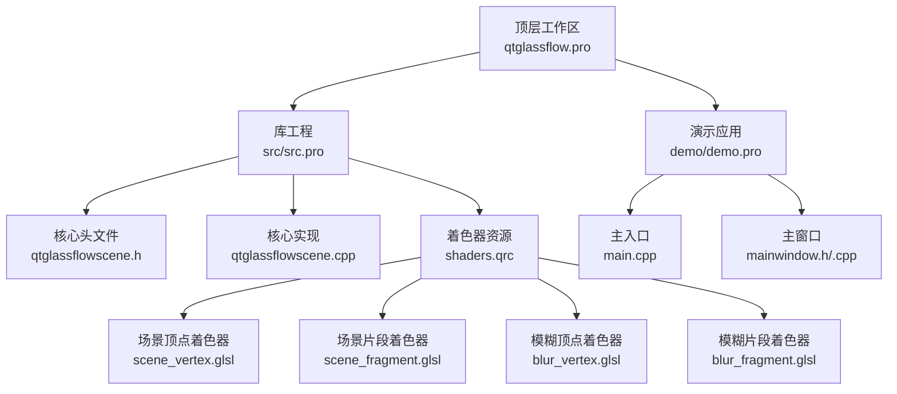
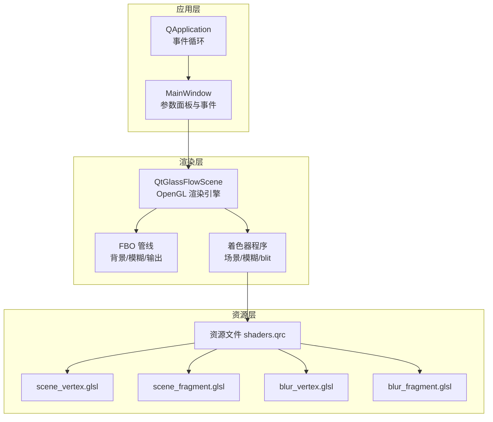
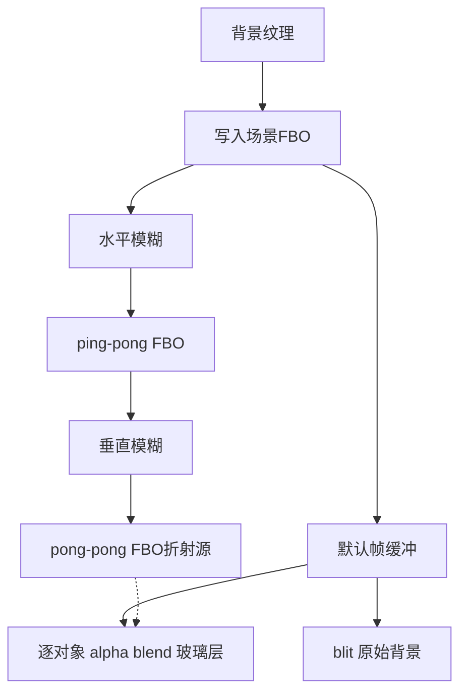
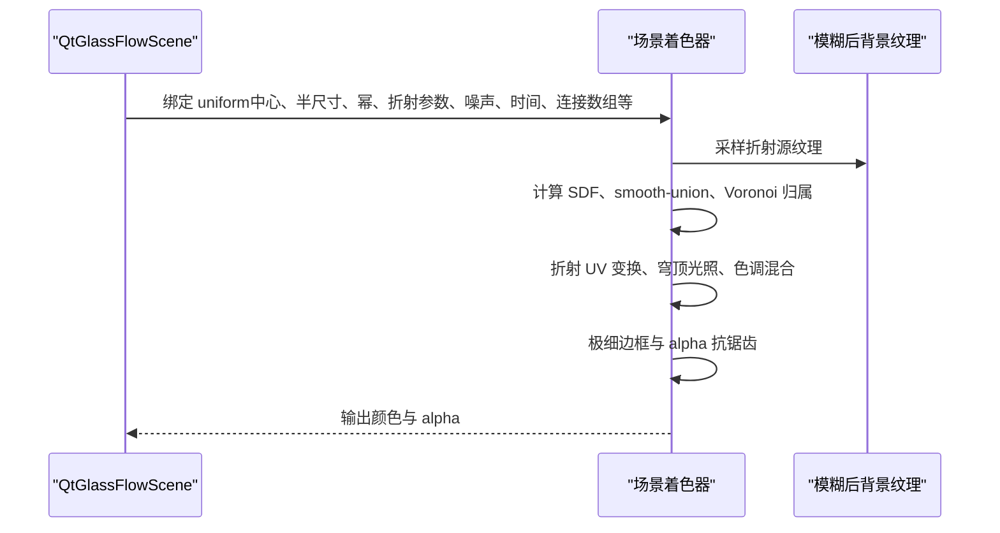
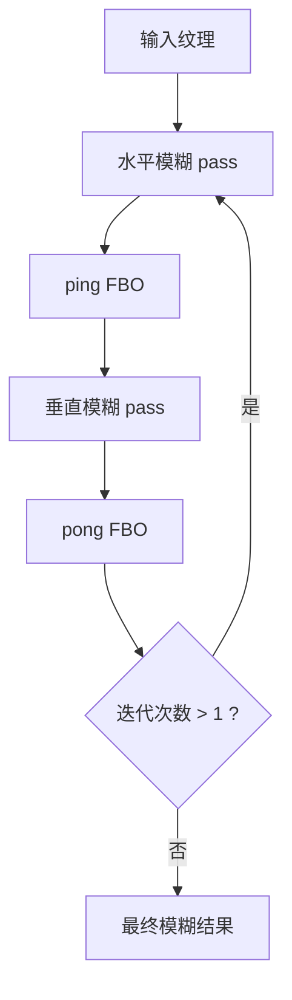
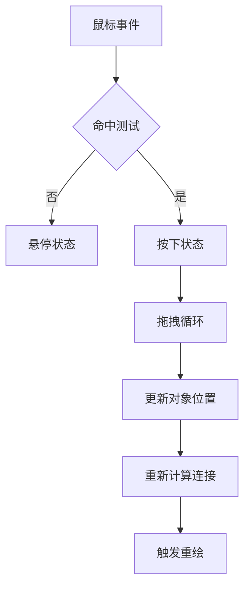
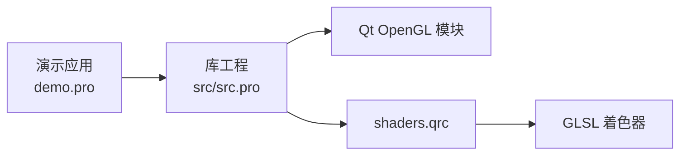

# 架构演进与重构

<cite>
**本文引用的文件**
- [README.md](file://README.md)
- [qtglassflow.pro](file://qtglassflow.pro)
- [src.pro](file://src/src.pro)
- [demo.pro](file://demo/demo.pro)
- [qtglassflowscene.h](file://src/qtglassflowscene.h)
- [qtglassflowscene.cpp](file://src/qtglassflowscene.cpp)
- [scene_vertex.glsl](file://src/shaders/scene_vertex.glsl)
- [scene_fragment.glsl](file://src/shaders/scene_fragment.glsl)
- [blur_vertex.glsl](file://src/shaders/blur_vertex.glsl)
- [blur_fragment.glsl](file://src/shaders/blur_fragment.glsl)
- [mainwindow.h](file://demo/mainwindow.h)
- [mainwindow.cpp](file://demo/mainwindow.cpp)
- [main.cpp](file://demo/main.cpp)
- [qtglassflow.pc.in](file://qtglassflow.pc.in)
- [changelog](file://debian/changelog)
</cite>

## 目录
1. [简介](#简介)
2. [项目结构](#项目结构)
3. [核心组件](#核心组件)
4. [架构总览](#架构总览)
5. [详细组件分析](#详细组件分析)
6. [依赖关系分析](#依赖关系分析)
7. [性能考量](#性能考量)
8. [故障排查指南](#故障排查指南)
9. [结论](#结论)
10. [附录](#附录)

## 简介
本指南面向高级开发者，围绕液体玻璃渲染系统进行架构演进与重构，目标包括：
- 模块化设计原则与接口抽象
- 依赖注入模式的应用
- 从 OpenGL 2.1 向更高版本 OpenGL 的迁移策略与兼容性处理
- 代码组织与命名规范最佳实践
- 设计可扩展的插件系统与扩展点
- 版本管理策略与向后兼容性保障

系统当前基于 Qt + OpenGL 2.1（GLSL 120）实现，提供基于 SDF 的超椭圆玻璃对象、smooth-union 粘性桥接、背景折射采样、抗锯齿与边框等效果。

## 项目结构
项目采用子目录组织，顶层为工作区，src 为库工程，demo 为演示应用，shaders 为资源文件，debian 与 pkg-config 用于打包与分发。

**图表来源**
- [qtglassflow.pro:1-4](file://qtglassflow.pro#L1-L4)
- [src/src.pro:1-15](file://src/src.pro#L1-L15)
- [demo/demo.pro:1-14](file://demo/demo.pro#L1-L14)

**章节来源**
- [qtglassflow.pro:1-4](file://qtglassflow.pro#L1-L4)
- [src/src.pro:1-15](file://src/src.pro#L1-L15)
- [demo/demo.pro:1-14](file://demo/demo.pro#L1-L14)

## 核心组件
- QtGlassFlowScene：继承 QOpenGLWidget，封装 OpenGL 初始化、FBO 管线、着色器编译与绑定、对象管理、交互事件与渲染调度。
- GlassObject：玻璃对象数据结构，包含位置、尺寸、超椭圆幂、文本标签、交互状态与拖拽偏移。
- Connection：对象间的粘性连接，记录两端索引与强度。
- MainWindow：演示应用窗口，提供参数面板与实时参数调整。
- 着色器：分离式高斯模糊与场景渲染，均使用 GLSL 120 语法。

关键职责与接口概览：
- 初始化与生命周期：initializeGL、paintGL、resizeGL、析构清理
- 渲染管线：背景 FBO 写入、多次迭代高斯模糊、屏幕 blit、逐对象渲染
- 参数接口：全局超椭圆幂、折射强度、模糊半径/迭代次数、噪声量、吸引距离
- 交互接口：鼠标事件处理、命中测试、拖拽状态管理

**章节来源**
- [qtglassflowscene.h:17-142](file://src/qtglassflowscene.h#L17-L142)
- [qtglassflowscene.cpp:51-104](file://src/qtglassflowscene.cpp#L51-L104)
- [mainwindow.h:10-32](file://demo/mainwindow.h#L10-L32)
- [mainwindow.cpp:33-142](file://demo/mainwindow.cpp#L33-L142)

## 架构总览
系统采用“渲染引擎 + 资源管线 + 应用界面”的分层架构。核心渲染引擎位于 QtGlassFlowScene，负责 OpenGL 上下文初始化、FBO 管线与着色器管理；应用层 MainWindow 提供参数面板与事件驱动；着色器作为资源通过资源文件统一管理。

**图表来源**
- [qtglassflowscene.h:17-142](file://src/qtglassflowscene.h#L17-L142)
- [qtglassflowscene.cpp:187-200](file://src/qtglassflowscene.cpp#L187-L200)
- [scene_vertex.glsl:1-9](file://src/shaders/scene_vertex.glsl#L1-L9)
- [scene_fragment.glsl:1-149](file://src/shaders/scene_fragment.glsl#L1-L149)
- [blur_vertex.glsl:1-9](file://src/shaders/blur_vertex.glsl#L1-L9)
- [blur_fragment.glsl:1-24](file://src/shaders/blur_fragment.glsl#L1-L24)

## 详细组件分析

### 渲染引擎与 FBO 管线
- 初始化：设置 OpenGL 上下文格式（OpenGL 2.1 Compatibility Profile）、禁用深度与背面剔除、编译并链接着色器程序、准备全屏四边形 VBO。
- 背景处理：将背景纹理 blit 至场景 FBO，随后进行多次迭代的分离式高斯模糊（ping-pong 缓冲）。
- 输出合成：先 blit 原始背景至默认帧缓冲，再对每个玻璃对象进行全屏 quad 绘制，片元着色器根据 SDF、smooth-union、折射与抗锯齿计算颜色与 alpha。

**图表来源**
- [qtglassflowscene.cpp:187-200](file://src/qtglassflowscene.cpp#L187-L200)
- [qtglassflowscene.cpp:190-194](file://src/qtglassflowscene.cpp#L190-L194)
- [qtglassflowscene.cpp:195-200](file://src/qtglassflowscene.cpp#L195-L200)

**章节来源**
- [qtglassflowscene.cpp:187-200](file://src/qtglassflowscene.cpp#L187-L200)
- [qtglassflowscene.cpp:195-200](file://src/qtglassflowscene.cpp#L195-L200)

### 场景渲染与着色器流程
- 顶点阶段：将 NDC 坐标与纹理坐标传给片元着色器。
- 片元阶段：计算本地坐标、SDF 超椭圆、smooth-union 合并、Voronoi 归属判定、涟漪/流动扰动、折射 UV 变换、穹顶光照、色调混合、极细边框与 alpha 抗锯齿。

**图表来源**
- [scene_fragment.glsl:66-148](file://src/shaders/scene_fragment.glsl#L66-L148)
- [scene_vertex.glsl:1-9](file://src/shaders/scene_vertex.glsl#L1-L9)

**章节来源**
- [scene_fragment.glsl:1-149](file://src/shaders/scene_fragment.glsl#L1-L149)
- [scene_vertex.glsl:1-9](file://src/shaders/scene_vertex.glsl#L1-L9)

### 模糊管线与迭代策略
- 分离式高斯模糊：水平与垂直两次 1D 9-tap 核，支持多次迭代以等效更大半径且避免单次大核的性能开销。
- ping-pong 缓冲：交替使用 ping/pong FBO，减少内存占用并提升缓存局部性。

**图表来源**
- [blur_fragment.glsl:9-23](file://src/shaders/blur_fragment.glsl#L9-L23)
- [blur_vertex.glsl:1-9](file://src/shaders/blur_vertex.glsl#L1-L9)

**章节来源**
- [blur_fragment.glsl:1-24](file://src/shaders/blur_fragment.glsl#L1-L24)
- [blur_vertex.glsl:1-9](file://src/shaders/blur_vertex.glsl#L1-L9)

### 交互与对象管理
- 对象添加：通过 API 添加玻璃对象，返回索引。
- 交互：鼠标事件驱动命中测试、悬停/按下状态切换、拖拽更新位置。
- 连接：基于对象中心距离与吸引距离动态计算连接强度，最多支持 8 个连接。

**图表来源**
- [qtglassflowscene.h:23-40](file://src/qtglassflowscene.h#L23-L40)
- [qtglassflowscene.cpp:106-117](file://src/qtglassflowscene.cpp#L106-L117)
- [qtglassflowscene.cpp:131-136](file://src/qtglassflowscene.cpp#L131-L136)

**章节来源**
- [qtglassflowscene.h:23-40](file://src/qtglassflowscene.h#L23-L40)
- [qtglassflowscene.cpp:106-117](file://src/qtglassflowscene.cpp#L106-L117)
- [qtglassflowscene.cpp:131-136](file://src/qtglassflowscene.cpp#L131-L136)

### 演示应用与参数面板
- MainWindow 构建左侧渲染场景与右侧参数面板，滑块联动 QtGlassFlowScene 的全局参数。
- 主入口设置共享 OpenGL 上下文属性，启动事件循环。

**章节来源**
- [mainwindow.h:10-32](file://demo/mainwindow.h#L10-L32)
- [mainwindow.cpp:33-142](file://demo/mainwindow.cpp#L33-L142)
- [main.cpp:4-15](file://demo/main.cpp#L4-L15)

## 依赖关系分析
- 模块耦合：QtGlassFlowScene 依赖 Qt OpenGL 模块与资源文件；着色器通过资源文件集中管理，降低运行时路径依赖。
- 外部依赖：Qt5Core/Gui/Widgets/OpenGL；Linux/macOS/Windows 平台支持。
- 兼容性：OpenGL 2.1 Compatibility Profile 与 GLSL 120，避免扩展指令。

**图表来源**
- [demo/demo.pro:1-14](file://demo/demo.pro#L1-L14)
- [src/src.pro:1-15](file://src/src.pro#L1-L15)

**章节来源**
- [demo/demo.pro:1-14](file://demo/demo.pro#L1-L14)
- [src/src.pro:1-15](file://src/src.pro#L1-L15)

## 性能考量
- FBO 与 ping-pong：减少内存占用并提升缓存命中。
- 抗锯齿：基于 fwidth 的自适应过渡，保证分辨率无关的锐利边缘。
- 迭代模糊：通过多次小半径模糊等效大半径，平衡质量与性能。
- 动画与扰动：涟漪与流动扰动幅度较小，避免显著性能开销。
- 纹理与 VBO：静态全屏四边形 VBO，减少 CPU-GPU 数据传输。

[本节为通用性能建议，不直接分析具体文件]

## 故障排查指南
- 着色器编译失败：检查资源路径与 GLSL 版本，确认 inline 字符串或资源文件加载成功。
- 背景纹理未显示：确认背景路径有效、纹理加载成功、FBO blit 正确。
- 模糊无效：检查模糊半径与迭代次数设置、ping-pong FBO 是否正确创建与切换。
- 交互异常：确认鼠标事件回调、命中测试逻辑与拖拽状态机正常。

**章节来源**
- [qtglassflowscene.cpp:138-157](file://src/qtglassflowscene.cpp#L138-L157)
- [qtglassflowscene.cpp:119-129](file://src/qtglassflowscene.cpp#L119-L129)
- [qtglassflowscene.cpp:195-200](file://src/qtglassflowscene.cpp#L195-L200)

## 结论
该液体玻璃渲染系统以 Qt + OpenGL 2.1 为基础，实现了高质量的 SDF 超椭圆、smooth-union 桥接与折射效果。通过模块化设计与资源集中管理，系统具备良好的可维护性与可移植性。面向未来演进，建议在保持现有 API 稳定的前提下，逐步引入更高版本 OpenGL 的能力与依赖注入模式，增强扩展性与可测试性。

[本节为总结性内容，不直接分析具体文件]

## 附录

### OpenGL 2.1 向更高版本 OpenGL 的迁移策略
- 渐进式升级：保留现有 GLSL 120 着色器不变，新增更高版本着色器与兼容分支，通过运行时探测与条件编译切换。
- 上下文与格式：在 QtGlassFlowScene 中动态设置 QSurfaceFormat，优先尝试更高版本，回退至 2.1 以保证兼容。
- 着色器迁移：将 attribute/varying 迁移到 in/out，使用现代 GLSL 内置函数；保持功能等价与输出一致。
- FBO 与纹理：利用更高版本的纹理压缩与多采样抗锯齿能力，优化渲染性能与质量。
- 兼容性处理：对不支持的扩展或指令进行条件编译与降级路径，确保在旧硬件上仍可运行。

[本节为概念性迁移策略，不直接分析具体文件]

### 依赖注入与接口抽象
- 渲染器接口：定义抽象渲染器接口，将 QtOpenGLWidget 的具体实现替换为可注入的渲染器实例，便于单元测试与多平台适配。
- 着色器管理：引入着色器工厂与资源加载器，通过构造函数或 setter 注入，支持热更新与多套着色器方案。
- FBO 管线：将 FBO 创建、绑定与销毁抽象为独立服务，通过依赖注入注入到渲染引擎，便于替换与扩展。
- 事件与交互：将鼠标事件处理抽象为可注入的交互策略，支持不同交互模式（编辑/浏览/演示）。

[本节为架构设计建议，不直接分析具体文件]

### 代码组织与命名规范
- 命名空间：库内使用统一前缀（如 QtGlassFlow）避免命名冲突；头文件与实现文件一一对应。
- 头文件组织：公共 API 放置于库头文件，内部实现细节隐藏在私有实现中；资源文件通过 qrc 统一管理。
- API 设计：遵循单一职责与最小暴露原则，将复杂逻辑封装为受控接口；参数校验与错误码明确。
- 文件与目录：按功能域划分目录（如 shaders、core、ui），避免交叉依赖。

[本节为通用规范建议，不直接分析具体文件]

### 插件系统与扩展点设计
- 扩展点：在渲染管线中预留扩展点（如额外的后处理通道、材质类型、光源模型），通过注册表或策略模式接入。
- 第三方贡献：提供稳定的公共 API 与资源接口，允许第三方开发者实现新的玻璃对象类型、材质或交互行为。
- 插件接口：定义插件接口与生命周期钩子，支持动态加载与卸载；对资源与上下文访问进行安全约束。

[本节为概念性扩展设计，不直接分析具体文件]

### 版本管理与向后兼容
- 版本策略：采用语义化版本（主.次.补丁），在破坏性变更时提升主版本号；在新增功能时提升次版本号。
- 兼容性保证：对公共 API 保持稳定，新增接口以可选参数形式提供；对废弃接口提供迁移指南与过渡期支持。
- 打包与分发：通过 pkg-config 与 Debian 包管理器提供安装与依赖解析；在 changelog 中记录变更与兼容性影响。

**章节来源**
- [qtglassflow.pc.in:1-12](file://qtglassflow.pc.in#L1-L12)
- [changelog:1-9](file://debian/changelog#L1-L9)