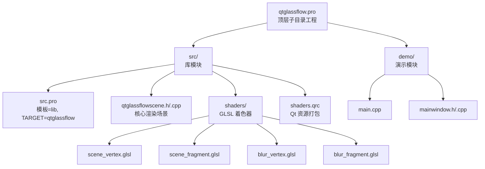
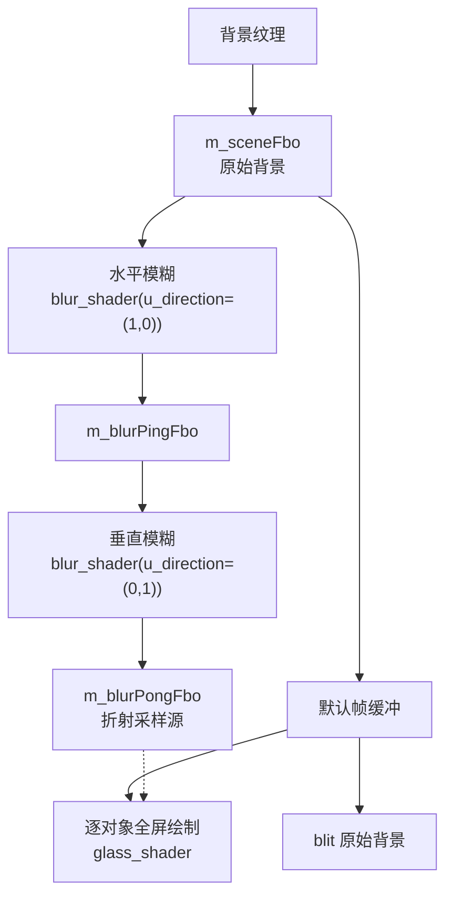
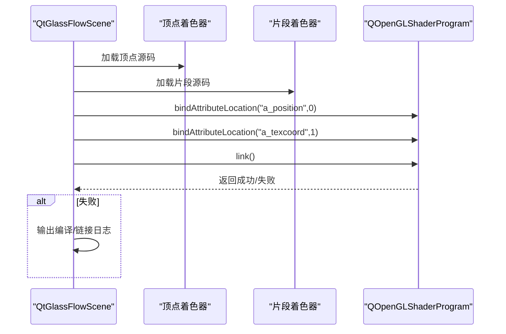
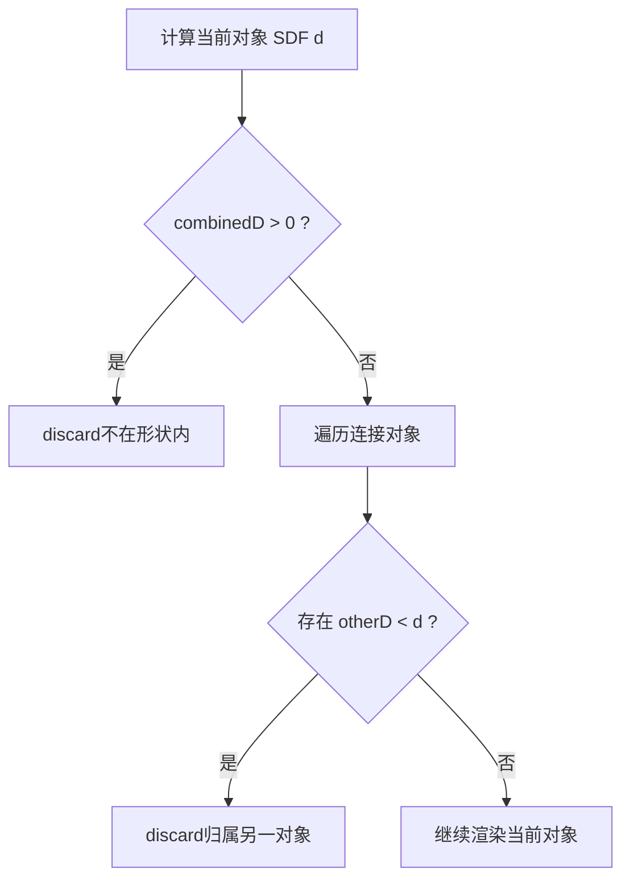
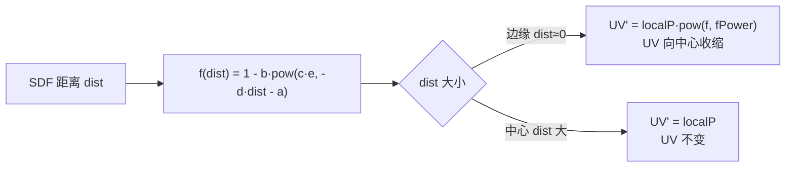
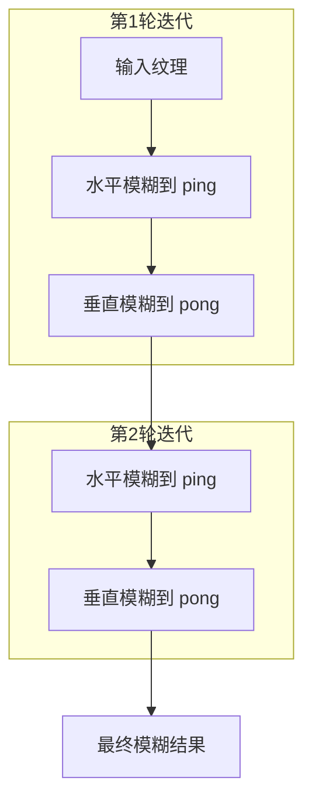
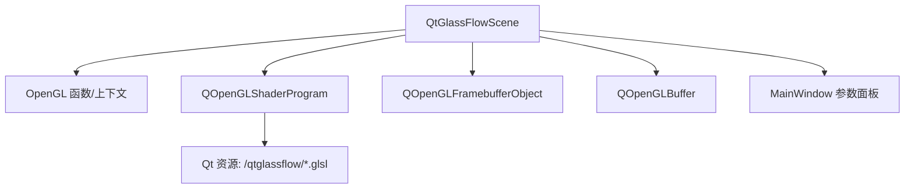

# 着色器开发与优化

<cite>
**本文档引用的文件**
- [README.md](file://README.md)
- [scene_vertex.glsl](file://src/shaders/scene_vertex.glsl)
- [scene_fragment.glsl](file://src/shaders/scene_fragment.glsl)
- [blur_vertex.glsl](file://src/shaders/blur_vertex.glsl)
- [blur_fragment.glsl](file://src/shaders/blur_fragment.glsl)
- [qtglassflowscene.h](file://src/qtglassflowscene.h)
- [qtglassflowscene.cpp](file://src/qtglassflowscene.cpp)
- [shaders.qrc](file://src/shaders.qrc)
- [mainwindow.h](file://demo/mainwindow.h)
- [mainwindow.cpp](file://demo/mainwindow.cpp)
- [main.cpp](file://demo/main.cpp)
- [qtglassflow.pro](file://qtglassflow.pro)
- [src.pro](file://src/src.pro)
</cite>

## 目录
1. [简介](#简介)
2. [项目结构](#项目结构)
3. [核心组件](#核心组件)
4. [架构总览](#架构总览)
5. [详细组件分析](#详细组件分析)
6. [依赖关系分析](#依赖关系分析)
7. [性能考量](#性能考量)
8. [故障排查指南](#故障排查指南)
9. [结论](#结论)
10. [附录](#附录)

## 简介
本指南面向高级开发者，围绕液体玻璃效果的着色器开发与优化展开，涵盖顶点与片段着色器的开发规范、OpenGL 2.1 兼容性要求、着色器程序编译与链接流程、SDF 数学原理与折射计算、分离式高斯模糊算法、调试技巧、性能优化策略以及 Qt 资源系统集成最佳实践。文中所有技术细节均来自仓库中的实际实现与文档说明。

## 项目结构
该项目采用子模块组织，核心库位于 src，演示程序位于 demo，着色器资源通过 Qt 资源系统打包。整体结构如下：

图表来源
- [qtglassflow.pro:1-4](file://qtglassflow.pro#L1-L4)
- [src.pro:1-15](file://src/src.pro#L1-L15)
- [shaders.qrc:1-9](file://src/shaders.qrc#L1-L9)

章节来源
- [qtglassflow.pro:1-4](file://qtglassflow.pro#L1-L4)
- [src.pro:1-15](file://src/src.pro#L1-L15)
- [shaders.qrc:1-9](file://src/shaders.qrc#L1-L9)

## 核心组件
- 渲染场景核心：QtGlassFlowScene（继承 QOpenGLWidget），负责初始化 OpenGL、管理 FBO 管线、编译链接着色器、驱动每帧渲染与交互。
- 着色器集合：场景顶点/片段着色器用于玻璃对象绘制，模糊顶点/片段着色器用于背景模糊与折射采样。
- Qt 资源系统：shaders.qrc 将 GLSL 文件打包为 Qt 资源，便于运行时加载。
- 演示应用：main.cpp 与 MainWindow 提供参数面板与交互，实时调整全局渲染参数。

章节来源
- [qtglassflowscene.h:17-142](file://src/qtglassflowscene.h#L17-L142)
- [qtglassflowscene.cpp:51-104](file://src/qtglassflowscene.cpp#L51-L104)
- [shaders.qrc:1-9](file://src/shaders.qrc#L1-L9)
- [mainwindow.cpp:15-31](file://demo/mainwindow.cpp#L15-L31)

## 架构总览
液体玻璃渲染采用“背景模糊 + 多对象玻璃层合成”的管线，核心流程如下：

图表来源
- [qtglassflowscene.cpp:293-359](file://src/qtglassflowscene.cpp#L293-L359)
- [qtglassflowscene.cpp:510-539](file://src/qtglassflowscene.cpp#L510-L539)

章节来源
- [README.md:171-194](file://README.md#L171-L194)
- [qtglassflowscene.cpp:293-359](file://src/qtglassflowscene.cpp#L293-L359)
- [qtglassflowscene.cpp:510-539](file://src/qtglassflowscene.cpp#L510-L539)

## 详细组件分析

### 顶点着色器与片段着色器开发规范
- 顶点着色器职责：接收位置与纹理坐标属性，输出裁剪空间坐标与片元纹理坐标。
- 片段着色器职责：基于 SDF 超椭圆与 smooth-union 实现多对象融合；根据 SDF 距离计算折射 UV；应用穹顶光照、色调混合、极细边框与抗锯齿；输出最终颜色。

章节来源
- [scene_vertex.glsl:1-9](file://src/shaders/scene_vertex.glsl#L1-L9)
- [scene_fragment.glsl:1-149](file://src/shaders/scene_fragment.glsl#L1-L149)

### OpenGL 2.1 兼容性与着色器编译链接流程
- 兼容性要点：使用 GLSL 120 内置函数（如 fwidth、texture2D），不声明扩展；使用 attribute/varying 语法；兼容 OpenGL 2.1 Compatibility Profile。
- 编译链接流程：先添加顶点/片段源码，绑定属性位置，再链接程序；失败时记录日志并警告。

图表来源
- [qtglassflowscene.cpp:138-157](file://src/qtglassflowscene.cpp#L138-L157)

章节来源
- [README.md:367-373](file://README.md#L367-L373)
- [qtglassflowscene.cpp:138-157](file://src/qtglassflowscene.cpp#L138-L157)

### SDF 数学原理与 smooth-union 桥接
- SDF 超椭圆：对任意点计算到形状边缘的有符号距离，结合归一化梯度保证像素级过渡精度。
- smooth-union：使用多项式平滑最小值函数，在两个形状距离差很小时进行圆滑过渡，形成液桥效果；桥宽度由连接强度与经验系数共同决定。

图表来源
- [scene_fragment.glsl:66-95](file://src/shaders/scene_fragment.glsl#L66-L95)

章节来源
- [README.md:215-284](file://README.md#L215-L284)
- [scene_fragment.glsl:40-95](file://src/shaders/scene_fragment.glsl#L40-L95)

### 折射计算与 UV 变形
- 基于指数衰减曲线对 SDF 距离进行非线性变换，得到 UV 变形因子；边缘 dist≈0 时 UV 向中心收缩，中心 dist 较大时 UV 不变，从而实现边缘扭曲、中心清晰的玻璃质感。
- 折射参数（a、b、c、d、fPower）控制曲线形状与强度。

图表来源
- [scene_fragment.glsl:50-53](file://src/shaders/scene_fragment.glsl#L50-L53)
- [scene_fragment.glsl:118-121](file://src/shaders/scene_fragment.glsl#L118-L121)

章节来源
- [README.md:286-319](file://README.md#L286-L319)
- [scene_fragment.glsl:50-53](file://src/shaders/scene_fragment.glsl#L50-L53)
- [scene_fragment.glsl:118-121](file://src/shaders/scene_fragment.glsl#L118-L121)

### 分离式高斯模糊算法
- 采用水平 + 垂直两阶段 1D 9-tap 高斯核，支持多次迭代以等效更大半径；每次迭代在 ping-pong FBO 之间切换，避免单次大核带来的性能与精度问题。
- 核心权重与偏移常量在片段着色器中直接给出，u_radius 与 u_direction 控制采样步长与方向。

图表来源
- [blur_fragment.glsl:9-23](file://src/shaders/blur_fragment.glsl#L9-L23)
- [qtglassflowscene.cpp:316-359](file://src/qtglassflowscene.cpp#L316-L359)

章节来源
- [README.md:195-214](file://README.md#L195-L214)
- [blur_fragment.glsl:1-24](file://src/shaders/blur_fragment.glsl#L1-L24)
- [qtglassflowscene.cpp:316-359](file://src/qtglassflowscene.cpp#L316-L359)

### 凸面穹顶光照与抗锯齿
- 凸面光照：基于 localP.y 的线性渐变，底部略暗、顶部略亮，增强体积感。
- 抗锯齿：使用 fwidth 获取 SDF 距离在像素间的梯度，结合 clamp 限制范围，实现分辨率无关的锐利边缘；极细边框线叠加白色反光，提升轮廓表现。

章节来源
- [README.md:320-366](file://README.md#L320-L366)
- [scene_fragment.glsl:130-145](file://src/shaders/scene_fragment.glsl#L130-L145)

### Qt 资源系统与着色器加载
- shaders.qrc 将四个 GLSL 文件打包为 Qt 资源，路径前缀为 /qtglassflow。
- 演示程序通过资源路径加载着色器源码，库模块在运行时从资源读取并编译链接。

章节来源
- [shaders.qrc:1-9](file://src/shaders.qrc#L1-L9)
- [qtglassflowscene.cpp:204-213](file://src/qtglassflowscene.cpp#L204-L213)

## 依赖关系分析
- QtGlassFlowScene 依赖 OpenGL 上下文与 QOpenGLShaderProgram 进行着色器编译与链接；依赖 QOpenGLFramebufferObject 管理 FBO；依赖 QOpenGLBuffer 绘制全屏四边形。
- 着色器依赖 Qt 资源系统提供的 GLSL 源码；片段着色器依赖顶点着色器输出的纹理坐标。
- 演示应用 MainWindow 通过信号槽与 QtGlassFlowScene 交互，实时更新全局渲染参数。

图表来源
- [qtglassflowscene.h:17-142](file://src/qtglassflowscene.h#L17-L142)
- [qtglassflowscene.cpp:187-225](file://src/qtglassflowscene.cpp#L187-L225)
- [shaders.qrc:1-9](file://src/shaders.qrc#L1-L9)
- [mainwindow.cpp:131-141](file://demo/mainwindow.cpp#L131-L141)

章节来源
- [qtglassflowscene.h:17-142](file://src/qtglassflowscene.h#L17-L142)
- [qtglassflowscene.cpp:187-225](file://src/qtglassflowscene.cpp#L187-L225)
- [shaders.qrc:1-9](file://src/shaders.qrc#L1-L9)
- [mainwindow.cpp:131-141](file://demo/mainwindow.cpp#L131-L141)

## 性能考量
- 指令优化
  - 使用内置函数 fwidth 计算梯度，避免昂贵的外部导数计算；在 smooth-union 过渡区对 fwidth 进行 clamp，防止退化与光晕。
  - 将常量权重与偏移直接写入着色器，减少 uniform 数量与分支开销。
- 纹理采样优化
  - 模糊阶段使用线性过滤与 CLAMP_TO_EDGE，减少边界伪影；迭代次数 m_blurIterations 可调，平衡质量与性能。
  - 折射采样使用单次 texture2D，配合预模糊背景纹理，避免重复模糊。
- 内存访问模式改进
  - 全屏四边形使用静态 VBO，一次绑定多次绘制；FBO 纹理设置线性过滤与边缘包裹，降低采样成本。
- 渲染管线优化
  - 分离式高斯模糊 ping-pong 交替使用，避免单次大核；按需启用混合，减少不必要的像素写入。

章节来源
- [README.md:195-214](file://README.md#L195-L214)
- [scene_fragment.glsl:138-145](file://src/shaders/scene_fragment.glsl#L138-L145)
- [qtglassflowscene.cpp:235-264](file://src/qtglassflowscene.cpp#L235-L264)
- [qtglassflowscene.cpp:316-359](file://src/qtglassflowscene.cpp#L316-L359)

## 故障排查指南
- 着色器编译/链接失败
  - 现象：编译或链接日志输出警告。
  - 排查：检查 GLSL 版本与语法（GLSL 120），确认未使用不受支持的扩展；核对属性绑定与 uniform 名称一致性。
  - 参考路径：[编译链接流程:138-157](file://src/qtglassflowscene.cpp#L138-L157)，[GLSL 120 兼容性:367-373](file://README.md#L367-L373)
- 折射效果异常
  - 现象：边缘过度扭曲或中心失真。
  - 排查：检查折射参数 a/b/c/d/fPower 的取值范围；确认 SDF 距离计算与 UV 变换逻辑一致。
  - 参考路径：[折射曲线与 UV 变换:50-53](file://src/shaders/scene_fragment.glsl#L50-L53)，[折射采样:118-121](file://src/shaders/scene_fragment.glsl#L118-L121)
- 抗锯齿边缘发虚或过锐
  - 现象：边缘出现光晕或锯齿。
  - 排查：检查 fwidth 的 clamp 范围与 smoothstep 边界；确认模糊半径与迭代次数设置合理。
  - 参考路径：[抗锯齿实现:138-145](file://src/shaders/scene_fragment.glsl#L138-L145)，[模糊核:9-23](file://src/shaders/blur_fragment.glsl#L9-L23)
- 模糊性能瓶颈
  - 现象：帧率下降。
  - 排查：降低 m_blurIterations 或 u_radius；确认 ping-pong FBO 正确切换；避免在主循环中频繁重建 FBO。
  - 参考路径：[模糊迭代流程:316-359](file://src/qtglassflowscene.cpp#L316-L359)，[FBO 创建/销毁:235-264](file://src/qtglassflowscene.cpp#L235-L264)

章节来源
- [qtglassflowscene.cpp:138-157](file://src/qtglassflowscene.cpp#L138-L157)
- [README.md:367-373](file://README.md#L367-L373)
- [scene_fragment.glsl:50-53](file://src/shaders/scene_fragment.glsl#L50-L53)
- [scene_fragment.glsl:118-121](file://src/shaders/scene_fragment.glsl#L118-L121)
- [scene_fragment.glsl:138-145](file://src/shaders/scene_fragment.glsl#L138-L145)
- [blur_fragment.glsl:9-23](file://src/shaders/blur_fragment.glsl#L9-L23)
- [qtglassflowscene.cpp:316-359](file://src/qtglassflowscene.cpp#L316-L359)
- [qtglassflowscene.cpp:235-264](file://src/qtglassflowscene.cpp#L235-L264)

## 结论
本项目以 OpenGL 2.1 兼容为目标，通过 SDF 超椭圆与 smooth-union 实现液态桥接，结合分离式高斯模糊与指数型折射模型，营造出细腻真实的液体玻璃效果。着色器开发遵循 GLSL 120 规范，渲染管线采用 FBO ping-pong 与 alpha 混合合成，兼顾质量与性能。Qt 资源系统简化了着色器资源管理，便于跨平台部署。建议在实际工程中沿用本指南的调试与优化策略，并根据目标平台进一步评估 uniform 数量与分支条件，持续迭代以获得更佳的视觉与性能平衡。

## 附录
- 关键实现路径参考
  - [场景初始化与着色器编译:187-225](file://src/qtglassflowscene.cpp#L187-L225)
  - [背景模糊与合成:293-359](file://src/qtglassflowscene.cpp#L293-L359)
  - [玻璃对象绘制与参数传递:394-476](file://src/qtglassflowscene.cpp#L394-L476)
  - [参数面板与实时参数应用:131-141](file://demo/mainwindow.cpp#L131-L141)
  - [Qt 资源打包与加载:1-9](file://src/shaders.qrc#L1-L9)