# 自定义渲染引擎开发

<cite>
**本文档引用的文件**
- [qtglassflowscene.h](file://src/qtglassflowscene.h)
- [qtglassflowscene.cpp](file://src/qtglassflowscene.cpp)
- [mainwindow.h](file://demo/mainwindow.h)
- [mainwindow.cpp](file://demo/mainwindow.cpp)
- [blur_vertex.glsl](file://src/shaders/blur_vertex.glsl)
- [blur_fragment.glsl](file://src/shaders/blur_fragment.glsl)
- [scene_vertex.glsl](file://src/shaders/scene_vertex.glsl)
- [scene_fragment.glsl](file://src/shaders/scene_fragment.glsl)
- [README.md](file://README.md)
- [qtglassflow.pro](file://qtglassflow.pro)
- [src.pro](file://src/src.pro)
- [demo.pro](file://demo/demo.pro)
</cite>

## 目录
1. [简介](#简介)
2. [项目结构](#项目结构)
3. [核心组件](#核心组件)
4. [架构概览](#架构概览)
5. [详细组件分析](#详细组件分析)
6. [依赖关系分析](#依赖关系分析)
7. [性能考虑](#性能考虑)
8. [故障排除指南](#故障排除指南)
9. [结论](#结论)
10. [附录](#附录)

## 简介

QtGlassFlowScene 是一个基于 Qt + OpenGL 的液态玻璃效果渲染库，专为高级开发者设计，提供了完整的自定义渲染引擎开发框架。该引擎实现了基于 SDF（有符号距离场）的超椭圆玻璃对象渲染，具备折射、模糊、噪声与粘性桥接等高级视觉效果。

本指南将深入解析 QtGlassFlowScene 类的架构设计，包括 OpenGL 上下文管理、FBO 多重缓冲技术、着色器程序生命周期管理，以及如何继承该类进行二次开发。同时提供完整的扩展示例，涵盖新渲染效果添加、现有算法修改和第三方图形库集成。

## 项目结构

该项目采用模块化设计，主要包含以下核心组件：

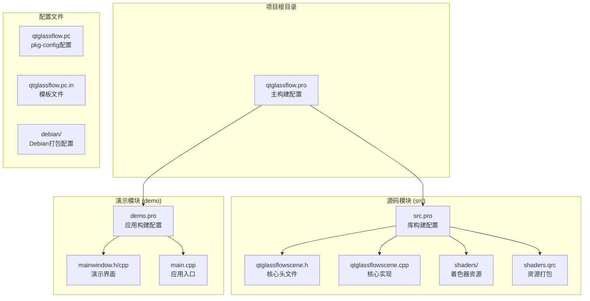

**图表来源**
- [qtglassflow.pro:1-4](file://qtglassflow.pro#L1-L4)
- [src.pro:1-15](file://src/src.pro#L1-L15)
- [demo.pro:1-14](file://demo/demo.pro#L1-L14)

**章节来源**
- [qtglassflow.pro:1-4](file://qtglassflow.pro#L1-L4)
- [src/src.pro:1-15](file://src/src.pro#L1-L15)
- [demo/demo.pro:1-14](file://demo/demo.pro#L1-L14)

## 核心组件

### QtGlassFlowScene 类架构

QtGlassFlowScene 是整个渲染引擎的核心类，继承自 QOpenGLWidget 并实现了完整的 OpenGL 渲染管线。该类的设计体现了高度的模块化和可扩展性。

#### 主要数据结构

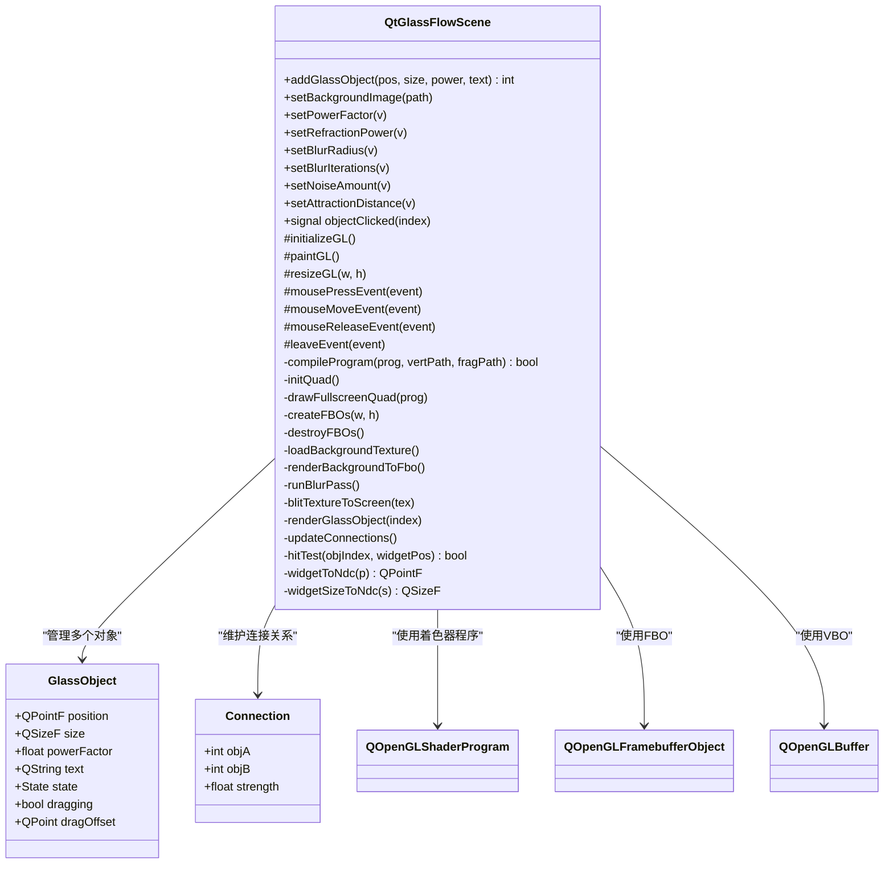

**图表来源**
- [qtglassflowscene.h:17-142](file://src/qtglassflowscene.h#L17-L142)

#### 关键接口设计

QtGlassFlowScene 提供了丰富的公共接口，支持动态参数调整和实时渲染控制：

| 接口名称 | 参数类型 | 功能描述 |
|---------|----------|----------|
| `addGlassObject` | `QPointF, QSizeF, float, QString` | 添加玻璃对象，返回对象索引 |
| `setBackgroundImage` | `QString` | 设置背景图像路径 |
| `setPowerFactor` | `float` | 设置全局超椭圆幂因子 |
| `setRefractionPower` | `float` | 设置折射强度 |
| `setBlurRadius` | `float` | 设置模糊半径 |
| `setBlurIterations` | `int` | 设置模糊迭代次数 |
| `setNoiseAmount` | `float` | 设置噪声量 |
| `setAttractionDistance` | `float` | 设置粘性吸引距离 |

**章节来源**
- [qtglassflowscene.h:42-61](file://src/qtglassflowscene.h#L42-L61)
- [qtglassflowscene.h:131-136](file://src/qtglassflowscene.h#L131-L136)

## 架构概览

### 渲染管线架构

QtGlassFlowScene 实现了一个完整的 OpenGL 渲染管线，采用 FBO 多重缓冲技术和分离式高斯模糊算法：

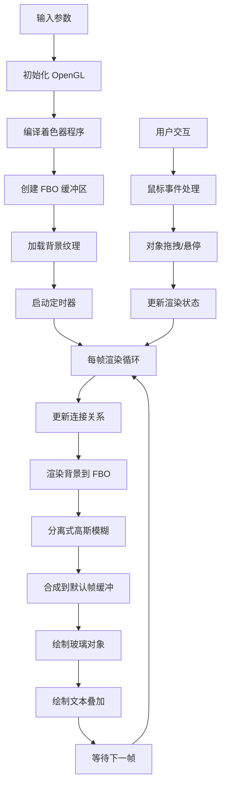

**图表来源**
- [qtglassflowscene.cpp:510-566](file://src/qtglassflowscene.cpp#L510-L566)

### OpenGL 上下文管理

该引擎采用了严格的 OpenGL 上下文管理策略，确保资源的安全分配和释放：

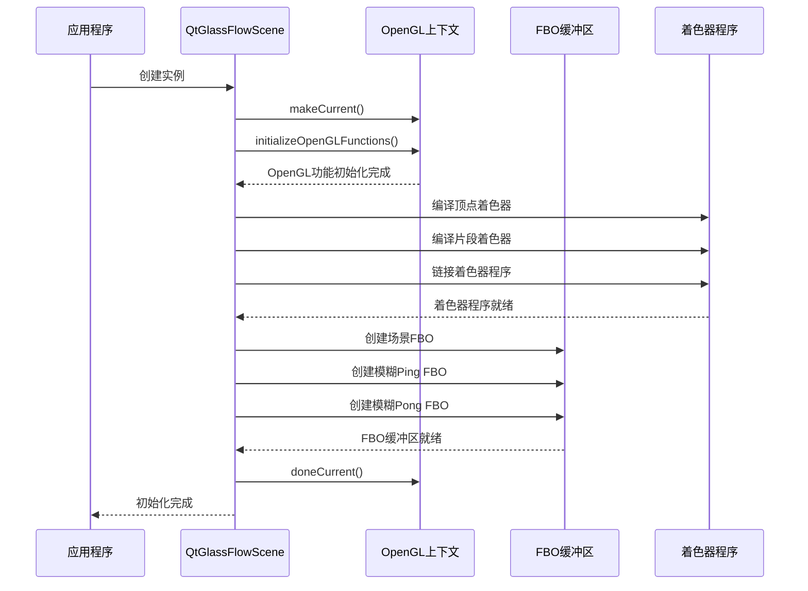

**图表来源**
- [qtglassflowscene.cpp:187-225](file://src/qtglassflowscene.cpp#L187-L225)
- [qtglassflowscene.cpp:235-264](file://src/qtglassflowscene.cpp#L235-L264)

**章节来源**
- [qtglassflowscene.cpp:51-104](file://src/qtglassflowscene.cpp#L51-L104)
- [qtglassflowscene.cpp:187-225](file://src/qtglassflowscene.cpp#L187-L225)

## 详细组件分析

### FBO 多重缓冲系统

QtGlassFlowScene 实现了高效的 FBO 多重缓冲系统，用于支持分离式高斯模糊算法：

#### FBO 创建与配置

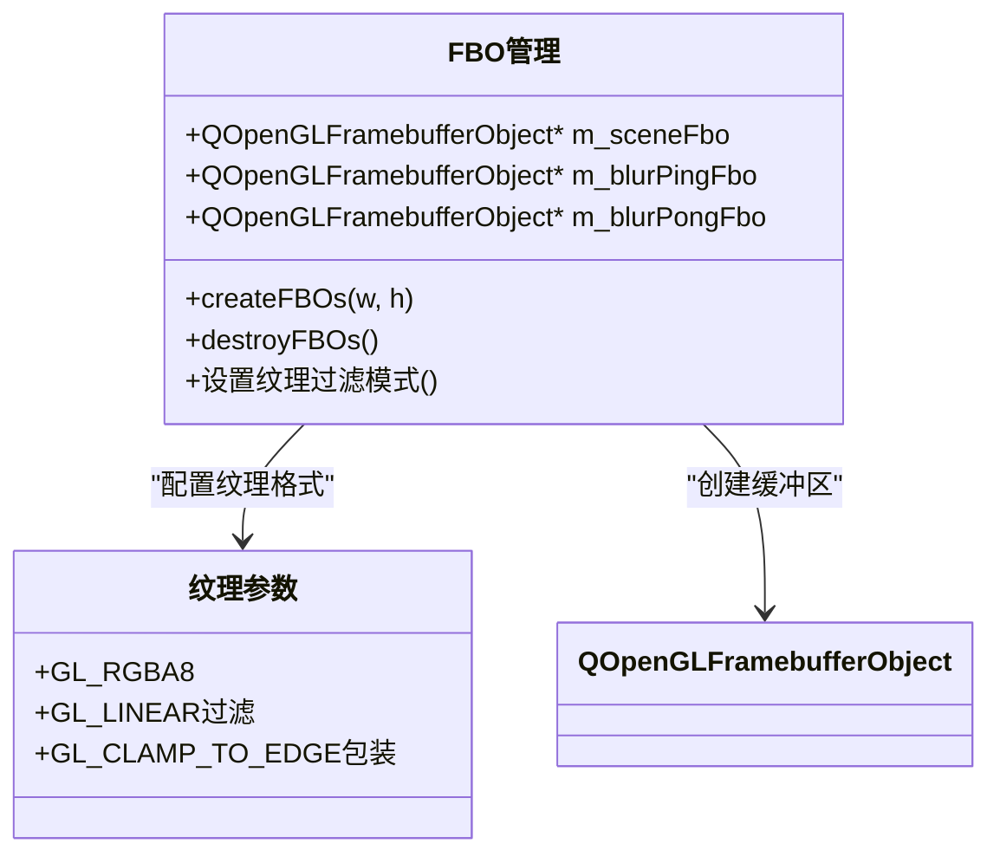

**图表来源**
- [qtglassflowscene.cpp:235-264](file://src/qtglassflowscene.cpp#L235-L264)

#### 分离式高斯模糊算法

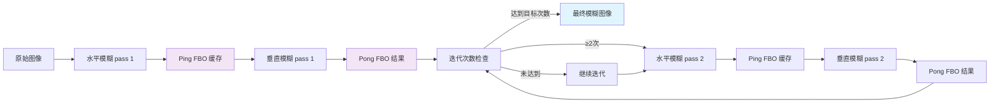

**图表来源**
- [qtglassflowscene.cpp:316-359](file://src/qtglassflowscene.cpp#L316-L359)

**章节来源**
- [qtglassflowscene.cpp:235-264](file://src/qtglassflowscene.cpp#L235-L264)
- [qtglassflowscene.cpp:316-359](file://src/qtglassflowscene.cpp#L316-L359)

### 着色器程序生命周期

QtGlassFlowScene 管理着三个核心着色器程序，每个都有特定的职责：

#### 着色器程序架构

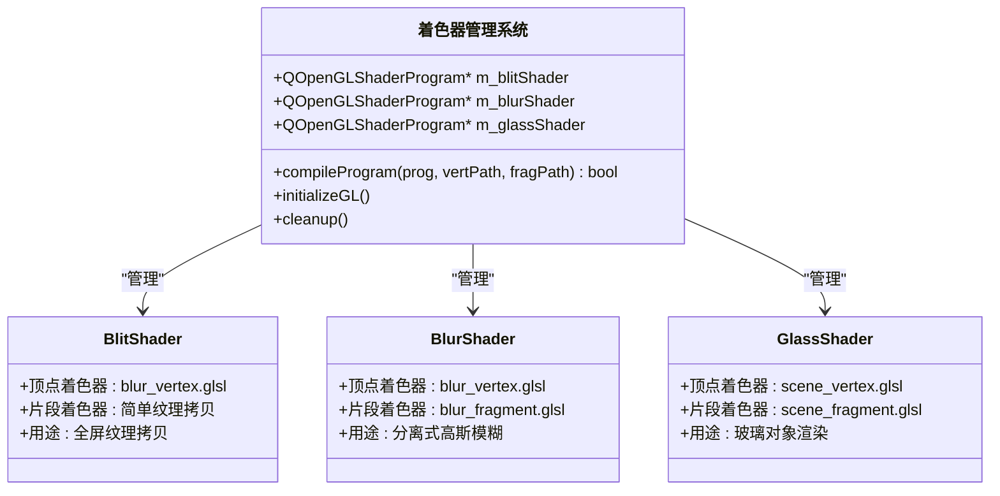

**图表来源**
- [qtglassflowscene.cpp:138-157](file://src/qtglassflowscene.cpp#L138-L157)
- [qtglassflowscene.cpp:194-214](file://src/qtglassflowscene.cpp#L194-L214)

#### 着色器编译流程

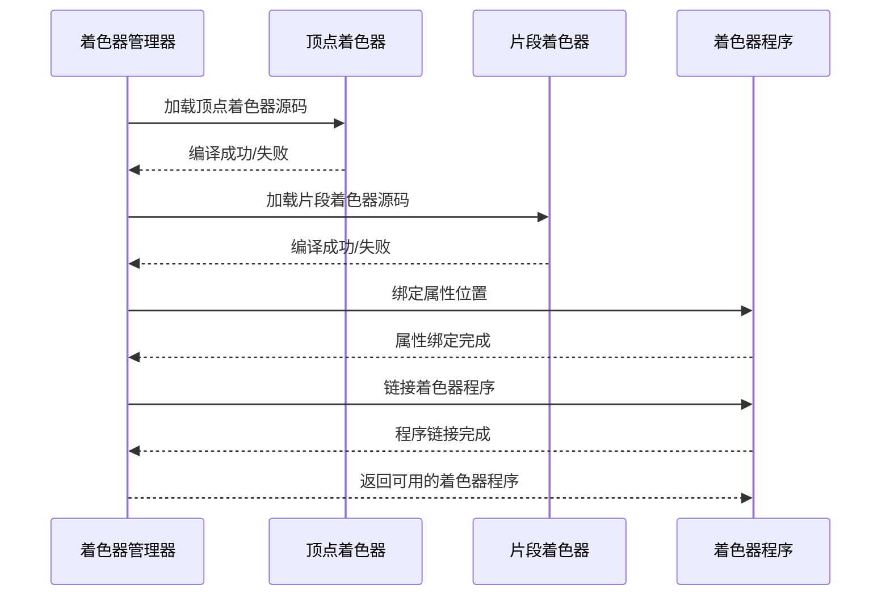

**图表来源**
- [qtglassflowscene.cpp:138-157](file://src/qtglassflowscene.cpp#L138-L157)

**章节来源**
- [qtglassflowscene.cpp:138-157](file://src/qtglassflowscene.cpp#L138-L157)
- [qtglassflowscene.cpp:194-214](file://src/qtglassflowscene.cpp#L194-L214)

### 交互系统扩展

QtGlassFlowScene 提供了完整的鼠标交互系统，支持对象拖拽、悬停检测和点击事件：

#### 交互状态机

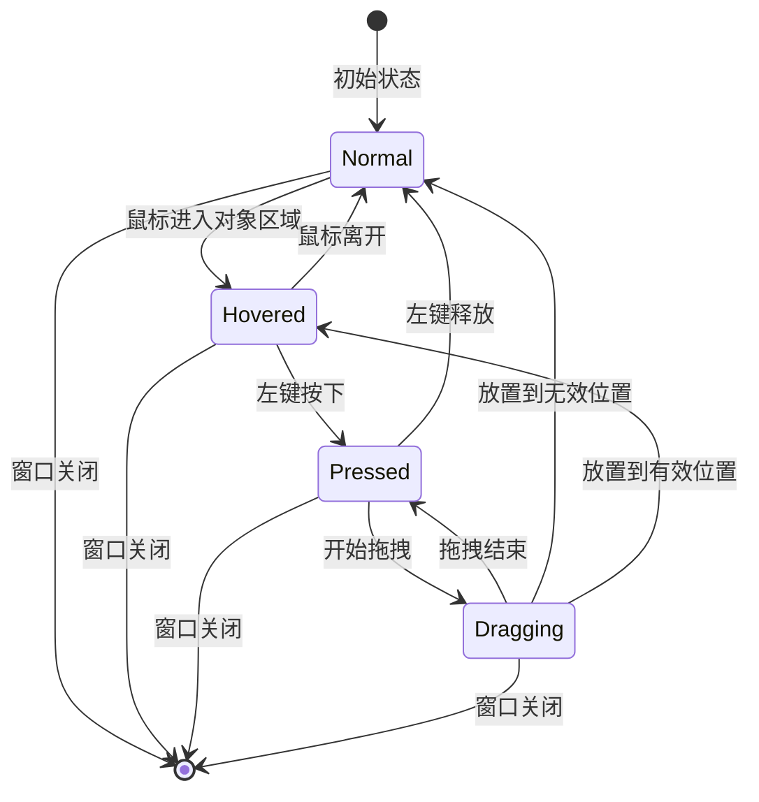

**图表来源**
- [qtglassflowscene.h:21](file://src/qtglassflowscene.h#L21)
- [qtglassflowscene.cpp:587-667](file://src/qtglassflowscene.cpp#L587-L667)

#### 鼠标事件处理流程

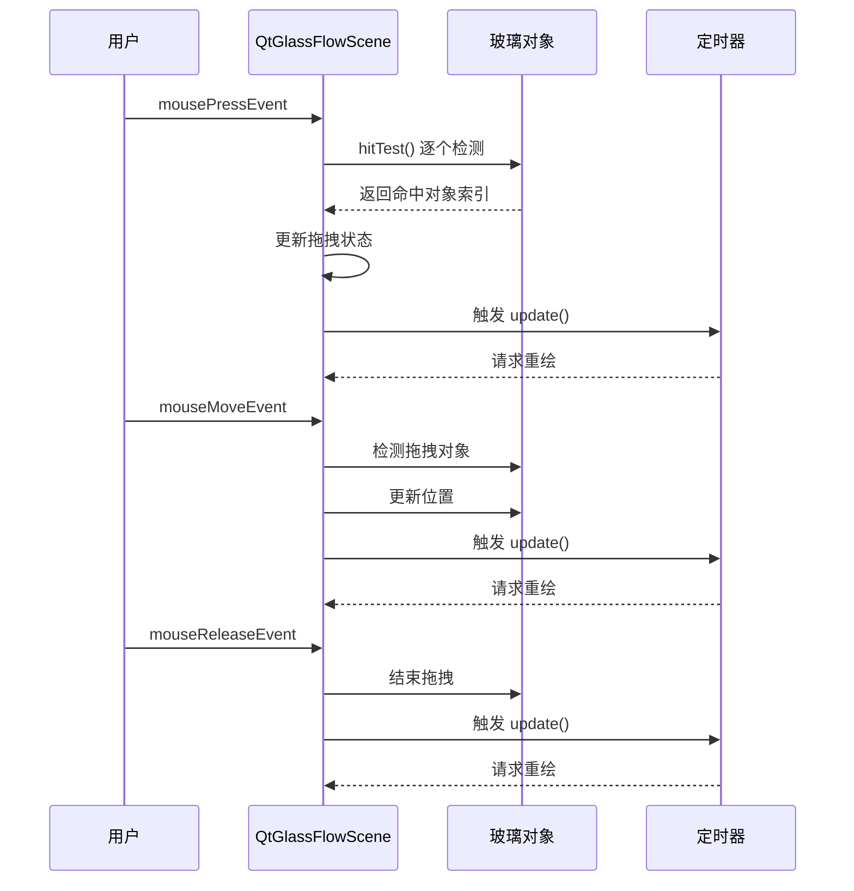

**图表来源**
- [qtglassflowscene.cpp:587-667](file://src/qtglassflowscene.cpp#L587-L667)

**章节来源**
- [qtglassflowscene.cpp:587-667](file://src/qtglassflowscene.cpp#L587-L667)

## 依赖关系分析

### 外部依赖关系

QtGlassFlowScene 依赖于 Qt 框架的多个模块，形成了清晰的层次化依赖结构：

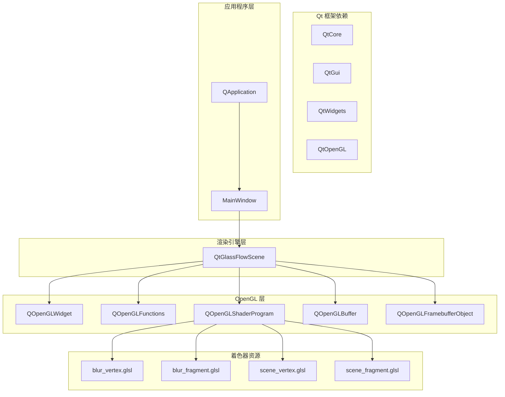

**图表来源**
- [src/src.pro:4](file://src/src.pro#L4)
- [demo/demo.pro:3](file://demo/demo.pro#L3)

### 内部组件依赖

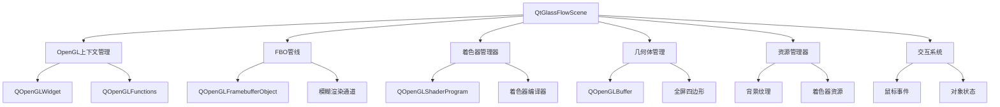

**图表来源**
- [qtglassflowscene.h:71-139](file://src/qtglassflowscene.h#L71-L139)

**章节来源**
- [src/src.pro:4](file://src/src.pro#L4)
- [demo/demo.pro:3](file://demo/demo.pro#L3)

## 性能考虑

### 渲染性能优化策略

QtGlassFlowScene 实现了多项性能优化技术，确保在各种硬件配置下都能保持流畅的渲染效果：

#### FBO 缓冲区优化

- **线性过滤**: 所有 FBO 纹理都使用 GL_LINEAR 过滤，减少采样伪影
- **边缘包装**: 使用 GL_CLAMP_TO_EDGE 包装模式，避免模糊边缘的重复纹理
- **RGBA8 格式**: 选择合适的纹理格式平衡质量和内存占用

#### 着色器性能优化

- **GLSL 120 兼容**: 确保广泛的硬件兼容性
- **内置函数优化**: 使用 GPU 内置的导数函数进行抗锯齿
- **uniform 数组限制**: 限制连接数量至 8 个，避免超出硬件限制

#### 内存管理最佳实践

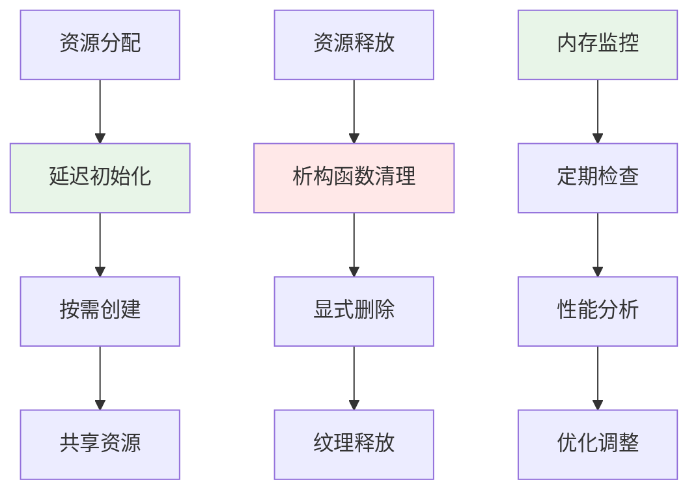

**章节来源**
- [qtglassflowscene.cpp:246-256](file://src/qtglassflowscene.cpp#L246-L256)
- [qtglassflowscene.cpp:90-104](file://src/qtglassflowscene.cpp#L90-L104)

### 性能基准测试

建议开发者在不同硬件配置下进行性能基准测试，重点关注以下指标：

- **帧率稳定性**: 在 60 FPS 下保持稳定
- **内存占用**: 监控纹理和缓冲区内存使用
- **CPU/GPU 占用**: 平衡 CPU 和 GPU 负载
- **响应延迟**: 鼠标交互的响应时间

## 故障排除指南

### 常见问题及解决方案

#### OpenGL 上下文问题

**问题**: 着色器编译失败或链接失败
**解决方案**: 
1. 检查 OpenGL 版本兼容性（需要 OpenGL 2.1+）
2. 验证着色器源码语法
3. 确认 QOpenGLFunctions 初始化完成

#### FBO 缓冲区问题

**问题**: 模糊效果异常或渲染黑屏
**解决方案**:
1. 检查 FBO 创建是否成功
2. 验证纹理格式和过滤设置
3. 确认渲染目标切换正确

#### 性能问题

**问题**: 帧率下降或内存泄漏
**解决方案**:
1. 减少模糊迭代次数
2. 降低对象数量
3. 检查资源释放逻辑

**章节来源**
- [qtglassflowscene.cpp:142-155](file://src/qtglassflowscene.cpp#L142-L155)
- [qtglassflowscene.cpp:259-264](file://src/qtglassflowscene.cpp#L259-L264)

### 调试技巧

1. **启用调试输出**: 使用 qWarning() 输出调试信息
2. **逐步验证**: 分步骤验证每个渲染阶段
3. **性能分析**: 使用性能分析工具监控资源使用
4. **错误检查**: 在关键 OpenGL 调用后检查错误状态

## 结论

QtGlassFlowScene 提供了一个完整且高性能的自定义渲染引擎框架，具有以下优势：

1. **模块化设计**: 清晰的组件分离和职责划分
2. **高性能渲染**: 优化的 FBO 管线和着色器程序管理
3. **易于扩展**: 完善的接口设计支持二次开发
4. **跨平台兼容**: 基于 Qt 的跨平台渲染解决方案

通过深入理解本指南中的架构设计和实现细节，高级开发者可以基于 QtGlassFlowScene 构建更加复杂和个性化的渲染效果，满足各种创意和商业需求。

## 附录

### 扩展开发示例

#### 添加新的渲染效果

要在 QtGlassFlowScene 中添加新的渲染效果，建议遵循以下步骤：

1. **创建新的着色器程序**: 在 shaders 目录添加新的 GLSL 文件
2. **注册着色器程序**: 在 initializeGL() 中创建和编译新着色器
3. **实现渲染逻辑**: 在 paintGL() 或专门的渲染函数中使用新着色器
4. **添加控制接口**: 提供公共接口允许外部控制新效果参数

#### 修改现有算法

修改现有算法时，建议：

1. **保持向后兼容**: 确保新算法与现有接口兼容
2. **参数化设计**: 将算法参数化，支持运行时调整
3. **性能考量**: 评估算法复杂度对性能的影响
4. **测试验证**: 充分测试修改后的效果和性能

#### 集成第三方图形库

集成第三方图形库时：

1. **抽象层设计**: 通过抽象层隔离第三方库的具体实现
2. **资源管理**: 统一管理第三方库的资源生命周期
3. **错误处理**: 实现完善的错误处理和恢复机制
4. **性能监控**: 监控第三方库对整体性能的影响

**章节来源**
- [qtglassflowscene.cpp:194-214](file://src/qtglassflowscene.cpp#L194-L214)
- [qtglassflowscene.cpp:510-566](file://src/qtglassflowscene.cpp#L510-L566)