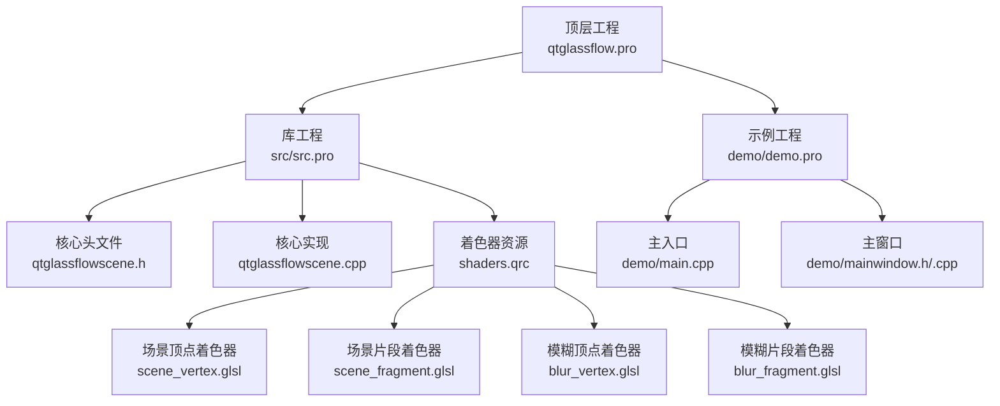
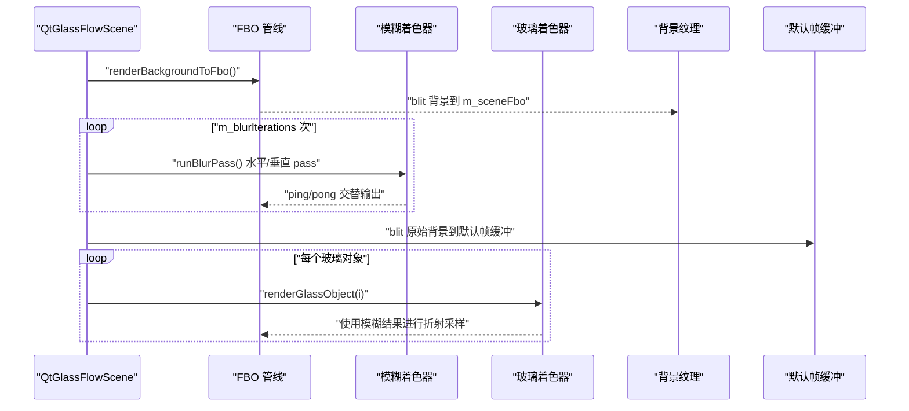
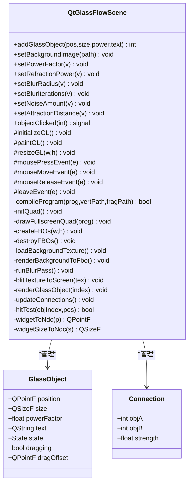
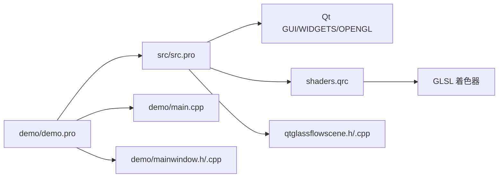

# 高级开发指南

<cite>
**本文档引用的文件**
- [README.md](file://README.md)
- [qtglassflow.pro](file://qtglassflow.pro)
- [src/src.pro](file://src/src.pro)
- [demo/demo.pro](file://demo/demo.pro)
- [src/qtglassflowscene.h](file://src/qtglassflowscene.h)
- [src/qtglassflowscene.cpp](file://src/qtglassflowscene.cpp)
- [src/shaders/scene_vertex.glsl](file://src/shaders/scene_vertex.glsl)
- [src/shaders/scene_fragment.glsl](file://src/shaders/scene_fragment.glsl)
- [src/shaders/blur_vertex.glsl](file://src/shaders/blur_vertex.glsl)
- [src/shaders/blur_fragment.glsl](file://src/shaders/blur_fragment.glsl)
- [src/shaders.qrc](file://src/shaders.qrc)
- [demo/mainwindow.h](file://demo/mainwindow.h)
- [demo/mainwindow.cpp](file://demo/mainwindow.cpp)
- [demo/main.cpp](file://demo/main.cpp)
</cite>

## 目录
1. [简介](#简介)
2. [项目结构](#项目结构)
3. [核心组件](#核心组件)
4. [架构总览](#架构总览)
5. [详细组件分析](#详细组件分析)
6. [依赖关系分析](#依赖关系分析)
7. [性能考虑](#性能考虑)
8. [故障排查指南](#故障排查指南)
9. [结论](#结论)
10. [附录](#附录)

## 简介
本指南面向高级开发者，围绕液体玻璃效果扩展开发，系统讲解如何继承 QtGlassFlowScene 创建自定义渲染效果、如何开发与调试 GLSL 着色器（OpenGL 2.1/ GLSL 120 兼容）、如何进行性能优化（渲染批处理、纹理压缩、着色器优化、内存管理）、如何集成第三方图形库与扩展功能，以及如何使用调试工具（OpenGL 调试器、性能分析器、着色器调试技巧）。文档同时提供代码级架构图与流程图，帮助你构建可维护的扩展系统。

## 项目结构
该项目采用子模块结构，顶层通过 subdirs 管理 src（库）与 demo（示例）两个子工程，资源通过 Qt Resource Collection 组织，核心渲染逻辑封装在 QtGlassFlowScene 中，示例应用通过参数面板实时调整全局渲染参数。

图表来源
- [qtglassflow.pro:1-4](file://qtglassflow.pro#L1-L4)
- [src/src.pro:1-15](file://src/src.pro#L1-L15)
- [demo/demo.pro:1-14](file://demo/demo.pro#L1-L14)
- [src/shaders.qrc:1-9](file://src/shaders.qrc#L1-L9)

章节来源
- [README.md:86-108](file://README.md#L86-L108)
- [qtglassflow.pro:1-4](file://qtglassflow.pro#L1-L4)
- [src/src.pro:1-15](file://src/src.pro#L1-L15)
- [demo/demo.pro:1-14](file://demo/demo.pro#L1-L14)

## 核心组件
- QtGlassFlowScene：继承 QOpenGLWidget，实现液体玻璃渲染管线（背景 FBO、分离式高斯模糊、逐对象玻璃层合成、文本叠加）。提供添加玻璃对象、设置背景、参数调节等公共接口。
- 玻璃对象数据结构：包含位置、尺寸、超椭圆幂、文本标签、交互状态与拖拽偏移。
- 连接数据结构：记录两个对象之间的粘性连接强度与索引。
- 着色器：场景着色器（场景顶点/片段）与模糊着色器（顶点/片段），均使用 GLSL 120 语法，满足 OpenGL 2.1 兼容性。
- 示例应用：MainWindow 提供参数面板，实时调节折射强度、模糊半径、噪声、吸引距离、超椭圆幂等参数。

章节来源
- [src/qtglassflowscene.h:17-142](file://src/qtglassflowscene.h#L17-L142)
- [src/qtglassflowscene.cpp:51-104](file://src/qtglassflowscene.cpp#L51-L104)
- [src/qtglassflowscene.cpp:106-136](file://src/qtglassflowscene.cpp#L106-L136)
- [src/shaders/scene_vertex.glsl:1-9](file://src/shaders/scene_vertex.glsl#L1-L9)
- [src/shaders/scene_fragment.glsl:1-149](file://src/shaders/scene_fragment.glsl#L1-L149)
- [src/shaders/blur_vertex.glsl:1-9](file://src/shaders/blur_vertex.glsl#L1-L9)
- [src/shaders/blur_fragment.glsl:1-24](file://src/shaders/blur_fragment.glsl#L1-L24)
- [demo/mainwindow.h:10-32](file://demo/mainwindow.h#L10-L32)
- [demo/mainwindow.cpp:33-142](file://demo/mainwindow.cpp#L33-L142)

## 架构总览
液体玻璃渲染采用“背景 FBO + 分离式高斯模糊 + 多 Pass 玻璃层合成”的管线。每帧流程包括：背景 blit 到场景 FBO、多次 ping-pong 迭代高斯模糊、将模糊结果作为折射采样源、逐对象绘制全屏 quad，最后叠加文本。

图表来源
- [src/qtglassflowscene.cpp:510-566](file://src/qtglassflowscene.cpp#L510-L566)
- [src/qtglassflowscene.cpp:316-359](file://src/qtglassflowscene.cpp#L316-L359)
- [src/qtglassflowscene.cpp:394-476](file://src/qtglassflowscene.cpp#L394-L476)

章节来源
- [README.md:171-194](file://README.md#L171-L194)
- [src/qtglassflowscene.cpp:510-566](file://src/qtglassflowscene.cpp#L510-L566)

## 详细组件分析

### QtGlassFlowScene 类设计与继承要点
- 继承关系：QtGlassFlowScene 继承 QOpenGLWidget 并实现 QOpenGLFunctions，负责 OpenGL 初始化、渲染循环与事件处理。
- 关键虚函数重写：initializeGL、paintGL、resizeGL、mousePressEvent、mouseMoveEvent、mouseReleaseEvent、leaveEvent。这些是扩展自定义渲染效果的入口。
- 数据结构：GlassObject、Connection、FBO 指针、着色器程序指针、背景纹理、参数缓存、动画计时器、交互状态等。
- 渲染管线：背景 FBO、模糊 FBO、逐对象玻璃层、文本叠加。
- 参数接口：全局超椭圆幂、折射强度、模糊半径、模糊迭代次数、噪声量、吸引距离等。

图表来源
- [src/qtglassflowscene.h:17-142](file://src/qtglassflowscene.h#L17-L142)
- [src/qtglassflowscene.cpp:51-104](file://src/qtglassflowscene.cpp#L51-L104)

章节来源
- [src/qtglassflowscene.h:17-142](file://src/qtglassflowscene.h#L17-L142)
- [src/qtglassflowscene.cpp:51-104](file://src/qtglassflowscene.cpp#L51-L104)

### 自定义渲染效果扩展流程（继承 QtGlassFlowScene）
- 步骤 1：创建派生类，重写 paintGL 或在现有基础上扩展。例如在玻璃层绘制后追加自定义几何或纹理叠加。
- 步骤 2：在 initializeGL 中加载自定义着色器与 VBO/VAO/FBO 资源，确保与现有管线兼容。
- 步骤 3：在 updateConnections 之前或之后插入自定义连接/碰撞检测逻辑，必要时扩展 Connection 结构。
- 步骤 4：在 renderGlassObject 之前或之后插入自定义渲染通道，注意保持 blend 状态与 viewport 一致性。
- 步骤 5：通过公共接口（如 setPowerFactor、setRefractionPower 等）暴露参数，或新增自定义参数 setter。
- 步骤 6：在鼠标事件中扩展交互行为，避免破坏原有拖拽/悬停逻辑。

章节来源
- [src/qtglassflowscene.cpp:510-566](file://src/qtglassflowscene.cpp#L510-L566)
- [src/qtglassflowscene.cpp:478-508](file://src/qtglassflowscene.cpp#L478-L508)
- [src/qtglassflowscene.cpp:587-667](file://src/qtglassflowscene.cpp#L587-L667)

### GLSL 着色器开发与调试（OpenGL 2.1/GLSL 120）
- 语法规范：使用 attribute/varying/uniform，不使用 in/out；仅使用 GLSL 120 内置函数（如 fwidth、dFdx、dFdy、texture2D）。
- 场景着色器（scene_fragment.glsl）实现：
  - SDF 超椭圆形状与归一化距离计算。
  - smooth-union 桥接与 Voronoi 归属，确保每个像素仅由最近对象渲染。
  - 折射 UV 变换与背景采样。
  - 凸面穹顶光照、极细边框线、抗锯齿 alpha。
  - 可选涟漪、流动、色调混合、噪声去色带。
- 模糊着色器（blur_fragment.glsl）实现：
  - 分离式高斯核（1D 9-tap），水平与垂直两次 pass。
  - ping-pong 缓冲，支持多次迭代以等效更大半径。
- 调试技巧：
  - 将中间变量写入颜色通道进行可视化（如 SDF 值、距离、强度）。
  - 使用固定颜色快速定位渲染分支错误。
  - 逐步注释掉效果（抗锯齿、边框、折射）以定位问题。
  - 在 Qt 侧打印着色器 log 与链接失败原因。

章节来源
- [src/shaders/scene_fragment.glsl:1-149](file://src/shaders/scene_fragment.glsl#L1-L149)
- [src/shaders/blur_fragment.glsl:1-24](file://src/shaders/blur_fragment.glsl#L1-L24)
- [src/qtglassflowscene.cpp:138-157](file://src/qtglassflowscene.cpp#L138-L157)
- [README.md:367-373](file://README.md#L367-L373)

### 性能优化高级技术
- 渲染批处理：
  - 逐对象绘制全屏 quad，使用 alpha 混合合成；通过 Voronoi 归属减少重复绘制。
  - 将模糊 pass 与玻璃层 pass 合理组织，避免不必要的 FBO 切换。
- 纹理压缩与采样：
  - 使用 RGBA8 纹理格式，线性过滤，边缘 Clamp。
  - 背景纹理加载时镜像 Y 轴以匹配 OpenGL 坐标系。
- 着色器优化：
  - 仅在需要时启用 blend；在 blit/模糊 pass 中禁用 blend。
  - 使用常量与 uniform 数组上限（连接数组最多 8 个）。
  - 避免在片元着色器中进行昂贵的循环或条件分支。
- 内存管理策略：
  - FBO 生命周期与窗口大小变化绑定，resizeGL 中重建。
  - 背景纹理懒加载与脏标记（m_bgDirty）。
  - 定时器驱动更新，帧率约 60fps（16ms）。

章节来源
- [src/qtglassflowscene.cpp:227-233](file://src/qtglassflowscene.cpp#L227-L233)
- [src/qtglassflowscene.cpp:235-264](file://src/qtglassflowscene.cpp#L235-L264)
- [src/qtglassflowscene.cpp:266-291](file://src/qtglassflowscene.cpp#L266-L291)
- [src/qtglassflowscene.cpp:316-359](file://src/qtglassflowscene.cpp#L316-L359)
- [src/qtglassflowscene.cpp:394-476](file://src/qtglassflowscene.cpp#L394-L476)

### 第三方图形库与扩展集成
- 可在 QtGlassFlowScene 派生类中引入其他图形库（如 Qt Quick、QSG、QOpenGLExtraFunctions 等），但需注意：
  - 保持与 QOpenGLWidget 的上下文一致。
  - 在 paintGL 中严格遵循现有 blend/viewport 状态。
  - 将第三方渲染封装在独立 pass，避免与现有管线冲突。
- 建议通过参数接口暴露第三方效果开关与强度，保持与现有 API 一致。

[本节为概念性指导，不直接分析具体文件]

### 调试工具与技巧
- OpenGL 调试器：使用 RenderDoc/Vulkan-HPP（若可用）捕获帧，检查 FBO、纹理与着色器状态。
- 性能分析器：使用 perf/gprof/Intel VTune 等分析 CPU/GPU 时间分配。
- 着色器调试：在 Qt 侧打印编译/链接日志；在 GLSL 中输出中间变量到颜色通道；逐步禁用效果定位问题。
- 交互调试：在 mousePressEvent/Move/Release 中输出对象索引与状态，验证 hitTest 与拖拽逻辑。

章节来源
- [src/qtglassflowscene.cpp:138-157](file://src/qtglassflowscene.cpp#L138-L157)
- [src/qtglassflowscene.cpp:587-667](file://src/qtglassflowscene.cpp#L587-L667)

### 代码重构与架构演进建议
- 将渲染管线抽象为可插拔的 Pass（如 BackgroundPass、BlurPass、GlassPass），便于替换与扩展。
- 将参数管理集中到 Config/ParamManager，统一初始化与更新。
- 将着色器资源与编译逻辑封装为 ShaderManager，支持热重载与版本管理。
- 将交互逻辑抽取为 InputManager，支持多对象拖拽与手势扩展。
- 采用 RAII 管理 OpenGL 资源，确保异常安全与资源回收。

[本节为最佳实践建议，不直接分析具体文件]

## 依赖关系分析
- 构建依赖：demo 依赖 src 库；src 依赖 Qt GUI/WIDGETS/OPENGL；资源通过 shaders.qrc 注入。
- 运行时依赖：QtGlassFlowScene 依赖 QOpenGLWidget/QOpenGLFunctions、QOpenGLShaderProgram、QOpenGLBuffer、QOpenGLFramebufferObject。
- 着色器依赖：场景与模糊着色器通过资源路径加载，确保运行时可用。

图表来源
- [demo/demo.pro:1-14](file://demo/demo.pro#L1-L14)
- [src/src.pro:1-15](file://src/src.pro#L1-L15)
- [src/shaders.qrc:1-9](file://src/shaders.qrc#L1-L9)
- [demo/main.cpp:1-16](file://demo/main.cpp#L1-L16)
- [demo/mainwindow.h:10-32](file://demo/mainwindow.h#L10-L32)
- [demo/mainwindow.cpp:33-142](file://demo/mainwindow.cpp#L33-L142)
- [src/qtglassflowscene.h:17-142](file://src/qtglassflowscene.h#L17-L142)
- [src/qtglassflowscene.cpp:51-104](file://src/qtglassflowscene.cpp#L51-L104)

章节来源
- [qtglassflow.pro:1-4](file://qtglassflow.pro#L1-L4)
- [src/src.pro:1-15](file://src/src.pro#L1-L15)
- [demo/demo.pro:1-14](file://demo/demo.pro#L1-L14)

## 性能考虑
- 渲染路径优化：优先使用 ping-pong FBO，减少纹理拷贝；在不需要时禁用 blend。
- 着色器路径优化：避免在片元着色器中进行昂贵计算；尽量使用 uniform 数组而非动态分支。
- 参数更新：通过 update() 触发重绘，避免频繁重编译着色器。
- 文本叠加：使用 QPainter 在 GL 之后进行，避免影响 GPU 渲染状态。

[本节提供通用指导，不直接分析具体文件]

## 故障排查指南
- 着色器编译/链接失败：检查 Qt 侧 log 输出，确认 GLSL 版本与内置函数使用正确。
- 模糊效果异常：检查 u_radius、u_direction、u_resolution 是否正确传递；确认 ping-pong 纹理绑定顺序。
- 折射采样错误：检查 u_fPower、refractionF 与局部坐标转换；确认 texCoord 在 [0,1] 范围内。
- 抗锯齿与边框问题：检查 fwidth 范围与 smoothstep 边界；确认 alpha 混合模式。
- 背景不显示：检查背景纹理加载与镜像设置；确认 blit pass 的纹理绑定。

章节来源
- [src/qtglassflowscene.cpp:138-157](file://src/qtglassflowscene.cpp#L138-L157)
- [src/qtglassflowscene.cpp:316-359](file://src/qtglassflowscene.cpp#L316-L359)
- [src/qtglassflowscene.cpp:394-476](file://src/qtglassflowscene.cpp#L394-L476)
- [src/qtglassflowscene.cpp:266-291](file://src/qtglassflowscene.cpp#L266-L291)

## 结论
通过继承 QtGlassFlowScene 并遵循现有渲染管线与参数接口，你可以高效地扩展液体玻璃效果。结合 GLSL 120 兼容性约束与性能优化策略，可以在保持稳定性的前提下实现高质量的自定义渲染效果。配合完善的调试工具与架构演进建议，能够构建可维护、可扩展的图形扩展系统。

[本节为总结性内容，不直接分析具体文件]

## 附录

### API 一览（来自核心类）
- 添加玻璃对象：addGlassObject(pos, size, power, text) -> int
- 设置背景图片：setBackgroundImage(path)
- 全局参数：
  - setPowerFactor(v)
  - setRefractionPower(v)
  - setBlurRadius(v)
  - setBlurIterations(v)
  - setNoiseAmount(v)
  - setAttractionDistance(v)
- 信号：objectClicked(index)

章节来源
- [src/qtglassflowscene.h:42-60](file://src/qtglassflowscene.h#L42-L60)
- [src/qtglassflowscene.cpp:106-136](file://src/qtglassflowscene.cpp#L106-L136)

### 示例应用参数面板
- 折射强度、模糊半径、噪声量、吸引距离、超椭圆幂等滑块，实时调用 setXxx 方法。

章节来源
- [demo/mainwindow.cpp:131-141](file://demo/mainwindow.cpp#L131-L141)